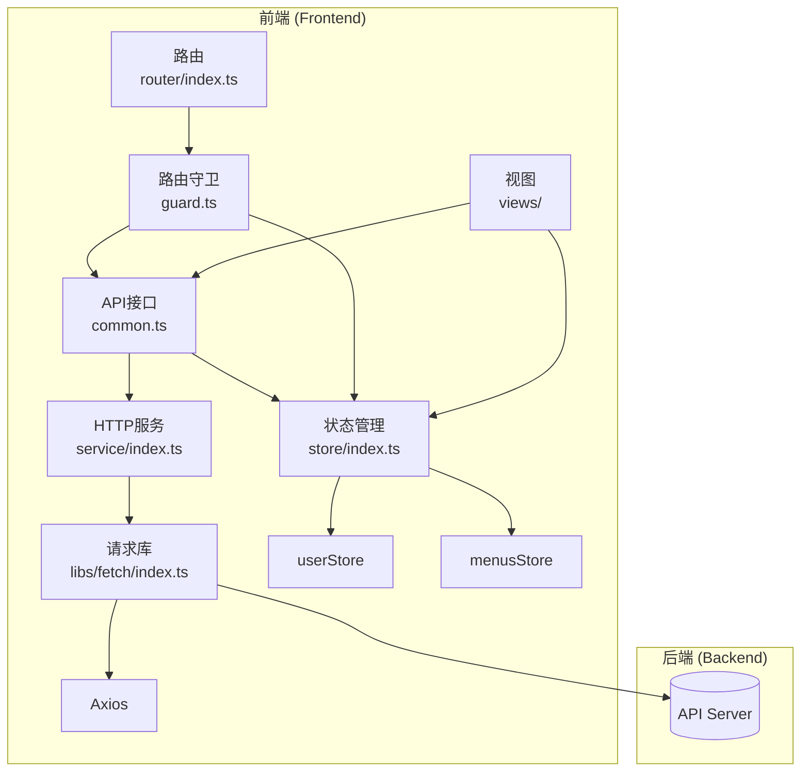
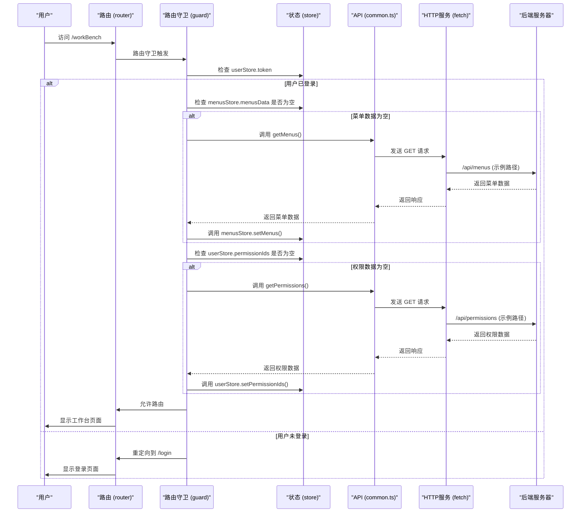
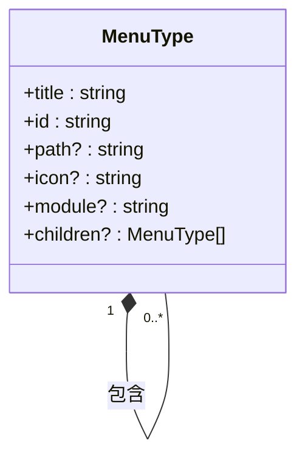
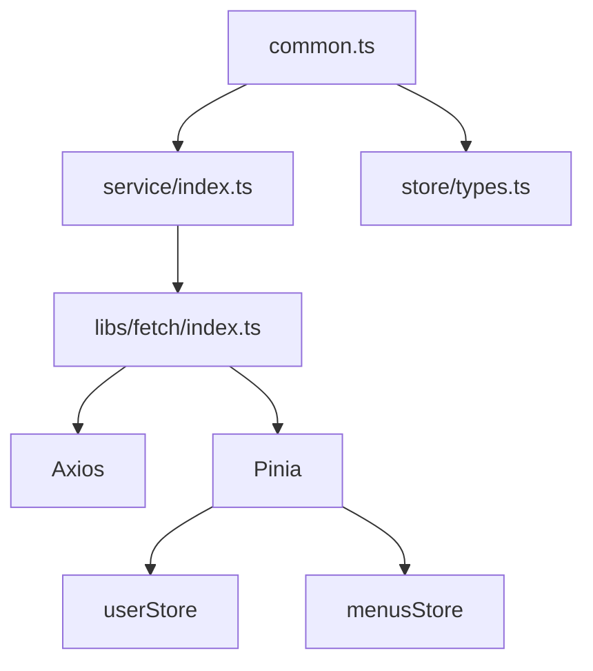

# API接口规范

<cite>
**本文档中引用的文件**   
- [common.ts](file://src/api/common.ts#L1-L355)
- [index.ts](file://src/service/index.ts#L1-L12)
- [index.ts](file://src/libs/fetch/index.ts#L1-L140)
- [types.ts](file://src/libs/fetch/types.ts#L1-L16)
- [types.ts](file://src/store/uedModule/app/types.ts#L1-L27)
- [defaultConfig.ts](file://src/store/uedModule/app/defaultConfig.ts#L1-L20)
- [types.ts](file://src/views/uedModule/login/types.ts#L1-L61)
- [types.ts](file://src/store/uedModule/menus/types.ts#L1-L15)
- [index.ts](file://src/store/index.ts#L1-L13)
- [index.ts](file://src/store/uedModule/user/index.ts#L1-L62)
- [index.ts](file://src/store/uedModule/menus/index.ts#L1-L138)
- [index.ts](file://src/router/index.ts#L1-L52)
- [guard.ts](file://src/router/guard.ts#L1-L65)
- [routes.ts](file://src/router/routes.ts#L1-L278)
- [index.vue](file://src/views/uedModule/login/index.vue#L1-L413)
- [login-demo.vue](file://src/views/uedModule/loginConfig/login-demo.vue#L1-L93)
- [index.vue](file://src/views/uedModule/loginConfig/index.vue#L1-L542)
- [sideMenu.vue](file://src/components/uedModule/menu/sideMenu.vue#L1-L260)
- [topMenu.vue](file://src/components/uedModule/menu/topMenu.vue#L1-L82)
</cite>

## 目录
1. [简介](#简介)
2. [项目结构](#项目结构)
3. [核心组件](#核心组件)
4. [架构概述](#架构概述)
5. [详细组件分析](#详细组件分析)
6. [依赖分析](#依赖分析)
7. [性能考虑](#性能考虑)
8. [故障排除指南](#故障排除指南)
9. [结论](#结论)

## 简介
本文档全面文档化了 `src/api/common.ts` 文件中声明的所有API端点。该文件是整个应用的核心，提供了获取菜单、权限、网站配置以及用户认证等关键功能。这些API是前端应用与后端服务交互的基础，支撑着应用的导航、权限控制和用户会话管理。本文档将详细说明每个接口的HTTP方法、URL路径、请求参数、响应结构、认证要求和业务用途，并结合实际代码和业务场景进行解释。

## 项目结构
项目采用典型的Vue 3 + TypeScript + Pinia架构。`src/api/common.ts` 位于API层，是所有业务API的入口。它依赖于 `src/service/index.ts` 创建的HTTP服务实例，该实例基于Axios封装，提供了统一的请求配置、拦截器和错误处理。数据流遵循清晰的路径：API调用 -> HTTP服务 -> Axios实例 -> 后端。状态管理使用Pinia，用户信息和菜单数据等全局状态在调用API后被存储在 `userStore` 和 `menusStore` 中。路由系统 (`src/router`) 在应用启动时通过路由守卫 (`guard.ts`) 调用这些API来初始化应用状态。



**图源**
- [common.ts](file://src/api/common.ts#L1-L355)
- [index.ts](file://src/service/index.ts#L1-L12)
- [index.ts](file://src/libs/fetch/index.ts#L1-L140)
- [index.ts](file://src/store/index.ts#L1-L13)
- [guard.ts](file://src/router/guard.ts#L1-L65)

**本节来源**
- [common.ts](file://src/api/common.ts#L1-L355)
- [index.ts](file://src/service/index.ts#L1-L12)
- [index.ts](file://src/libs/fetch/index.ts#L1-L140)
- [index.ts](file://src/store/index.ts#L1-L13)
- [guard.ts](file://src/router/guard.ts#L1-L65)

## 核心组件
`src/api/common.ts` 是本文档的核心，它导出了多个异步函数，这些函数封装了对后端API的调用。每个函数都对应一个特定的业务功能，如获取菜单、用户登录等。这些函数的实现依赖于 `createService` 函数返回的HTTP客户端，该客户端由 `src/service/index.ts` 提供，并在 `src/libs/fetch/index.ts` 中进行了详细的配置，包括请求拦截器（用于添加认证令牌）和响应拦截器（用于全局错误处理）。这些API的调用结果被Pinia状态管理器捕获并存储，供整个应用的各个组件使用。

**本节来源**
- [common.ts](file://src/api/common.ts#L1-L355)
- [index.ts](file://src/service/index.ts#L1-L12)
- [index.ts](file://src/libs/fetch/index.ts#L1-L140)
- [index.ts](file://src/store/index.ts#L1-L13)

## 架构概述
整个应用的架构围绕着API调用和状态管理展开。当用户访问应用时，路由守卫会拦截请求，并检查用户是否已登录（通过检查 `userStore` 中的token）。如果未登录，则重定向到登录页。如果已登录但尚未获取菜单和权限，则守卫会自动调用 `getMenus` 和 `getPermissions` API来获取这些数据，并将其存储在相应的Pinia store中。此后，应用的UI（如侧边栏菜单 `sideMenu.vue` 和顶部菜单 `topMenu.vue`）会从store中读取这些数据进行渲染。用户交互（如登录）会触发相应的API调用，成功后更新store中的状态，从而驱动UI更新。



**图源**
- [guard.ts](file://src/router/guard.ts#L1-L65)
- [common.ts](file://src/api/common.ts#L1-L355)
- [index.ts](file://src/libs/fetch/index.ts#L1-L140)
- [index.ts](file://src/store/index.ts#L1-L13)

## 详细组件分析
本节将对 `src/api/common.ts` 中定义的每一个API端点进行详细分析，包括其功能、参数、响应和使用场景。

### getMenus 接口分析
`getMenus` 函数用于获取应用的完整菜单结构。它返回一个 `MenuType` 数组，该数组定义了应用的导航菜单，包括一级菜单、二级菜单及其子菜单。菜单数据是静态的，直接在函数体内以JavaScript对象的形式硬编码返回，而不是通过HTTP请求从后端获取。这简化了前端的初始化流程。



**图源**
- [types.ts](file://src/store/uedModule/menus/types.ts#L1-L15)
- [common.ts](file://src/api/common.ts#L1-L355)

**本节来源**
- [types.ts](file://src/store/uedModule/menus/types.ts#L1-L15)
- [common.ts](file://src/api/common.ts#L1-L355)
- [sideMenu.vue](file://src/components/uedModule/menu/sideMenu.vue#L1-L260)
- [topMenu.vue](file://src/components/uedModule/menu/topMenu.vue#L1-L82)

#### getMenus 接口详情
- **HTTP方法**: 无 (本地数据)
- **完整URL路径**: N/A
- **路径参数**: 无
- **查询参数**: 无
- **请求体**: 无
- **预期JSON响应结构**:
    ```json
    [
      {
        "id": "workBench",
        "title": "工作台",
        "icon": "AppstoreOutlined",
        "path": "/workBench",
        "children": [
          {
            "id": "workBench",
            "title": "工作台",
            "icon": "AppstoreOutlined",
            "path": "/workBench"
          },
          // ... 其他子菜单
        ]
      },
      // ... 其他一级菜单
    ]
    ```
- **字段说明**:
    - `id`: 菜单项的唯一标识符。
    - `title`: 菜单项的显示名称，通常使用国际化键（如 `I18N.layout.gongZuoTai`）。
    - `path`: 菜单项对应的路由路径。
    - `icon`: 菜单项的图标名称。
    - `children`: 子菜单项的数组，用于构建多级菜单。
- **认证要求**: 无。此数据是应用的基础配置。
- **访问权限级别**: 所有用户。
- **业务用途**: 为应用的侧边栏和顶部导航栏提供数据源。路由守卫在用户登录后调用此函数来初始化菜单。
- **典型请求/响应示例**: 由于是本地函数调用，没有HTTP请求。调用 `getMenus()` 会直接返回上述结构的数组。

### getPermissions 接口分析
`getPermissions` 函数用于获取当前用户的权限标识符列表。与 `getMenus` 类似，它也返回一个硬编码的权限列表，而不是通过网络请求获取。这些权限ID用于路由守卫中的权限校验。

**本节来源**
- [common.ts](file://src/api/common.ts#L1-L355)
- [guard.ts](file://src/router/guard.ts#L1-L65)

#### getPermissions 接口详情
- **HTTP方法**: 无 (本地数据)
- **完整URL路径**: N/A
- **路径参数**: 无
- **查询参数**: 无
- **请求体**: 无
- **预期JSON响应结构**:
    ```json
    ["base::example:index", "base::theme:index", "base::workBench:index"]
    ```
- **字段说明**:
    - 返回一个字符串数组，每个字符串代表一个权限ID。这些ID与路由元信息中的 `permissionId` 字段对应。
- **认证要求**: 无。
- **访问权限级别**: 所有用户。
- **业务用途**: 为路由守卫提供权限数据，用于判断用户是否有权访问某个路由。
- **典型请求/响应示例**: 调用 `getPermissions()` 返回一个权限ID数组。

### getWebsiteConfig 接口分析
`getWebsiteConfig` 函数用于获取网站的全局配置，特别是登录页面的配置。它结合了默认配置和存储在 `localStorage` 中的用户自定义配置。

**本节来源**
- [common.ts](file://src/api/common.ts#L1-L355)
- [types.ts](file://src/store/uedModule/app/types.ts#L1-L27)
- [defaultConfig.ts](file://src/store/uedModule/app/defaultConfig.ts#L1-L20)
- [types.ts](file://src/views/uedModule/login/types.ts#L1-L61)
- [index.vue](file://src/views/uedModule/loginConfig/index.vue#L1-L542)
- [login-demo.vue](file://src/views/uedModule/loginConfig/login-demo.vue#L1-L93)

#### getWebsiteConfig 接口详情
- **HTTP方法**: 无 (本地数据处理)
- **完整URL路径**: N/A
- **路径参数**: 无
- **查询参数**: 无
- **请求体**: 无
- **预期JSON响应结构**:
    ```json
    {
      "loginConfig": {
        "mode": "light",
        "bgMode": "image",
        "bgImage": "/path/to/bg.png",
        "bgImageDark": "/path/to/bg-dark.png",
        "logoMode": "image",
        "logoName": "智启vue3孵化器系统",
        "title": "欢迎登录",
        "showLanguage": true,
        "language": "zh",
        "copyright": [
          {
            "text": "© 2023 公司名称",
            "link": "https://www.example.com"
          }
        ]
      }
    }
    ```
- **字段说明**:
    - `loginConfig`: 一个 `LoginConfigDTO` 对象，包含了登录页的所有可配置项，如主题、背景、LOGO、版权信息等。
- **认证要求**: 无。
- **访问权限级别**: 所有用户。
- **业务用途**: 为登录页面 (`login/index.vue`) 和登录配置页面 (`loginConfig/index.vue`) 提供配置数据。登录配置页面允许管理员修改这些配置，并将其保存到 `localStorage` 中。
- **典型请求/响应示例**: 调用 `getWebsiteConfig()` 会返回合并了默认配置和本地存储配置的对象。

### 用户认证接口分析
这些接口 (`onLogin`, `onRegister`, `onLogout`, `getCaptcha`, `refreshToken`, `verifyToken`) 是真正的HTTP API，通过 `createService` 发起网络请求。它们都遵循统一的响应格式。

```mermaid
classDiagram
class ResponseType {
+code : number
+data : T
+message : string
}
note right of ResponseType
T 是具体的业务数据类型
end
```

**图源**
- [types.ts](file://src/libs/fetch/types.ts#L1-L16)

**本节来源**
- [common.ts](file://src/api/common.ts#L1-L355)
- [index.ts](file://src/libs/fetch/index.ts#L1-L140)
- [types.ts](file://src/libs/fetch/types.ts#L1-L16)
- [index.vue](file://src/views/uedModule/login/index.vue#L1-L413)

#### onLogin 接口详情
- **HTTP方法**: POST
- **完整URL路径**: `/api/user/v1/login`
- **路径参数**: 无
- **查询参数**: 无
- **请求体结构**:
    ```json
    {
      "username": "string",
      "password": "string",
      "verifyCode": "string",
      "captchaId": "string"
    }
    ```
    - `username`: 用户名，必填，长度至少3个字符。
    - `password`: 密码，必填，长度至少6个字符。
    - `verifyCode`: 图片验证码。
    - `captchaId`: 验证码ID，由 `getCaptcha` 接口返回。
- **预期JSON响应结构**:
    ```json
    {
      "code": 200,
      "message": "登录成功",
      "data": {
        "accessToken": "jwt-token-string",
        "user": {
          "name": "张三",
          "age": 30,
          "iphone": "13800138000",
          "email": "zhangsan@example.com",
          "gender": "男"
        }
      }
    }
    ```
- **字段说明**:
    - `code`: 业务状态码，200表示成功。
    - `message`: 响应消息。
    - `data`: 包含登录成功后的访问令牌 (`accessToken`) 和用户信息 (`user`)。
- **认证要求**: 无 (此为登录接口)。
- **访问权限级别**: 未登录用户。
- **业务用途**: 验证用户凭据，成功后返回JWT令牌和用户信息。
- **典型请求/响应示例**: 在登录页面输入用户名、密码和验证码后，点击登录按钮，前端会调用此接口。成功后，`userStore` 会存储 `accessToken` 和 `user` 信息。

#### onRegister 接口详情
- **HTTP方法**: POST
- **完整URL路径**: `/api/user/v1/register`
- **路径参数**: 无
- **查询参数**: 无
- **请求体结构**:
    ```json
    {
      "username": "string",
      "password": "string",
      "passwordConfirm": "string"
    }
    ```
    - `username`: 用户名。
    - `password`: 密码。
    - `passwordConfirm`: 确认密码，必须与 `password` 一致。
- **预期JSON响应结构**:
    ```json
    {
      "code": 200,
      "message": "注册成功",
      "data": {}
    }
    ```
- **认证要求**: 无。
- **访问权限级别**: 未登录用户。
- **业务用途**: 创建新用户账户。
- **典型请求/响应示例**: 在登录表单的“注册账号”选项卡中填写信息并提交。

#### onLogout 接口详情
- **HTTP方法**: POST
- **完整URL路径**: `/api/user/v1/logout`
- **路径参数**: 无
- **查询参数**: 无
- **请求体**: 无
- **预期JSON响应结构**:
    ```json
    {
      "code": 200,
      "message": "退出成功",
      "data": {}
    }
    ```
- **认证要求**: 是。请求头 `Authorization` 必须包含有效的 `Bearer <token>`。
- **访问权限级别**: 已登录用户。
- **业务用途**: 使当前用户的会话失效。
- **典型请求/响应示例**: 用户点击“退出登录”按钮时调用。

#### getCaptcha 接口详情
- **HTTP方法**: GET
- **完整URL路径**: `/api/user/v1/captcha`
- **路径参数**: 无
- **查询参数**: 无
- **请求体**: 无
- **预期JSON响应结构**:
    ```json
    {
      "code": 200,
      "message": "获取成功",
      "data": {
        "captchaId": "unique-id-123",
        "captchaBase64": "base64-encoded-image-data"
      }
    }
    ```
    - 或者直接返回:
    ```json
    {
      "captchaId": "unique-id-123",
      "captchaBase64": "base64-encoded-image-data"
    }
    ```
- **认证要求**: 无。
- **访问权限级别**: 所有用户。
- **业务用途**: 获取图片验证码，用于登录时的二次验证。
- **典型请求/响应示例**: 登录表单加载时或用户点击“刷新验证码”时调用。

#### refreshToken 接口详情
- **HTTP方法**: POST
- **完整URL路径**: `/api/user/v1/refresh-token`
- **路径参数**: 无
- **查询参数**: 无
- **请求体结构**:
    ```json
    {
      "refreshToken": "refresh-token-string"
    }
    ```
- **预期JSON响应结构**:
    ```json
    {
      "code": 200,
      "message": "刷新成功",
      "data": {
        "accessToken": "new-jwt-token-string"
      }
    }
    ```
- **认证要求**: 通常使用 `refreshToken` 进行认证，而非 `accessToken`。
- **访问权限级别**: 已登录用户（通过 `refreshToken`）。
- **业务用途**: 当 `accessToken` 过期时，使用 `refreshToken` 获取新的 `accessToken`，以保持用户会话。
- **典型请求/响应示例**: 在HTTP响应拦截器中，当检测到401错误且存在 `refreshToken` 时自动调用。

#### verifyToken 接口详情
- **HTTP方法**: GET
- **完整URL路径**: `/api/user/v1/verify-token`
- **路径参数**: 无
- **查询参数**: 无
- **请求体**: 无
- **预期JSON响应结构**:
    ```json
    {
      "code": 200,
      "message": "验证成功",
      "data": {}
    }
    ```
- **认证要求**: 是。请求头 `Authorization` 必须包含有效的 `Bearer <token>`。
- **访问权限级别**: 已登录用户。
- **业务用途**: 验证当前 `accessToken` 是否有效。
- **典型请求/响应示例**: 应用启动时或需要确认用户身份时调用。

#### getLoginRedirectUrl 接口详情
- **HTTP方法**: GET
- **完整URL路径**: `/api/user/v1/dingtalk/login-url`
- **路径参数**: 无
- **查询参数**:
    - `state`: 状态标识符，例如 `relogin`。
    - `redirectUri`: 回调地址。
- **请求体**: 无
- **预期JSON响应结构**:
    ```json
    {
      "code": 200,
      "message": "获取成功",
      "data": {
        "redirectUrl": "https://dingtalk.com/authorize?..."
      }
    }
    ```
- **认证要求**: 无。
- **访问权限级别**: 所有用户。
- **业务用途**: 获取钉钉OAuth登录的授权URL。
- **典型请求/响应示例**: 用户点击“钉钉扫码”登录时调用，然后重定向到返回的 `redirectUrl`。

#### fetchDingTalkUserInfo 接口详情
- **HTTP方法**: GET
- **完整URL路径**: `/api/user/v1/dingtalk/callback`
- **路径参数**: 无
- **查询参数**:
    - `code`: 钉钉授权码。
- **请求体**: 无
- **预期JSON响应结构**:
    ```json
    {
      "code": 200,
      "message": "登录成功",
      "data": {
        "accessToken": "jwt-token-string",
        "user": {
          "name": "李四",
          "avatar": "https://avatar.url"
        }
      }
    }
    ```
- **认证要求**: 无。
- **访问权限级别**: 所有用户。
- **业务用途**: 通过钉钉授权码换取用户信息和应用的访问令牌。
- **典型请求/响应示例**: 钉钉授权成功后，回调页面会携带 `code` 参数，前端调用此接口完成登录。

## 依赖分析
`src/api/common.ts` 的依赖关系清晰。它直接依赖于 `@/service` 来获取HTTP客户端，并依赖于 `@/store` 中的类型定义。`@/service` 又依赖于 `@/libs/fetch`，后者是Axios的封装，包含了核心的请求逻辑和拦截器。`@/libs/fetch` 依赖于 `pinia` 来访问 `userStore`，以便在请求拦截器中添加认证令牌。这种分层设计使得代码职责分明，易于维护和测试。



**图源**
- [common.ts](file://src/api/common.ts#L1-L355)
- [index.ts](file://src/service/index.ts#L1-L12)
- [index.ts](file://src/libs/fetch/index.ts#L1-L140)
- [index.ts](file://src/store/index.ts#L1-L13)

**本节来源**
- [common.ts](file://src/api/common.ts#L1-L355)
- [index.ts](file://src/service/index.ts#L1-L12)
- [index.ts](file://src/libs/fetch/index.ts#L1-L140)
- [index.ts](file://src/store/index.ts#L1-L13)

## 性能考虑
由于 `getMenus` 和 `getPermissions` 是本地函数调用，性能开销极小。对于网络请求，`libs/fetch` 库通过请求拦截器统一处理了错误，避免了在每个API调用处重复编写错误处理代码，提高了代码的健壮性。HTTP客户端配置了1分钟的超时时间，防止请求无限期挂起。使用Pinia进行状态管理，避免了重复的API调用，例如菜单和权限数据在首次获取后会被缓存。

## 故障排除指南
- **401错误**: 表示未授权。检查 `userStore` 中的 `token` 是否存在且有效。如果无效，需要重新登录或调用 `refreshToken`。
- **403错误**: 表示拒绝访问。检查当前路由的 `permissionId` 是否在 `userStore.permissionIds` 列表中。
- **500错误**: 表示服务器内部错误。检查后端服务日志。
- **登录失败**: 检查用户名、密码和验证码是否正确。确保 `getCaptcha` 接口返回的 `captchaId` 和 `verifyCode` 与登录请求匹配。
- **菜单不显示**: 检查路由守卫是否成功调用了 `getMenus` 并将数据存入 `menusStore`。

## 结论
`src/api/common.ts` 文件定义了应用的核心API，涵盖了菜单、权限、配置和用户认证等关键功能。这些API的设计体现了前后端分离的架构思想，前端通过清晰的接口与后端交互，并利用Pinia进行高效的状态管理。理解这些API的工作原理对于维护和扩展应用至关重要。