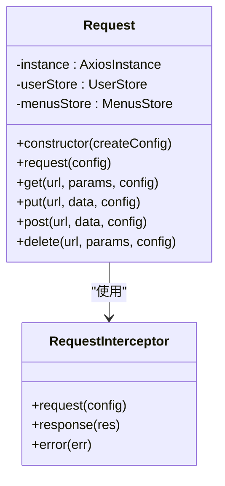
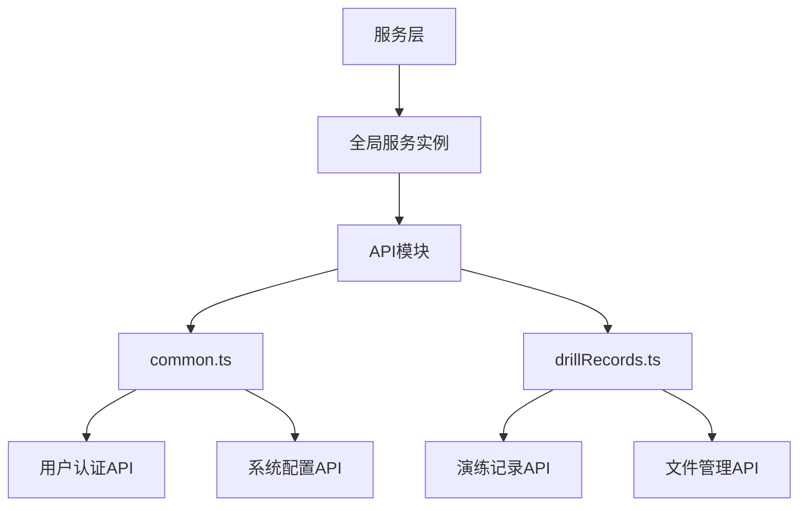
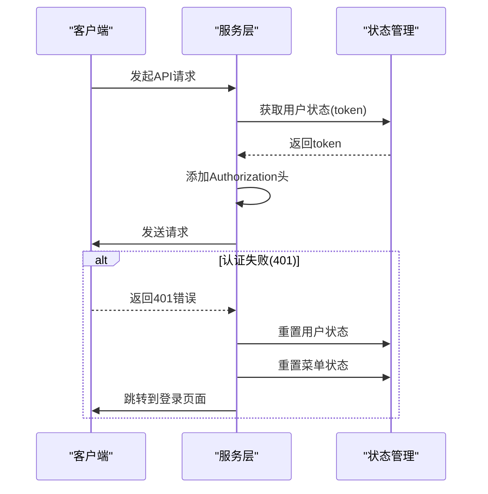
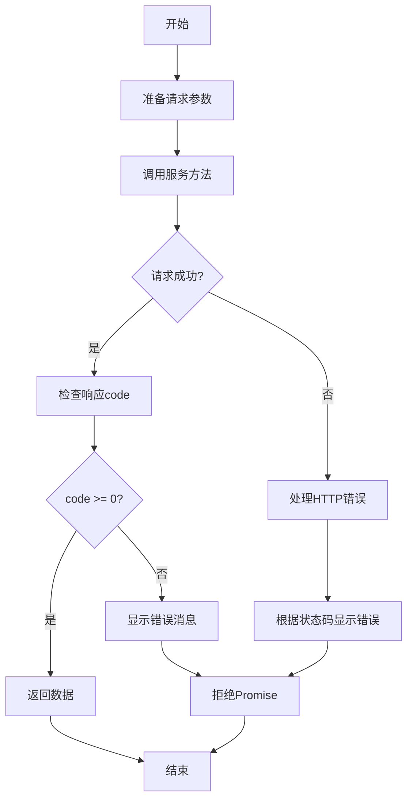
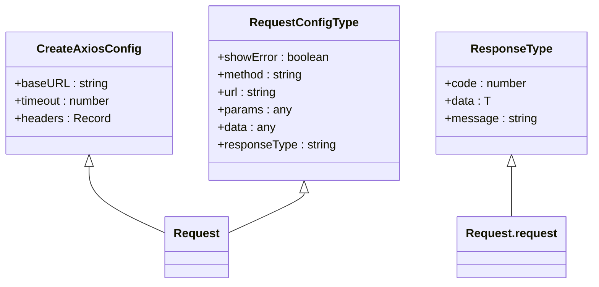
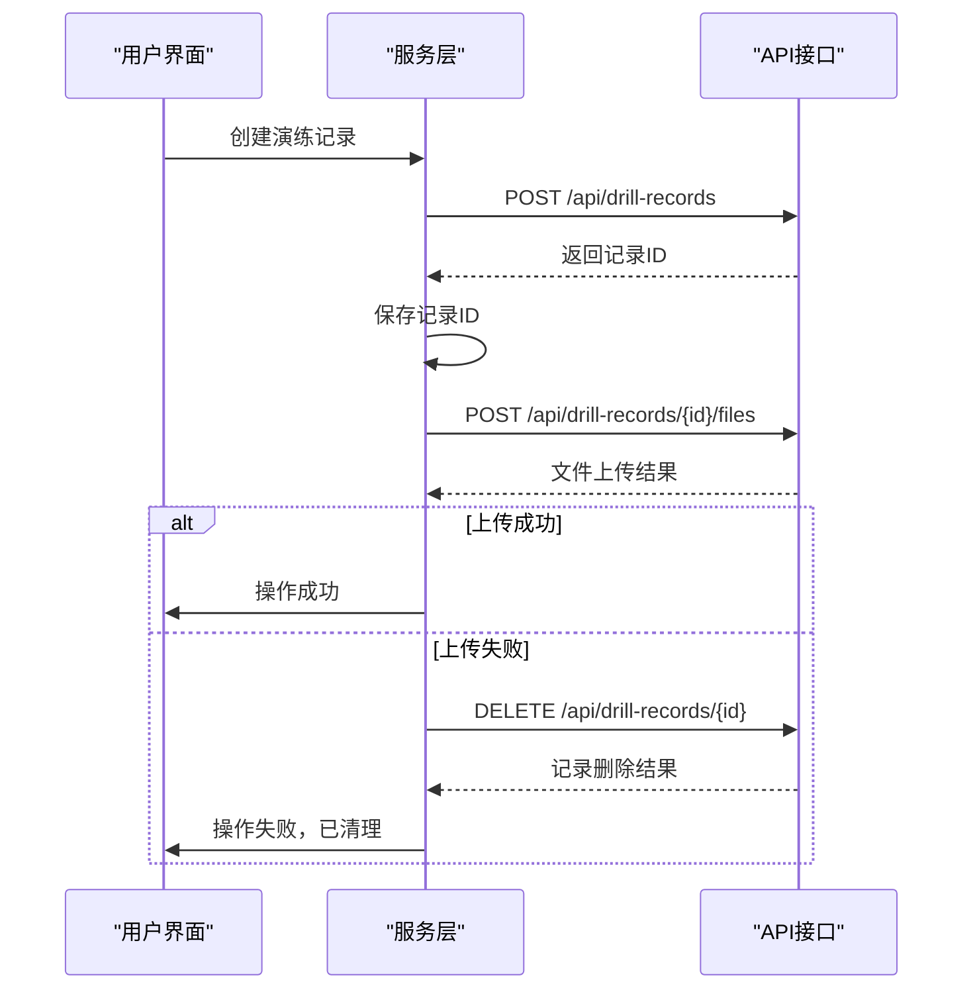

# 服务层封装

<cite>
**本文档引用的文件**   
- [index.ts](file://src/service/index.ts)
- [fetch/index.ts](file://src/libs/fetch/index.ts)
- [types.ts](file://src/libs/fetch/types.ts)
- [common.ts](file://src/api/common.ts)
- [drillRecords.ts](file://src/api/drillRecords.ts)
- [index.ts](file://src/store/index.ts)
</cite>

## 目录
1. [服务层设计概述](#服务层设计概述)
2. [服务类组织结构](#服务类组织结构)
3. [依赖注入与状态管理协作](#依赖注入与状态管理协作)
4. [服务调用流程示例](#服务调用流程示例)
5. [服务层与API层契约关系](#服务层与api层契约关系)
6. [复杂业务场景协调机制](#复杂业务场景协调机制)

## 服务层设计概述

服务层封装设计旨在对API接口进行业务逻辑抽象和分层管理，通过创建统一的服务实例来处理所有HTTP请求。该设计模式将网络请求逻辑与业务逻辑分离，提高了代码的可维护性和可测试性。

服务层的核心是`createService`函数，它创建并配置了一个`Request`实例，该实例基于axios库封装，提供了统一的请求配置、拦截器和错误处理机制。



**图示来源**
- [fetch/index.ts](file://src/libs/fetch/index.ts#L1-L140)

**本节来源**
- [index.ts](file://src/service/index.ts#L1-L12)

## 服务类组织结构

服务层的组织结构遵循单一职责原则，每个服务类负责特定的业务领域。在本项目中，服务层通过`src/service/index.ts`文件导出一个全局服务实例，该实例被所有API模块共享使用。

服务类的组织结构特点包括：

1. **集中式服务实例**：通过`createService()`函数创建全局服务实例，确保所有请求使用相同的配置和拦截器
2. **模块化API定义**：API接口按业务领域分散在不同的模块中（如`common.ts`、`drillRecords.ts`），每个模块导入并使用全局服务实例
3. **类型安全**：利用TypeScript的泛型特性，为每个API调用提供精确的类型定义



**图示来源**
- [index.ts](file://src/service/index.ts#L1-L12)
- [common.ts](file://src/api/common.ts#L304-L354)
- [drillRecords.ts](file://src/api/drillRecords.ts#L0-L127)

**本节来源**
- [index.ts](file://src/service/index.ts#L1-L12)
- [common.ts](file://src/api/common.ts#L304-L354)
- [drillRecords.ts](file://src/api/drillRecords.ts#L0-L127)

## 依赖注入与状态管理协作

服务层与Pinia状态管理的协作模式采用依赖注入的方式，在`Request`类的构造函数中直接注入Pinia实例，从而访问各个状态管理模块。

这种协作模式的关键特点包括：

1. **直接依赖注入**：在`Request`类中通过`useUserStore(pinia)`和`useMenusStore(pinia)`直接获取状态管理实例
2. **状态驱动的请求行为**：利用用户状态中的token信息自动添加到请求头中
3. **状态同步的错误处理**：在HTTP 401错误时自动重置用户和菜单状态，并跳转到登录页面



**图示来源**
- [fetch/index.ts](file://src/libs/fetch/index.ts#L1-L140)
- [index.ts](file://src/store/index.ts#L1-L12)

**本节来源**
- [fetch/index.ts](file://src/libs/fetch/index.ts#L1-L140)
- [index.ts](file://src/store/index.ts#L1-L12)

## 服务调用流程示例

服务调用的完整流程包括参数传递、响应处理和错误捕获三个主要环节。以下以用户登录为例，展示完整的调用流程。

### 登录服务调用示例

```typescript
// API定义
export async function onLogin(data: any): Promise<any> {
  return createService.post('/api/user/v1/login', data);
}

// 使用示例
async function handleLogin() {
  try {
    const loginData = {
      username: 'user123',
      password: 'password123'
    };
    
    const response = await onLogin(loginData);
    
    // 处理成功响应
    if (response.code === 0) {
      console.log('登录成功', response.data);
    } else {
      console.error('登录失败', response.message);
    }
  } catch (error) {
    // 处理网络错误或API错误
    console.error('请求失败', error);
  }
}
```

### 调用流程分析



**图示来源**
- [common.ts](file://src/api/common.ts#L304-L354)
- [fetch/index.ts](file://src/libs/fetch/index.ts#L1-L140)

**本节来源**
- [common.ts](file://src/api/common.ts#L304-L354)
- [fetch/index.ts](file://src/libs/fetch/index.ts#L1-L140)

## 服务层与API层契约关系

服务层与API层之间的契约关系通过明确的接口定义、数据转换机制和请求优化策略来维护。这种契约关系确保了前后端通信的稳定性和可靠性。

### 数据转换机制

服务层定义了统一的响应数据结构，通过`ResponseType<T>`接口规范了所有API响应的格式：

```typescript
export interface ResponseType<T> {
  code: number;
  data: T;
  message: string;
}
```

这种结构化的响应格式使得前端可以统一处理所有API响应，无论其具体业务内容如何。

### 请求优化机制

服务层通过以下方式优化请求性能：

1. **超时配置**：全局设置60秒的请求超时时间
2. **基础URL配置**：通过环境变量配置API基础路径
3. **自动错误提示**：当响应code小于0时自动显示错误消息



**图示来源**
- [types.ts](file://src/libs/fetch/types.ts#L1-L16)
- [fetch/index.ts](file://src/libs/fetch/index.ts#L1-L140)

**本节来源**
- [types.ts](file://src/libs/fetch/types.ts#L1-L16)
- [fetch/index.ts](file://src/libs/fetch/index.ts#L1-L140)

## 复杂业务场景协调机制

在复杂业务场景下，服务层通过协调多个API调用来保证数据一致性。以演练记录管理为例，展示了如何通过服务层协调多个相关API调用。

### 演练记录管理API

```typescript
// 获取演练记录列表
export const getDrillRecords = (params: DrillRecordsParams) => {
  return request.get<DrillRecordsResponse>('/api/drill-records', params)
}

// 获取演练统计数据
export const getDrillStats = () => {
  return request.get<DrillStats>('/api/drill-records/stats')
}

// 创建演练记录
export const createDrillRecord = (data: Partial<DrillRecord>) => {
  return request.post<DrillRecord>('/api/drill-records', data)
}

// 上传演练资料
export const uploadDrillFiles = (id: string, files: File[]) => {
  const formData = new FormData()
  files.forEach(file => {
    formData.append('files', file)
  })
  
  return request.post(`/api/drill-records/${id}/files`, formData, {
    headers: {
      'Content-Type': 'multipart/form-data'
    }
  })
}
```

### 数据一致性保证

服务层通过以下机制保证复杂业务场景下的数据一致性：

1. **事务性操作**：对于需要多个API调用才能完成的业务操作，通过Promise链或async/await确保操作的原子性
2. **错误回滚**：在某个API调用失败时，执行相应的回滚操作
3. **状态同步**：在成功完成一系列API调用后，更新相关状态管理模块



**图示来源**
- [drillRecords.ts](file://src/api/drillRecords.ts#L0-L127)
- [fetch/index.ts](file://src/libs/fetch/index.ts#L1-L140)

**本节来源**
- [drillRecords.ts](file://src/api/drillRecords.ts#L0-L127)
- [fetch/index.ts](file://src/libs/fetch/index.ts#L1-L140)