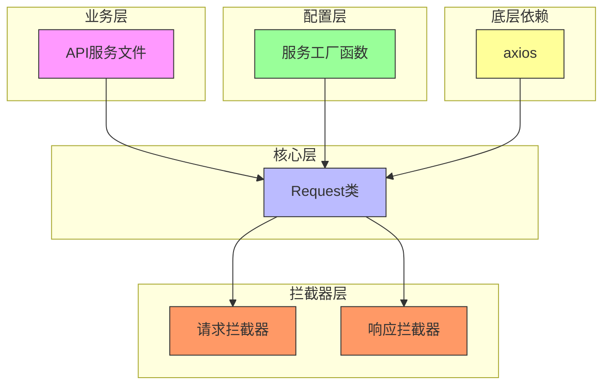
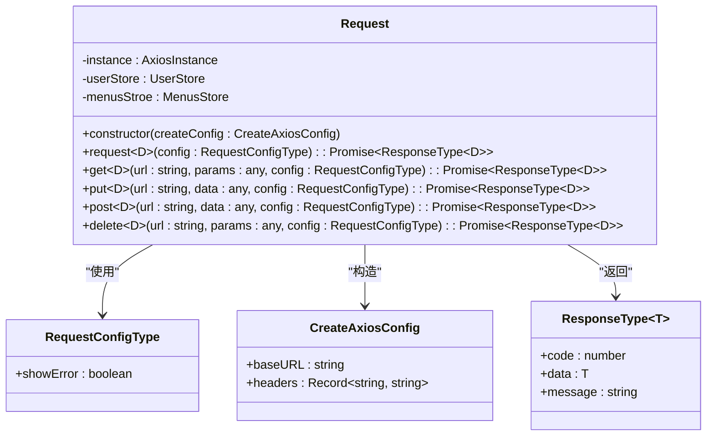
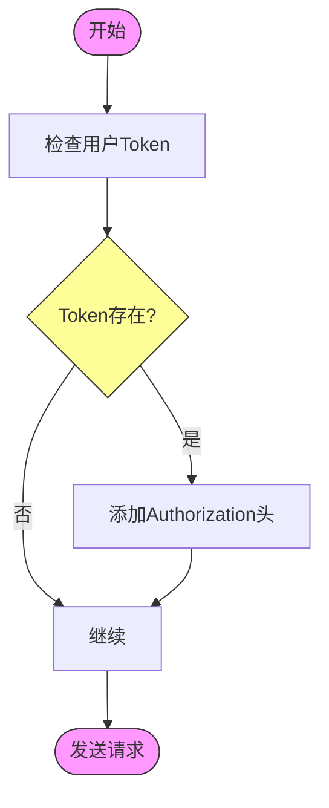
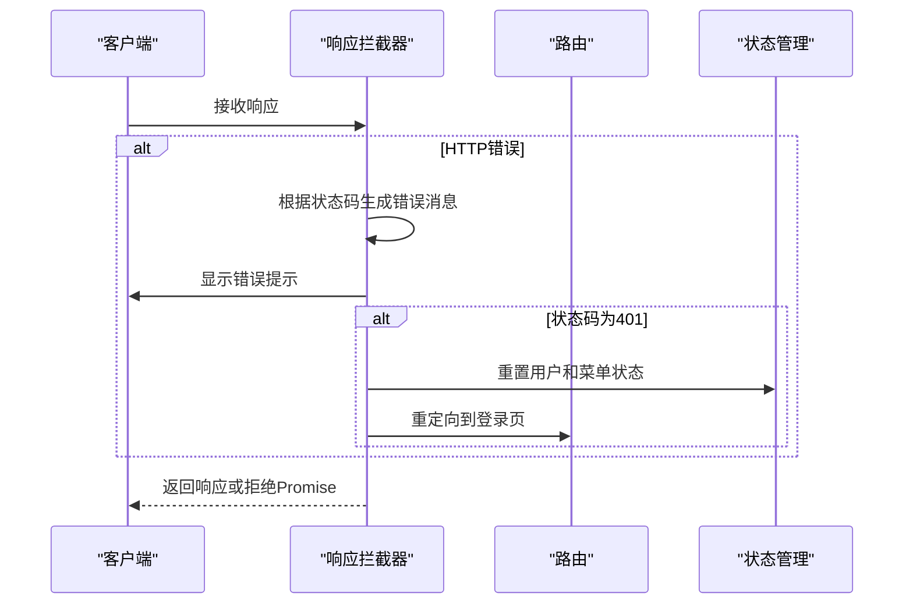
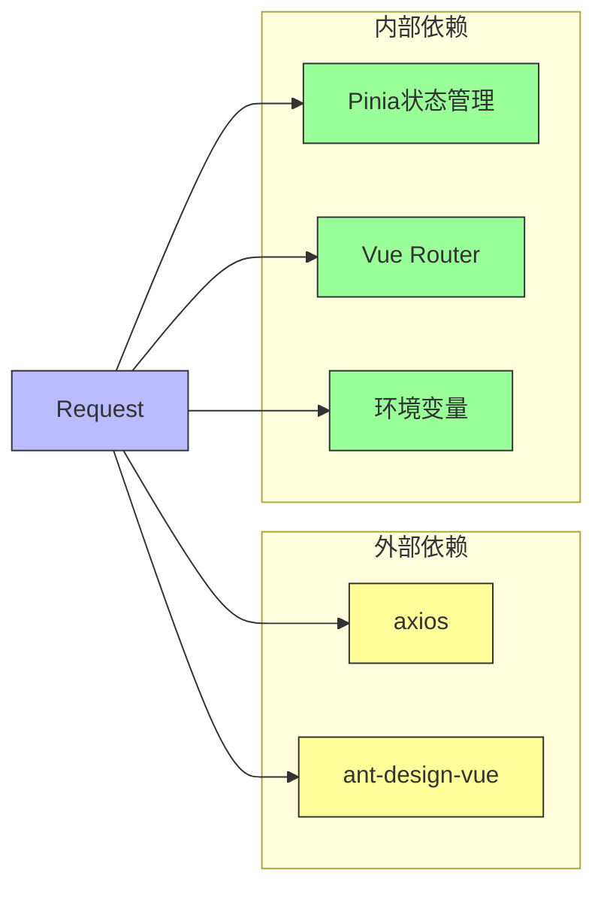
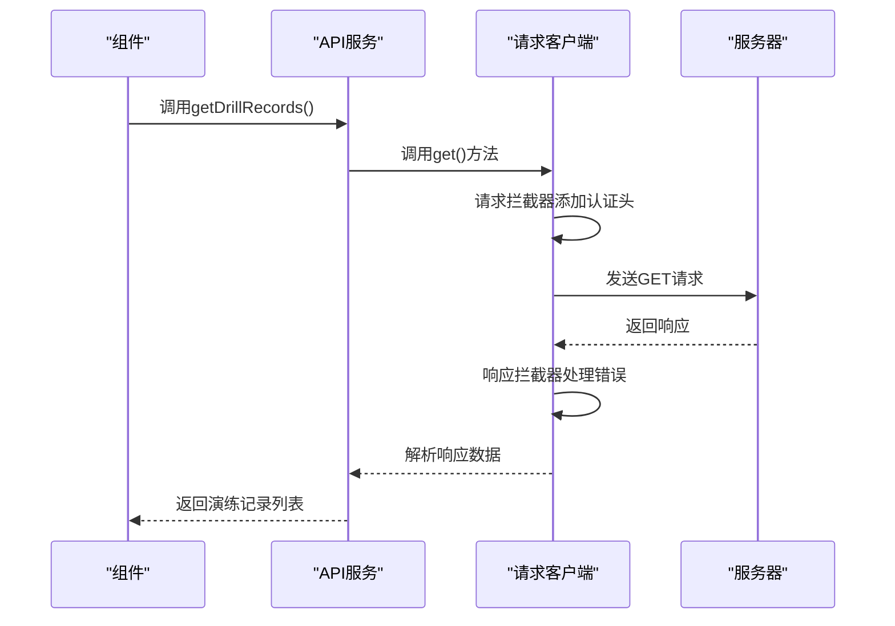

# 请求客户端实现

<cite>
**本文档引用的文件**   
- [index.ts](file://src/libs/fetch/index.ts)
- [types.ts](file://src/libs/fetch/types.ts)
- [index.ts](file://src/service/index.ts)
- [drillRecords.ts](file://src/api/drillRecords.ts)
- [vite.config.base.ts](file://configs/vite.config.base.ts)
- [utils.ts](file://configs/utils.ts)
</cite>

## 目录
1. [简介](#简介)
2. [核心组件分析](#核心组件分析)
3. [架构概览](#架构概览)
4. [详细组件分析](#详细组件分析)
5. [依赖分析](#依赖分析)
6. [使用示例](#使用示例)
7. [最佳实践](#最佳实践)

## 简介
本文档深入解析了项目中自定义请求客户端的实现细节。该客户端基于axios库进行封装，提供了统一的API请求处理机制，包括请求拦截、响应拦截、错误处理、认证头添加等功能。通过TypeScript类型定义，确保了类型安全和代码可维护性。客户端被设计为可配置的类，允许在实例化时传入基础配置，如baseURL和超时时间。整个实现体现了良好的分层架构和关注点分离原则。

## 核心组件分析
请求客户端的核心实现位于`src/libs/fetch/index.ts`文件中，通过一个名为`Request`的类来封装所有HTTP请求功能。该类使用axios作为底层HTTP客户端，并通过拦截器机制实现了请求和响应的预处理。客户端与应用的状态管理（Pinia）和路由系统（Vue Router）紧密集成，能够自动处理认证状态和未授权重定向。类型定义文件`types.ts`提供了清晰的接口契约，确保了API使用的类型安全。

**本节来源**
- [index.ts](file://src/libs/fetch/index.ts#L1-L140)
- [types.ts](file://src/libs/fetch/types.ts#L1-L16)

## 架构概览
请求客户端的架构采用分层设计，从底层的axios实例到上层的业务API调用，形成了清晰的调用链。配置层负责初始化客户端实例，拦截器层处理通用的请求/响应逻辑，核心类层提供统一的请求方法，而业务层则基于此构建具体的API服务。



**图表来源**
- [index.ts](file://src/libs/fetch/index.ts#L1-L140)
- [types.ts](file://src/libs/fetch/types.ts#L1-L16)
- [index.ts](file://src/service/index.ts#L1-L12)

## 详细组件分析
### 请求客户端类分析
`Request`类是整个请求系统的中心，它封装了axios实例并提供了高级的请求方法。类的构造函数接收配置对象，创建axios实例，并设置请求和响应拦截器。这种设计模式使得客户端可以集中处理跨领域的关注点，如认证、错误处理和日志记录。

#### 类图


**图表来源**
- [index.ts](file://src/libs/fetch/index.ts#L1-L140)
- [types.ts](file://src/libs/fetch/types.ts#L1-L16)

### 拦截器链分析
请求客户端通过axios的拦截器机制实现了强大的预处理能力。请求拦截器负责在发送请求前自动添加认证头，而响应拦截器则统一处理HTTP错误状态码，提供全局的错误提示。

#### 请求拦截器流程


#### 响应拦截器流程


**图表来源**
- [index.ts](file://src/libs/fetch/index.ts#L14-L59)

## 依赖分析
请求客户端与多个核心系统组件存在依赖关系，形成了一个紧密集成的生态系统。通过分析这些依赖，可以更好地理解客户端在整个应用架构中的角色和职责。



**图表来源**
- [index.ts](file://src/libs/fetch/index.ts#L1-L140)
- [index.ts](file://src/service/index.ts#L1-L12)
- [vite.config.base.ts](file://configs/vite.config.base.ts#L1-L91)

## 使用示例
请求客户端在业务代码中的使用非常直观和一致。通过服务工厂函数创建的实例被导入到各个API服务文件中，用于构建具体的业务请求。

### API服务使用示例


**图表来源**
- [drillRecords.ts](file://src/api/drillRecords.ts#L1-L127)
- [index.ts](file://src/libs/fetch/index.ts#L82-L139)

## 最佳实践
### 配置管理
客户端的配置通过环境变量进行管理，确保了不同环境下的灵活性。基础配置在`src/service/index.ts`中定义，通过`process.env`访问环境变量：

```typescript
const defaultConfig = {
  baseURL: process.env.API_BASE_PATH || '/',
  timeout: Number(process.env.TIME_OUT || 1000 * 60)
};
```

这种模式允许在不同部署环境中（开发、测试、生产）使用不同的API端点和超时设置，而无需修改代码。

### 错误处理
客户端实现了两级错误处理机制：
1. **HTTP状态码处理**：在响应拦截器中处理常见的HTTP错误状态码，提供用户友好的错误消息。
2. **业务逻辑错误处理**：在`request`方法中检查响应体中的`code`字段，当`code < 0`时视为业务逻辑错误，显示具体的错误消息。

### 类型安全
通过TypeScript泛型，客户端提供了类型安全的API调用。例如，`get<D>()`方法允许指定响应数据的类型，确保在编译时就能发现类型错误：

```typescript
export const getDrillRecordDetail = (id: string) => {
  return request.get<DrillRecord>(`/api/drill-records/${id}`)
}
```

**本节来源**
- [index.ts](file://src/libs/fetch/index.ts#L1-L140)
- [types.ts](file://src/libs/fetch/types.ts#L1-L16)
- [index.ts](file://src/service/index.ts#L1-L12)
- [drillRecords.ts](file://src/api/drillRecords.ts#L1-L127)
- [vite.config.base.ts](file://configs/vite.config.base.ts#L1-L91)