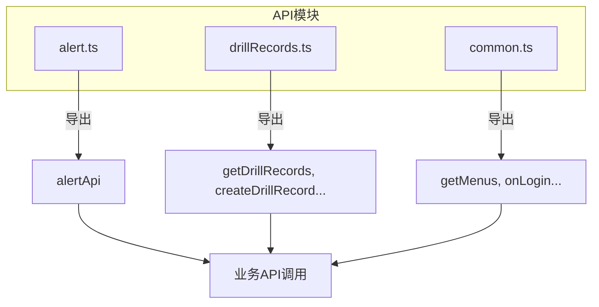
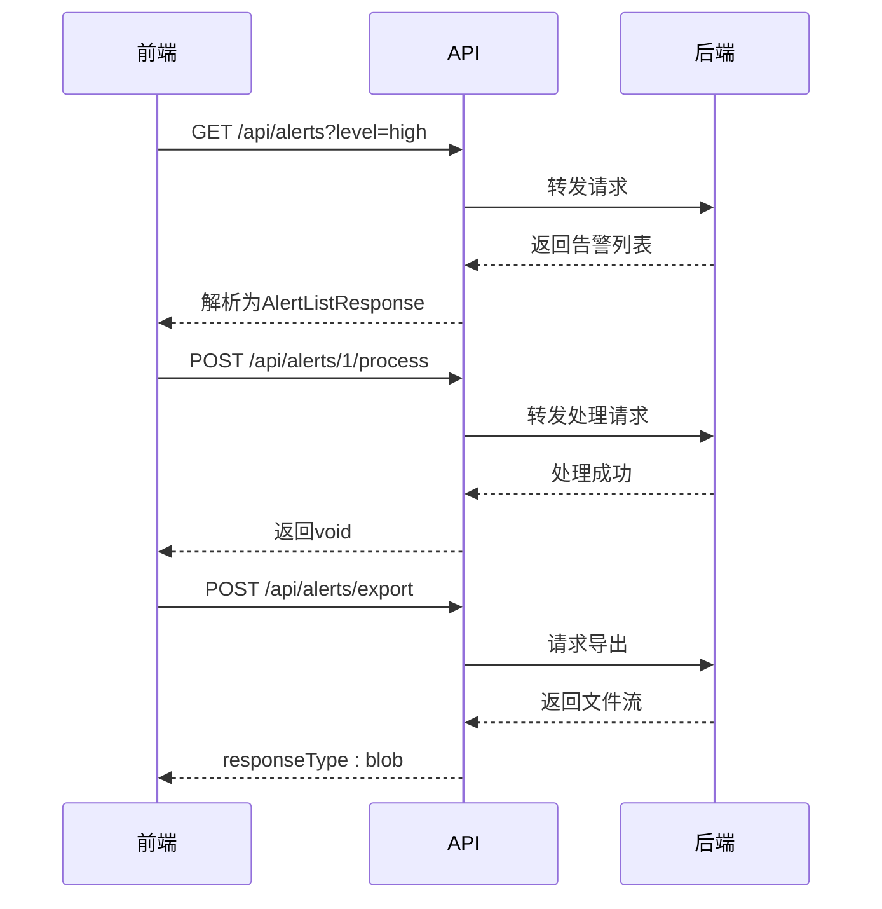

# API定义规范

<cite>
**本文档引用的文件**  
- [alert.ts](file://src/api/alert.ts)
- [common.ts](file://src/api/common.ts)
- [drillRecords.ts](file://src/api/drillRecords.ts)
- [alert.ts](file://src/types/alert.ts)
- [index.ts](file://src/service/index.ts)
</cite>

## 目录
1. [引言](#引言)
2. [API组织结构](#api组织结构)
3. [数据模型定义](#数据模型定义)
4. [API命名与路径规范](#api命名与路径规范)
5. [HTTP方法选择原则](#http方法选择原则)
6. [服务聚合机制](#服务聚合机制)
7. [类型安全与泛型应用](#类型安全与泛型应用)
8. [最佳实践与目录建议](#最佳实践与目录建议)

## 引言
本文档旨在规范基于TypeScript的前端项目中API模块的定义方式，重点说明如何通过类型系统保证接口调用的安全性，以及如何组织和管理业务API模块。文档以告警管理、演练记录等实际模块为例，阐述完整的API定义标准。

## API组织结构

项目中的API模块按照业务功能划分，统一存放在`src/api/`目录下。每个业务模块对应一个独立的TypeScript文件（如`alert.ts`、`drillRecords.ts`），文件名采用小写字母和连字符命名法，清晰表达其业务领域。

模块内部通过命名空间对象（如`alertApi`）组织相关接口方法，形成逻辑清晰的API集合。公共或跨领域API则定义在`common.ts`中，避免重复定义。



**图示来源**  
- [alert.ts](file://src/api/alert.ts)
- [drillRecords.ts](file://src/api/drillRecords.ts)
- [common.ts](file://src/api/common.ts)

**本节来源**  
- [alert.ts](file://src/api/alert.ts)
- [drillRecords.ts](file://src/api/drillRecords.ts)
- [common.ts](file://src/api/common.ts)

## 数据模型定义

API请求参数和响应数据通过TypeScript接口在`src/types/`目录下统一定义，确保前后端数据结构的一致性。以告警模块为例，`types/alert.ts`中定义了完整的类型体系：

- `AlertFilter`：请求参数筛选条件
- `AlertItem`：单条告警数据结构
- `AlertListResponse`：列表响应格式
- `ProcessForm`：处理表单数据结构

这些接口通过可选属性（`?`）和联合类型（`|`）精确描述数据的可能形态，如`timeRange?: [string, string]`表示时间范围可为空数组。

```mermaid
classDiagram
class AlertItem {
+id : string
+title : string
+description : string
+level : AlertLevel
+status : AlertStatus
+alertTime : string | Date
+processingRecords : ProcessingRecord[]
}
class AlertFilter {
+level? : AlertLevel
+status? : AlertStatus
+type? : AlertType
+timeRange? : [string, string]
+keyword? : string
}
class AlertListResponse {
+list : AlertItem[]
+total : number
+page : number
+pageSize : number
}
class ProcessForm {
+method : ProcessMethod
+description : string
}
AlertLevel <|-- AlertItem
AlertStatus <|-- AlertItem
ProcessingRecord <|-- AlertItem
AlertItem <|-- AlertListResponse
AlertFilter <|-- getAlertList()
ProcessForm <|-- processAlert()
```

**图示来源**  
- [alert.ts](file://src/types/alert.ts#L1-L140)

**本节来源**  
- [alert.ts](file://src/types/alert.ts#L1-L140)
- [alert.ts](file://src/api/alert.ts#L1-L195)

## API命名与路径规范

API方法命名采用动词+名词的语义化格式，如`getAlertList`、`createDrillRecord`，清晰表达操作意图。命名遵循驼峰式（camelCase），动词使用现在时态。

URL路径严格遵循RESTful风格，以`/api/`为前缀，后接资源复数形式：
- `/api/alerts`：告警资源集合
- `/api/drill-records`：演练记录资源集合
- `/api/alerts/${id}`：特定告警资源

路径中的单词使用连字符分隔（kebab-case），保持URL的可读性。对于批量操作，采用`/batch/`子路径明确标识，如`/api/alerts/batch/process`。

**本节来源**  
- [alert.ts](file://src/api/alert.ts#L1-L195)
- [drillRecords.ts](file://src/api/drillRecords.ts#L1-L127)

## HTTP方法选择原则

HTTP方法的选择严格遵循语义规范：
- **GET**：用于获取资源（`getAlertList`, `getDrillRecordDetail`）
- **POST**：用于创建资源或执行非幂等操作（`createDrillRecord`, `processAlert`）
- **PUT**：用于完整更新资源（`updateDrillRecord`）
- **DELETE**：用于删除资源（`deleteDrillRecord`）

对于导出等特殊操作，虽使用POST但通过`responseType: 'blob'`明确返回二进制流。文件上传操作通过`FormData`和`multipart/form-data`头信息实现。



**图示来源**  
- [alert.ts](file://src/api/alert.ts#L1-L195)
- [drillRecords.ts](file://src/api/drillRecords.ts#L1-L127)

**本节来源**  
- [alert.ts](file://src/api/alert.ts#L1-L195)
- [drillRecords.ts](file://src/api/drillRecords.ts#L1-L127)

## 服务聚合机制

所有API模块通过`src/service/index.ts`提供的`createService`工厂函数创建HTTP请求实例。该实例封装了基础URL、超时时间等公共配置，确保全局请求行为一致。

各API模块通过`import createService from '@/service'`引入该实例，并在其基础上定义具体接口。这种设计实现了请求逻辑与业务逻辑的解耦，便于统一管理拦截器、错误处理等横切关注点。

`src/service/index.ts`作为统一入口，通过默认导出方式提供服务实例，被所有API模块复用。

**本节来源**  
- [index.ts](file://src/service/index.ts#L1-L12)
- [alert.ts](file://src/api/alert.ts#L1-L195)
- [drillRecords.ts](file://src/api/drillRecords.ts#L1-L127)

## 类型安全与泛型应用

通过TypeScript泛型确保API响应数据的类型安全。在调用`request.get<T>()`时指定预期返回类型，如`get<DrillRecordsResponse>`，编译器将验证响应数据结构是否匹配。

这种机制在开发阶段即可捕获类型错误，避免运行时因数据结构变更导致的异常。同时，IDE能基于泛型提供精准的自动补全和类型推断，提升开发效率。

例如，调用`getAlertList`时，返回值被推断为`Promise<AlertListResponse>`，调用方可以直接访问`list`、`total`等属性而无需额外类型断言。

**本节来源**  
- [drillRecords.ts](file://src/api/drillRecords.ts#L1-L127)
- [alert.ts](file://src/api/alert.ts#L1-L195)

## 最佳实践与目录建议

定义新API模块时，应遵循以下最佳实践：
1. 在`src/api/`下创建独立文件，命名体现业务领域
2. 在`src/types/`中定义相关接口，避免内联类型
3. 使用`createService`实例发起请求，保持一致性
4. 为所有方法添加返回类型注解，增强可维护性
5. 复杂参数应封装为接口，提高可读性

推荐目录结构：
```
src/
├── api/
│   ├── moduleName.ts      # API方法定义
├── types/
│   ├── moduleName.ts      # 类型定义
```

通过严格遵循此规范，可构建类型安全、易于维护的API调用体系。

**本节来源**  
- [alert.ts](file://src/api/alert.ts)
- [drillRecords.ts](file://src/api/drillRecords.ts)
- [index.ts](file://src/service/index.ts)
- [alert.ts](file://src/types/alert.ts)