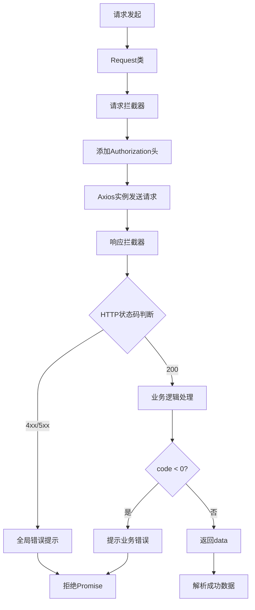
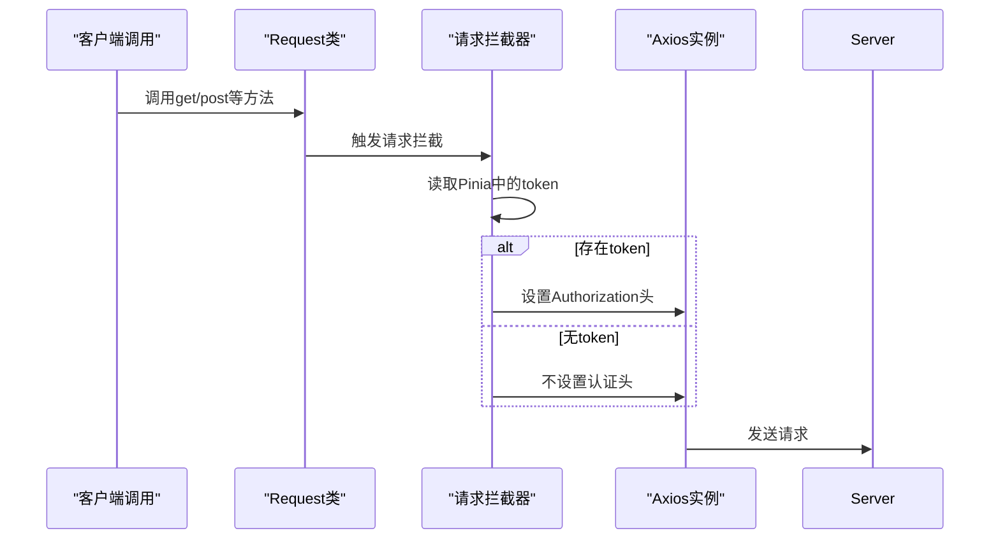
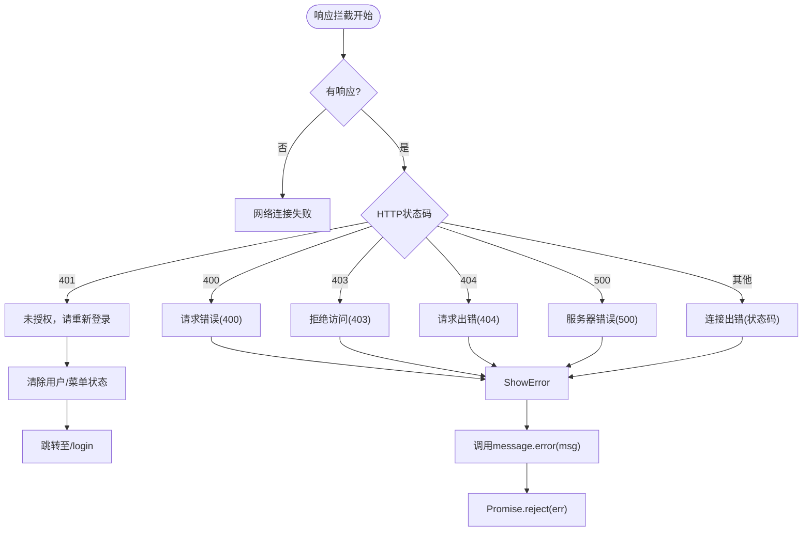
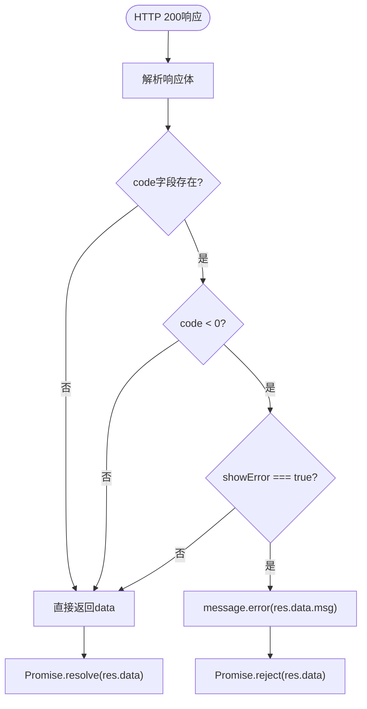
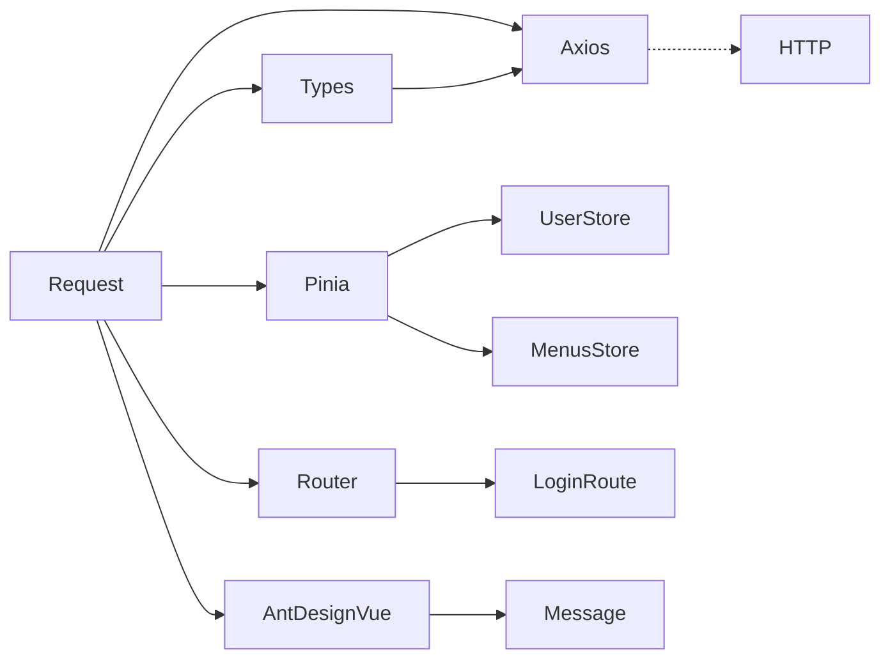

# 请求封装

<cite>
**本文档引用的文件**
- [index.ts](file://src/libs/fetch/index.ts)
- [types.ts](file://src/libs/fetch/types.ts)
</cite>

## 目录
1. [简介](#简介)
2. [核心组件](#核心组件)
3. [架构概述](#架构概述)
4. [详细组件分析](#详细组件分析)
5. [依赖分析](#依赖分析)
6. [性能考虑](#性能考虑)
7. [故障排除指南](#故障排除指南)
8. [结论](#结论)

## 简介
本项目中的请求封装模块位于 `src/libs/fetch/` 目录下，基于 Axios 实现了一套完整的 HTTP 请求解决方案。该封装通过 `index.ts` 中的 `Request` 类提供统一的请求入口，并通过 `types.ts` 定义了标准化的请求与响应类型。封装支持请求/响应拦截器、自动认证头注入、全局错误提示、状态码统一处理等功能，旨在提升前端网络请求的稳定性与可维护性。

## 核心组件

该请求封装的核心实现位于 `src/libs/fetch/index.ts`，主要包含以下功能：
- 基于 Axios 的实例化封装
- 请求拦截器：自动注入认证 Token
- 响应拦截器：统一处理 HTTP 状态码错误
- 业务响应处理：根据返回体中的 `code` 字段判断业务成功或失败
- 支持 GET、POST、PUT、DELETE 等常用 HTTP 方法
- 可配置的错误提示机制

此外，`types.ts` 文件定义了关键的类型接口，包括响应格式 `ResponseType`、创建配置 `CreateAxiosConfig` 和请求配置 `RequestConfigType`，确保类型安全和开发体验。

**Section sources**
- [index.ts](file://src/libs/fetch/index.ts#L1-L140)
- [types.ts](file://src/libs/fetch/types.ts#L1-L16)

## 架构概述

**Diagram sources**
- [index.ts](file://src/libs/fetch/index.ts#L20-L140)
- [types.ts](file://src/libs/fetch/types.ts#L2-L15)

## 详细组件分析

### 请求拦截器分析

请求拦截器在发送请求前自动检查用户登录状态，并将 Token 注入到 `Authorization` 头中，实现无感认证。

**Diagram sources**
- [index.ts](file://src/libs/fetch/index.ts#L25-L35)

**Section sources**
- [index.ts](file://src/libs/fetch/index.ts#L25-L35)

### 响应拦截器分析

响应拦截器负责处理常见的 HTTP 错误状态码，并通过 Ant Design Vue 的 `message.error` 进行全局提示。对于 401 未授权状态，自动清除用户和菜单状态并跳转至登录页。

**Diagram sources**
- [index.ts](file://src/libs/fetch/index.ts#L37-L79)

**Section sources**
- [index.ts](file://src/libs/fetch/index.ts#L37-L79)

### 业务响应处理分析

在 HTTP 成功（200）的前提下，进一步解析响应体中的业务状态码 `code`。若 `code < 0` 且配置了 `showError: true`，则提示业务错误信息。

**Diagram sources**
- [index.ts](file://src/libs/fetch/index.ts#L81-L93)

**Section sources**
- [index.ts](file://src/libs/fetch/index.ts#L81-L93)

## 依赖分析

该请求封装模块依赖多个外部和内部模块，形成清晰的依赖链：

**Diagram sources**
- [index.ts](file://src/libs/fetch/index.ts#L1-L140)
- [types.ts](file://src/libs/fetch/types.ts#L1-L16)

**Section sources**
- [index.ts](file://src/libs/fetch/index.ts#L1-L140)
- [types.ts](file://src/libs/fetch/types.ts#L1-L16)

## 性能考虑

- **拦截器开销**：请求/响应拦截器引入了轻量级逻辑判断，对性能影响极小。
- **错误提示统一化**：避免在业务层重复编写错误提示代码，减少冗余渲染。
- **Token 注入高效**：每次请求仅读取一次 Pinia 状态，避免频繁访问存储。
- **Promise 封装合理**：使用标准 Promise 模式，兼容 async/await，无额外性能损耗。

该封装在保证功能完整性的同时，保持了良好的运行效率，适用于大规模应用。

## 故障排除指南

常见问题及解决方案：

| 问题现象 | 可能原因 | 解决方案 |
|--------|--------|--------|
| 请求无Authorization头 | 用户未登录或token为空 | 确保登录后正确设置token |
| 401后未跳转登录页 | 路由未正确注入 | 检查main.ts中是否正确挂载router |
| 错误提示重复出现 | 多次调用失败且未捕获 | 在业务层使用try/catch或.catch()处理 |
| 上传文件失败 | 未设置Content-Type | 在config中手动设置headers: {'Content-Type': 'multipart/form-data'} |
| 请求超时 | 默认超时时间过短 | 在CreateAxiosConfig中配置timeout字段 |

**Section sources**
- [index.ts](file://src/libs/fetch/index.ts#L37-L79)
- [index.ts](file://src/libs/fetch/index.ts#L81-L93)

## 结论

该请求封装模块设计合理、功能完整，具备以下优势：
- 统一处理认证、错误提示、业务状态判断
- 类型安全，接口清晰
- 易于扩展和维护
- 与项目状态管理（Pinia）和路由系统深度集成
- 提供简洁的 API（get/post/put/delete）供业务层调用

建议在项目中全面采用此封装进行网络请求，避免直接使用原生 Axios，以保障代码一致性与用户体验。