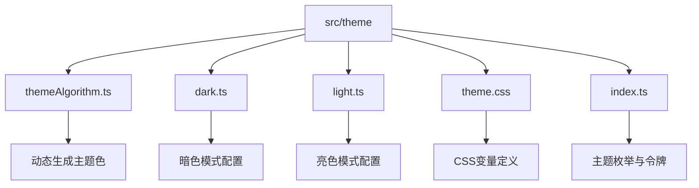
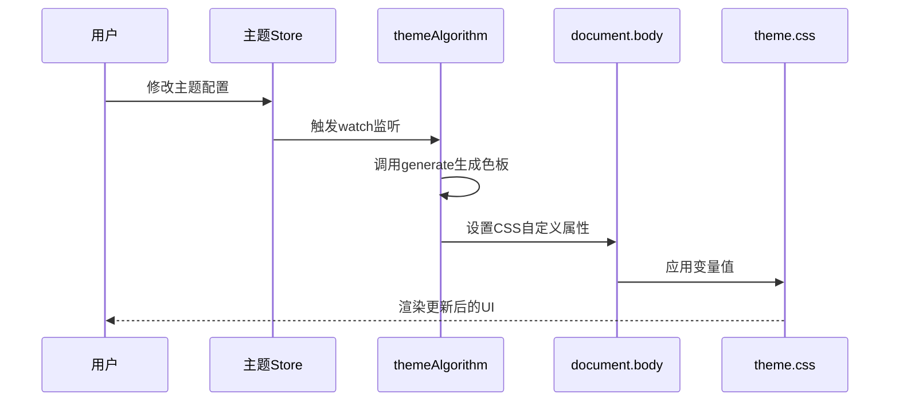
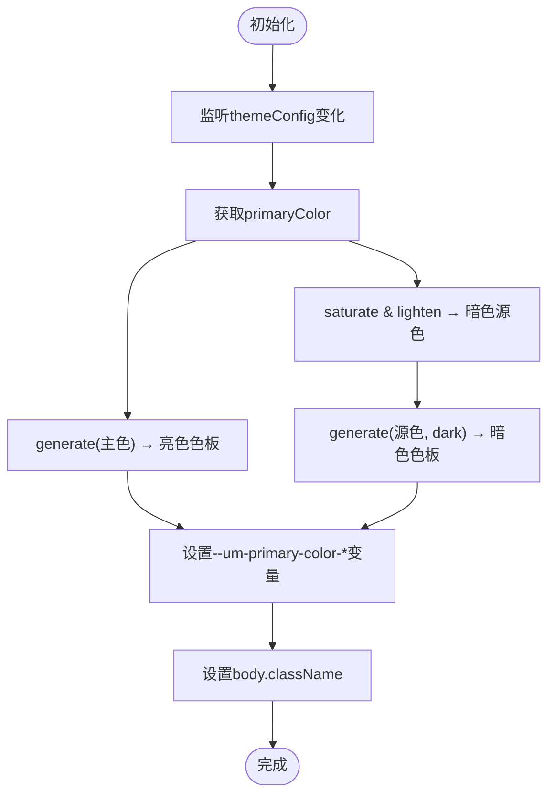
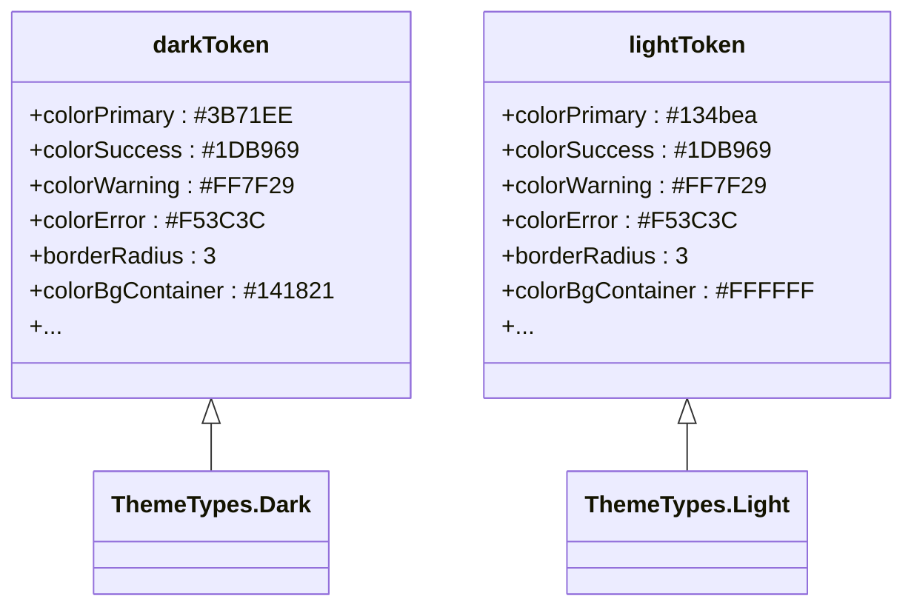
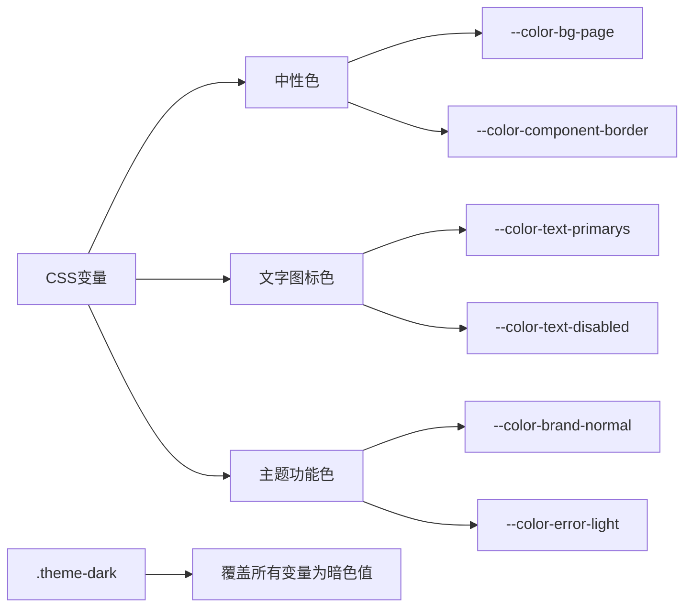
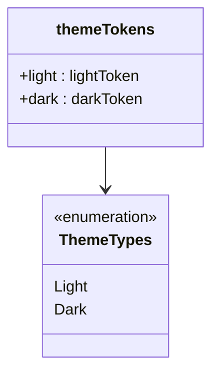

# 主题系统

<cite>
**本文档引用的文件**  
- [themeAlgorithm.ts](file://src/theme/themeAlgorithm.ts)
- [dark.ts](file://src/theme/dark.ts)
- [light.ts](file://src/theme/light.ts)
- [theme.css](file://src/theme/theme.css)
- [index.ts](file://src/theme/index.ts)
</cite>

## 目录
1. [介绍](#介绍)
2. [项目结构](#项目结构)
3. [核心组件](#核心组件)
4. [架构概述](#架构概述)
5. [详细组件分析](#详细组件分析)
6. [依赖分析](#依赖分析)
7. [性能考虑](#性能考虑)
8. [故障排除指南](#故障排除指南)
9. [结论](#结论)

## 介绍
本技术文档深入解析了基于CSS变量与Ant Design Vue主题算法实现的动态主题系统。系统通过`themeAlgorithm.ts`动态生成主题色变量，结合`dark.ts`和`light.ts`中定义的明暗模式样式配置，利用`theme.css`作为CSS变量载体，并通过`index.ts`协调主题切换与应用。文档详细阐述了各模块的协作机制，提供自定义主题的实现步骤，并评估主题切换对性能的影响。

## 项目结构
主题系统位于`src/theme`目录下，包含核心配置文件与算法实现。该目录通过模块化设计分离主题逻辑，确保可维护性与扩展性。



**图示来源**  
- [themeAlgorithm.ts](file://src/theme/themeAlgorithm.ts#L1-L68)
- [dark.ts](file://src/theme/dark.ts#L1-L74)
- [light.ts](file://src/theme/light.ts#L1-L72)
- [theme.css](file://src/theme/theme.css#L1-L197)
- [index.ts](file://src/theme/index.ts#L1-L12)

**本节来源**  
- [src/theme](file://src/theme)

## 核心组件
主题系统由五个核心文件构成：`themeAlgorithm.ts`负责根据配置动态生成主题色；`dark.ts`和`light.ts`分别定义暗色与亮色模式的完整设计令牌；`theme.css`通过CSS变量暴露样式配置；`index.ts`统一导出主题类型与令牌，供应用层调用。

**本节来源**  
- [themeAlgorithm.ts](file://src/theme/themeAlgorithm.ts#L1-L68)
- [dark.ts](file://src/theme/dark.ts#L1-L74)
- [light.ts](file://src/theme/light.ts#L1-L72)
- [theme.css](file://src/theme/theme.css#L1-L197)
- [index.ts](file://src/theme/index.ts#L1-L12)

## 架构概述
系统采用“配置驱动 + 动态注入”的架构模式。用户通过Pinia状态管理配置主题色与模式，`themeAlgorithm`监听配置变化，利用Ant Design Colors库生成渐变色板，并将结果写入DOM的CSS变量。`theme.css`中的样式规则引用这些变量，实现全局主题更新。



**图示来源**  
- [themeAlgorithm.ts](file://src/theme/themeAlgorithm.ts#L15-L60)
- [theme.css](file://src/theme/theme.css#L1-L197)

## 详细组件分析

### themeAlgorithm.ts 分析
该模块是主题系统的核心逻辑，负责响应式地生成并应用主题色。



**图示来源**  
- [themeAlgorithm.ts](file://src/theme/themeAlgorithm.ts#L15-L60)

**本节来源**  
- [themeAlgorithm.ts](file://src/theme/themeAlgorithm.ts#L1-L68)

### dark.ts 和 light.ts 分析
这两个文件定义了Ant Design组件库在不同模式下的设计令牌，覆盖颜色、圆角、边框等视觉属性。



**图示来源**  
- [dark.ts](file://src/theme/dark.ts#L1-L74)
- [light.ts](file://src/theme/light.ts#L1-L72)

**本节来源**  
- [dark.ts](file://src/theme/dark.ts#L1-L74)
- [light.ts](file://src/theme/light.ts#L1-L72)

### theme.css 分析
该文件是CSS变量的声明中心，将JavaScript生成的变量映射到实际样式规则中。



**图示来源**  
- [theme.css](file://src/theme/theme.css#L1-L197)

**本节来源**  
- [theme.css](file://src/theme/theme.css#L1-L197)

### index.ts 分析
该模块提供主题系统的公共接口，定义枚举类型并聚合主题令牌。



**图示来源**  
- [index.ts](file://src/theme/index.ts#L1-L12)

**本节来源**  
- [index.ts](file://src/theme/index.ts#L1-L12)

## 依赖分析
主题系统依赖于多个外部库与内部模块，形成清晰的依赖链。

```mermaid
graph LR
A[themeAlgorithm.ts] --> B[@ant-design/colors]
A --> C[Color]
A --> D[Pinia Store]
D --> E[themeStore]
A --> F[document.body]
G[theme.css] --> F
H[index.ts] --> I[dark.ts]
H --> J[light.ts]
K[应用层] --> H
K --> A
```

**图示来源**  
- [themeAlgorithm.ts](file://src/theme/themeAlgorithm.ts#L1-L68)
- [index.ts](file://src/theme/index.ts#L1-L12)

**本节来源**  
- [themeAlgorithm.ts](file://src/theme/themeAlgorithm.ts#L1-L68)
- [index.ts](file://src/theme/index.ts#L1-L12)

## 性能考虑
主题切换的性能影响主要体现在：
1. **首次加载**：色板生成为同步操作，但计算量小，影响可忽略。
2. **运行时切换**：通过`watch`监听配置变化，仅在用户主动修改时触发，避免频繁重计算。
3. **DOM操作**：直接设置`style.setProperty`，仅更新必要变量，不触发全量重排。
4. **CSS解析**：浏览器对CSS变量有良好优化，样式更新高效。

建议避免在动画过程中频繁切换主题，以防视觉卡顿。

## 故障排除指南
- **主题未生效**：检查`body`元素是否正确应用`theme-dark`或`theme-light`类。
- **颜色显示异常**：确认`themeAlgorithm`已正确初始化并监听store。
- **变量未定义**：验证`theme.css`是否已正确引入项目。
- **暗色模式错乱**：检查`dark.ts`中的`backgroundColor`是否与`generate`调用一致。

**本节来源**  
- [themeAlgorithm.ts](file://src/theme/themeAlgorithm.ts#L15-L60)
- [theme.css](file://src/theme/theme.css#L1-L197)
- [dark.ts](file://src/theme/dark.ts#L1-L74)

## 结论
该主题系统通过CSS变量与Ant Design算法的结合，实现了高度动态且可定制的主题管理。其模块化设计便于维护与扩展，响应式机制确保了用户体验的流畅性。开发者可基于现有结构轻松添加新主题或调整配色方案，满足多样化的视觉需求。