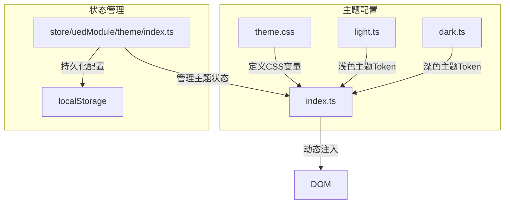
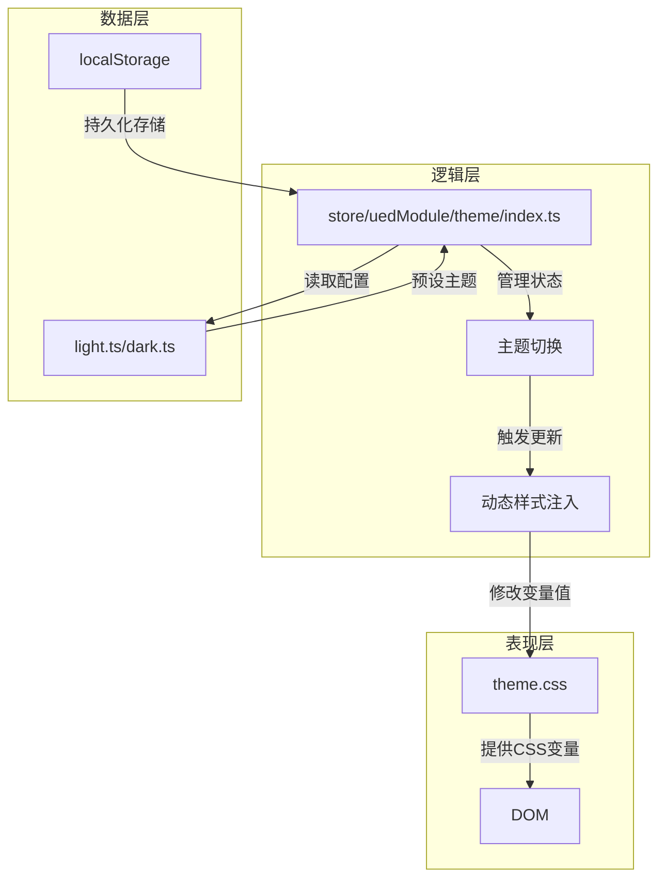
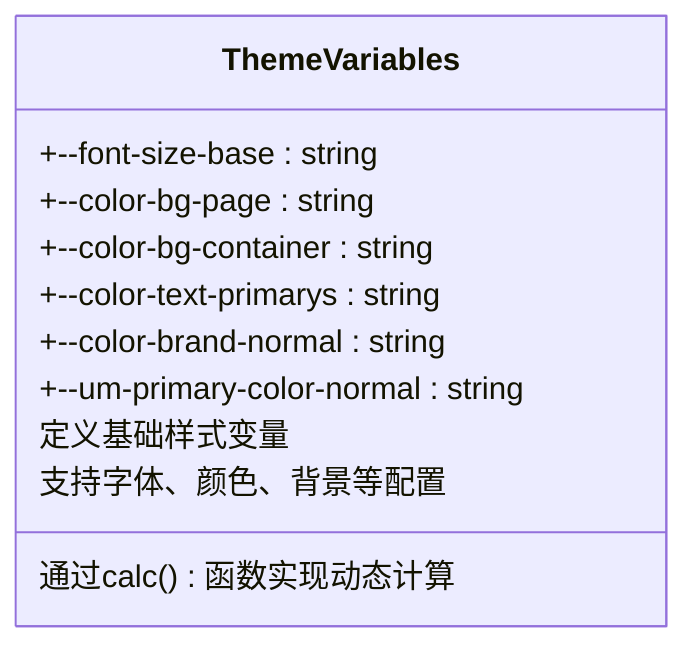
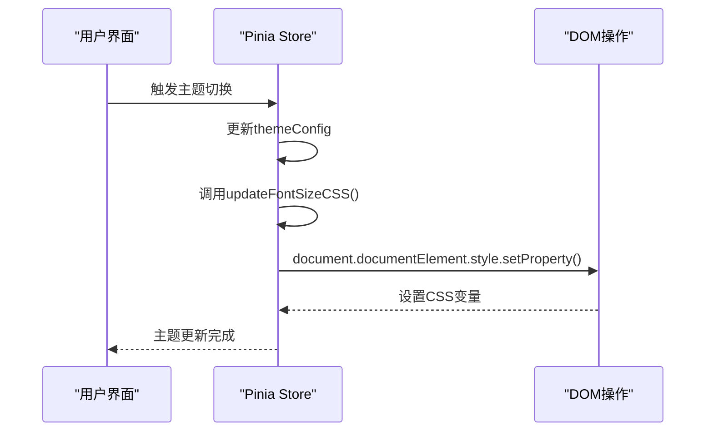
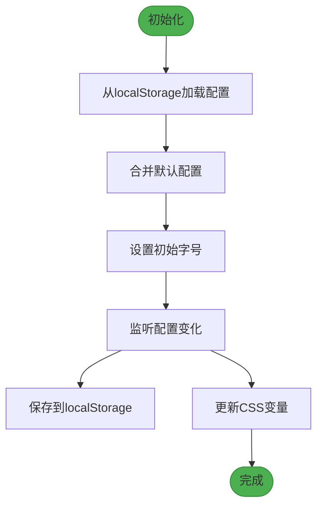
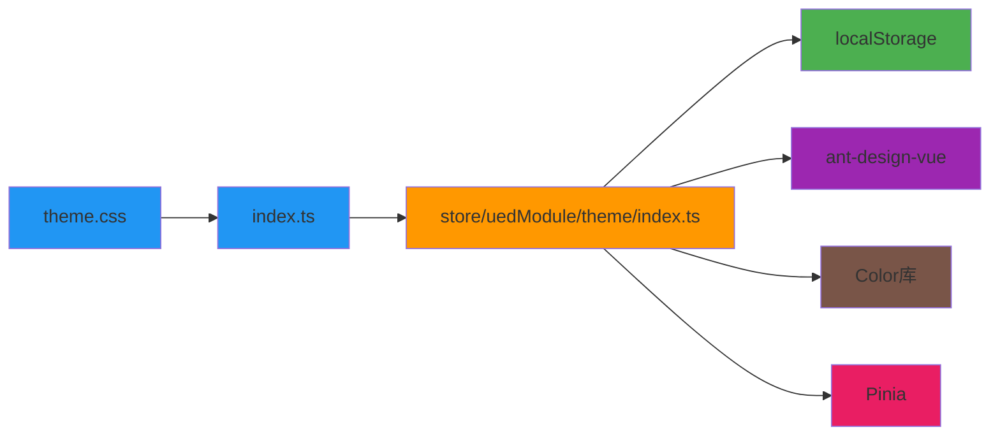

# 主题系统实现原理

<cite>
**本文档引用的文件**  
- [theme.css](file://src/theme/theme.css)
- [index.ts](file://src/theme/index.ts)
- [theme/index.ts](file://src/store/uedModule/theme/index.ts)
- [light.ts](file://src/theme/light.ts)
- [dark.ts](file://src/theme/dark.ts)
</cite>

## 目录
1. [简介](#简介)
2. [项目结构](#项目结构)
3. [核心组件](#核心组件)
4. [架构概述](#架构概述)
5. [详细组件分析](#详细组件分析)
6. [依赖分析](#依赖分析)
7. [性能考虑](#性能考虑)
8. [故障排除指南](#故障排除指南)
9. [结论](#结论)

## 简介
本文档详细阐述了基于CSS变量的主题系统实现原理。重点分析了`theme.css`文件如何通过CSS变量定义主题配置，`index.ts`如何通过JavaScript动态修改这些变量实现主题切换，以及该系统如何与Pinia状态管理(store/uedModule/theme/index.ts)集成。文档还提供了主题切换流程的代码示例，并讨论了该实现方式的优势和局限性。

## 项目结构
主题系统主要由以下几个核心文件构成，分布在`src/theme`和`src/store/uedModule/theme`目录中：

**图示来源**  
- [theme.css](file://src/theme/theme.css)
- [index.ts](file://src/theme/index.ts)
- [store/uedModule/theme/index.ts](file://src/store/uedModule/theme/index.ts)

**本节来源**  
- [theme.css](file://src/theme/theme.css)
- [index.ts](file://src/theme/index.ts)
- [store/uedModule/theme/index.ts](file://src/store/uedModule/theme/index.ts)

## 核心组件
主题系统的核心组件包括：
- **CSS变量定义**：在`theme.css`中定义所有可配置的样式变量
- **主题Token管理**：通过`light.ts`和`dark.ts`提供预设的主题配置
- **状态管理**：使用Pinia store管理主题配置和状态
- **动态样式注入**：通过JavaScript动态修改CSS变量值

**本节来源**  
- [theme.css](file://src/theme/theme.css#L1-L197)
- [index.ts](file://src/theme/index.ts#L1-L12)
- [store/uedModule/theme/index.ts](file://src/store/uedModule/theme/index.ts#L1-L158)

## 架构概述
主题系统的整体架构采用分层设计，将样式定义、状态管理和DOM操作分离：

**图示来源**  
- [theme.css](file://src/theme/theme.css)
- [index.ts](file://src/theme/index.ts)
- [store/uedModule/theme/index.ts](file://src/store/uedModule/theme/index.ts)

## 详细组件分析

### CSS变量定义机制
主题系统基于CSS自定义属性（CSS变量）实现样式配置，所有变量在`:root`和`.theme-light`、`.theme-dark`选择器中定义。

**图示来源**  
- [theme.css](file://src/theme/theme.css#L1-L197)

**本节来源**  
- [theme.css](file://src/theme/theme.css#L1-L197)

### JavaScript动态样式注入
通过JavaScript动态修改CSS变量值，实现主题的实时切换。

**图示来源**  
- [store/uedModule/theme/index.ts](file://src/store/uedModule/theme/index.ts#L14-L20)
- [store/uedModule/theme/index.ts](file://src/store/uedModule/theme/index.ts#L30-L34)

**本节来源**  
- [store/uedModule/theme/index.ts](file://src/store/uedModule/theme/index.ts#L14-L34)

### 主题状态管理
使用Pinia实现主题配置的状态管理，包括配置持久化和响应式更新。

**图示来源**  
- [store/uedModule/theme/index.ts](file://src/store/uedModule/theme/index.ts#L25-L45)

**本节来源**  
- [store/uedModule/theme/index.ts](file://src/store/uedModule/theme/index.ts#L25-L45)

## 依赖分析
主题系统与其他模块的依赖关系如下：

**图示来源**  
- [theme.css](file://src/theme/theme.css)
- [index.ts](file://src/theme/index.ts)
- [store/uedModule/theme/index.ts](file://src/store/uedModule/theme/index.ts)

**本节来源**  
- [theme.css](file://src/theme/theme.css)
- [index.ts](file://src/theme/index.ts)
- [store/uedModule/theme/index.ts](file://src/store/uedModule/theme/index.ts)

## 性能考虑
主题系统的实现方式具有以下性能特点：

- **优点**：
  - CSS变量的浏览器原生支持，性能优异
  - 只需修改少量CSS变量，即可实现全局样式更新
  - 利用浏览器的样式重计算优化机制
  - 配置持久化减少重复计算

- **局限性**：
  - 需要浏览器支持CSS变量（IE不支持）
  - 大量CSS变量可能增加内存占用
  - 动态更新时可能触发重排和重绘
  - 深色模式的颜色生成算法有一定计算开销

**本节来源**  
- [store/uedModule/theme/index.ts](file://src/store/uedModule/theme/index.ts#L60-L85)

## 故障排除指南
常见问题及解决方案：

1. **主题切换无效**
   - 检查CSS变量名是否正确
   - 确认DOM元素是否应用了正确的类名
   - 验证Pinia store是否正确更新

2. **字体大小不生效**
   - 确保`--font-size-base`变量被正确设置
   - 检查是否使用了`calc()`函数的正确语法
   - 验证单位是否正确（px）

3. **深色模式颜色异常**
   - 检查`generate`函数的参数是否正确
   - 验证背景色配置是否匹配
   - 确认颜色计算逻辑是否正确

**本节来源**  
- [store/uedModule/theme/index.ts](file://src/store/uedModule/theme/index.ts#L60-L85)
- [theme.css](file://src/theme/theme.css)

## 结论
本文档详细分析了基于CSS变量的主题系统实现原理。该系统通过`theme.css`文件定义CSS变量作为主题配置的载体，利用`index.ts`中的JavaScript代码动态修改这些变量实现主题切换。系统与Pinia状态管理(store/uedModule/theme/index.ts)深度集成，实现了主题配置的持久化和响应式更新。

这种实现方式具有配置集中、更新高效、维护简单等优点，但也存在浏览器兼容性限制和性能开销等局限性。整体而言，该主题系统设计合理，实现了样式配置与业务逻辑的分离，为应用提供了灵活的主题管理能力。