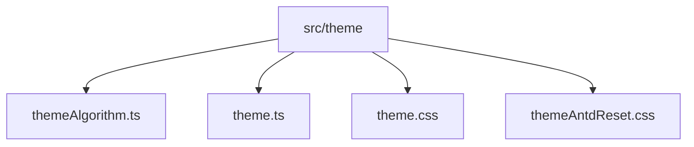
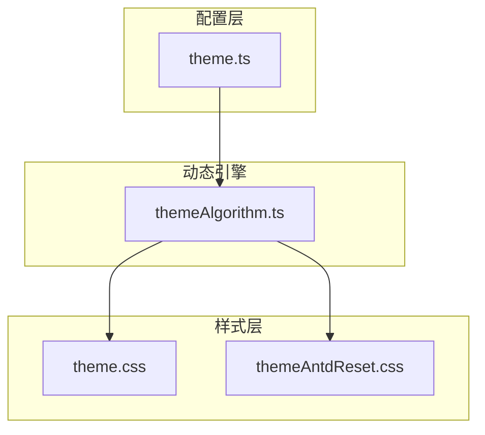
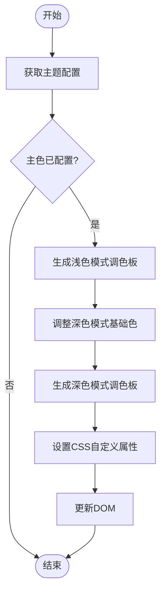

# 动态主题算法

<cite>
**本文档引用的文件**
- [themeAlgorithm.ts](file://src/theme/themeAlgorithm.ts)
- [theme.ts](file://src/theme/theme.ts)
- [theme.css](file://src/theme/theme.css)
- [themeAntdReset.css](file://src/theme/themeAntdReset.css)
</cite>

## 目录
1. [简介](#简介)
2. [项目结构](#项目结构)
3. [核心组件](#核心组件)
4. [架构概述](#架构概述)
5. [详细组件分析](#详细组件分析)
6. [依赖分析](#依赖分析)
7. [性能考虑](#性能考虑)
8. [故障排除指南](#故障排除指南)
9. [结论](#结论)
10. [附录](#附录)（如有必要）

## 简介
本文档深入解析动态主题算法的技术实现，重点分析 `themeAlgorithm.ts` 文件中 `generateThemeVariables` 函数（在代码中体现为 `themeAlgorithm` 函数）的工作原理。该算法基于 Ant Design Vue 的设计规范，通过基础色生成完整的调色板，包括主色、辅助色、文字色等，并确保生成的主题符合设计系统要求。文档将详细阐述算法如何计算颜色梯度和对比度，提供从主题配置输入到 CSS 变量映射输出的完整转换过程示例，并讨论其可扩展性。

## 项目结构
项目主题系统位于 `src/theme` 目录下，包含核心算法、默认配置和样式文件。`themeAlgorithm.ts` 是动态主题生成的核心逻辑，`theme.ts` 提供了默认的主题配置，`theme.css` 定义了基于 CSS 变量的样式规则，而 `themeAntdReset.css` 则用于覆盖 Ant Design 组件库的默认样式以符合 UED 规范。



**图示来源**
- [themeAlgorithm.ts](file://src/theme/themeAlgorithm.ts#L1-L68)
- [theme.ts](file://src/theme/theme.ts#L1-L61)
- [theme.css](file://src/theme/theme.css#L1-L197)
- [themeAntdReset.css](file://src/theme/themeAntdReset.css#L1-L773)

**本节来源**
- [themeAlgorithm.ts](file://src/theme/themeAlgorithm.ts#L1-L68)
- [theme.ts](file://src/theme/theme.ts#L1-L61)
- [theme.css](file://src/theme/theme.css#L1-L197)
- [themeAntdReset.css](file://src/theme/themeAntdReset.css#L1-L773)

## 核心组件
`themeAlgorithm.ts` 文件中的 `themeAlgorithm` 函数是整个动态主题系统的核心。它利用 `@ant-design/colors` 库的 `generate` 函数，根据用户配置的主色调，生成一个包含10个梯度的完整调色板。该函数通过 Vue 的响应式系统（`watchEffect` 和 `watch`）监听主题配置的变化，动态更新 `document.body` 上的 CSS 自定义属性（CSS Variables），从而实现主题的实时切换。

**本节来源**
- [themeAlgorithm.ts](file://src/theme/themeAlgorithm.ts#L1-L68)

## 架构概述
整个主题系统采用分层架构。`theme.ts` 提供静态的默认主题配置。`themeAlgorithm.ts` 作为动态引擎，接收用户配置，应用算法生成动态的 CSS 变量。`theme.css` 是样式层，它使用这些 CSS 变量来定义应用的视觉样式。最后，`themeAntdReset.css` 作为适配层，确保第三方组件库（Ant Design Vue）的样式与整体设计规范保持一致。



**图示来源**
- [themeAlgorithm.ts](file://src/theme/themeAlgorithm.ts#L1-L68)
- [theme.ts](file://src/theme/theme.ts#L1-L61)
- [theme.css](file://src/theme/theme.css#L1-L197)
- [themeAntdReset.css](file://src/theme/themeAntdReset.css#L1-L773)

## 详细组件分析

### 主题算法分析
`themeAlgorithm` 函数的核心功能是将一个基础的主色调扩展为一个完整的、符合设计规范的调色板。

#### 算法工作流程


**图示来源**
- [themeAlgorithm.ts](file://src/theme/themeAlgorithm.ts#L1-L68)

#### 颜色生成与设计规范
算法严格遵循 Ant Design 的设计规范。当用户设置一个主色（如 `#134bea`）时，`@ant-design/colors` 库的 `generate` 函数会基于该颜色生成一个包含10个梯度的数组。例如，`primaryColors[5]` 对应主色（normal），`primaryColors[4]` 对应悬停色（hover），`primaryColors[7]` 对应激活色（active）。这确保了颜色梯度的和谐与一致性。

对于深色模式，算法并非简单地反转浅色模式的颜色。它首先使用 `color` 库对原始主色进行调整：饱和度增加 `15/85` 并略微提亮，生成一个更适合深色背景的“深色模式基础色”。然后，使用 `generate` 函数的 `theme: 'dark'` 模式，基于这个新基础色和指定的背景色 `#1c222e` 生成一套专为深色模式优化的调色板。这保证了在深色背景下，主题色依然具有良好的可读性和视觉吸引力。

**本节来源**
- [themeAlgorithm.ts](file://src/theme/themeAlgorithm.ts#L1-L68)
- [theme.css](file://src/theme/theme.css#L1-L197)

### 代码转换示例
以下示例展示了从输入到输出的完整转换过程。

**输入：** 用户在主题配置中选择主色为 `#134bea`，模式为 `light`。

**处理过程：**
1.  `themeAlgorithm` 函数监听到 `config.value.primaryColor` 的变化。
2.  调用 `generate('#134bea')` 生成浅色调色板 `primaryColors`。
3.  计算深色模式基础色 `darkOriginColor`。
4.  调用 `generate(darkOriginColor, { theme: 'dark', backgroundColor: '#1c2e' })` 生成深色调色板 `darkPrimaryColors`。
5.  将生成的颜色值通过 `setProperty` 方法设置为 `document.body` 的 CSS 变量。

**输出：** DOM 中的 CSS 变量被更新，例如：
-   `--um-primary-color-normal: #134bea;` (来自 `primaryColors[5]`)
-   `--um-dark-primary-color-normal: #某个深色模式下的主色;` (来自 `darkPrimaryColors[5]`)
-   `--color-brand-normal: var(--um-primary-color-normal);` (在 `theme.css` 中被引用)

这些 CSS 变量随后被 `theme.css` 和 `themeAntdReset.css` 中的样式规则所使用，从而全局改变应用的外观。

**本节来源**
- [themeAlgorithm.ts](file://src/theme/themeAlgorithm.ts#L1-L68)
- [theme.css](file://src/theme/theme.css#L1-L197)

## 依赖分析
该主题系统依赖于多个外部库和内部模块。

```mermaid
graph LR
A[themeAlgorithm.ts] --> B[@ant-design/colors]
A --> C[Color]
A --> D[pinia]
A --> E[themeConfig]
F[theme.css] --> G[CSS Variables]
H[themeAntdReset.css] --> G
A --> G
```

**图示来源**
- [themeAlgorithm.ts](file://src/theme/themeAlgorithm.ts#L1-L68)
- [theme.css](file://src/theme/theme.css#L1-L197)
- [themeAntdReset.css](file://src/theme/themeAntdReset.css#L1-L773)

**本节来源**
- [themeAlgorithm.ts](file://src/theme/themeAlgorithm.ts#L1-L68)
- [theme.css](file://src/theme/theme.css#L1-L197)
- [themeAntdReset.css](file://src/theme/themeAntdReset.css#L1-L773)

## 性能考虑
该算法的性能开销主要发生在主题配置变更时。`generate` 函数的计算是即时的，且只在配置变化时触发一次。通过将生成的颜色值存储为 CSS 变量，避免了在每个组件中重复计算，极大地提升了运行时性能。样式文件（`theme.css`）的加载是静态的，不会造成额外的性能负担。

## 故障排除指南
如果主题切换不生效，请检查以下几点：
1.  确保 `themeAlgorithm` 函数已在应用启动时被正确调用。
2.  检查 `themeConfig` 的 `primaryColor` 是否被正确更新。
3.  在浏览器开发者工具中检查 `document.body` 上是否设置了预期的 CSS 变量。
4.  确认 `theme.css` 和 `themeAntdReset.css` 文件已被正确引入。

**本节来源**
- [themeAlgorithm.ts](file://src/theme/themeAlgorithm.ts#L1-L68)
- [theme.css](file://src/theme/theme.css#L1-L197)

## 结论
`themeAlgorithm.ts` 实现了一个高效、规范的动态主题系统。它巧妙地结合了 `@ant-design/colors` 库的算法和 CSS 变量技术，实现了基于单一主色的完整调色板生成和实时主题切换。该设计不仅保证了与 Ant Design 设计规范的高度一致性，还通过响应式编程和 CSS 变量优化了性能，为应用提供了强大的主题定制能力。

## 附录

### 可扩展性分析
该算法具有良好的可扩展性。要添加自定义颜色生成规则，可以在 `themeAlgorithm` 函数中，在调用 `generate` 之后，对生成的 `primaryColors` 数组进行二次处理，例如手动覆盖某些索引的颜色值。要支持新的设计系统，可以创建一个新的算法函数，该函数遵循新系统的配色规范，并生成一套新的 CSS 变量，然后在 `theme.css` 中引用这些新变量。