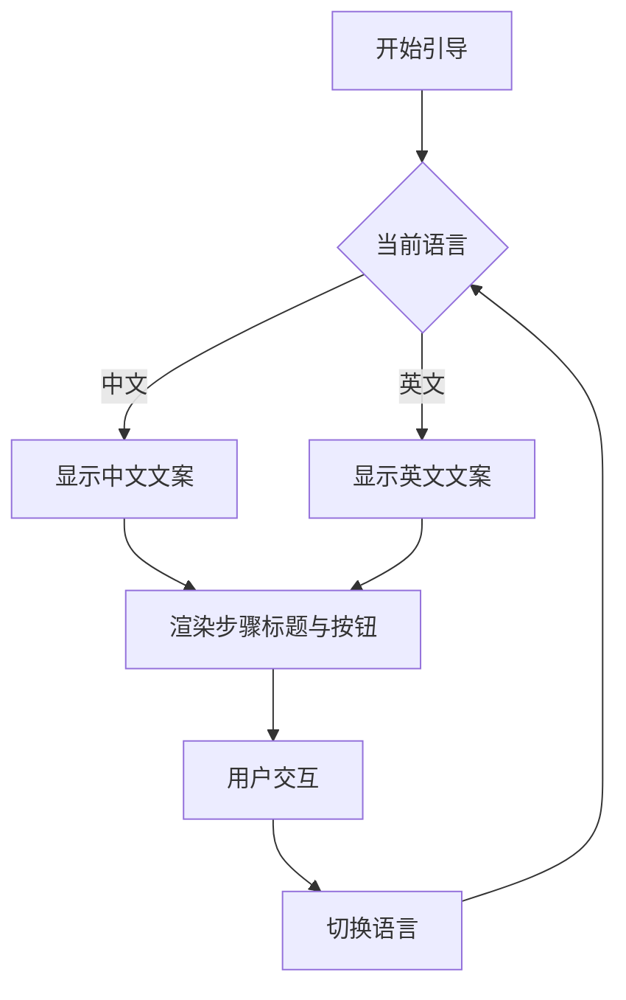

# 国际化

<cite>
**本文档中引用的文件**  
- [index.ts](file://src/locale/index.ts)
- [main.ts](file://src/main.ts)
- [index.vue](file://src/components/uedModule/vueTour/index.vue)
- [index.vue](file://src/views/uedTypical/vueTour/index.vue)
</cite>

## 目录
1. [简介](#简介)
2. [i18n 实例配置](#i18n-实例配置)
3. [在 Vue 组件中使用翻译方法](#在-vue-组件中使用翻译方法)
4. [国际化在 UI 中的实际应用](#国际化在-ui-中的实际应用)
5. [添加新语言包的完整流程](#添加新语言包的完整流程)
6. [总结](#总结)

## 简介
本项目通过 `@international/vue3-i18n` 实现多语言支持，提供灵活的国际化能力。系统支持中文（zh-CN）和英文（en-US）两种语言，并可通过配置扩展更多语言。本文档详细说明 i18n 的配置方式、翻译方法的使用、UI 组件中的实际应用案例，以及如何添加新的语言包。

## i18n 实例配置

`src/locale/index.ts` 文件中定义了 i18n 实例的初始化逻辑。该模块导出一个函数，接收 Vue 应用实例作为参数，并通过 `createI18n` 方法创建国际化实例。

配置主要包括以下内容：
- **自动检测语言**：`autoDetect: false` 表示不启用浏览器语言自动检测。
- **语言包消息**：通过 `messages` 字段注册支持的语言，当前支持 `zh`（中文）和 `en`（英文），每个语言对应一个嵌套对象，结构为 `{ I18N: 语言包 }`。
- **Kiwi 集成**：`kiwi` 字段直接暴露语言包对象，便于外部工具集成。
- **应用挂载**：使用 `app.use(i18nIns)` 将 i18n 实例注册到 Vue 应用中。

语言包文件来自项目根目录下的 `.kiwi` 文件夹，分别为 `zh-CN` 和 `en-US` 的翻译内容。

**Section sources**
- [index.ts](file://src/locale/index.ts#L1-L18)

## 在 Vue 组件中使用翻译方法

在 Vue 组件中，可以通过 `$t()` 方法进行文本翻译。该方法接受一个字符串路径作为参数，返回对应语言环境下的翻译结果。

例如，在模板中使用：
```vue
<span>{{ $t('I18N.layout.yiQiShouShou') }}</span>
```
其中 `'I18N.layout.yiQiShouShou'` 是语言包中的键路径，会根据当前语言环境动态替换为对应的中文或英文文本。

`$t()` 方法在组件渲染时自动响应语言切换，无需手动刷新组件。

**Section sources**
- [index.vue](file://src/views/uedTypical/vueTour/index.vue#L60)
- [index.ts](file://src/locale/index.ts#L1-L18)

## 国际化在 UI 中的实际应用

以 `vueTour` 组件为例，展示了国际化在用户界面中的具体应用。

在 `src/views/uedTypical/vueTour/index.vue` 中，`steps` 数组的每个步骤标题、按钮文字等内容均通过 `$t()` 方法进行翻译。例如：

- `title: I18N.layout.dianJiDaoXiaYiBu`
- `buttonNext: I18N.layout.ziDingYiXiaYiBuWenZi`

这些值从语言包中读取，并根据当前语言环境显示相应文本。此外，`labels` 字段允许对按钮文字进行自定义配置，进一步增强了灵活性。

组件通过 `VueTour` 封装的 `VTour` 和 `VStep` 实现引导式交互，所有 UI 文案均实现国际化，确保多语言用户获得一致体验。



**Diagram sources**
- [index.vue](file://src/components/uedModule/vueTour/index.vue#L1-L82)
- [index.vue](file://src/views/uedTypical/vueTour/index.vue#L1-L138)

**Section sources**
- [index.vue](file://src/components/uedModule/vueTour/index.vue#L1-L82)
- [index.vue](file://src/views/uedTypical/vueTour/index.vue#L1-L138)

## 添加新语言包的完整流程

要为项目添加新的语言包，需执行以下步骤：

### 1. 创建语言文件
在 `.kiwi` 目录下创建新的语言文件，例如 `fr-FR.ts`（法语），并导出对应的翻译对象：
```ts
export default {
  I18N: {
    layout: {
      yiQiShouShou: 'Commencez ensemble',
      dianJiDaoXiaYiBu: 'Cliquez pour continuer',
      // 其他翻译...
    }
  }
}
```

### 2. 注册到 i18n 实例
修改 `src/locale/index.ts` 文件，导入新语言并注册到 `messages` 和 `kiwi` 配置中：
```ts
import fr from '../../.kiwi/fr-FR';

// 在 createI18n 配置中添加
messages: {
  zh: { I18N: zh },
  en: { I18N: en },
  fr: { I18N: fr }
},
kiwi: {
  zh,
  en,
  fr
}
```

### 3. 在应用中切换语言
通过修改应用的语言环境来实现语言切换。虽然当前配置中 `autoDetect` 为 `false`，但可通过全局状态或路由参数控制语言设置。建议在 `pinia` store 中维护当前语言状态，并在语言变更时触发 `$forceUpdate()` 或重新挂载组件以更新 UI。

### 4. 测试新语言
在组件中使用 `$t()` 调用新语言的键名，验证翻译是否正确加载和显示。

**Section sources**
- [index.ts](file://src/locale/index.ts#L1-L18)
- [main.ts](file://src/main.ts#L1-L38)

## 总结
本项目通过 `@international/vue3-i18n` 实现了完整的国际化支持，具备良好的可扩展性。通过集中管理语言包、统一调用 `$t()` 方法、结合组件化设计，实现了多语言内容的高效维护与展示。未来可进一步优化语言自动检测、动态加载语言包、持久化用户语言偏好等功能，提升用户体验。