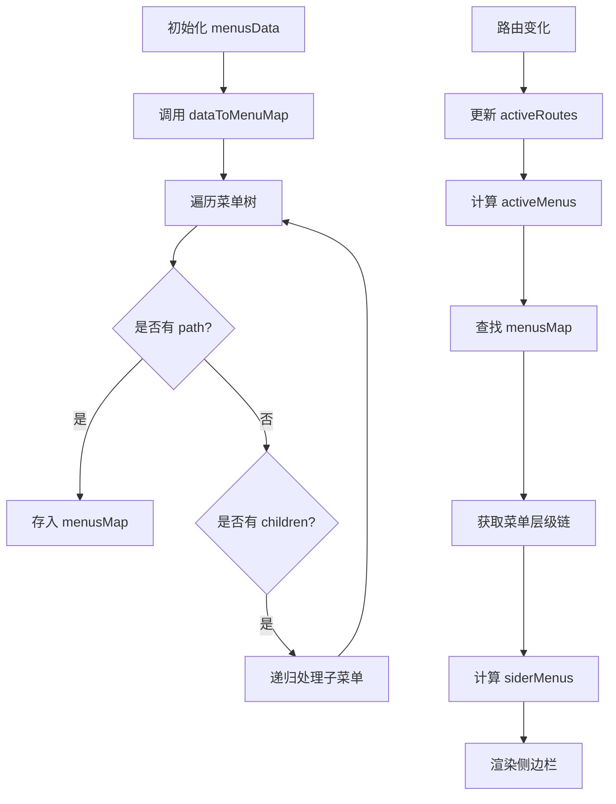

# 功能权限

<cite>
**本文档引用文件**  
- [index.ts](file://src/store/uedModule/login/index.ts)
- [types.ts](file://src/store/uedModule/login/types.ts)
- [defaultConfig.ts](file://src/store/uedModule/login/defaultConfig.ts)
- [sideMenu.vue](file://src/components/uedModule/menu/sideMenu.vue)
- [index.ts](file://src/store/uedModule/menus/index.ts)
- [types.ts](file://src/store/uedModule/menus/types.ts)
</cite>

## 目录
1. [简介](#简介)
2. [登录状态中的权限数据结构与初始化流程](#登录状态中的权限数据结构与初始化流程)
3. [UI元素的权限控制实现](#ui元素的权限控制实现)
4. [菜单渲染与权限过滤机制](#菜单渲染与权限过滤机制)
5. [权限判断的最佳实践](#权限判断的最佳实践)
6. [权限变更后的视图更新处理](#权限变更后的视图更新处理)
7. [总结](#总结)

## 简介
本文档详细描述了基于用户角色或权限码的细粒度功能权限控制系统。重点分析了登录状态中用户权限数据的存储结构和初始化流程，展示了如何在Vue组件中通过`v-if`或自定义指令控制按钮、菜单项等UI元素的显示逻辑。结合`sideMenu.vue`中的菜单渲染机制，说明权限过滤的具体实现方式，并提供在模板和JavaScript中进行权限判断的最佳实践方案。

## 登录状态中的权限数据结构与初始化流程

用户登录配置信息通过Pinia状态管理库进行集中管理，存储于`login` store中。该store负责维护用户的语言、主题模式、Logo等个性化设置，并持久化至`localStorage`。

权限相关的核心数据结构定义在`LoginConfigDTO`类中，由`loginConfig`状态变量持有，类型为`Ref<LoginConfigDTO>`。初始化时，系统会从`localStorage`中读取键名为`ZQ_LOGIN_CONFIG`的数据，若存在则合并默认配置`defaultLoginConfig`后创建新的`LoginConfigDTO`实例；若不存在，则使用默认配置初始化。

初始化过程中，还会根据存储的`mode`（主题模式）和`lang`（语言）自动调用`setTheme`和`setI18n`方法设置应用的主题和国际化语言，确保用户每次进入系统时都能恢复上次的个性化设置。

**Section sources**
- [index.ts](file://src/store/uedModule/login/index.ts#L1-L58)
- [types.ts](file://src/store/uedModule/login/types.ts#L1-L13)
- [defaultConfig.ts](file://src/store/uedModule/login/defaultConfig.ts#L1-L4)

## UI元素的权限控制实现

在Vue组件中，可通过响应式数据绑定结合条件渲染指令实现UI元素的权限控制。最常用的方式是使用`v-if`指令，根据当前用户的权限字段动态决定是否渲染特定的按钮、菜单项或其他界面元素。

例如，在侧边栏组件`sideMenu.vue`中，多个功能模块的显示与否直接由`config`对象中的布尔值控制：
- `v-if="config.helpCenter"` 控制“帮助文档”项的显示
- `v-if="config.languageSwitch"` 控制语言切换功能的可见性
- `v-if="config.lightDarkSwitch"` 控制明暗主题切换开关的展示

这些配置项最终来源于`loginConfig`中的用户设置，实现了基于用户权限或偏好设置的功能可见性控制。

此外，也可通过自定义指令封装更复杂的权限校验逻辑，如基于角色或权限码的访问控制，但当前项目主要采用组件内响应式数据驱动的方式实现。

**Section sources**
- [sideMenu.vue](file://src/components/uedModule/menu/sideMenu.vue#L45-L65)

## 菜单渲染与权限过滤机制

菜单系统的权限过滤机制主要由`menus` store实现，其核心在于将后端返回的原始菜单数据转换为前端可渲染的结构，并根据当前路由动态计算激活路径和侧边栏菜单。

`menus` store中定义了`menusData`用于存储原始菜单树结构，`menusMap`是一个`Map<string, MenuType[]>`，用于建立路由路径到菜单层级路径的映射关系。通过`dataToMenuMap`函数递归遍历菜单树，将每个具有`path`属性的菜单项路径作为键，其自身及所有父级菜单组成的数组作为值存入`menusMap`。

当路由发生变化时，`activeRoutes`被更新，触发`activeMenus`计算属性重新执行。该属性通过当前激活路由的路径在`menusMap`中查找对应的菜单层级链，从而确定当前所属的一级菜单（headerMenu），并据此从`menusData`中提取其子菜单作为侧边栏内容（`siderMenus`）。

此机制虽未显式进行权限码比对，但菜单数据本身是由后端根据用户权限过滤后下发的，因此前端仅需安全地渲染即可，确保了菜单项的权限隔离。

**Diagram sources**
- [index.ts](file://src/store/uedModule/menus/index.ts#L1-L139)
- [types.ts](file://src/store/uedModule/menus/types.ts#L1-L16)

**Section sources**
- [index.ts](file://src/store/uedModule/menus/index.ts#L1-L139)
- [sideMenu.vue](file://src/components/uedModule/menu/sideMenu.vue#L1-L261)

## 权限判断的最佳实践

在Vue模板中进行权限判断时，推荐使用计算属性或组合式API封装判断逻辑，避免在模板中编写复杂表达式。例如，可定义一个`hasPermission`函数，接收权限码作为参数，返回布尔值。

在JavaScript逻辑中，应优先使用store中的状态进行判断，确保数据来源单一且响应式。对于频繁使用的权限判断，可利用`computed`缓存结果，提升性能。

同时，建议将权限相关的配置项（如`helpCenter`、`languageSwitch`等）统一管理，避免散落在各个组件中，便于维护和全局控制。

## 权限变更后的视图更新处理

当用户权限或配置发生变更时（如切换语言、主题模式），系统通过Pinia store的响应式机制自动触发视图更新。例如，在`sideMenu.vue`中使用`watchEffect`监听`themeConfig`的变化，一旦检测到配置更新，立即同步到本地`config`变量，从而驱动模板重新渲染。

对于需要全局刷新的场景（如语言切换），当前实现采用了`window.location.reload()`强制刷新页面以确保所有组件状态同步。虽然这不是最优解，但在当前架构下能有效保证一致性。

更优的做法是利用Vue的响应式系统和i18n插件的动态切换能力，避免整页刷新，提升用户体验。未来可考虑优化为纯响应式更新。

**Section sources**
- [sideMenu.vue](file://src/components/uedModule/menu/sideMenu.vue#L130-L135)
- [index.ts](file://src/store/uedModule/login/index.ts#L40-L45)

## 总结
本系统通过Pinia管理用户登录配置与菜单数据，实现了基于用户状态的功能权限控制。权限数据在初始化时从`localStorage`恢复，并与默认配置合并。UI元素的显示通过`v-if`指令绑定配置项实现。菜单渲染依赖`menus` store构建的路径映射表，动态生成侧边栏内容。权限变更通过响应式系统自动触发视图更新，部分场景仍需页面刷新。整体设计清晰，具备良好的可维护性，未来可进一步优化无刷新更新体验。