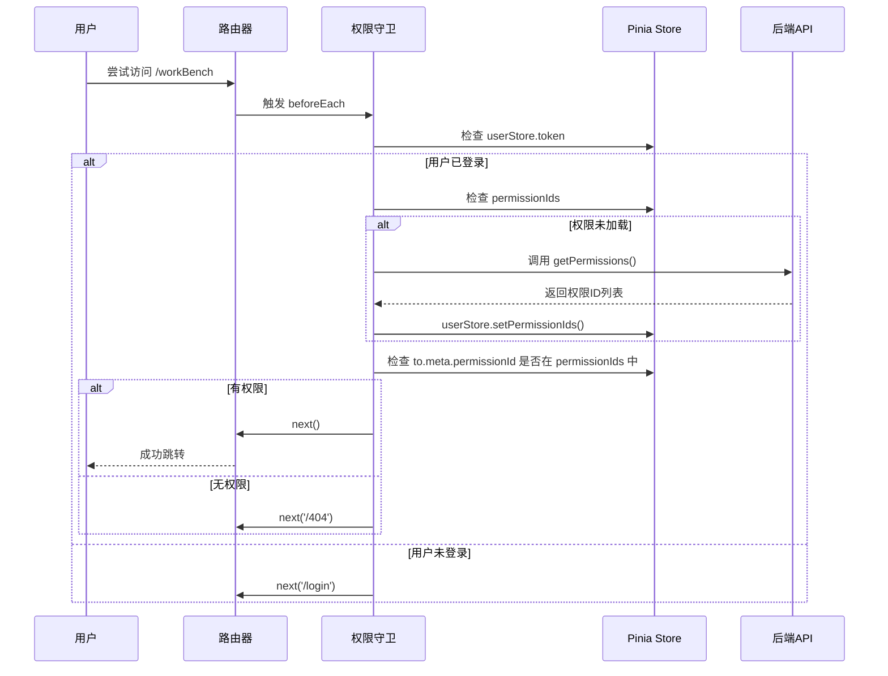
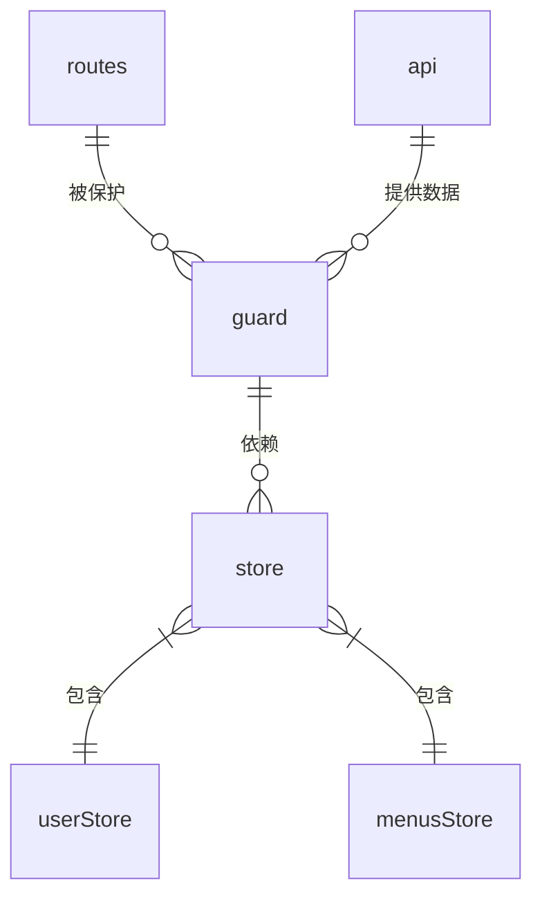

# 路由权限

<cite>
**本文档引用的文件**
- [guard.ts](file://src/router/guard.ts)
- [routes.ts](file://src/router/routes.ts)
- [index.ts](file://src/store/index.ts)
- [user/index.ts](file://src/store/uedModule/user/index.ts)
</cite>

## 目录
1. [简介](#简介)
2. [项目结构](#项目结构)
3. [核心组件](#核心组件)
4. [架构概述](#架构概述)
5. [详细组件分析](#详细组件分析)
6. [依赖分析](#依赖分析)
7. [性能考虑](#性能考虑)
8. [故障排除指南](#故障排除指南)
9. [结论](#结论)

## 简介
本文档详细说明了 Vue 项目中基于 `vue-router` 的路由权限控制机制。重点分析 `guard.ts` 中的路由守卫实现，以及如何通过 `routes.ts` 中的 `meta` 字段定义权限元数据。文档还涵盖与 Pinia 状态管理的集成、权限验证逻辑、白名单处理、重定向策略，并提供常见问题的解决方案。

## 项目结构
项目采用模块化结构，权限控制相关代码集中在 `src/router` 和 `src/store` 目录下。路由配置与守卫逻辑分离，状态管理使用 Pinia 实现模块化。

```mermaid
graph TB
subgraph "路由模块"
guard[guard.ts]
routes[routes.ts]
end
subgraph "状态管理"
store[index.ts]
userStore[user/index.ts]
menusStore[menus/index.ts]
end
guard --> store : "使用"
routes --> guard : "被守卫保护"
guard --> userStore : "读取 token/权限"
guard --> menusStore : "读取/设置菜单"
```

**Diagram sources**
- [guard.ts](file://src/router/guard.ts#L1-L65)
- [routes.ts](file://src/router/routes.ts#L1-L288)
- [index.ts](file://src/store/index.ts#L1-L14)
- [user/index.ts](file://src/store/uedModule/user/index.ts#L1-L50)

**Section sources**
- [guard.ts](file://src/router/guard.ts#L1-L65)
- [routes.ts](file://src/router/routes.ts#L1-L288)

## 核心组件
核心权限控制由 `guard.ts` 中的 `setupPermissionGuard` 函数实现，它利用 `router.beforeEach` 守卫拦截所有导航。权限数据（如菜单、权限ID）存储在 Pinia 的 `userStore` 和 `menusStore` 中，并通过 `routes.ts` 的 `meta` 字段与具体路由关联。

**Section sources**
- [guard.ts](file://src/router/guard.ts#L10-L65)
- [routes.ts](file://src/router/routes.ts#L1-L288)
- [index.ts](file://src/store/index.ts#L1-L14)

## 架构概述
系统采用基于角色和权限ID的访问控制模型。用户登录后，其权限信息被获取并存储在持久化的 Pinia Store 中。每次路由跳转时，全局前置守卫会检查目标路由的权限要求与用户当前权限是否匹配，从而决定是否放行。



**Diagram sources**
- [guard.ts](file://src/router/guard.ts#L10-L65)
- [routes.ts](file://src/router/routes.ts#L1-L288)
- [user/index.ts](file://src/store/uedModule/user/index.ts#L1-L50)

## 详细组件分析

### 路由守卫 (guard.ts) 分析
`guard.ts` 文件实现了核心的权限验证逻辑。

#### 权限验证流程
```mermaid
flowchart TD
A[导航开始] --> B{路径在白名单?}
B --> |是| C{是登录页且已登录?}
C --> |是| D[重定向到首页]
C --> |否| E[放行]
B --> |否| F{用户已登录?}
F --> |否| G[重定向到登录页]
F --> |是| H{菜单数据已加载?}
H --> |否| I[调用 getMenus() 并存储]
H --> |是| J{权限ID已加载?}
J --> |否| K[调用 getPermissions() 并存储]
J --> |是| L{是首页?}
L --> |是| M[跳转到首个菜单项]
L --> |否| N{有权限或为公开路由?}
N --> |是| O[放行]
N --> |否| P[跳转到404]
```

**Diagram sources**
- [guard.ts](file://src/router/guard.ts#L10-L65)

#### 关键逻辑说明
- **白名单处理**: `WHITE_LIST` 数组定义了无需登录即可访问的路径（如 `/login`, `/404`）。
- **登录状态检查**: 通过 `userStore.token` 判断用户是否已登录。
- **异步权限获取**: 首次访问受保护路由时，若权限数据未加载，则异步调用 `getPermissions()` 和 `getMenus()`。
- **权限比对**: 使用 `userStore.permissionIds.includes(to.meta.permissionId)` 进行精确的权限ID匹配。
- **首页重定向**: 访问根路径 `/` 时，自动跳转到用户有权访问的第一个侧边栏菜单项。
- **公开路由**: `meta.public` 字段标记的路由（如 `/custom`）对所有用户开放。

**Section sources**
- [guard.ts](file://src/router/guard.ts#L1-L65)

### 路由配置 (routes.ts) 分析
`routes.ts` 文件定义了所有路由及其权限元数据。

#### 路由元数据 (meta) 字段
| 字段名 | 类型 | 描述 | 示例 |
| :--- | :--- | :--- | :--- |
| `title` | string | 页面标题（支持国际化） | `"I18N.layout.gongZuoTai"` |
| `permissionId` | string | 该路由对应的权限ID | `"base::workBench:index"` |
| `fullScreen` | boolean | 是否全屏显示 | `true` |
| `public` | boolean | 是否为公开路由 | `true` |

**Section sources**
- [routes.ts](file://src/router/routes.ts#L1-L288)

#### 特殊路由处理
- **外链跳转**: 使用 `beforeEnter` 钩子直接 `window.open` 打开外部链接，并返回 `false` 阻止原路由跳转。
- **动态加载**: 使用 `import()` 语法实现路由组件的懒加载，提升首屏性能。
- **404路由**: 通过通配符 `/:page*` 匹配所有未定义的路径。

## 依赖分析
系统依赖关系清晰，各模块职责分明。



**Diagram sources**
- [guard.ts](file://src/router/guard.ts#L1-L65)
- [index.ts](file://src/store/index.ts#L1-L14)

**Section sources**
- [guard.ts](file://src/router/guard.ts#L1-L65)
- [index.ts](file://src/store/index.ts#L1-L14)

## 性能考虑
- **懒加载**: 所有非核心路由组件均采用动态导入，有效减少初始包体积。
- **状态持久化**: 使用 `pinia-plugin-persistedstate` 插件，避免页面刷新后丢失登录状态和权限数据。
- **防抖加载**: 权限和菜单数据仅在首次访问受保护路由时加载一次，后续导航直接使用缓存数据。

## 故障排除指南
### 常见问题及解决方案

1.  **页面刷新后权限丢失**
    - **原因**: `userStore` 或 `menusStore` 未正确配置持久化。
    - **解决方案**: 确保 `pinia-plugin-persistedstate` 已正确安装，并在 Store 定义中启用。

2.  **动态路由加载失败**
    - **原因**: `getMenus()` API 返回的路由数据格式与前端期望不符。
    - **解决方案**: 检查 `getMenus()` 接口返回的数据结构，确保与 `routes.ts` 中的 `RouteRecordRaw` 类型兼容。

3.  **无法跳转到指定页面**
    - **原因**: 目标路由的 `meta.permissionId` 与用户拥有的 `permissionIds` 不匹配。
    - **解决方案**: 检查后端返回的权限ID列表和前端路由配置中的 `permissionId` 是否一致。

4.  **登录后仍被重定向到登录页**
    - **原因**: `userStore.token` 未被正确设置。
    - **解决方案**: 检查登录流程中 `userStore.setToken()` 的调用，确保 token 值有效。

**Section sources**
- [guard.ts](file://src/router/guard.ts#L1-L65)
- [user/index.ts](file://src/store/uedModule/user/index.ts#L1-L50)

## 结论
该项目的路由权限系统设计合理，通过 `vue-router` 的全局守卫结合 Pinia 状态管理，实现了灵活且安全的访问控制。系统支持异步权限加载、白名单机制、公开路由和状态持久化，能够满足复杂的权限管理需求。遵循本文档的指导，可以有效维护和扩展系统的权限功能。