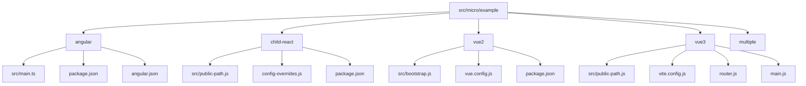
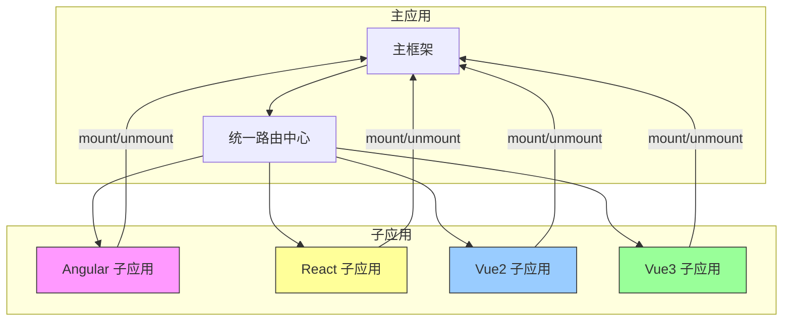
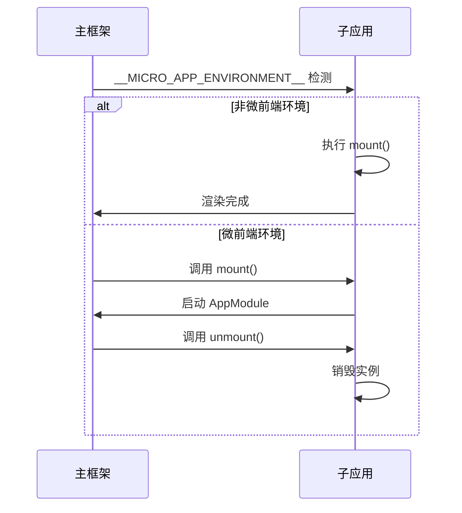
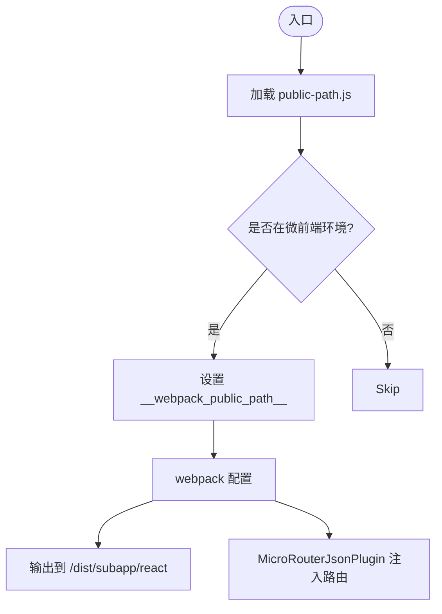
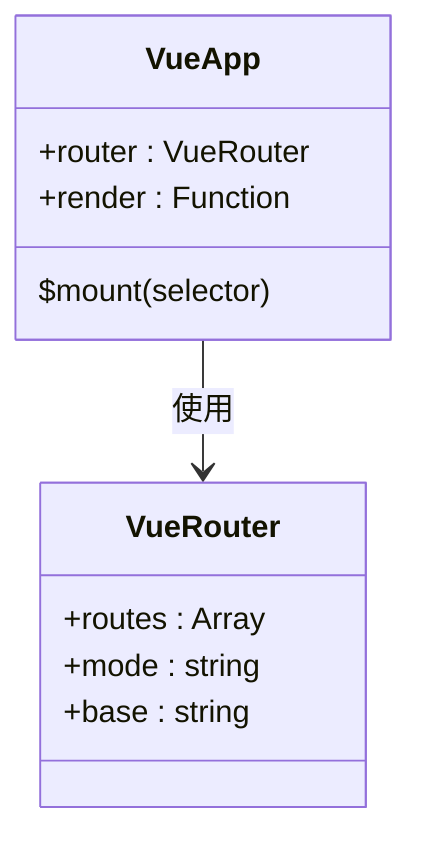
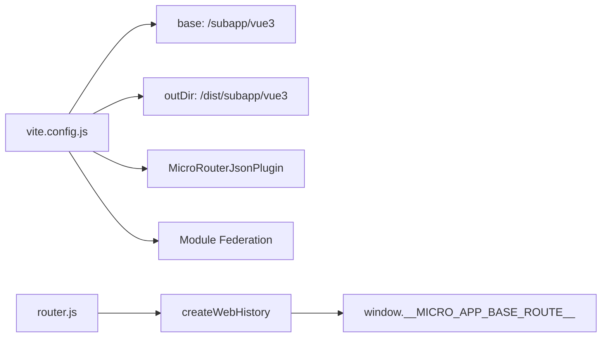

# 子应用集成

<cite>
**本文档中引用的文件**  
- [public-path.js](file://src/micro/example/child-react/src/public-path.js)
- [config-overrides.js](file://src/micro/example/child-react/config-overrides.js)
- [public-path.js](file://src/micro/example/vue3/src/public-path.js)
- [vite.config.js](file://src/micro/example/vue3/vite.config.js)
- [vue.config.js](file://src/micro/example/vue2/vue.config.js)
- [bootstrap.js](file://src/micro/example/vue2/src/bootstrap.js)
- [main.ts](file://src/micro/example/angular/src/main.ts)
- [router.js](file://src/micro/example/vue3/src/router.js)
</cite>

## 目录

1. [简介](#简介)
2. [项目结构](#项目结构)
3. [核心组件](#核心组件)
4. [架构概览](#架构概览)
5. [详细组件分析](#详细组件分析)
6. [依赖分析](#依赖分析)
7. [性能考虑](#性能考虑)
8. [故障排除指南](#故障排除指南)
9. [结论](#结论)

## 简介
本文档提供将不同技术栈（Angular、React、Vue2、Vue3）的子应用集成到主框架中的详细指南。重点说明各 example 目录下的配置要点，包括 public-path.js 的路径处理、webpack/vite 的构建配置调整、生命周期钩子的实现方式。同时提供从零创建新子应用的完整流程，涵盖项目结构、构建配置和注册机制，并通过实际代码示例展示跨框架集成的关键配置与常见问题解决方案。

## 项目结构



**图示来源**  
- [angular](file://src/micro/example/angular)
- [child-react](file://src/micro/example/child-react)
- [vue2](file://src/micro/example/vue2)
- [vue3](file://src/micro/example/vue3)

**本节来源**  
- [src/micro/example](file://src/micro/example)

## 核心组件

本项目通过微前端架构实现多技术栈子应用的集成，核心在于统一的生命周期管理、资源路径处理和路由协调机制。每个子应用均需实现特定的构建配置和运行时逻辑以适配主框架环境。

**本节来源**  
- [main.ts](file://src/micro/example/angular/src/main.ts#L1-L70)
- [bootstrap.js](file://src/micro/example/vue2/src/bootstrap.js#L1-L21)
- [main.js](file://src/micro/example/vue3/src/main.js#L1-L12)

## 架构概览



**图示来源**  
- [main.ts](file://src/micro/example/angular/src/main.ts#L1-L70)
- [bootstrap.js](file://src/micro/example/vue2/src/bootstrap.js#L1-L21)
- [vite.config.js](file://src/micro/example/vue3/vite.config.js#L1-L33)
- [vue.config.js](file://src/micro/example/vue2/vue.config.js#L1-L33)

## 详细组件分析

### Angular 子应用分析

Angular 子应用通过全局声明 `mount` 和 `unmount` 函数来支持微前端环境下的动态加载与卸载。默认模式下直接启动应用，UMD 模式则通过 window.mount 触发。



**图示来源**  
- [main.ts](file://src/micro/example/angular/src/main.ts#L1-L70)

**本节来源**  
- [main.ts](file://src/micro/example/angular/src/main.ts#L1-L70)

### React 子应用分析

React 子应用通过 `public-path.js` 动态设置 `__webpack_public_path__`，并在 `config-overrides.js` 中配置输出路径和插件，确保资源正确加载。

#### 构建配置要点



**图示来源**  
- [public-path.js](file://src/micro/example/child-react/src/public-path.js#L1-L4)
- [config-overrides.js](file://src/micro/example/child-react/config-overrides.js#L1-L21)

**本节来源**  
- [public-path.js](file://src/micro/example/child-react/src/public-path.js#L1-L4)
- [config-overrides.js](file://src/micro/example/child-react/config-overrides.js#L1-L21)

### Vue2 子应用分析

Vue2 子应用使用 Vue CLI 构建，通过 `vue.config.js` 设置 `publicPath` 和输出目录，并在 `bootstrap.js` 中初始化 Vue 实例。

#### 路由与生命周期处理



**图示来源**  
- [bootstrap.js](file://src/micro/example/vue2/src/bootstrap.js#L1-L21)
- [vue.config.js](file://src/micro/example/vue2/vue.config.js#L1-L33)

**本节来源**  
- [bootstrap.js](file://src/micro/example/vue2/src/bootstrap.js#L1-L21)
- [vue.config.js](file://src/micro/example/vue2/vue.config.js#L1-L33)

### Vue3 子应用分析

Vue3 子应用采用 Vite 构建，通过 `vite.config.js` 配置联邦模块和输出路径，并在 `router.js` 中使用 `__MICRO_APP_BASE_ROUTE__` 支持嵌套路由。

#### Vite 配置与路由集成



**图示来源**  
- [vite.config.js](file://src/micro/example/vue3/vite.config.js#L1-L33)
- [router.js](file://src/micro/example/vue3/src/router.js#L1-L18)
- [public-path.js](file://src/micro/example/vue3/src/public-path.js#L1-L4)

**本节来源**  
- [vite.config.js](file://src/micro/example/vue3/vite.config.js#L1-L33)
- [router.js](file://src/micro/example/vue3/src/router.js#L1-L18)
- [public-path.js](file://src/micro/example/vue3/src/public-path.js#L1-L4)

## 依赖分析

```mermaid
dependency-graph
"micro-router-json-plugin" --> "child-react"
"micro-router-json-plugin" --> "vue2"
"micro-router-json-plugin" --> "vue3"
"vite-plugin-federation" --> "vue3"
"@angular/platform-browser-dynamic" --> "angular"
"react-scripts" --> "child-react"
"@vue/cli-service" --> "vue2"
```

**图示来源**  
- [package.json](file://src/micro/example/angular/package.json)
- [package.json](file://src/micro/example/child-react/package.json)
- [package.json](file://src/micro/example/vue2/package.json)
- [package.json](file://src/micro/example/vue3/package.json)
- [config-overrides.js](file://src/micro/example/child-react/config-overrides.js)
- [vue.config.js](file://src/micro/example/vue2/vue.config.js)
- [vite.config.js](file://src/micro/example/vue3/vite.config.js)

**本节来源**  
- [package.json](file://src/micro/example/angular/package.json)
- [package.json](file://src/micro/example/child-react/package.json)
- [package.json](file://src/micro/example/vue2/package.json)
- [package.json](file://src/micro/example/vue3/package.json)

## 性能考虑

为确保子应用在主框架中高效运行，建议：
- 合理设置 `publicPath` 避免资源加载失败
- 使用懒加载减少初始包体积
- 在开发环境中启用热更新提升调试效率
- 通过 Module Federation 实现共享依赖避免重复加载

## 故障排除指南

常见问题及解决方案：

| 问题现象 | 可能原因 | 解决方案 |
|--------|--------|--------|
| 子应用白屏 | publicPath 未正确设置 | 检查 public-path.js 是否生效 |
| 路由不匹配 | base route 配置错误 | 确保使用 window.__MICRO_APP_BASE_ROUTE__ |
| 卸载失败 | unmount 函数未定义 | 检查是否暴露 window.unmount |
| 构建路径错误 | outputDir 配置不当 | 核对 config-overrides.js 或 vite.config.js |

**本节来源**  
- [public-path.js](file://src/micro/example/child-react/src/public-path.js#L1-L4)
- [public-path.js](file://src/micro/example/vue3/src/public-path.js#L1-L4)
- [config-overrides.js](file://src/micro/example/child-react/config-overrides.js#L1-L21)
- [vite.config.js](file://src/micro/example/vue3/vite.config.js#L1-L33)

## 结论

本文档系统地介绍了如何将 Angular、React、Vue2、Vue3 技术栈的子应用集成到主框架中。关键在于统一的生命周期管理（mount/unmount）、动态资源路径处理（public-path.js）、构建工具配置（webpack/vite）以及路由协调机制。通过标准化的配置模板和清晰的集成流程，可快速实现多技术栈共存的微前端架构。