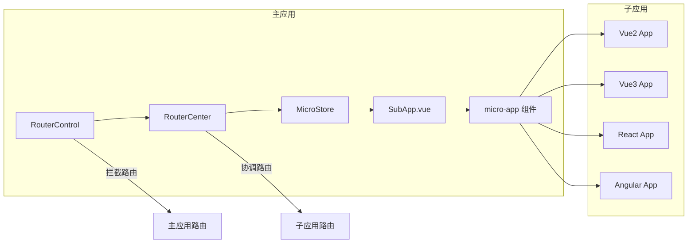
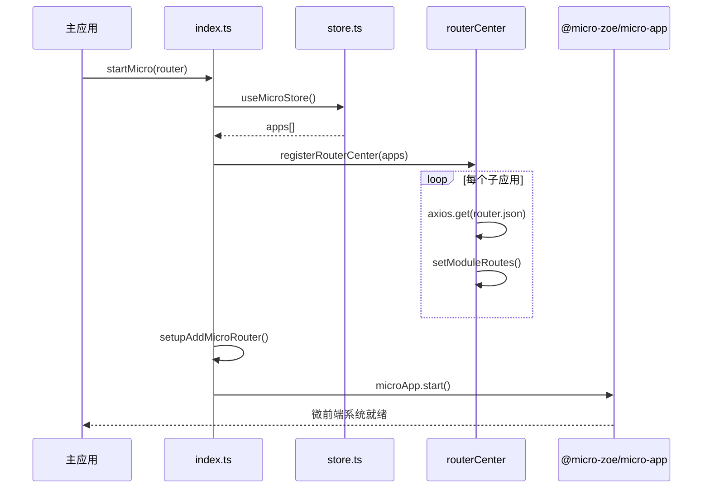
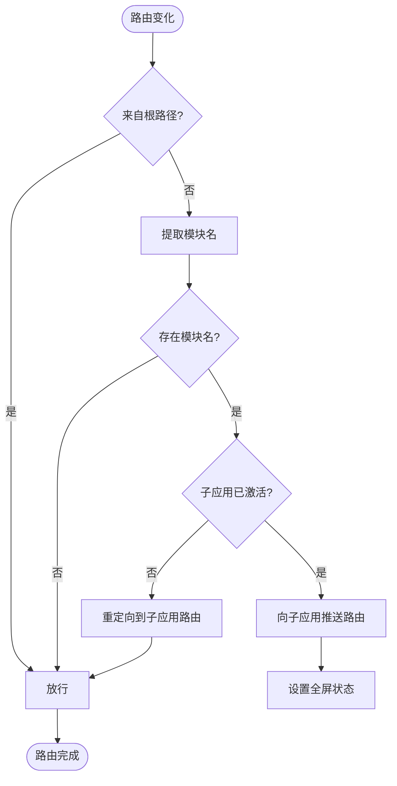
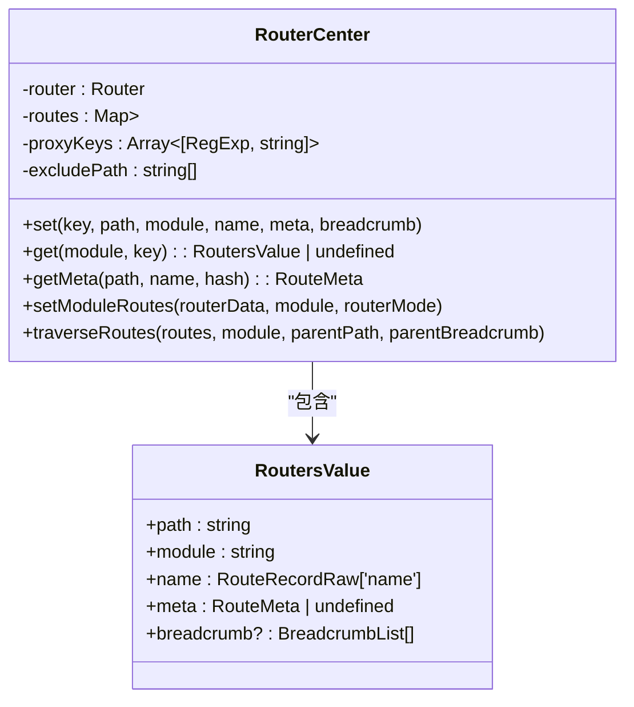
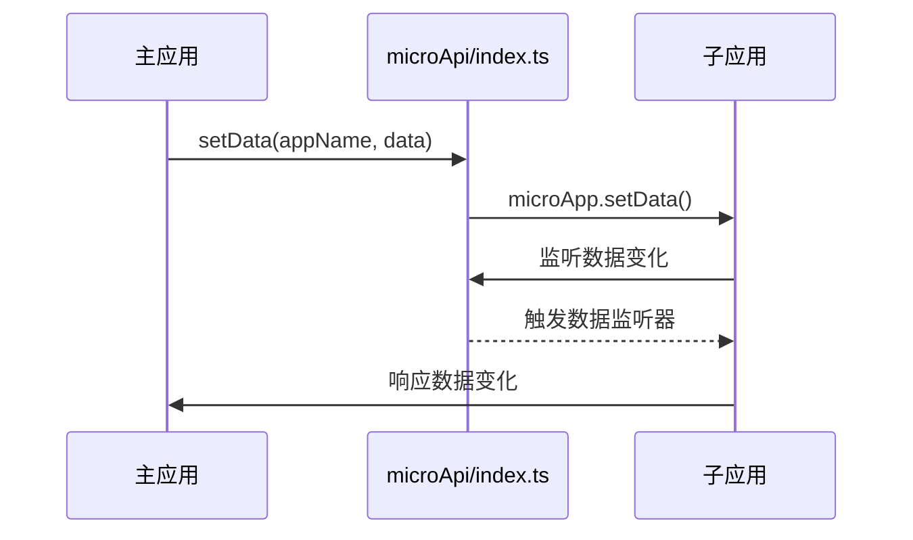

# 微前端系统

<cite>
**本文档引用的文件**
- [routerControl.ts](file://src/micro/routerControl.ts)
- [routerCenter/index.ts](file://src/micro/routerCenter/index.ts)
- [microApi/index.ts](file://src/micro/microApi/index.ts)
- [store.ts](file://src/micro/store.ts)
- [microApi/helper.ts](file://src/micro/microApi/helper.ts)
- [index.ts](file://src/micro/index.ts)
- [sub-app.vue](file://src/micro/sub-app.vue)
- [example/vue2](file://src/micro/example/vue2)
- [example/vue3](file://src/micro/example/vue3)
- [example/child-react](file://src/micro/example/child-react)
- [example/angular](file://src/micro/example/angular)
</cite>

## 目录
1. [简介](#简介)
2. [项目结构](#项目结构)
3. [核心组件](#核心组件)
4. [架构概述](#架构概述)
5. [详细组件分析](#详细组件分析)
6. [依赖分析](#依赖分析)
7. [性能考虑](#性能考虑)
8. [故障排除指南](#故障排除指南)
9. [结论](#结论)

## 简介
本文档详细阐述了基于 `@micro-zoe/micro-app` 的微前端系统实现原理。该系统支持将不同技术栈（Vue2、Vue3、React、Angular）的应用作为子应用集成到主应用中，通过沙箱隔离、路由控制和数据通信机制实现松耦合的微前端架构。文档深入解析了子应用的注册、加载、路由拦截与协调、通信机制，并提供集成示例和常见问题解决方案。

## 项目结构
微前端相关的核心代码位于 `/src/micro` 目录下，包含子应用配置、路由中心、API 封装和主控逻辑。

```mermaid
graph TD
A[/src/micro] --> B[index.ts]
A --> C[routerControl.ts]
A --> D[routerCenter/index.ts]
A --> E[microApi/index.ts]
A --> F[store.ts]
A --> G[sub-app.vue]
A --> H[example/]
B --> |初始化| C
C --> |路由守卫| D
D --> |存储路由映射| E
E --> |调用| microApp
F --> |定义子应用| B
G --> |渲染子应用| microApp
H --> |子应用示例| B
```

**图示来源**
- [index.ts](file://src/micro/index.ts)
- [routerControl.ts](file://src/micro/routerControl.ts)
- [routerCenter/index.ts](file://src/micro/routerCenter/index.ts)

**本节来源**
- [src/micro](file://src/micro)

## 核心组件
系统的核心组件包括子应用注册与管理、路由控制中心、沙箱隔离和跨应用通信。

**本节来源**
- [index.ts](file://src/micro/index.ts#L1-L65)
- [store.ts](file://src/micro/store.ts#L1-L45)
- [routerControl.ts](file://src/micro/routerControl.ts#L1-L141)

## 架构概述
系统采用主从架构，主应用负责协调和集成，子应用独立开发和部署。`@micro-zoe/micro-app` 提供了 iframe 沙箱、JS 沙箱和样式隔离能力。



**图示来源**
- [routerControl.ts](file://src/micro/routerControl.ts#L1-L141)
- [routerCenter/index.ts](file://src/micro/routerCenter/index.ts#L1-L221)
- [sub-app.vue](file://src/micro/sub-app.vue#L1-L87)

## 详细组件分析

### 子应用注册与加载
子应用通过 `store.ts` 中的 `useMicroStore` 进行配置和注册。`index.ts` 中的 `startMicro` 函数负责初始化微前端环境，包括注册路由中心和启动 `micro-app`。



**图示来源**
- [index.ts](file://src/micro/index.ts#L1-L65)
- [store.ts](file://src/micro/store.ts#L1-L45)
- [routerCenter/index.ts](file://src/micro/routerCenter/index.ts#L1-L221)

**本节来源**
- [index.ts](file://src/micro/index.ts#L1-L65)
- [store.ts](file://src/micro/store.ts#L1-L45)

### 路由控制机制
`routerControl.ts` 是路由控制的核心，通过 `setupMicroRouterGuards` 设置全局路由守卫，拦截所有路由变化，决定由主应用还是子应用处理。

#### 路由拦截与决策流程


**图示来源**
- [routerControl.ts](file://src/micro/routerControl.ts#L1-L141)

#### 路由中心协调
`RouterCenter` 类负责维护主应用与子应用之间的路由映射关系，提供路由查询和元数据获取功能。



**图示来源**
- [routerCenter/index.ts](file://src/micro/routerCenter/index.ts#L1-L221)

**本节来源**
- [routerControl.ts](file://src/micro/routerControl.ts#L1-L141)
- [routerCenter/index.ts](file://src/micro/routerCenter/index.ts#L1-L221)

### 沙箱隔离与通信
子应用通过 `micro-app` 组件的 iframe 和 JS 沙箱实现隔离。主应用通过 `setData` 和 `getData` 与子应用进行通信。

#### 通信机制


**图示来源**
- [microApi/index.ts](file://src/micro/microApi/index.ts#L1-L136)
- [sub-app.vue](file://src/micro/sub-app.vue#L1-L87)

**本节来源**
- [microApi/index.ts](file://src/micro/microApi/index.ts#L1-L136)
- [sub-app.vue](file://src/micro/sub-app.vue#L1-L87)

## 依赖分析
系统依赖 `@micro-zoe/micro-app` 作为核心框架，通过 Pinia 管理状态，Vue Router 进行路由控制。

```mermaid
graph TD
A[@micro-zoe/micro-app] --> B[iframe 隔离]
A --> C[JS 沙箱]
A --> D[样式隔离]
A --> E[数据通信]
F[Pinia] --> G[useMicroStore]
H[Vue Router] --> I[路由守卫]
I --> J[routerControl.ts]
J --> A
G --> K[index.ts]
K --> A
```

**图示来源**
- [package.json](file://package.json)
- [index.ts](file://src/micro/index.ts#L1-L65)
- [store.ts](file://src/micro/store.ts#L1-L45)

**本节来源**
- [package.json](file://package.json)
- [index.ts](file://src/micro/index.ts#L1-L65)

## 性能考虑
- **预加载**: 可通过 `microApp.preFetch` 预加载子应用资源。
- **按需加载**: 子应用仅在路由匹配时才被加载。
- **资源隔离**: iframe 隔离避免了资源冲突，但可能增加内存开销。

## 故障排除指南
- **子应用无法加载**: 检查 `store.ts` 中的 `url` 配置和网络连接。
- **路由不匹配**: 确认子应用的 `router.json` 文件正确上传且格式正确。
- **通信失败**: 检查 `setData` 和 `addDataListener` 的应用名称是否匹配。
- **样式冲突**: 确保 `micro-app` 组件的 `iframe` 属性已启用。

**本节来源**
- [microApi/index.ts](file://src/micro/microApi/index.ts#L1-L136)
- [helper.ts](file://src/micro/microApi/helper.ts#L1-L185)

## 结论
本微前端系统通过 `@micro-zoe/micro-app` 实现了多技术栈应用的集成，具备良好的隔离性、灵活性和可扩展性。通过 `RouterCenter` 和 `routerControl` 实现了复杂的路由协调，通过 `microApi` 提供了统一的通信接口。系统设计合理，能够有效支持大型项目的微前端改造。