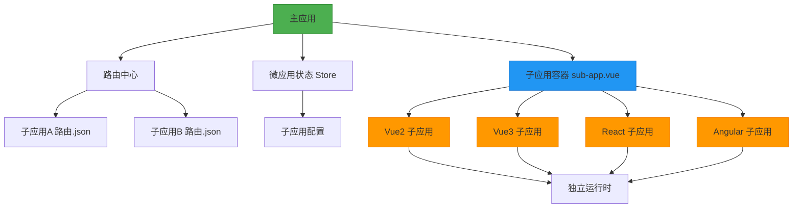
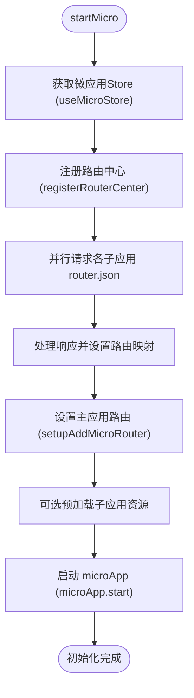
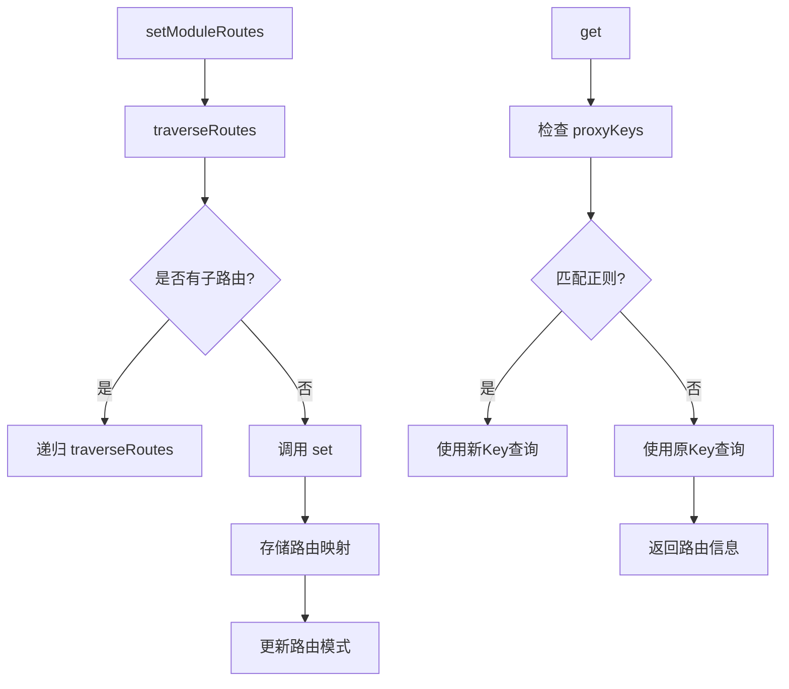

# 架构原理

<cite>
**本文档中引用的文件**  
- [index.ts](file://src/micro/index.ts)
- [sub-app.vue](file://src/micro/sub-app.vue)
- [routerCenter/index.ts](file://src/micro/routerCenter/index.ts)
- [store.ts](file://src/micro/store.ts)
- [microApi/index.ts](file://src/micro/microApi/index.ts)
</cite>

## 目录
1. [简介](#简介)
2. [项目结构](#项目结构)
3. [核心组件](#核心组件)
4. [架构概述](#架构概述)
5. [详细组件分析](#详细组件分析)
6. [依赖分析](#依赖分析)
7. [性能考虑](#性能考虑)
8. [故障排除指南](#故障排除指南)
9. [结论](#结论)

## 简介
本文档详细阐述了基于 `@micro-zoe/micro-app` 的微前端系统架构原理。重点分析主应用如何通过动态加载机制集成多个技术栈独立的子应用，实现运行时隔离与协同。文档涵盖主子应用生命周期管理、JS与CSS沙箱隔离机制、资源预加载策略、路由中心设计以及整体架构权衡。结合 `src/micro/index.ts` 的初始化逻辑和 `sub-app.vue` 的封装方式，全面揭示微前端系统的实现细节与优势。

## 项目结构
微前端相关的核心代码集中于 `src/micro` 目录下，形成了一个独立的模块化设计。该结构清晰地分离了配置、状态管理、路由控制、API 封装和 UI 组件。

```mermaid
graph TB
subgraph "src/micro"
A[index.ts] --> B[sub-app.vue]
A --> C[store.ts]
A --> D[routerCenter/index.ts]
A --> E[microApi/index.ts]
C --> F[apps: SubApp[]]
D --> G[RouterCenter Class]
E --> H[微应用API封装]
B --> I[micro-app组件]
end
```

**Diagram sources**
- [index.ts](file://src/micro/index.ts)
- [sub-app.vue](file://src/micro/sub-app.vue)
- [store.ts](file://src/micro/store.ts)
- [routerCenter/index.ts](file://src/micro/routerCenter/index.ts)
- [microApi/index.ts](file://src/micro/microApi/index.ts)

**Section sources**
- [index.ts](file://src/micro/index.ts)
- [sub-app.vue](file://src/micro/sub-app.vue)

## 核心组件
微前端架构的核心由主应用的初始化逻辑、子应用的加载容器、全局状态管理、路由中心和 API 封装共同构成。`src/micro/index.ts` 负责启动整个微前端系统，`sub-app.vue` 作为子应用的运行时容器，`store.ts` 统一管理所有子应用的配置，`routerCenter` 实现跨应用的路由协调，而 `microApi` 则提供了与 `@micro-zoe/micro-app` 交互的便捷接口。

**Section sources**
- [index.ts](file://src/micro/index.ts#L1-L65)
- [sub-app.vue](file://src/micro/sub-app.vue#L1-L87)
- [store.ts](file://src/micro/store.ts#L1-L45)

## 架构概述
该微前端系统采用主从式架构，主应用作为基座（Base App），负责协调和管理多个独立开发、独立部署的子应用（Sub App）。系统通过 `@micro-zoe/micro-app` 提供的 iframe 和沙箱技术，确保子应用在 JavaScript 和 CSS 层面的完全隔离，避免了技术栈冲突和样式污染。



**Diagram sources**
- [index.ts](file://src/micro/index.ts#L1-L65)
- [routerCenter/index.ts](file://src/micro/routerCenter/index.ts#L1-L221)
- [sub-app.vue](file://src/micro/sub-app.vue#L1-L87)

## 详细组件分析

### 主应用初始化分析
主应用的微前端初始化过程在 `src/micro/index.ts` 中完成，其核心是 `startMicro` 函数。该函数首先从 `useMicroStore` 获取所有子应用的配置，然后通过 `registerRouterCenter` 异步获取每个子应用的路由配置，最后启动 `microApp` 并设置 iframe 的空页面源。

#### 初始化流程图


**Diagram sources**
- [index.ts](file://src/micro/index.ts#L1-L65)

**Section sources**
- [index.ts](file://src/micro/index.ts#L1-L65)

### 子应用容器分析
`sub-app.vue` 是一个 Vue 3 的组合式 API 组件，它封装了 `@micro-zoe/micro-app` 的原生组件，为子应用的加载提供了统一的 UI 和逻辑控制。

#### 子应用容器类图
```mermaid
classDiagram
class SubAppContainer {
+appInfo : SubApp
+url : ComputedRef~string~
+isFullScreen : ComputedRef~boolean~
+showSpin : Ref~boolean~
+globaldata : Ref~object~
+appCreated() : void
+appMounted() : void
+sendData() : void
}
class SubApp {
+name : string
+url : string
+baseroute : string
+custom? : boolean
+routerMode? : 'hash' | 'history'
+meta? : { fullScreen? : boolean }
}
class MicroAppAPI {
+setData(appName : string, data : any) : void
+getData(appName : string) : any
}
SubAppContainer --> SubApp : "使用"
SubAppContainer --> MicroAppAPI : "调用"
SubAppContainer --> "micro-app" : "渲染"
```

**Diagram sources**
- [sub-app.vue](file://src/micro/sub-app.vue#L1-L87)
- [store.ts](file://src/micro/store.ts#L1-L45)
- [microApi/index.ts](file://src/micro/microApi/index.ts#L1-L136)

**Section sources**
- [sub-app.vue](file://src/micro/sub-app.vue#L1-L87)

### 路由中心分析
`RouterCenter` 类是整个微前端系统的核心协调者，它负责收集、存储和查询所有子应用的路由信息，实现了主应用对子应用路由的统一管理和动态解析。

#### 路由中心核心方法


**Diagram sources**
- [routerCenter/index.ts](file://src/micro/routerCenter/index.ts#L1-L221)

**Section sources**
- [routerCenter/index.ts](file://src/micro/routerCenter/index.ts#L1-L221)

## 依赖分析
微前端架构通过明确的依赖关系实现了高内聚、低耦合的设计。

```mermaid
graph TD
A[index.ts] --> B[sub-app.vue]
A --> C[store.ts]
A --> D[routerCenter]
A --> E[microApi]
B --> E
B --> C
D --> "vue-router"
E --> "@micro-zoe/micro-app"
C --> "pinia"
```

**Diagram sources**
- [index.ts](file://src/micro/index.ts#L1-L65)
- [sub-app.vue](file://src/micro/sub-app.vue#L1-L87)
- [store.ts](file://src/micro/store.ts#L1-L45)
- [routerCenter/index.ts](file://src/micro/routerCenter/index.ts#L1-L221)
- [microApi/index.ts](file://src/micro/microApi/index.ts#L1-L136)

**Section sources**
- [index.ts](file://src/micro/index.ts#L1-L65)
- [sub-app.vue](file://src/micro/sub-app.vue#L1-L87)
- [store.ts](file://src/micro/store.ts#L1-L45)

## 性能考虑
该架构在性能方面进行了多项优化。首先，通过 `Promise.allSettled` 并行请求所有子应用的路由配置，显著减少了初始化时间。其次，虽然当前代码中预加载被注释，但 `microApp.preFetch` 接口的存在表明系统支持资源预加载，可以在用户访问前预先加载关键子应用，提升用户体验。最后，`iframe` 模式虽然带来一定的内存开销，但其提供的强隔离性避免了运行时冲突导致的性能问题。

## 故障排除指南
当子应用无法正常加载时，请按以下步骤排查：
1.  **检查网络**：确认子应用的 `url` 配置正确，且服务已启动。
2.  **检查路由**：确认子应用的 `router.json` 文件存在且格式正确。
3.  **检查沙箱**：若出现 JS 错误，检查 `iframeSrc` 是否指向有效的空页面。
4.  **检查通信**：若数据通信失败，检查 `setData` 和 `getData` 的调用时机和应用名称。

**Section sources**
- [index.ts](file://src/micro/index.ts#L1-L65)
- [sub-app.vue](file://src/micro/sub-app.vue#L1-L87)
- [routerCenter/index.ts](file://src/micro/routerCenter/index.ts#L1-L221)

## 结论
本微前端架构通过 `@micro-zoe/micro-app` 实现了技术栈无关、运行时隔离的子应用集成。其核心优势在于：
1.  **强隔离性**：利用 iframe 和沙箱确保子应用互不干扰。
2.  **灵活的路由管理**：通过 `RouterCenter` 动态聚合路由，实现无缝导航。
3.  **统一的状态与通信**：通过 `store` 和 `microApi` 提供标准化的配置与数据交互。
4.  **可扩展性**：模块化设计便于添加新的子应用和功能。

该设计成功地在复杂性与功能性之间取得了平衡，为大型前端项目的持续集成与交付提供了坚实的基础。