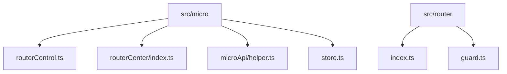
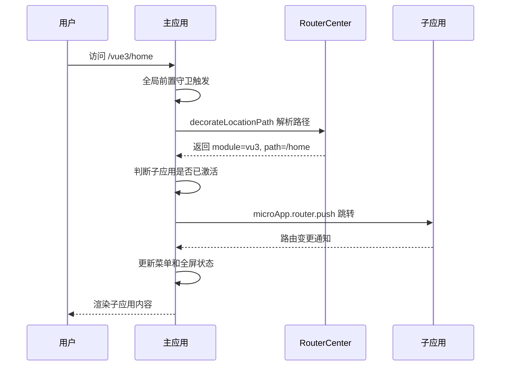
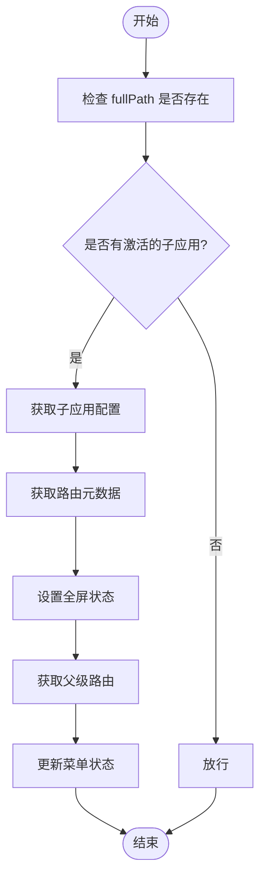
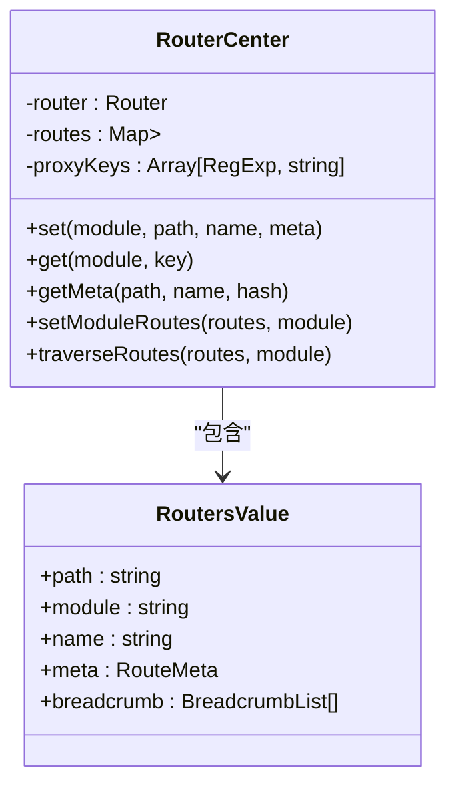
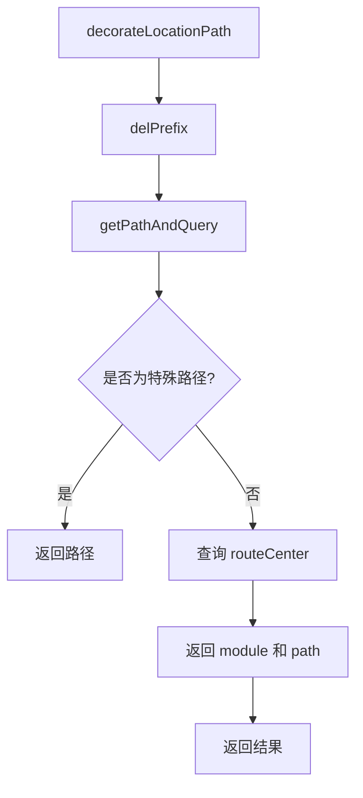

# 路由集成

<cite>
**本文档引用的文件**  
- [routerControl.ts](file://src/micro/routerControl.ts)
- [routerCenter/index.ts](file://src/micro/routerCenter/index.ts)
- [microApi/helper.ts](file://src/micro/microApi/helper.ts)
- [store.ts](file://src/micro/store.ts)
- [index.ts](file://src/micro/index.ts)
- [router/index.ts](file://src/router/index.ts)
- [guard.ts](file://src/router/guard.ts)
</cite>

## 目录
1. [简介](#简介)
2. [项目结构](#项目结构)
3. [核心组件](#核心组件)
4. [架构概览](#架构概览)
5. [详细组件分析](#详细组件分析)
6. [依赖分析](#依赖分析)
7. [性能考虑](#性能考虑)
8. [故障排除指南](#故障排除指南)
9. [结论](#结论)

## 简介
本文档详细说明了微前端架构中的路由集成机制，重点分析主应用如何通过路由守卫拦截请求、判断子应用路由匹配、维护子应用路由注册表并实现路由同步。文档还描述了主应用与子应用之间的通信协议，包括URL模式匹配、参数传递和历史记录管理，并通过代码示例展示路由拦截、转发和状态同步的实现细节。

## 项目结构
微前端路由集成相关代码主要位于 `src/micro` 目录下，核心模块包括 `routerControl.ts`（路由控制）、`routerCenter/index.ts`（路由中心）、`microApi/helper.ts`（辅助函数）和 `store.ts`（子应用状态管理）。主应用的路由配置在 `src/router/index.ts` 中定义，权限守卫在 `guard.ts` 中实现。



**图示来源**  
- [routerControl.ts](file://src/micro/routerControl.ts)
- [routerCenter/index.ts](file://src/micro/routerCenter/index.ts)
- [microApi/helper.ts](file://src/micro/microApi/helper.ts)
- [store.ts](file://src/micro/store.ts)
- [index.ts](file://src/router/index.ts)

## 核心组件
`routerControl.ts` 负责设置路由守卫和子应用路由注册，`routerCenter` 维护子应用的路由注册表，`microApi/helper.ts` 提供路由解析和路径处理的辅助函数。`store.ts` 定义了子应用的配置模型，`index.ts` 在应用启动时初始化路由中心并注册子应用。

**节来源**  
- [routerControl.ts](file://src/micro/routerControl.ts#L1-L141)
- [routerCenter/index.ts](file://src/micro/routerCenter/index.ts#L1-L221)
- [microApi/helper.ts](file://src/micro/microApi/helper.ts#L1-L185)
- [store.ts](file://src/micro/store.ts#L1-L45)

## 架构概览
微前端路由集成采用主从式架构，主应用通过 `RouterCenter` 类集中管理所有子应用的路由信息。当用户访问特定路径时，主应用的路由守卫会拦截请求，解析路径并判断是否属于某个子应用。如果是，则激活对应子应用并同步路由状态。



**图示来源**  
- [routerControl.ts](file://src/micro/routerControl.ts#L50-L141)
- [microApi/helper.ts](file://src/micro/microApi/helper.ts#L100-L150)
- [routerCenter/index.ts](file://src/micro/routerCenter/index.ts#L100-L150)

## 详细组件分析

### 路由控制分析
`routerControl.ts` 通过 `setupMicroRouterGuards` 方法设置两个关键的路由守卫：一个是子应用路由变更的监听器，另一个是主应用的全局前置守卫。前者用于同步子应用的路由变化到主应用状态，后者用于拦截主应用的路由请求并判断是否需要转发给子应用。



**图示来源**  
- [routerControl.ts](file://src/micro/routerControl.ts#L70-L100)

**节来源**  
- [routerControl.ts](file://src/micro/routerControl.ts#L50-L141)

### 路由中心分析
`RouterCenter` 类是路由集成的核心，它使用嵌套的 `Map` 结构存储每个子应用的路由表。通过 `setModuleRoutes` 方法注册子应用路由，`getMeta` 方法查询路由元数据，`traverseRoutes` 方法递归遍历并扁平化路由配置。



**图示来源**  
- [routerCenter/index.ts](file://src/micro/routerCenter/index.ts#L10-L50)

**节来源**  
- [routerCenter/index.ts](file://src/micro/routerCenter/index.ts#L1-L221)

### 路由辅助函数分析
`microApi/helper.ts` 提供了关键的路由处理函数，如 `decorateLocationPath` 用于解析URL路径并提取子应用名称和实际路径，`isActiveApp` 判断指定子应用是否处于激活状态，`getCustomParentRoute` 处理定制页面的路由映射。



**图示来源**  
- [microApi/helper.ts](file://src/micro/microApi/helper.ts#L100-L130)

**节来源**  
- [microApi/helper.ts](file://src/micro/microApi/helper.ts#L1-L185)

## 依赖分析
微前端路由系统依赖 `@micro-zoe/micro-app` 提供的底层能力，包括应用生命周期管理、数据通信和路由代理。主应用通过 `microApp.router.setBaseAppRouter` 将自身路由实例暴露给子应用，使子应用能够调用主应用的路由方法。

```mermaid
graph LR
A[主应用] --> B[@micro-zoe/micro-app]
C[子应用] --> B
B --> D[浏览器 History API]
A --> E[Vue Router]
C --> E
```

**图示来源**  
- [index.ts](file://src/micro/index.ts#L1-L65)
- [microApi/index.ts](file://src/micro/microApi/index.ts#L1-L136)

**节来源**  
- [index.ts](file://src/micro/index.ts#L1-L65)
- [microApi/index.ts](file://src/micro/microApi/index.ts#L1-L136)

## 性能考虑
路由集成在初始化时通过 `registerRouterCenter` 异步加载所有子应用的 `router.json` 文件，避免阻塞主应用启动。`RouterCenter` 使用 `Map` 数据结构实现 O(1) 复杂度的路由查找，确保路由匹配的高效性。建议对大型应用实施路由懒加载和预加载策略以优化用户体验。

## 故障排除指南
常见路由问题包括子应用无法激活、路由不匹配和循环重定向。检查 `store.ts` 中子应用配置的 `baseroute` 是否正确，确认子应用的 `router.json` 文件可访问，验证 `routerMode` 配置与子应用实际路由模式一致。使用浏览器开发者工具监控 `microApp` 的生命周期事件和路由变化日志。

**节来源**  
- [routerControl.ts](file://src/micro/routerControl.ts#L50-L141)
- [microApi/helper.ts](file://src/micro/microApi/helper.ts#L100-L150)
- [store.ts](file://src/micro/store.ts#L1-L45)

## 结论
本文档详细阐述了微前端架构中的路由集成机制，展示了如何通过 `routerControl` 和 `routerCenter` 实现主子应用间的路由协调。该设计实现了路由的集中管理、状态同步和无缝跳转，有效解决了微前端环境下的路由冲突和状态不一致问题，为构建大型分布式前端应用提供了可靠的路由解决方案。