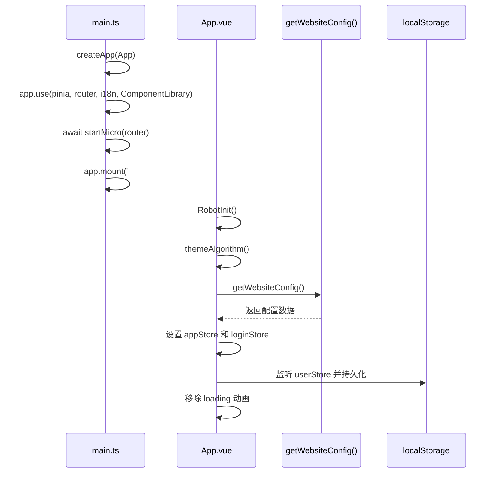

# 快速开始

<cite>
**本文档中引用的文件**  
- [main.ts](file://src/main.ts)
- [App.vue](file://src/App.vue)
- [dev.env.js](file://dev.env.js)
- [vite.config.dev.ts](file://configs/vite.config.dev.ts)
- [package.json](file://package.json)
</cite>

## 目录
1. [简介](#简介)
2. [环境准备](#环境准备)
3. [项目克隆与依赖安装](#项目克隆与依赖安装)
4. [开发服务器启动](#开发服务器启动)
5. [应用初始化流程分析](#应用初始化流程分析)
6. [常见问题与故障排除](#常见问题与故障排除)
7. [总结](#总结)

## 简介
本指南旨在帮助开发者快速在本地环境中搭建并运行 `vue-project-template6` 项目。通过逐步说明，涵盖从环境配置、项目克隆、依赖安装、环境变量设置到开发服务器启动的完整流程。同时，结合 `main.ts` 和 `App.vue` 的代码逻辑，解析应用启动时的核心初始化过程，并提供常见问题的解决方案，确保新手开发者能够顺利启动项目。

## 环境准备
在开始之前，请确保本地开发环境满足以下要求：

- **Node.js**: 建议使用 v16.x 或 v18.x 版本，确保兼容性。
- **包管理工具**: 项目主要使用 `pnpm`，建议安装 pnpm（可通过 `npm install -g pnpm` 安装）。
- **Git**: 用于克隆项目仓库。

验证环境：
```bash
node --version
pnpm --version
git --version
```

## 项目克隆与依赖安装
1. **克隆项目**
   ```bash
   git clone <项目仓库地址> vue-project-template6
   cd vue-project-template6
   ```

2. **安装依赖**
   项目支持多种包管理工具，推荐使用 `pnpm`：
   ```bash
   pnpm install
   ```
   或使用 `npm`：
   ```bash
   npm install
   ```

   **预期输出**：
   ```
   added 1xxx packages in X.XXs
   ```

   **注意**：若使用 `npm`，请确保网络环境良好，避免因网络问题导致安装失败。

## 开发服务器启动
1. **启动开发服务器**
   使用以下命令启动前端开发服务：
   ```bash
   npm run dev
   ```
   该命令会并行启动前端服务和本地 mock 服务。

   **预期输出**：
   ```
   ➜  Local:   http://localhost:3000/
   ➜  Network: use --host to expose
   ```

2. **访问应用**
   打开浏览器，访问 `http://localhost:3000`，应能看到应用首页加载成功。

## 应用初始化流程分析
通过分析 `main.ts` 和 `App.vue`，可以理解应用启动时的关键流程。

### main.ts 初始化流程
`main.ts` 是应用的入口文件，主要完成以下初始化操作：

1. **创建应用实例**：使用 `createApp(App)` 创建 Vue 应用。
2. **引入全局依赖**：包括组件库、国际化、路由、状态管理（Pinia）等。
3. **配置全局属性**：如 `$tours` 和 `$oem` 品牌信息。
4. **异步加载微前端模块**：通过 `startMicro(router)` 初始化微前端子应用。
5. **挂载应用**：最后通过 `app.mount('#app')` 将应用挂载到 DOM。

**Section sources**
- [main.ts](file://src/main.ts#L1-L38)

### App.vue 初始化逻辑
`App.vue` 是根组件，其 `setup` 脚本中执行了以下关键逻辑：

1. **状态监听**：使用 `watch` 监听用户状态变化，并持久化到 `localStorage`。
2. **机器人初始化**：调用 `RobotInit()` 注册机器人功能。
3. **主题算法设置**：调用 `themeAlgorithm()` 动态修改主题色。
4. **获取网站配置**：通过 `getWebsiteConfig()` 请求后端配置，初始化应用和登录状态。
5. **DOM 清理**：移除加载动画容器 `#loader`。



**Diagram sources**
- [main.ts](file://src/main.ts#L1-L38)
- [App.vue](file://src/App.vue#L1-L74)

**Section sources**
- [App.vue](file://src/App.vue#L1-L74)

## 常见问题与故障排除
### 1. 依赖安装失败
- **现象**：`npm install` 或 `pnpm install` 报错，如 `404 Not Found` 或 `ETIMEDOUT`。
- **解决方案**：
  - 检查网络连接，尝试切换镜像源：
    ```bash
    npm config set registry https://registry.npmmirror.com
    pnpm config set registry https://registry.npmmirror.com
    ```
  - 删除 `node_modules` 和锁文件后重试：
    ```bash
    rm -rf node_modules package-lock.json pnpm-lock.yaml
    pnpm install
    ```

### 2. 端口冲突（3000 端口被占用）
- **现象**：启动时报错 `Error: listen EADDRINUSE: address already in use 0.0.0.0:3000`。
- **解决方案**：
  - 修改 `configs/vite.config.dev.ts` 中的 `server.port` 为其他端口（如 3001）。
  - 或终止占用端口的进程：
    ```bash
    lsof -i :3000
    kill -9 <PID>
    ```

### 3. 代理配置失效
- **现象**：API 请求无法代理到后端服务。
- **原因**：`dev.env.js` 中的代理配置依赖 `.env.development.js` 文件。
- **解决方案**：
  - 确保项目根目录存在 `.env.development.js` 文件，并导出 `DEV_PROXY_TARGET_local_server` 变量。
  - 示例内容：
    ```js
    module.exports = {
      DEV_PROXY_TARGET_local_server: 'http://localhost:8080'
    };
    ```

### 4. 页面空白或加载失败
- **现象**：页面白屏，控制台报错。
- **排查步骤**：
  - 检查 `main.ts` 中的模块导入路径是否正确。
  - 确认 `App.vue` 中的 `RouterView` 是否正常渲染。
  - 查看浏览器控制台和网络面板，定位具体错误。

## 总结
本指南详细介绍了 `vue-project-template6` 项目的本地运行流程，从环境准备到启动调试，并深入分析了应用初始化的核心逻辑。通过遵循上述步骤，开发者应能顺利启动项目。对于常见问题，提供了针对性的解决方案，帮助快速定位和修复问题，确保开发工作高效推进。