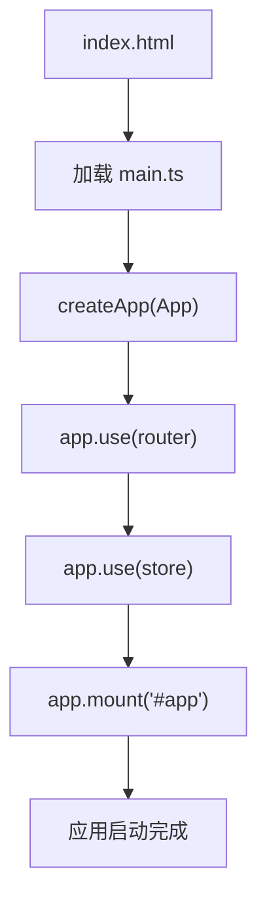

# 快速开始

<cite>
**本文档中引用的文件**  
- [package.json](file://package.json)
- [vite.config.dev.ts](file://configs/vite.config.dev.ts)
- [vite.config.base.ts](file://configs/vite.config.base.ts)
- [main.ts](file://src/main.ts)
- [index.html](file://public/index.html)
- [App.vue](file://src/App.vue)
</cite>

## 目录
1. [环境准备](#环境准备)
2. [项目克隆与依赖安装](#项目克隆与依赖安装)
3. [启动本地开发服务器](#启动本地开发服务器)
4. [开发模式下的热重载机制](#开发模式下的热重载机制)
5. [Vite 配置文件详解](#vite-配置文件详解)
6. [构建生产版本](#构建生产版本)
7. [本地预览生产版本](#本地预览生产版本)
8. [项目启动流程解析](#项目启动流程解析)
9. [常见初始化问题及解决方案](#常见初始化问题及解决方案)

## 环境准备

在开始搭建开发环境之前，请确保您的系统已安装以下基础工具：

- **Node.js**：建议使用 **v16.x 或更高版本**。您可以通过以下命令检查当前 Node.js 版本：
  ```bash
  node -v
  ```
  如果未安装或版本过低，请前往 [Node.js 官网](https://nodejs.org/) 下载并安装。

- **包管理器**：本项目支持 `npm`、`pnpm` 和 `yarn`。推荐使用 `pnpm` 以获得更快的依赖安装速度和更小的磁盘占用。安装 pnpm 的命令如下：
  ```bash
  npm install -g pnpm
  ```

**Section sources**
- [package.json](file://package.json#L1-L10)

## 项目克隆与依赖安装

1. 克隆项目仓库到本地：
   ```bash
   git clone <repository-url>
   cd vue-project-template6
   ```

2. 安装项目依赖。根据您选择的包管理器执行相应命令：

   使用 npm：
   ```bash
   npm install
   ```

   使用 pnpm（推荐）：
   ```bash
   pnpm install
   ```

   使用 yarn：
   ```bash
   yarn install
   ```

   安装完成后，您将在控制台看到类似以下的输出，表示依赖安装成功：
   ```
   added 1234 packages in 30.2s
   ```

   您也可以通过检查 `node_modules` 目录是否存在且非空来验证安装结果。

**Section sources**
- [package.json](file://package.json#L10-L20)

## 启动本地开发服务器

安装完依赖后，可以启动本地开发服务器进行开发调试。

运行以下命令启动开发服务器：
```bash
npm run dev
```

或使用 pnpm：
```bash
pnpm dev
```

启动成功后，控制台将输出类似以下信息：
```
  VITE v4.5.0  ready in 1234 ms

  ➜  Local:   http://localhost:3000/
  ➜  Network: use --host to expose
```

此时，打开浏览器访问 [http://localhost:3000](http://localhost:3000)，即可看到应用首页。

**Section sources**
- [package.json](file://package.json#L20-L25)

## 开发模式下的热重载机制

本项目基于 **Vite** 构建，开发模式下具备高效的热模块替换（HMR）功能。当您修改源代码文件（如 `.vue`、`.ts`、`.css` 文件）并保存时，浏览器会自动刷新相关模块，无需手动刷新页面。

热重载的工作原理如下：
- Vite 在开发服务器中监听文件系统变化。
- 当检测到文件变更时，Vite 会通过 WebSocket 通知浏览器。
- 浏览器加载更新后的模块并替换旧模块，保持应用状态不变。

例如，修改 `src/components/uedModule/layout/index.vue` 中的文本内容，保存后页面对应部分将立即更新。

## Vite 配置文件详解

项目使用多环境 Vite 配置文件，位于 `configs/` 目录下：

- `vite.config.base.ts`：基础配置，包含公共插件和别名设置。
- `vite.config.dev.ts`：开发环境专用配置。
- `vite.config.prod.ts`：生产环境构建配置。
- `vite.config.lib.ts`：库模式构建配置。

### 开发配置核心内容（vite.config.dev.ts）

```ts
import { defineConfig } from 'vite'
import baseConfig from './vite.config.base'

export default defineConfig({
  ...baseConfig,
  server: {
    port: 3000,
    open: true,
    host: 'localhost',
    proxy: {
      '/api': {
        target: 'http://localhost:8080',
        changeOrigin: true
      }
    }
  }
})
```

关键配置说明：
- `server.port`：开发服务器端口，默认为 `3000`。
- `server.open`：启动后自动打开浏览器。
- `server.proxy`：配置代理规则，解决跨域问题。

**Section sources**
- [vite.config.dev.ts](file://configs/vite.config.dev.ts#L1-L30)
- [vite.config.base.ts](file://configs/vite.config.base.ts#L1-L20)

## 构建生产版本

当开发完成，需要构建生产环境版本时，执行以下命令：

```bash
npm run build
```

或使用 pnpm：
```bash
pnpm build
```

构建过程将：
1. 编译 TypeScript 和 Vue 文件。
2. 压缩 JavaScript、CSS 和 HTML。
3. 生成静态资源文件到 `dist/` 目录。

构建成功后，控制台输出示例：
```
✓ 123 modules transformed.
dist/index.html   0.50 kB
dist/assets/*.js  1.23 MB
```

构建产物位于 `dist/` 目录，可直接部署到 Nginx、Apache 或 CDN。

**Section sources**
- [package.json](file://package.json#L25-L30)

## 本地预览生产版本

为确保构建结果正确，可在本地预览生产版本：

```bash
npm run preview
```

或使用 pnpm：
```bash
pnpm preview
```

该命令会启动一个静态服务器，托管 `dist/` 目录内容，默认地址为 [http://localhost:5000](http://localhost:5000)。

输出示例：
```
  ➜  Local:   http://localhost:5000/
  ➜  Network: use --host to expose
```

**Section sources**
- [package.json](file://package.json#L30-L35)

## 项目启动流程解析

项目启动流程从 `index.html` 入口开始，逐步初始化应用。

### 入口文件结构（public/index.html）

```html
<!DOCTYPE html>
<html lang="zh-CN">
  <head>
    <meta charset="UTF-8" />
    <link rel="icon" href="/favicon.ico" />
    <meta name="viewport" content="width=device-width, initial-scale=1.0" />
    <title>Vue 项目模板</title>
  </head>
  <body>
    <div id="app"></div>
    <script type="module" src="/src/main.ts"></script>
  </body>
</html>
```

### 应用初始化逻辑（src/main.ts）

```ts
import { createApp } from 'vue'
import App from './App.vue'
import router from './router'
import store from './store'
import './assets/styles/reset.css'

const app = createApp(App)
app.use(router)
app.use(store)
app.mount('#app')
```

启动流程如下：
1. 浏览器加载 `index.html`。
2. 加载并执行 `main.ts` 入口脚本。
3. 创建 Vue 应用实例。
4. 注册路由（router）和状态管理（store）插件。
5. 挂载到 DOM 节点 `#app`。



**Diagram sources**
- [index.html](file://public/index.html#L1-L15)
- [main.ts](file://src/main.ts#L1-L15)

**Section sources**
- [index.html](file://public/index.html#L1-L15)
- [main.ts](file://src/main.ts#L1-L15)

## 常见初始化问题及解决方案

### 1. 依赖安装失败或冲突

**问题现象**：`npm install` 报错，如 `ERESOLVE unable to resolve dependency tree`。

**解决方案**：
- 使用 `--legacy-peer-deps` 参数忽略依赖冲突：
  ```bash
  npm install --legacy-peer-deps
  ```
- 或改用 `pnpm`，其天然支持扁平化依赖管理。

### 2. 端口被占用

**问题现象**：启动时报错 `Error: listen EADDRINUSE: address already in use 127.0.0.1:3000`。

**解决方案**：
- 修改 `vite.config.dev.ts` 中的端口号：
  ```ts
  server: {
    port: 3001 // 修改为其他端口
  }
  ```
- 或终止占用端口的进程：
  ```bash
  lsof -i :3000
  kill -9 <PID>
  ```

### 3. 环境变量缺失

**问题现象**：运行时报错 `process is not defined` 或 API 请求失败。

**解决方案**：
- 检查根目录是否存在 `.env` 文件，如无则创建。
- 添加必要环境变量，例如：
  ```
  VITE_API_BASE_URL=http://localhost:8080/api
  ```
- 重启开发服务器使环境变量生效。

**Section sources**
- [vite.config.dev.ts](file://configs/vite.config.dev.ts#L10-L20)
- [.env 示例](file://dev.env.js)