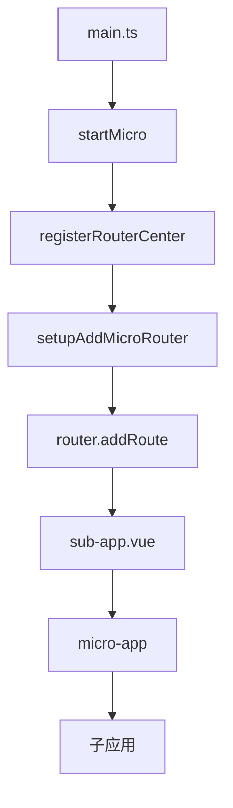

# 技术栈与依赖

<cite>
**本文档中引用的文件**  
- [package.json](file://package.json)
- [vite.config.base.ts](file://configs/vite.config.base.ts)
- [tsconfig.json](file://tsconfig.json)
- [uno.config.ts](file://uno.config.ts)
- [index.ts](file://src/micro/index.ts)
- [sub-app.vue](file://src/micro/sub-app.vue)
- [microApi/index.ts](file://src/micro/microApi/index.ts)
- [store.ts](file://src/micro/store.ts)
- [routerControl.ts](file://src/micro/routerControl.ts)
- [helper.ts](file://src/micro/microApi/helper.ts)
- [routerCenter/index.ts](file://src/micro/routerCenter/index.ts)
</cite>

## 目录
1. [技术栈概览](#技术栈概览)
2. [核心依赖库分析](#核心依赖库分析)
   - [Vue 3](#vue-3)
   - [TypeScript](#typescript)
   - [Vite](#vite)
   - [Pinia](#pinia)
   - [Ant Design Vue](#ant-design-vue)
   - [微前端框架 micro-app](#微前端框架-micro-app)
   - [UnoCSS](#unocss)
3. [TypeScript 配置详解](#typescript-配置详解)
4. [Vite 构建配置策略](#vite-构建配置策略)
5. [UnoCSS 原子化CSS方案](#unocss-原子化css方案)
6. [微前端架构集成分析](#微前端架构集成分析)

## 技术栈概览

本项目采用现代化的前端技术栈，构建了一个功能丰富且可扩展的企业级应用框架。技术选型以 Vue 3 为核心，结合 TypeScript 提供强类型支持，并使用 Vite 作为构建工具以获得卓越的开发体验。项目集成了 Ant Design Vue 作为 UI 组件库，并通过 micro-app 实现了微前端架构，支持多技术栈子应用的集成。同时，采用 UnoCSS 原子化 CSS 方案来优化样式管理和性能。

## 核心依赖库分析

### Vue 3

Vue 3 是本项目的核心前端框架，版本为 `^3.4.15`。作为渐进式 JavaScript 框架，Vue 3 提供了组合式 API (Composition API)、响应式系统、虚拟 DOM 等核心特性，使开发者能够高效地构建用户界面。

**优势与角色**：
- **组合式 API**：通过 `setup` 函数和 `ref`、`reactive` 等响应式 API，提供了更灵活的代码组织方式，特别适合复杂组件的逻辑复用。
- **性能优化**：Vue 3 的编译时优化和更高效的虚拟 DOM 实现了更快的渲染速度和更小的包体积。
- **生态系统**：与 Vue Router、Pinia 等官方库无缝集成，形成了完整的解决方案。

**Section sources**
- [package.json](file://package.json)

### TypeScript

TypeScript 是本项目的主要开发语言，版本为 `5.3.3`。它为 JavaScript 添加了静态类型系统，极大地提升了代码的可维护性和开发体验。

**优势与角色**：
- **类型安全**：在编译阶段捕获类型错误，减少运行时错误。
- **代码可读性**：清晰的类型定义使代码意图更加明确，便于团队协作。
- **IDE 支持**：提供强大的代码补全、导航和重构功能。

**Section sources**
- [package.json](file://package.json)

### Vite

Vite 是本项目的构建工具，版本为 `^4.5.0`。它利用现代浏览器的原生 ES 模块支持，提供了闪电般的开发服务器启动速度和热模块替换 (HMR)。

**优势与角色**：
- **极速启动**：无需打包即可启动开发服务器，显著提升开发效率。
- **按需编译**：只编译当前请求的模块，HMR 速度极快。
- **现代化配置**：基于插件的架构，易于扩展和定制。

**Section sources**
- [package.json](file://package.json)

### Pinia

Pinia 是本项目的状态管理库，版本为 `^3.0.1`。作为 Vue 3 的官方推荐状态管理方案，它替代了 Vuex，提供了更简洁和类型友好的 API。

**优势与角色**：
- **组合式 API 风格**：Store 的定义和使用方式与 Composition API 保持一致。
- **TypeScript 友好**：完全用 TypeScript 编写，提供完美的类型推断。
- **轻量级**：API 简洁，学习成本低。

**Section sources**
- [package.json](file://package.json)

### Ant Design Vue

Ant Design Vue 是本项目采用的 UI 组件库，版本为 `^4.2.3`。它是 Ant Design 设计语言在 Vue 中的实现，提供了一套高质量的 React 组件。

**优势与角色**：
- **企业级设计**：遵循 Ant Design 设计规范，提供统一、专业的视觉风格。
- **丰富组件**：包含大量开箱即用的组件，如表格、表单、弹窗等。
- **主题定制**：支持通过 Less 变量进行深度主题定制。

**Section sources**
- [package.json](file://package.json)

### 微前端框架 micro-app

micro-app 是本项目采用的微前端框架，版本为 `^1.0.0-rc.13`。它通过 Web Components 技术实现子应用的隔离和通信，支持多种技术栈的子应用集成。

**优势与角色**：
- **技术栈无关**：支持 Vue、React、Angular 等不同技术栈的子应用。
- **沙箱隔离**：提供 JS、CSS 沙箱，防止子应用间的污染。
- **通信机制**：提供全局数据和应用间数据通信能力。

**Section sources**
- [package.json](file://package.json)

### UnoCSS

UnoCSS 是本项目采用的原子化 CSS 引擎，版本为 `^0.57.7`。它不同于传统的工具类框架，是一个即时的、可定制的原子化 CSS 引擎。

**优势与角色**：
- **极致性能**：生成的 CSS 文件极小，几乎没有未使用的样式。
- **高度可定制**：通过预设和规则，可以完全自定义原子类。
- **运行时生成**：只生成实际使用的类，避免了传统工具类框架的臃肿问题。

**Section sources**
- [package.json](file://package.json)

## TypeScript 配置详解

TypeScript 的配置文件 `tsconfig.json` 定义了编译器的行为和项目设置，对类型安全和开发体验有重要影响。

```json
{
  "compilerOptions": {
    "target": "ES2020",
    "module": "ES2020",
    "moduleResolution": "node",
    "strict": true,
    "allowImportingTsExtensions": true,
    "resolveJsonModule": true,
    "isolatedModules": true,
    "noEmit": true,
    "jsx": "preserve",
    "jsxImportSource": "vue",
    "sourceMap": true,
    "noImplicitAny": false,
    "esModuleInterop": true,
    "noUnusedLocals": true,
    "noUnusedParameters": true,
    "noFallthroughCasesInSwitch": true,
    "allowSyntheticDefaultImports": true,
    "baseUrl": ".",
    "paths": {
      "@/*": ["src/*"]
    },
    "allowJs": true,
    "lib": ["es2020", "dom"],
    "skipLibCheck": true
  },
  "include": ["configs/**/*.ts", "src/**/*.ts", "src/**/*.d.ts", "src/**/*.tsx", "src/**/*.vue", "types/*.d.ts", "components.d.ts", "./auto-imports.d.ts", "global.d.ts"],
  "exclude": ["node_modules"],
  "references": [{ "path": "./tsconfig.node.json" }]
}
```

**关键选项分析**：

- **`strict: true`**：启用所有严格的类型检查选项，是保证类型安全的基础。
- **`noUnusedLocals` 和 `noUnusedParameters`**：强制检查未使用的局部变量和参数，有助于保持代码整洁。
- **`noFallthroughCasesInSwitch`**：防止 switch 语句中的 case 穿透，避免潜在的逻辑错误。
- **`jsx: "preserve"` 和 `jsxImportSource: "vue"`**：支持 Vue 3 的 JSX 语法，并自动导入 Vue。
- **`paths`**：配置了 `@/*` 别名，指向 `src/*`，简化了模块导入路径。
- **`include`**：明确指定了需要编译的文件范围，包括 `.vue` 文件，确保 SFC 中的 TypeScript 能被正确处理。

这些配置共同确保了项目的类型安全，同时通过 `skipLibCheck: true` 优化了编译速度。

**Diagram sources**
- [tsconfig.json](file://tsconfig.json)

**Section sources**
- [tsconfig.json](file://tsconfig.json)

## Vite 构建配置策略

Vite 的基础配置文件 `vite.config.base.ts` 定义了项目的核心构建策略，通过插件系统实现了丰富的功能。

```typescript
import federation from '@originjs/vite-plugin-federation';
import vue from '@vitejs/plugin-vue';
import vueJsx from '@vitejs/plugin-vue-jsx';
import { dasComponentResolver } from 'das-component-vue';
import { resolve } from 'path';
import UnoCSS from 'unocss/vite';
import AutoImport from 'unplugin-auto-import/vite';
import { AntDesignVueResolver } from 'unplugin-vue-components/resolvers';
import Components from 'unplugin-vue-components/vite';
import { defineConfig } from 'vite';
import { loadEnv } from './utils';

const env = loadEnv();

export default defineConfig({
  base: env?.BASE_PATH || '/',
  plugins: [
    vue({
      template: {
        compilerOptions: {
          isCustomElement: (tag) => /^(micro-app|ued-)/.test(tag)
        }
      }
    }),
    vueJsx(),
    federation({
      name: 'home',
      filename: 'remoteEntry.js',
      exposes: {
        './axios': 'axios',
        './ant-design-vue': 'ant-design-vue',
        './dayjs': 'dayjs'
      }
    }),
    UnoCSS(),
    AutoImport({
      imports: ['vue', 'vue-router'],
      dts: './auto-imports.d.ts',
      eslintrc: {
        enabled: false,
        filepath: './.eslintrc-auto-import.json',
        globalsPropValue: true
      },
      vueTemplate: false
    }),
    Components({
      directoryAsNamespace: true,
      resolvers: [
        AntDesignVueResolver({
          importStyle: false
        }),
        dasComponentResolver()
      ]
    })
  ],
  resolve: {
    alias: [
      {
        find: '@',
        replacement: resolve(__dirname, '../src')
      },
      {
        find: 'vue',
        replacement: 'vue/dist/vue.esm-bundler.js'
      }
    ],
    extensions: ['.ts', '.js']
  },
  define: {
    'process.env': JSON.stringify(env)
  },
  build: {},
  css: {
    preprocessorOptions: {
      less: {
        javascriptEnabled: true
      }
    }
  }
});
```

**配置策略分析**：

- **Vue 插件**：`@vitejs/plugin-vue` 用于处理 `.vue` 单文件组件。`isCustomElement` 配置将 `micro-app` 和 `ued-` 开头的标签视为自定义元素，避免 Vue 编译器处理它们。
- **模块联邦**：`@originjs/vite-plugin-federation` 实现了模块联邦，允许将 `axios`、`ant-design-vue`、`dayjs` 等库暴露给子应用，实现依赖共享。
- **UnoCSS**：集成 UnoCSS 引擎，实现原子化 CSS。
- **自动导入**：`unplugin-auto-import` 自动导入 Vue 和 Vue Router 的 API，减少手动导入。
- **组件自动注册**：`unplugin-vue-components` 结合 `AntDesignVueResolver` 实现 Ant Design Vue 组件的按需加载。
- **路径别名**：配置 `@` 别名指向 `src` 目录，方便模块导入。
- **环境变量**：通过 `define` 将环境变量注入到代码中。

这些配置共同优化了开发体验和构建性能，实现了高效的模块化和依赖管理。

**Diagram sources**
- [vite.config.base.ts](file://configs/vite.config.base.ts)

**Section sources**
- [vite.config.base.ts](file://configs/vite.config.base.ts)

## UnoCSS 原子化CSS方案

UnoCSS 的配置文件 `uno.config.ts` 定义了原子类的生成规则和预设，是项目样式系统的核心。

```typescript
import { defineConfig, presetAttributify, presetUno, transformerDirectives } from 'unocss';
import presetRemToPx from '@unocss/preset-rem-to-px';
export default defineConfig({
  rules: [],
  shortcuts: [
    ['f-c-c', 'flex justify-center items-center'],
    ['wh-full', 'w-full h-full'],
    ['text-ellipsis', 'truncate'],
    ['flex-col', 'flex flex-col'],
  ],
  presets: [
    presetRemToPx({
      baseFontSize: 4
    }),
    presetUno(),
    presetAttributify()
  ],
  transformers: [transformerDirectives()]
});
```

**集成方式与使用模式**：

- **预设 (Presets)**：
  - `presetUno`：UnoCSS 的核心预设，提供通用的原子类。
  - `presetAttributify`：支持属性化语法，如 `<div bg="white" text="sm gray900" p="x-4 y-2" />`。
  - `presetRemToPx`：将 `rem` 单位转换为 `px`，`baseFontSize: 4` 表示 1rem = 4px，便于移动端适配。

- **快捷方式 (Shortcuts)**：定义了常用的原子类组合，如 `f-c-c` 代表 `flex justify-center items-center`，提高了开发效率。

- **转换器 (Transformers)**：`transformerDirectives` 支持 `@apply` 指令，可以在 CSS 中应用原子类。

这种模式使得样式编写既灵活又高效，同时保证了最终 CSS 的极简性。

**Diagram sources**
- [uno.config.ts](file://uno.config.ts)

**Section sources**
- [uno.config.ts](file://uno.config.ts)

## 微前端架构集成分析

微前端架构是本项目的重要特性，通过 `@micro-zoe/micro-app` 实现了主应用与多个子应用的集成。其核心集成逻辑分布在 `src/micro` 目录下。

### 集成原理

微前端的集成基于以下核心文件和逻辑：

- **`index.ts`**：微前端的入口文件，负责启动 micro-app 并注册子应用路由。
- **`sub-app.vue`**：子应用的容器组件，使用 `<micro-app>` 标签加载子应用。
- **`store.ts`**：使用 Pinia 存储子应用的配置信息。
- **`routerControl.ts`**：控制子应用的路由添加和导航。
- **`microApi/index.ts`**：对 micro-app API 的二次封装，提供更便捷的调用方式。
- **`routerCenter/index.ts`**：路由中心，用于管理和映射子应用的路由。



**Diagram sources**
- [index.ts](file://src/micro/index.ts)
- [routerControl.ts](file://src/micro/routerControl.ts)
- [sub-app.vue](file://src/micro/sub-app.vue)

**Section sources**
- [index.ts](file://src/micro/index.ts)
- [sub-app.vue](file://src/micro/sub-app.vue)
- [store.ts](file://src/micro/store.ts)
- [routerControl.ts](file://src/micro/routerControl.ts)
- [microApi/index.ts](file://src/micro/microApi/index.ts)
- [routerCenter/index.ts](file://src/micro/routerCenter/index.ts)

### 核心流程分析

1.  **启动与注册**：
    - 在 `main.ts` 中调用 `startMicro(router)` 启动微前端。
    - `registerRouterCenter` 函数通过 HTTP 请求获取子应用的 `router.json` 文件，获取其路由配置。
    - `setupAddMicroRouter` 函数动态地将子应用的路由添加到主应用的 Vue Router 中。

2.  **路由映射**：
    - `RouterCenter` 类负责管理所有子应用的路由。
    - `traverseRoutes` 方法递归遍历子应用的路由配置，并将其存储在 `routes` Map 中。
    - `decorateLocationPath` 函数用于解析 URL，判断当前路径是否属于某个子应用。

3.  **子应用加载**：
    - 当访问子应用的路由时，Vue Router 会渲染 `sub-app.vue` 组件。
    - 该组件内的 `<micro-app>` 标签会根据 `name` 和 `url` 属性加载对应的子应用。
    - 配置了 `iframe` 和 `fiber` 以增强隔离性和性能。

4.  **通信机制**：
    - 通过 `setData` 和 `getData` API 实现主应用向子应用发送数据。
    - 通过 `addGlobalDataListener` 实现全局数据监听。
    - 通过 `setBaseAppRouter` 将主应用的路由实例暴露给子应用，方便子应用跳转。

### 对项目架构的影响

- **解耦与独立**：主应用和子应用可以独立开发、部署和升级，降低了系统复杂性。
- **技术异构**：支持 Vue2、Vue3、React、Angular 等多种技术栈的子应用共存。
- **渐进式迁移**：可以将旧系统逐步迁移到新框架，而无需一次性重写。
- **复杂性增加**：引入了路由映射、数据通信、样式隔离等额外的复杂性，需要精心设计和维护。