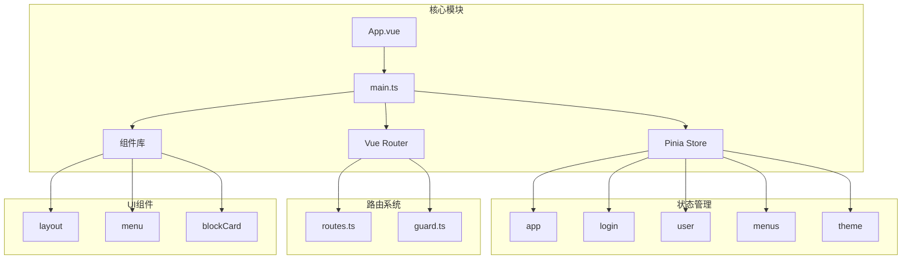
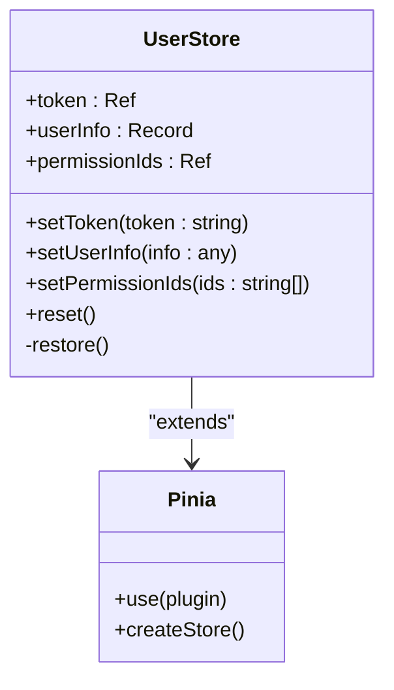
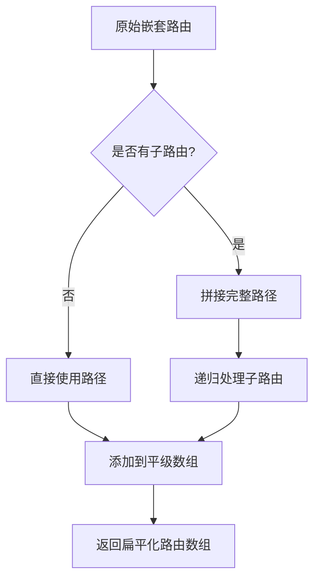
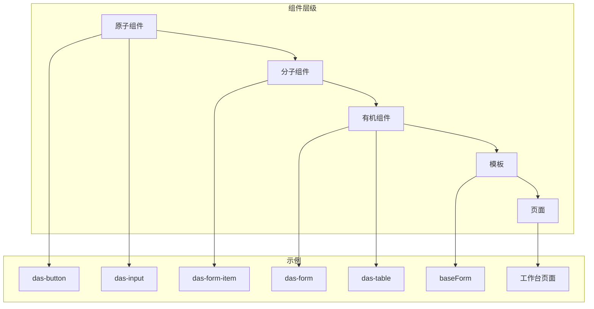
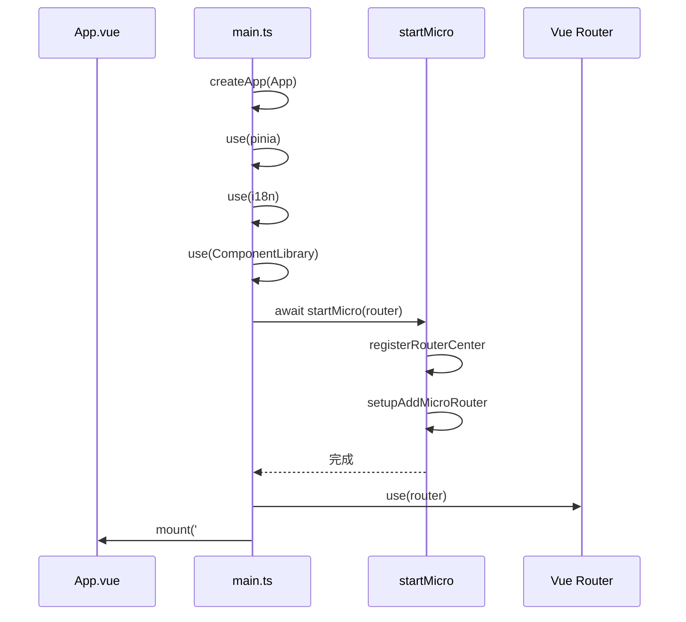

# 最佳实践

<cite>
**本文档引用文件**  
- [main.ts](file://src/main.ts)
- [commitlint.config.js](file://commitlint.config.js)
- [store/index.ts](file://src/store/index.ts)
- [store/uedModule/user/index.ts](file://src/store/uedModule/user/index.ts)
- [router/routes.ts](file://src/router/routes.ts)
- [router/index.ts](file://src/router/index.ts)
- [das-form.md](file://das-components-folder/docs/das-form.md)
- [das-table.md](file://das-components-folder/docs/das-table.md)
- [das-virtual-scroll.md](file://das-components-folder/docs/das-virtual-scroll.md)
- [layout/index.vue](file://src/components/uedModule/layout/index.vue)
</cite>

## 目录
1. [项目结构与代码组织](#项目结构与代码组织)  
2. [状态管理规范](#状态管理规范)  
3. [路由命名与结构约定](#路由命名与结构约定)  
4. [组件设计模式](#组件设计模式)  
5. [依赖注入与应用初始化](#依赖注入与应用初始化)  
6. [Git提交信息规范](#git提交信息规范)  
7. [性能优化策略](#性能优化策略)  
8. [可访问性支持](#可访问性支持)  
9. [代码审查清单](#代码审查清单)  
10. [常见反模式警示](#常见反模式警示)

## 项目结构与代码组织

项目采用模块化与功能分层相结合的组织方式，确保高内聚、低耦合。主要目录结构如下：

- `src/api`：统一管理接口请求逻辑
- `src/components/uedModule`：核心UI组件模块，按功能组织
- `src/libs/fetch`：封装网络请求层，提供统一的类型支持
- `src/locale`：国际化语言包管理
- `src/micro`：微前端相关逻辑，支持多应用集成
- `src/router`：路由定义与权限控制
- `src/store`：Pinia状态管理模块
- `src/theme`：主题配置与样式变量
- `src/views`：页面级视图组件，按业务模块划分
- `das-components-folder/docs`：组件文档与使用示例

代码组织遵循以下原则：
- **模块化导入**：通过 `@/` 别名简化路径引用，提升可维护性
- **类型复用**：在 `types.ts` 文件中集中定义共享类型，避免重复声明
- **按功能拆分**：每个功能模块（如 `uedModule`）拥有独立的 store、路由和组件



**图示来源**  
- [main.ts](file://src/main.ts#L1-L37)
- [store/index.ts](file://src/store/index.ts#L1-L12)
- [router/index.ts](file://src/router/index.ts#L1-L53)

## 状态管理规范

项目采用 **Pinia** 作为状态管理方案，并结合 `pinia-plugin-persistedstate` 实现状态持久化。

### Store 拆分策略

状态按业务域进行合理拆分，避免单一 store 膨胀：
- `app`：全局应用状态（如水印、全屏模式）
- `login`：登录流程状态
- `menus`：菜单与导航状态
- `theme`：主题配置
- `user`：用户信息与权限

```typescript
// src/store/index.ts
import { createPinia } from 'pinia';
import piniaPluginPersistedstate from 'pinia-plugin-persistedstate';

const pinia = createPinia();
pinia.use(piniaPluginPersistedstate);
export default pinia;
```

### 持久化策略

通过插件实现自动持久化，配置如下：
- 使用 `localStorage` 存储用户状态
- 指定 `key` 避免命名冲突
- 支持多 store 独立配置

```typescript
// src/store/uedModule/user/index.ts
defineStore('user', () => {
  // ...
}, {
  persist: {
    key: 'user-store',
    storage: localStorage
  }
})
```

尽管代码中尝试使用 `persist` 配置，但注释表明其未生效，实际通过手动 `restore()` 方法从 `localStorage` 恢复状态，建议统一使用插件机制以保证一致性。



**图示来源**  
- [store/index.ts](file://src/store/index.ts#L1-L12)
- [store/uedModule/user/index.ts](file://src/store/uedModule/user/index.ts#L1-L61)

## 路由命名与结构约定

路由系统基于 Vue Router 构建，采用命名路由与元信息机制，支持权限控制与动态配置。

### 命名规范

路由名称采用 **双冒号分隔** 的命名空间格式：
```
<模块>::<功能>::<子功能>
```
例如：
- `base::workBench`
- `base::work-list-add`
- `base::das-readdy`

该命名方式清晰表达路由归属，便于权限控制与日志追踪。

### 路由结构

路由定义在 `routes.ts` 中，支持嵌套路由与懒加载：
- 使用 `import()` 动态导入组件，实现代码分割
- 通过 `meta` 字段附加元信息（如权限ID、标题）
- 支持 `beforeEnter` 守卫实现跳转拦截

```typescript
// src/router/routes.ts
{
  name: 'base::das-readdy',
  path: '/das-readdy',
  beforeEnter() {
    window.open('https://...', '_blank');
    return false; // 阻止原页面跳转
  },
  component: () => import('@/views/uedTypical/iframe/index.vue'),
  meta: {
    title: 'I18N.layout.dasReaddy',
    permissionId: 'base::workBench:index',
    fullScreen: true
  }
}
```

### 路由扁平化处理

在 `router/index.ts` 中，通过 `routeToArr` 函数将嵌套路由转换为平级结构，便于菜单渲染与权限匹配。



**图示来源**  
- [router/routes.ts](file://src/router/routes.ts#L1-L199)
- [router/index.ts](file://src/router/index.ts#L1-L53)

## 组件设计模式

项目遵循 **原子化设计原则**，组件按功能与复用性分层组织。

### 原子化设计

组件分为多个层级：
- **基础组件**：如 `das-button`、`das-input`，不可再拆分
- **复合组件**：如 `das-form`、`das-table`，由基础组件组合而成
- **布局组件**：如 `layout/index.vue`，负责页面结构布局
- **页面组件**：位于 `views/` 目录，组合多个复合组件完成业务功能

### Props 验证与类型安全

所有组件均使用 TypeScript 定义接口，确保类型安全。例如 `das-form` 组件支持：
- 自定义布局（水平、垂直、行内）
- 动态 label 宽度
- 表单项分组与锚点导航
- 内置校验规则

```vue
<das-form :model="formState" :rules="rules" layout="horizontal">
  <das-form-item label="名称" name="name" required>
    <a-input v-model:value="formState.name" />
  </das-form-item>
</das-form>
```

### 高级组件特性

#### das-table 表格组件
- 支持自定义刷新周期
- 提供列设置功能（可固定列）
- 支持插槽扩展（操作栏、快捷查询）
- 集成虚拟滚动优化大数据渲染

#### das-virtual-scroll 虚拟滚动
用于优化长列表性能，仅渲染视口内元素，显著降低 DOM 节点数量。

```vue
<das-virtual-scroll :items="largeList" :item-height="30">
  <template #default="{ item }">
    <div class="list-item">{{ item.value }}</div>
  </template>
</das-virtual-scroll>
```



**图示来源**  
- [das-form.md](file://das-components-folder/docs/das-form.md#L1-L199)
- [das-table.md](file://das-components-folder/docs/das-table.md#L1-L199)
- [layout/index.vue](file://src/components/uedModule/layout/index.vue#L1-L199)

## 依赖注入与应用初始化

`main.ts` 是应用的入口文件，负责依赖注入与初始化流程。

### 依赖注入方式

通过 `app.use()` 方法依次注册全局依赖：
- Pinia 状态管理
- 国际化 `i18n`
- 组件库 `ComponentLibrary`
- 路由 `router`

```typescript
// src/main.ts
const app = createApp(App);
app.use(pinia);
i18n(app);
app.use(ComponentLibrary);

(async () => {
  await startMicro(router);
  app.use(router);
  app.mount('#app');
})();
```

### 全局属性注入

使用 `app.config.globalProperties` 注入全局可访问属性：
```typescript
app.config.globalProperties.$oem = {
  ahText: '安恒',
  baasText: 'BAAS',
  ailphaText: 'AILPHA'
};
```
此方式可用于快速访问品牌文案或全局工具。

### 异步初始化

微前端模块 `startMicro` 在路由挂载前异步加载，确保子应用路由注册完成。



**图示来源**  
- [main.ts](file://src/main.ts#L1-L37)

## Git提交信息规范

项目通过 `commitlint.config.js` 强制执行 Angular 风格的提交规范。

### 提交格式约束

配置文件内容：
```js
// commitlint.config.js
module.exports = {
  extends: ["@commitlint/config-angular"]
};
```

提交信息必须遵循格式：
```
<type>(<scope>): <subject>
```

常见 `type` 类型：
- `feat`：新增功能
- `fix`：修复缺陷
- `docs`：文档变更
- `style`：代码格式调整
- `refactor`：重构
- `test`：测试相关
- `chore`：构建或辅助工具变更

### 自动化流程作用

- **保证提交信息一致性**：便于生成 changelog
- **触发 CI/CD 流程**：特定类型可触发发布流程
- **提升代码审查效率**：清晰表达变更意图

## 性能优化策略

### 懒加载（Lazy Loading）

所有路由组件均采用动态导入，实现按需加载：
```ts
component: () => import('@/views/uedTypical/workBench/index.vue')
```
有效减少首屏加载体积。

### 虚拟滚动（Virtual Scrolling）

对于大数据列表，使用 `das-virtual-scroll` 组件：
- 仅渲染可视区域内的元素
- 固定项高度以提高计算效率
- 支持自定义渲染模板

```vue
<das-virtual-scroll :items="10000条数据" :item-height="30">
  <template #default="{ item }">
    <div>{{ item.value }}</div>
  </template>
</das-virtual-scroll>
```

### 其他优化建议
- 合理使用 `v-memo` 避免不必要的重渲染
- 对复杂计算使用 `computed` 缓存
- 图片资源启用 `imagemin` 压缩（见 `configs/plugin/imagemin.ts`）

## 可访问性支持

- 所有交互元素支持键盘操作
- 使用语义化 HTML 标签
- 表单组件提供 `label` 关联
- 支持屏幕阅读器通过 `aria-*` 属性
- 颜色对比度符合 WCAG 标准
- 提供国际化支持（`i18n`）

## 代码审查清单

| 检查项 | 是否符合 |
|-------|--------|
| 路由命名是否符合 `<模块>::<功能>` 规范 | ✅ |
| 组件是否使用 TypeScript 定义 Props | ✅ |
| 新增功能是否有对应的单元测试 | ❓ |
| 提交信息是否符合 Angular 规范 | ✅ |
| 敏感信息是否硬编码 | ❌ |
| 是否合理使用懒加载 | ✅ |
| 大数据列表是否使用虚拟滚动 | ✅ |
| 全局状态是否合理拆分 | ✅ |

## 常见反模式警示

1. **避免在 `setup()` 中执行副作用操作**：应放在 `onMounted` 或 `watch` 中
2. **禁止直接修改 `props`**：应通过事件通知父组件
3. **避免在模板中使用复杂表达式**：应使用 `computed` 或 `methods`
4. **不要在循环中使用 `v-if`**：应先过滤数据再渲染
5. **避免过度使用 `any` 类型**：破坏类型安全
6. **不要在 `main.ts` 中注册过多全局组件**：增加 bundle 体积
7. **避免在 `localStorage` 中存储敏感信息**：如 token 应使用 `httpOnly` Cookie