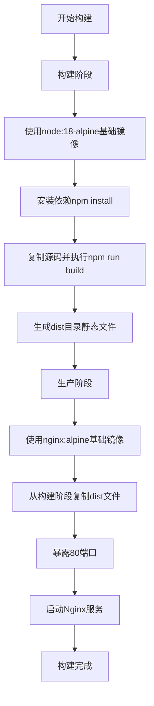
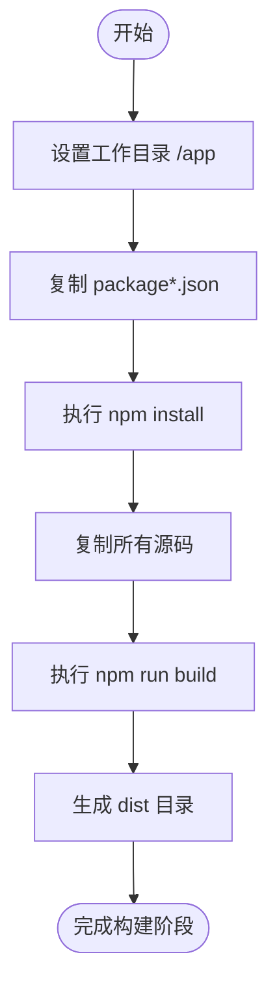
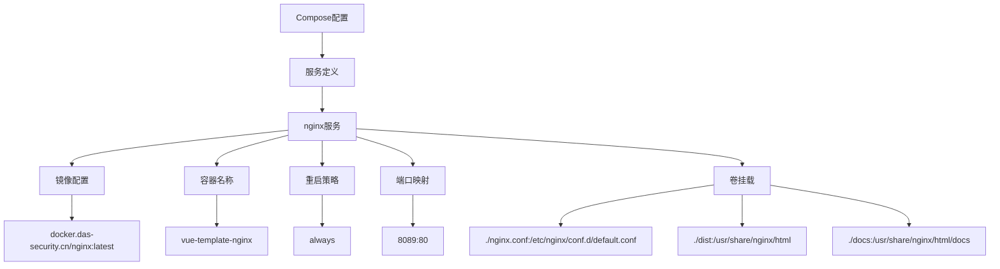
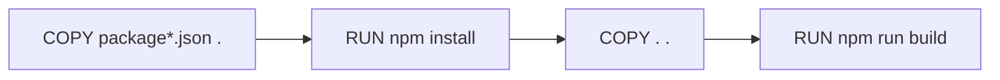
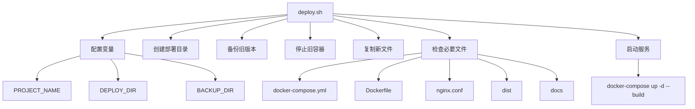

# Docker 容器化部署

<cite>
**本文档引用文件**   
- [Dockerfile](file://Dockerfile)
- [docker-compose.yml](file://docker-compose.yml)
- [nginx.conf](file://nginx.conf)
- [package.json](file://package.json)
- [configs/vite.config.prod.ts](file://configs/vite.config.prod.ts)
- [configs/vite.config.base.ts](file://configs/vite.config.base.ts)
- [deploy.sh](file://deploy.sh)
</cite>

## 目录
1. [Docker镜像构建流程](#docker镜像构建流程)
2. [Docker服务编排配置](#docker服务编排配置)
3. [Docker镜像优化技巧](#docker镜像优化技巧)
4. [多环境Compose文件管理](#多环境compose文件管理)

## Docker镜像构建流程

本项目采用多阶段构建策略来优化Docker镜像，通过分离构建环境和运行环境，显著减小最终镜像体积并提高安全性。

### 多阶段构建策略分析

Dockerfile采用了典型的多阶段构建模式，包含两个主要阶段：构建阶段和生产阶段。



**Diagram sources**
- [Dockerfile](file://Dockerfile#L1-L13)

**Section sources**
- [Dockerfile](file://Dockerfile#L1-L13)

#### 构建阶段详解

构建阶段使用`node:18-alpine`作为基础镜像，该选择具有以下优势：

- **轻量化**: Alpine Linux发行版体积小，通常只有5MB左右，相比Ubuntu等基础镜像可大幅减小镜像体积
- **安全性**: 精简的系统减少了潜在的攻击面
- **性能**: 更小的镜像意味着更快的拉取和部署速度

构建流程按以下顺序执行：
1. 设置工作目录为`/app`
2. 复制`package*.json`文件并执行`npm install`安装依赖
3. 复制所有源码文件
4. 执行`npm run build`命令生成生产环境构建产物



**Diagram sources**
- [Dockerfile](file://Dockerfile#L3-L8)
- [package.json](file://package.json#L10-L12)

**Section sources**
- [Dockerfile](file://Dockerfile#L3-L8)
- [package.json](file://package.json#L10-L12)

#### 生产阶段详解

生产阶段使用`nginx:alpine`作为基础镜像，这是一个专门为Web服务优化的轻量级镜像。该阶段通过`COPY --from=builder`指令从构建阶段复制构建产物，实现了构建环境与运行环境的完全分离。

关键配置说明：
- `COPY --from=builder /app/dist /usr/share/nginx/html/frontend/dist`: 从构建阶段复制dist目录到Nginx默认Web根目录的frontend子目录
- `EXPOSE 80`: 暴露80端口，声明容器监听的端口
- `CMD ["nginx", "-g", "daemon off;"]`: 以前台模式启动Nginx，确保容器持续运行

## Docker服务编排配置

docker-compose.yml文件定义了服务的编排配置，实现了容器的网络、端口映射、卷挂载等关键功能。

### 服务编排配置分析



**Diagram sources**
- [docker-compose.yml](file://docker-compose.yml#L1-L12)

**Section sources**
- [docker-compose.yml](file://docker-compose.yml#L1-L12)

#### 容器网络与端口映射

服务配置中定义了明确的端口映射规则：
- `"8089:80"`: 将宿主机的8089端口映射到容器的80端口

这种配置允许通过宿主机的8089端口访问容器内的Web服务，同时避免了与宿主机上可能已使用的80端口冲突。

#### 环境变量管理

虽然当前配置中未直接使用环境变量，但通过`restart: always`策略实现了容器的自动重启，这是一种重要的运行时管理策略，确保服务的高可用性。

#### 卷挂载配置

卷挂载配置是本部署方案的关键特性，实现了配置与数据的持久化：

- `./nginx.conf:/etc/nginx/conf.d/default.conf`: 将自定义的Nginx配置文件挂载到容器中，覆盖默认配置
- `./dist:/usr/share/nginx/html`: 将本地构建产物目录挂载到Nginx的Web根目录
- `./docs:/usr/share/nginx/html/docs`: 将文档目录挂载到Web服务器的docs路径

这种配置实现了配置即代码（Infrastructure as Code）的理念，使得配置变更可以被版本控制。

#### 启动依赖关系

虽然当前配置只定义了一个服务，但通过`restart: always`策略确保了服务的自愈能力。在更复杂的多服务架构中，可以使用`depends_on`字段定义服务间的启动依赖关系。

## Docker镜像优化技巧

### 层缓存利用

Docker构建过程中的层缓存机制是提高构建效率的关键。本项目的Dockerfile通过合理的指令顺序最大化利用了层缓存：



这种顺序确保了：
1. 当仅修改源码时，`npm install`步骤可以使用缓存，无需重新安装依赖
2. 只有当`package*.json`文件发生变化时，才会重新执行依赖安装

**Section sources**
- [Dockerfile](file://Dockerfile#L5-L7)

### .dockerignore配置建议

虽然项目中未提供.dockerignore文件，但建议创建以进一步优化构建过程：

```
node_modules
.git
.gitignore
README.md
npm-debug.log
.env.local
.env.development.local
.env.test.local
.env.production.local
```

这可以防止不必要的文件被复制到构建上下文中，减少构建时间和镜像体积。

### 安全加固建议

1. **使用非root用户运行**: 建议在Nginx容器中创建非特权用户运行服务
2. **最小化基础镜像**: 继续使用Alpine镜像，避免包含不必要的软件包
3. **定期更新基础镜像**: 定期更新node:18-alpine和nginx:alpine镜像以获取安全补丁
4. **镜像扫描**: 在CI/CD流程中集成镜像漏洞扫描

## 多环境Compose文件管理

### 当前环境管理方案

当前项目通过单一的docker-compose.yml文件管理部署，结合shell脚本实现环境管理：



**Diagram sources**
- [deploy.sh](file://deploy.sh#L1-L60)

**Section sources**
- [deploy.sh](file://deploy.sh#L1-L60)

### 多环境管理方案建议

为了支持staging和production等多环境部署，建议采用以下方案：

#### 1. 分层Compose文件结构

创建基础配置文件`docker-compose.base.yml`，然后为不同环境创建覆盖文件：

```yaml
# docker-compose.base.yml
version: '3'
services:
  nginx:
    build: .
    container_name: vue-template-nginx
    restart: always
    volumes:
      - ./nginx.conf:/etc/nginx/conf.d/default.conf
```

```yaml
# docker-compose.staging.yml
version: '3'
services:
  nginx:
    ports:
      - "8090:80"
    environment:
      - NODE_ENV=staging
```

```yaml
# docker-compose.production.yml
version: '3'
services:
  nginx:
    ports:
      - "80:80"
    environment:
      - NODE_ENV=production
    deploy:
      replicas: 3
      update_config:
        parallelism: 2
        delay: 10s
```

#### 2. 环境部署命令

```bash
# 部署到staging环境
docker-compose -f docker-compose.base.yml -f docker-compose.staging.yml up -d

# 部署到production环境
docker-compose -f docker-compose.base.yml -f docker-compose.production.yml up -d
```

#### 3. 环境特定配置

通过环境变量和配置文件分离不同环境的设置：

- `nginx.staging.conf` 和 `nginx.production.conf` 分别用于不同环境
- `.env.staging` 和 `.env.production` 文件存储环境特定变量
- 在deploy.sh脚本中根据参数选择不同的配置组合

这种分层方法提供了灵活性和可维护性，同时保持了配置的一致性。