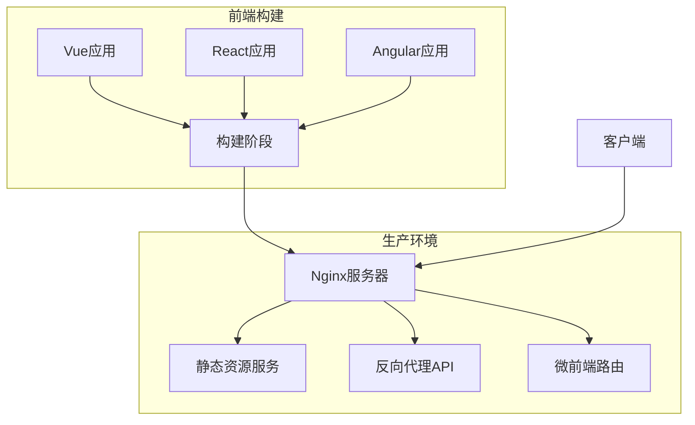
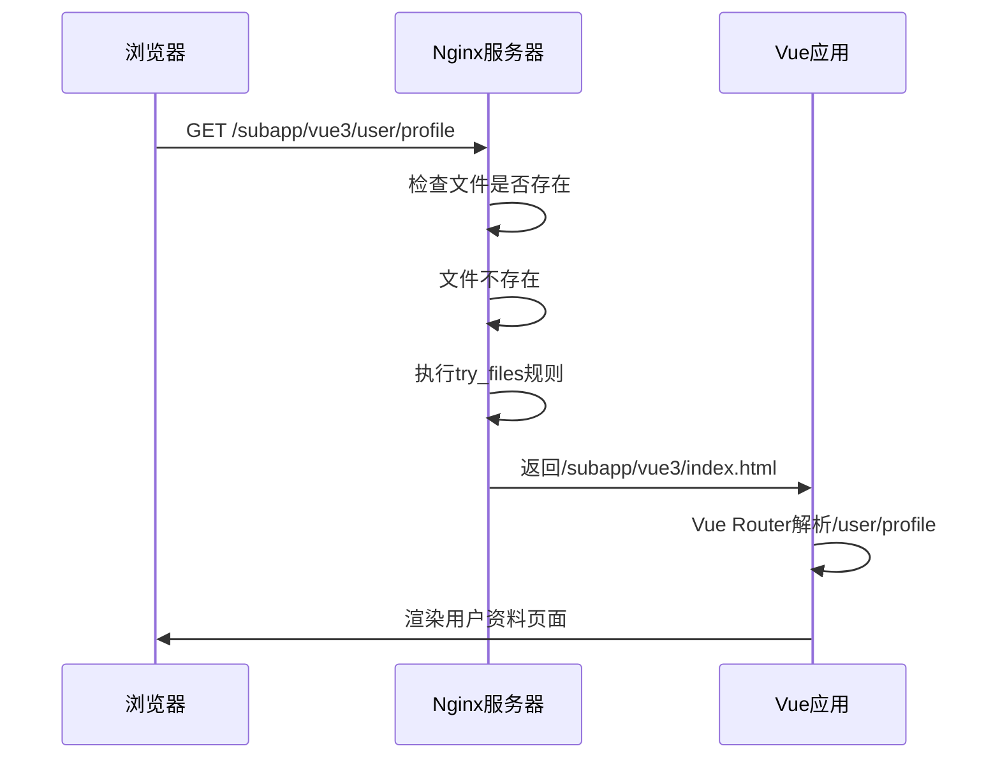
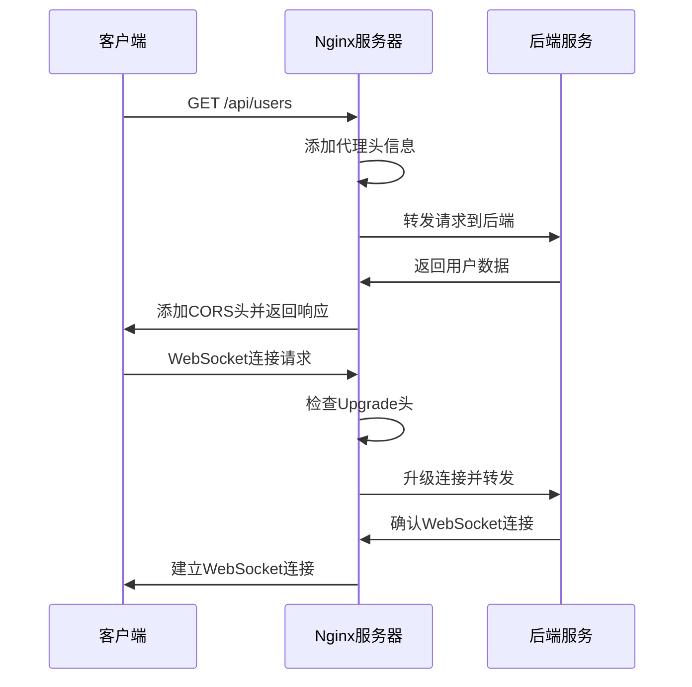

# Nginx 部署与反向代理

<cite>
**本文档中引用的文件**  
- [nginx.conf](file://nginx.conf)
- [Dockerfile](file://Dockerfile)
- [docker-compose.yml](file://docker-compose.yml)
- [src/micro/example/vue3/src/router.js](file://src/micro/example/vue3/src/router.js)
</cite>

## 目录
1. [项目结构分析](#项目结构分析)
2. [Nginx核心配置解析](#nginx核心配置解析)
3. [静态资源服务配置](#静态资源服务配置)
4. [Vue Router History模式支持](#vue-router-history模式支持)
5. [反向代理配置](#反向代理配置)
6. [Docker容器化部署](#docker容器化部署)
7. [安全与性能建议](#安全与性能建议)

## 项目结构分析

本项目是一个基于Vue的微前端架构模板，包含多个子应用（Vue2、Vue3、React、Angular），并通过Nginx作为统一的静态资源服务器和反向代理网关。项目采用Docker容器化部署，使用Docker Compose进行服务编排。



**Diagram sources**
- [Dockerfile](file://Dockerfile#L0-L13)
- [docker-compose.yml](file://docker-compose.yml#L0-L12)

**Section sources**
- [Dockerfile](file://Dockerfile#L0-L13)
- [docker-compose.yml](file://docker-compose.yml#L0-L12)

## Nginx核心配置解析

Nginx配置文件`nginx.conf`定义了服务器的基本行为，包括监听端口、服务器名称、静态资源处理和反向代理规则。

### Server块配置

Nginx的server块配置了基本的服务器参数：

- **监听端口**：监听80端口，支持IPv4和IPv6
- **服务器名称**：localhost
- **变量定义**：定义了`$service_url`变量指向后端API服务

```nginx
server {
    listen       80;
    listen  [::]:80;
    server_name  localhost;

    # 定义后端服务地址
    set $service_url http://172.27.0.4:3000;
}
```

**Section sources**
- [nginx.conf](file://nginx.conf#L1-L7)

### 错误页面处理

配置了标准的HTTP错误页面处理机制：

```nginx
error_page   500 502 503 504  /50x.html;
location = /50x.html {
    root   /usr/share/nginx/html;
}
```

当发生5xx服务器错误时，Nginx会返回位于`/usr/share/nginx/html/50x.html`的错误页面。

**Section sources**
- [nginx.conf](file://nginx.conf#L35-L39)

## 静态资源服务配置

Nginx作为静态资源服务器，通过不同的location块配置来处理各种静态资源请求。

### 根路径配置

根路径`/`的配置是整个前端应用的核心，支持单页应用（SPA）的路由机制：

```nginx
location / {
    root   /usr/share/nginx/html;
    add_header Access-Control-Allow-Origin *;
    index  index.html index.htm;
    try_files $uri $uri/ /index.html;
}
```

- **root**：指定静态文件根目录
- **add_header**：添加CORS跨域头，允许所有来源访问
- **index**：指定默认索引文件
- **try_files**：实现前端路由回退机制，当请求的文件或目录不存在时，返回`index.html`

### 特定资源路径配置

针对特定类型的静态资源，配置了专门的location块：

```nginx
location /assets/ {
    alias /usr/share/nginx/html/assets/;
    try_files $uri $uri/ =404;
}

location /docs {
    alias /usr/share/nginx/html/docs/;
    index index.html index.htm;
    try_files $uri $uri/ =404;   
}
```

- **alias**：使用alias指令而非root，更精确地映射URL路径到文件系统路径
- **try_files**：对于特定资源路径，直接返回404错误，不进行HTML回退

**Section sources**
- [nginx.conf](file://nginx.conf#L9-L28)

## Vue Router History模式支持

为了支持Vue Router的history模式，Nginx配置了特殊的路由回退规则，这是单页应用的关键配置。

### 前端路由原理

在history模式下，Vue Router会使用浏览器的History API来实现URL导航，而不会向服务器发送请求。当用户直接访问某个路由或刷新页面时，浏览器会向服务器发送请求，此时需要Nginx将这些请求重定向到`index.html`，由前端路由来处理。

### 微前端应用路由配置

项目中配置了多个微前端应用的路由规则：

```nginx
location  /subapp/vue2 {
    root /usr/share/nginx/html; 
    index  index.html index.htm;
    try_files $uri $uri/ /subapp/vue2/index.html;
}

location  /subapp/vue3 {
    root /usr/share/nginx/html; 
    index  index.html index.htm;
    try_files $uri $uri/ /subapp/vue3/index.html;
}
```

每个微前端应用都有独立的路径前缀和对应的`index.html`回退规则。

### Vue3路由配置示例

查看Vue3微应用的路由配置：

```javascript
const router = createRouter({
  history: createWebHistory(window.__MICRO_APP_BASE_ROUTE__ || '/vue3'),
  routes
});
```

这表明Vue3应用的base路径为`/vue3`，与Nginx配置中的`/subapp/vue3`路径相匹配。



**Diagram sources**
- [nginx.conf](file://nginx.conf#L29-L44)
- [src/micro/example/vue3/src/router.js](file://src/micro/example/vue3/src/router.js#L15-L18)

**Section sources**
- [nginx.conf](file://nginx.conf#L29-L44)
- [src/micro/example/vue3/src/router.js](file://src/micro/example/vue3/src/router.js#L15-L18)

## 反向代理配置

Nginx配置了反向代理功能，将API请求转发到后端服务，同时处理WebSocket连接。

### API代理配置

```nginx
location /api {
  proxy_pass $service_url$request_uri;
  proxy_http_version 1.1;
  proxy_set_header Upgrade $http_upgrade;
  proxy_set_header Connection "Upgrade";
  proxy_set_header Host $host;
  proxy_set_header X-Real-IP $remote_addr;
  proxy_set_header X-Forwarded-For $proxy_add_x_forwarded_for;
  proxy_set_header X-Forwarded-Proto $scheme;
  
  proxy_connect_timeout 6000s;
  proxy_send_timeout 6000s;
  proxy_read_timeout 6000s;
  proxy_buffering off;

  proxy_set_header X-Forwarded-Host $host;
  proxy_set_header X-Forwarded-Server $host;
  
  add_header Access-Control-Allow-Origin *;
  add_header Access-Control-Allow-Methods 'GET, POST, OPTIONS';
  add_header Access-Control-Allow-Headers '*';
}
```

### 代理配置详解

- **proxy_pass**：将请求转发到`$service_url`变量定义的后端服务
- **WebSocket支持**：通过Upgrade和Connection头支持WebSocket连接
- **请求头传递**：传递原始请求的Host、IP、协议等信息
- **超时设置**：设置了较长的连接、发送和读取超时时间
- **CORS配置**：添加跨域头，允许所有来源、方法和头部



**Diagram sources**
- [nginx.conf](file://nginx.conf#L75-L102)

**Section sources**
- [nginx.conf](file://nginx.conf#L75-L102)

## Docker容器化部署

项目使用Docker和Docker Compose进行容器化部署，实现了构建和运行环境的分离。

### 多阶段构建

Dockerfile采用多阶段构建策略：

```dockerfile
# 构建阶段
FROM node:18-alpine as builder
WORKDIR /app
COPY package*.json ./
RUN npm install
COPY . .
RUN npm run build

# 生产阶段
FROM nginx:alpine
COPY --from=builder /app/dist /usr/share/nginx/html/frontend/dist
EXPOSE 80
CMD ["nginx", "-g", "daemon off;"]
```

- **构建阶段**：使用Node.js镜像安装依赖并构建前端应用
- **生产阶段**：使用轻量级的Nginx镜像，只包含构建后的静态文件

### Docker Compose配置

```yaml
version: '3'
services:
  nginx:
    image: docker.das-security.cn/nginx:latest
    container_name: vue-template-nginx
    restart: always
    ports:
      - "8089:80"
    volumes:
      - ./nginx.conf:/etc/nginx/conf.d/default.conf
      - ./dist:/usr/share/nginx/html
      - ./docs:/usr/share/nginx/html/docs
```

- **端口映射**：将主机8089端口映射到容器80端口
- **配置挂载**：将自定义的nginx.conf挂载到容器中
- **静态文件挂载**：将构建后的dist目录和docs目录挂载到Nginx的HTML目录

**Section sources**
- [Dockerfile](file://Dockerfile#L0-L13)
- [docker-compose.yml](file://docker-compose.yml#L0-L12)

## 安全与性能建议

虽然当前配置已经实现了基本的功能需求，但为了生产环境的安全性和性能优化，建议进行以下改进。

### HTTPS配置建议

当前配置仅支持HTTP，建议添加HTTPS支持：

```nginx
# server {
#     listen 443 ssl http2;
#     server_name example.com;
#     
#     ssl_certificate /path/to/certificate.crt;
#     ssl_certificate_key /path/to/private.key;
#     
#     ssl_protocols TLSv1.2 TLSv1.3;
#     ssl_ciphers ECDHE-RSA-AES256-GCM-SHA512:DHE-RSA-AES256-GCM-SHA512;
# }
# 
# # HTTP到HTTPS重定向
# server {
#     listen 80;
#     return 301 https://$host$request_uri;
# }
```

### 性能调优参数

建议添加以下性能优化配置：

```nginx
# 在http块中添加
# worker_processes auto;
# keepalive_timeout 65;
# gzip on;
# gzip_vary on;
# gzip_min_length 1024;
# gzip_types text/plain text/css text/xml text/javascript application/javascript application/xml+rss application/json;
```

### 安全加固措施

建议添加以下安全头部：

```nginx
# 在server块中添加
# add_header X-Frame-Options DENY;
# add_header X-Content-Type-Options nosniff;
# add_header X-XSS-Protection "1; mode=block";
# add_header Strict-Transport-Security "max-age=31536000; includeSubDomains" always;
```

### 缓存控制策略

为静态资源添加适当的缓存头：

```nginx
# location ~* \.(js|css|png|jpg|jpeg|gif|ico|svg)$ {
#     expires 1y;
#     add_header Cache-Control "public, immutable";
# }
# 
# location ~* \.(html|htm)$ {
#     expires 1h;
#     add_header Cache-Control "public";
# }
```

**Section sources**
- [nginx.conf](file://nginx.conf)