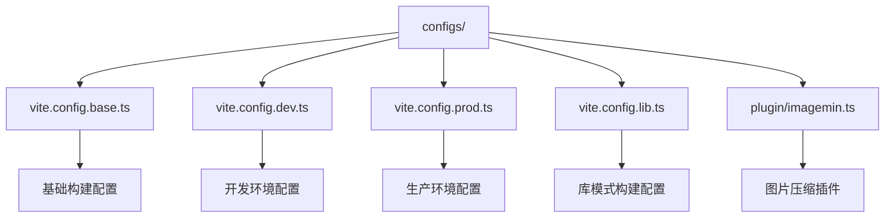
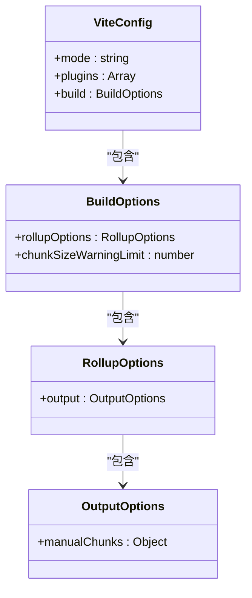
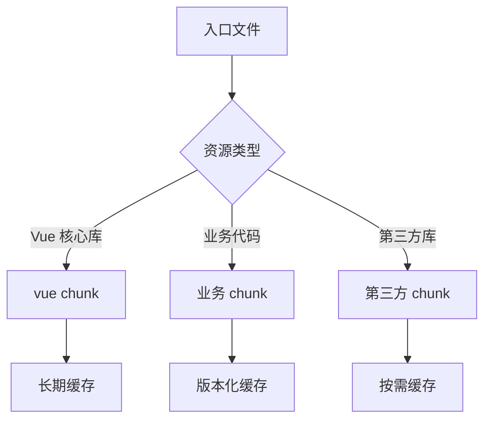
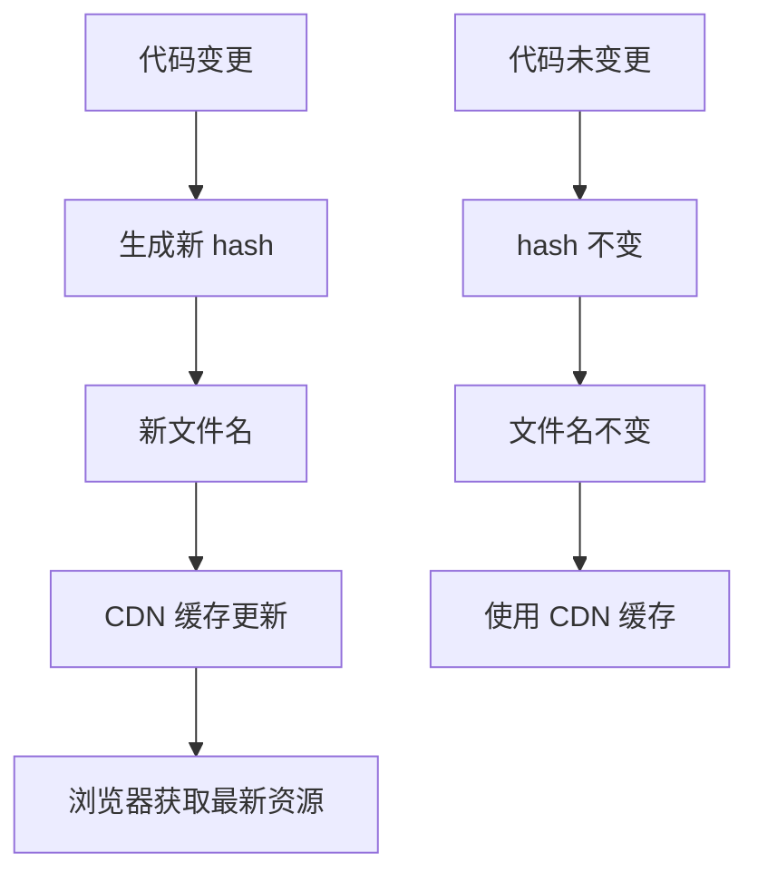
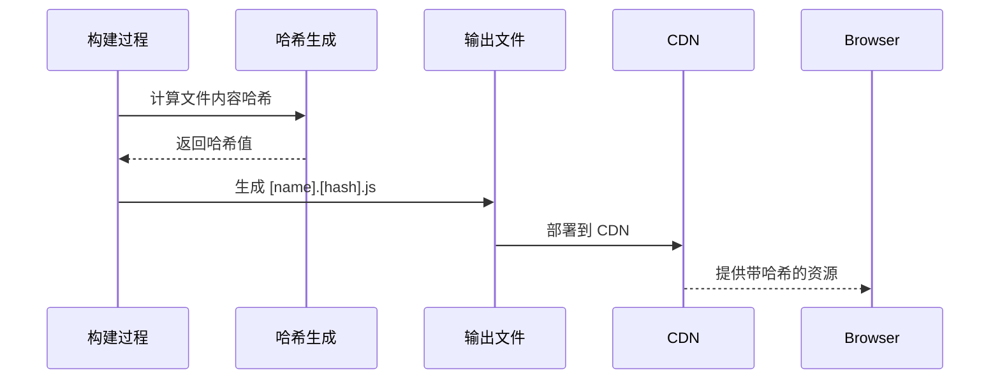

# Vite 生产构建配置

<cite>
**本文档引用的文件**  
- [vite.config.prod.ts](file://configs/vite.config.prod.ts)
- [vite.config.base.ts](file://configs/vite.config.base.ts)
- [plugin/imagemin.ts](file://configs/plugin/imagemin.ts)
- [utils.ts](file://configs/utils.ts)
- [vite.config.dev.ts](file://configs/vite.config.dev.ts)
- [vite.config.lib.ts](file://configs/vite.config.lib.ts)
- [src/micro/example/child-react/config-overrides.js](file://src/micro/example/child-react/config-overrides.js)
- [src/micro/example/vue3/src/public-path.js](file://src/micro/example/vue3/src/public-path.js)
</cite>

## 目录
1. [简介](#简介)
2. [项目结构](#项目结构)
3. [核心构建配置](#核心构建配置)
4. [代码压缩与优化](#代码压缩与优化)
5. [静态资源分块与优化](#静态资源分块与优化)
6. [Gzip/Brotli 预压缩配置](#gzipbrotli-预压缩配置)
7. [环境变量注入机制](#环境变量注入机制)
8. [构建产物目录组织方式](#构建产物目录组织方式)
9. [构建性能优化建议](#构建性能优化建议)
10. [CDN 公共路径与资源哈希配置](#cdn-公共路径与资源哈希配置)

## 简介
本文档深入解析 `vite.config.prod.ts` 文件中的生产构建配置，详细说明 Vite 在生产环境下的代码压缩、资源分块、预压缩、环境变量注入、构建产物组织等关键配置。通过分析实际配置文件，提供构建性能优化建议，包括代码分割策略、tree-shaking 调优和长期缓存方案，并结合示例说明如何配置 CDN 公共路径和资源哈希。

## 项目结构
项目采用模块化配置方式，将 Vite 配置拆分为多个文件，以实现不同环境的灵活配置。主要配置文件位于 `configs/` 目录下，包括基础配置、开发配置、生产配置和库模式配置。



**Diagram sources**
- [vite.config.base.ts](file://configs/vite.config.base.ts)
- [vite.config.dev.ts](file://configs/vite.config.dev.ts)
- [vite.config.prod.ts](file://configs/vite.config.prod.ts)
- [vite.config.lib.ts](file://configs/vite.config.lib.ts)
- [plugin/imagemin.ts](file://configs/plugin/imagemin.ts)

**Section sources**
- [vite.config.base.ts](file://configs/vite.config.base.ts)
- [vite.config.dev.ts](file://configs/vite.config.dev.ts)
- [vite.config.prod.ts](file://configs/vite.config.prod.ts)

## 核心构建配置
生产构建配置通过 `mergeConfig` 函数合并基础配置和生产环境特定配置。核心配置包括模式设置、插件集成和构建选项。



**Diagram sources**
- [vite.config.prod.ts](file://configs/vite.config.prod.ts#L1-L26)
- [vite.config.base.ts](file://configs/vite.config.base.ts#L1-L91)

**Section sources**
- [vite.config.prod.ts](file://configs/vite.config.prod.ts#L1-L26)
- [vite.config.base.ts](file://configs/vite.config.base.ts#L1-L91)

## 代码压缩与优化
生产环境通过 `vite-plugin-compression` 插件实现代码压缩，支持 Gzip 格式。该插件在构建过程中生成 `.gz` 压缩文件，可显著减小文件体积，提升网络传输效率。

```typescript
// vite.config.prod.ts
import compressPlugin from 'vite-plugin-compression';

export default mergeConfig(
  {
    plugins: [
      compressPlugin({
        ext: '.gz'
      })
    ]
  },
  baseConfig
);
```

Vite 默认使用 Rollup 进行打包，继承了其强大的 tree-shaking 能力，能有效移除未使用的代码。通过 `manualChunks` 配置，可以手动控制代码分割，将常用依赖打包到单独的 chunk 中，提高缓存利用率。

**Section sources**
- [vite.config.prod.ts](file://configs/vite.config.prod.ts#L1-L26)

## 静态资源分块与优化
通过 `build.rollupOptions.output.manualChunks` 配置实现静态资源的智能分块。将 Vue 核心库及其生态（vue-router、pinia）打包到名为 `vue` 的独立 chunk 中，实现长效缓存。



**Diagram sources**
- [vite.config.prod.ts](file://configs/vite.config.prod.ts#L15-L20)

**Section sources**
- [vite.config.prod.ts](file://configs/vite.config.prod.ts#L15-L20)

## Gzip/Brotli 预压缩配置
项目通过自定义 `imagemin` 插件实现图片资源的预压缩优化。插件使用 `vite-plugin-image-optimizer` 对 JPG 和 PNG 图片进行质量优化，分别设置为 90% 和 100% 的压缩质量。

```typescript
// configs/plugin/imagemin.ts
import { ViteImageOptimizer } from 'vite-plugin-image-optimizer';
export default function configImageminPlugin() {
  const imageminPlugin = ViteImageOptimizer({
    jpg: {
      quality: 90,
    },
    png: {
      quality: 100
    }
  })
  return imageminPlugin;
}
```

该插件在构建过程中自动优化图片资源，减少静态资源体积，提升页面加载性能。

**Section sources**
- [plugin/imagemin.ts](file://configs/plugin/imagemin.ts#L1-L17)

## 环境变量注入机制
环境变量通过 `utils.ts` 文件中的 `loadEnv` 函数加载。该函数根据 `NODE_ENV` 环境变量读取对应的 `.env` 文件（如 `.env.production`），并将解析后的变量注入到构建过程中。

```typescript
// configs/utils.ts
function loadEnv() {
  const mode = process.env.NODE_ENV || 'development';
  const env = dotenv.config({
    path: getPath(`env.${mode}`)
  });
  return env.parsed;
}

// vite.config.base.ts
const env = loadEnv();
export default defineConfig({
  define: {
    'process.env': JSON.stringify(env)
  }
});
```

通过 `define` 选项，将环境变量注入到代码中，可在运行时通过 `process.env` 访问。

**Section sources**
- [utils.ts](file://configs/utils.ts#L20-L28)
- [vite.config.base.ts](file://configs/vite.config.base.ts#L15-L17)

## 构建产物目录组织方式
构建产物的文件命名通过 `outFileName` 函数控制，该函数位于 `utils.ts` 文件中。主入口文件使用项目名称命名，其他 chunk 使用 `[name].[chunkhash]` 命名策略，实现长期缓存。

```typescript
// configs/utils.ts
function outFileName(pathData) {
  const info = packageInfo();
  if (pathData.chunk.name === 'main') return `static/js/${info.name}.main.js`;
  return 'static/js/[name].[chunkhash].js';
}
```

`chunkSizeWarningLimit` 设置为 2000KB，当 chunk 大小超过此限制时会发出警告，帮助开发者优化代码分割策略。

**Section sources**
- [utils.ts](file://configs/utils.ts#L10-L14)
- [vite.config.prod.ts](file://configs/vite.config.prod.ts#L22)

## 构建性能优化建议
### 代码分割策略
采用手动分块（manualChunks）策略，将核心依赖与业务代码分离。建议根据模块使用频率和更新频率进行分组，高频更新的业务代码单独打包，稳定的核心库独立缓存。

### Tree-shaking 调优
确保使用 ES 模块语法（import/export），避免使用 CommonJS 语法。在 `tsconfig.json` 中启用 `module: "ESNext"` 和 `target: "ESNext"`，最大化 tree-shaking 效果。

### 长期缓存方案
采用 `[name].[chunkhash]` 命名策略，结合 CDN 缓存，实现静态资源的长期缓存。通过 `chunkhash` 确保内容变更时文件名变化，避免缓存问题。



**Diagram sources**
- [utils.ts](file://configs/utils.ts#L10-L14)

## CDN 公共路径与资源哈希配置
### CDN 公共路径配置
通过 `base` 配置项设置资源的基础路径。在微前端场景下，子应用通过 `public-path.js` 动态设置 `__webpack_public_path__`，适应不同的部署路径。

```javascript
// src/micro/example/vue3/src/public-path.js
if (window.__MICRO_APP_ENVIRONMENT__) {
  __webpack_public_path__ = window.__MICRO_APP_PUBLIC_PATH__
}
```

### 资源哈希配置
资源哈希通过 Vite 内置机制实现，JS 文件使用 `[name].[chunkhash]` 命名，CSS 和静态资源自动添加内容哈希。这确保了资源内容变更时文件名变化，实现精确的缓存控制。



**Diagram sources**
- [utils.ts](file://configs/utils.ts#L10-L14)
- [src/micro/example/vue3/src/public-path.js](file://src/micro/example/vue3/src/public-path.js#L1-L3)

**Section sources**
- [utils.ts](file://configs/utils.ts#L10-L14)
- [src/micro/example/vue3/src/public-path.js](file://src/micro/example/vue3/src/public-path.js#L1-L3)