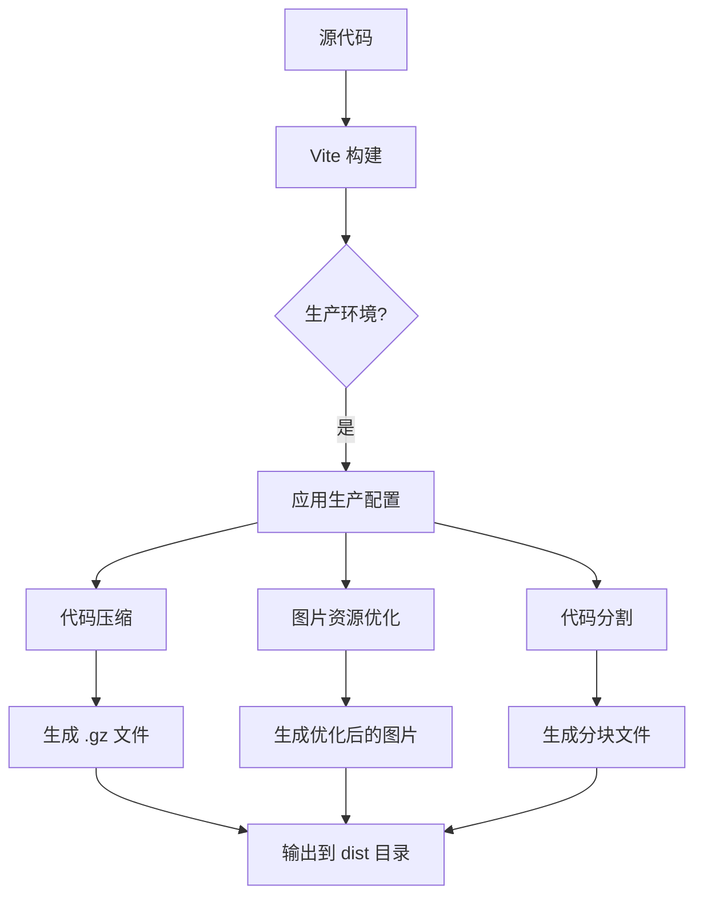
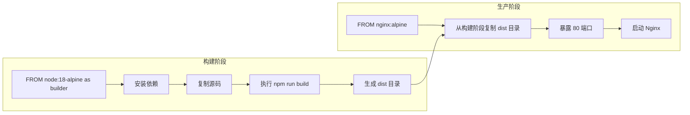
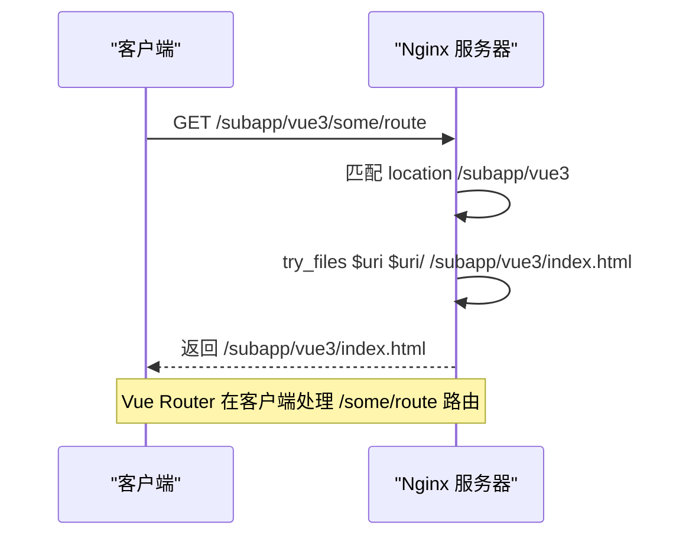
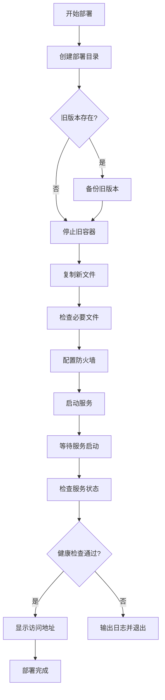

# 构建与部署

<cite>
**本文档引用文件**   
- [vite.config.prod.ts](file://configs/vite.config.prod.ts)
- [Dockerfile](file://Dockerfile)
- [docker-compose.yml](file://docker-compose.yml)
- [nginx.conf](file://nginx.conf)
- [deploy.sh](file://deploy.sh)
- [server.js](file://server.js)
- [vite.config.base.ts](file://configs/vite.config.base.ts)
- [imagemin.ts](file://configs/plugin/imagemin.ts)
- [utils.ts](file://configs/utils.ts)
</cite>

## 目录
1. [构建与部署](#构建与部署)
2. [Vite 生产环境构建配置](#vite-生产环境构建配置)
3. [Docker 镜像打包与容器编排](#docker-镜像打包与容器编排)
4. [Nginx 反向代理配置](#nginx-反向代理配置)
5. [Shell 部署脚本分析](#shell-部署脚本分析)
6. [自定义 Node 服务配置](#自定义-node-服务配置)
7. [CI/CD 集成与部署问题排查](#cicd-集成与部署问题排查)

## Vite 生产环境构建配置

本项目使用 Vite 作为构建工具，生产环境的构建配置通过 `vite.config.prod.ts` 文件定义。该配置文件通过 `mergeConfig` 函数合并了基础配置 `vite.config.base.ts`，并添加了生产环境特有的优化和压缩设置。

### 代码压缩与资源优化

生产环境配置中集成了两个关键的优化插件：

1.  **vite-plugin-compression**: 用于生成 Gzip 压缩文件。
2.  **vite-plugin-image-optimizer**: 用于压缩图片资源。



**Diagram sources**
- [vite.config.prod.ts](file://configs/vite.config.prod.ts#L1-L27)
- [imagemin.ts](file://configs/plugin/imagemin.ts#L1-L17)

#### Gzip 压缩配置

`vite-plugin-compression` 插件被配置为对所有静态资源生成 `.gz` 后缀的压缩文件。这可以显著减小文件体积，加快网络传输速度。

```typescript
// configs/vite.config.prod.ts
plugins: [
  compressPlugin({
    ext: '.gz' // 指定压缩文件的扩展名为 .gz
  }),
  // ... 其他插件
]
```

#### 图片资源优化配置

`vite-plugin-image-optimizer` 插件通过 `configImageminPlugin` 函数进行配置，对 JPEG 和 PNG 图片进行质量优化。

```typescript
// configs/plugin/imagemin.ts
export default function configImageminPlugin() {
  const imageminPlugin = ViteImageOptimizer({
    jpg: {
      quality: 90, // JPEG 图片质量设置为 90%
    },
    png: {
      quality: 100 // PNG 图片质量设置为 100% (无损压缩)
    }
  })
  return imageminPlugin;
}
```

**Section sources**
- [vite.config.prod.ts](file://configs/vite.config.prod.ts#L1-L27)
- [imagemin.ts](file://configs/plugin/imagemin.ts#L1-L17)

### 代码分割与分块大小

为了优化首屏加载性能，配置文件启用了 Rollup 的 `manualChunks` 功能，将核心的 Vue 框架、路由和状态管理库（`vue`, `vue-router`, `pinia`）打包到一个名为 `vue` 的独立分块中。这有助于浏览器缓存这些不常变动的库。

```typescript
// configs/vite.config.prod.ts
build: {
  rollupOptions: {
    output: {
      manualChunks: {
        vue: ['vue', 'vue-router', 'pinia'] // 将 Vue 相关库打包到一个分块
      }
    }
  },
  chunkSizeWarningLimit: 2000 // 将分块大小警告阈值提高到 2000kb
}
```

**Section sources**
- [vite.config.prod.ts](file://configs/vite.config.prod.ts#L1-L27)

### 环境变量注入

环境变量的注入是通过基础配置文件 `vite.config.base.ts` 中的 `define` 选项实现的。`loadEnv()` 函数会根据 `NODE_ENV` 环境变量加载对应的 `.env` 文件（如 `.env.production`），并将解析出的变量挂载到 `process.env` 对象上，最终在构建时被替换为实际的字符串。

```typescript
// configs/vite.config.base.ts
import { loadEnv } from './utils';

const env = loadEnv(); // 加载环境变量

export default defineConfig({
  // ... 其他配置
  define: {
    'process.env': JSON.stringify(env) // 将环境变量注入到代码中
  },
  // ... 其他配置
});
```

```typescript
// configs/utils.ts
function loadEnv() {
  const mode = process.env.NODE_ENV || 'development';
  const env = dotenv.config({
    path: getPath(`env.${mode}`) // 根据模式加载 .env 文件
  });
  if (env.error) {
    console.error(env.error);
    return {};
  }
  return env.parsed; // 返回解析后的环境变量对象
}
```

**Section sources**
- [vite.config.base.ts](file://configs/vite.config.base.ts#L1-L91)
- [utils.ts](file://configs/utils.ts#L1-L28)

## Docker 镜像打包与容器编排

项目的部署依赖于 Docker 容器化技术，通过 `Dockerfile` 定义镜像构建过程，并通过 `docker-compose.yml` 文件进行多容器服务的编排。

### Docker 镜像构建过程

`Dockerfile` 采用多阶段构建（Multi-stage Build）策略，分为构建阶段和生产阶段，以减小最终镜像的体积。



**Diagram sources**
- [Dockerfile](file://Dockerfile#L1-L14)

#### 构建阶段 (builder)

1.  **基础镜像**: 使用 `node:18-alpine` 作为基础镜像，这是一个轻量级的 Node.js 运行环境。
2.  **工作目录**: 设置工作目录为 `/app`。
3.  **安装依赖**: 复制 `package*.json` 文件并运行 `npm install` 安装项目依赖。
4.  **复制源码**: 将整个项目源码复制到容器中。
5.  **构建应用**: 执行 `npm run build` 命令，利用 Vite 构建生产环境的静态文件，输出到 `dist` 目录。

#### 生产阶段 (production)

1.  **基础镜像**: 使用 `nginx:alpine` 作为基础镜像，这是一个轻量级的 Nginx Web 服务器。
2.  **复制文件**: 使用 `COPY --from=builder` 命令，从上一阶段的 `builder` 容器中将构建好的 `dist` 目录复制到 Nginx 的默认 Web 根目录 `/usr/share/nginx/html/frontend/dist`。
3.  **暴露端口**: 暴露 80 端口。
4.  **启动命令**: 使用 `CMD ["nginx", "-g", "daemon off;"]` 命令启动 Nginx 服务，并以前台模式运行，确保容器不会在启动后立即退出。

**Section sources**
- [Dockerfile](file://Dockerfile#L1-L14)

### 多容器编排配置

`docker-compose.yml` 文件定义了名为 `nginx` 的服务，用于管理 Nginx 容器的生命周期和配置。

```yaml
# docker-compose.yml
version: '3'

services:
  nginx:
    image: docker.das-security.cn/nginx:latest # 使用自定义的 Nginx 镜像
    container_name: vue-template-nginx # 容器名称
    restart: always # 容器失败时自动重启
    ports:
      - "8089:80" # 将宿主机的 8089 端口映射到容器的 80 端口
    volumes:
      - ./nginx.conf:/etc/nginx/conf.d/default.conf # 挂载自定义 Nginx 配置
      - ./dist:/usr/share/nginx/html # 挂载构建好的静态文件
      - ./docs:/usr/share/nginx/html/docs # 挂载文档目录
```

该配置将宿主机的 `8089` 端口映射到容器的 `80` 端口，使得应用可以通过 `http://localhost:8089` 访问。同时，通过卷（volumes）挂载的方式，将自定义的 `nginx.conf` 配置文件、构建好的 `dist` 目录和 `docs` 文档目录同步到容器内部。

**Section sources**
- [docker-compose.yml](file://docker-compose.yml#L1-L13)

## Nginx 反向代理配置

`nginx.conf` 文件是 Nginx 的核心配置，定义了如何处理 HTTP 请求，包括静态资源服务、路由重写和反向代理。

### 静态资源服务与路由重写

Nginx 被配置为一个静态文件服务器，并处理单页应用（SPA）的路由。



**Diagram sources**
- [nginx.conf](file://nginx.conf#L1-L103)

#### 核心 `location` 块分析

-   **`location /`**: 这是默认的根路径处理规则。
    -   `root /usr/share/nginx/html;`: 设置 Web 根目录。
    -   `try_files $uri $uri/ /index.html;`: 这是 SPA 的关键。它尝试按顺序查找文件：首先查找请求的 URI 对应的文件，如果不存在则查找同名目录，如果都不存在，则返回 `index.html`。这使得 Vue Router 可以接管后续的客户端路由。

-   **`location /assets/`**: 专门处理 `/assets/` 路径下的资源请求，直接返回文件，如果不存在则返回 404，避免了不必要的 `index.html` 回退。

-   **`location /docs`**: 为文档目录提供服务，配置了 `index` 指令以支持目录索引。

-   **`location /subapp/*`**: 为微前端子应用（Vue2, Vue3, React, Angular）配置了独立的 `location` 块。每个块都使用 `root` 指令指向根目录，并通过 `try_files` 指令将所有子应用内部的路由请求重定向到其各自的 `index.html` 文件。

**Section sources**
- [nginx.conf](file://nginx.conf#L1-L103)

### 反向代理与 API 转发

`location /api` 块配置了反向代理，将所有以 `/api` 开头的请求转发到后端服务。

```nginx
# nginx.conf
location /api {
  proxy_pass $service_url$request_uri;  # 保留 /api 前缀并转发
  proxy_http_version 1.1;
  proxy_set_header Upgrade $http_upgrade;
  proxy_set_header Connection "Upgrade"; # 支持 WebSocket
  proxy_set_header Host $host;
  proxy_set_header X-Real-IP $remote_addr;
  proxy_set_header X-Forwarded-For $proxy_add_x_forwarded_for;
  proxy_set_header X-Forwarded-Proto $scheme;
  
  proxy_connect_timeout 6000s;
  proxy_send_timeout 6000s;
  proxy_read_timeout 6000s;
  proxy_buffering off;
}
```

-   **`proxy_pass`**: 使用变量 `$service_url` 定义后端服务地址，并通过 `$request_uri` 保留原始请求的 URI（包括 `/api` 前缀）。
-   **WebSocket 支持**: 通过设置 `Upgrade` 和 `Connection` 头部，支持 WebSocket 连接的升级。
-   **请求头传递**: 传递 `Host`, `X-Real-IP` 等头部，使后端服务能获取到真实的客户端信息。
-   **超时设置**: 设置了较长的超时时间（6000秒），适用于可能的长连接或大文件上传。

**Section sources**
- [nginx.conf](file://nginx.conf#L1-L103)

## Shell 部署脚本分析

`deploy.sh` 是一个自动化部署脚本，封装了从文件复制到服务启动的完整流程。

### 执行逻辑



**Diagram sources**
- [deploy.sh](file://deploy.sh#L1-L88)

#### 关键步骤与注意事项

1.  **变量定义**: 脚本定义了 `PROJECT_NAME`, `DEPLOY_DIR` 和 `BACKUP_DIR` 等变量，便于维护。
2.  **备份机制**: 在部署前，脚本会检查 `dist` 目录是否存在，如果存在则创建一个带有时间戳的备份，确保可以回滚。
3.  **服务管理**: 使用 `docker-compose down` 停止旧容器，然后使用 `sudo docker-compose up -d --build` 启动新服务。`--build` 参数确保 Docker 会重新构建镜像，应用最新的代码变更。
4.  **文件完整性检查**: 脚本会检查 `docker-compose.yml`, `Dockerfile`, `nginx.conf`, `dist`, `docs` 等关键文件是否存在，如果缺少则立即退出，防止部署不完整的应用。
5.  **防火墙配置**: 自动为 `8089` 端口添加防火墙规则，确保外部可以访问。
6.  **健康检查**: 部署完成后，脚本会使用 `curl` 命令检查 `http://localhost:8089/` 是否能正常访问，这是判断部署是否成功的关键一步。
7.  **权限与路径**: 脚本使用 `sudo` 来确保有足够的权限创建目录和复制文件，并使用 `$(pwd)` 和 `cd` 命令精确控制文件路径。

**Section sources**
- [deploy.sh](file://deploy.sh#L1-L88)

## 自定义 Node 服务配置

`server.js` 文件定义了一个简单的 Node.js 服务器配置，主要用于开发环境。

```javascript
// server.js
module.exports = {
  hot: true, // 启用热模块替换 (HMR)
  port: 3000, // 服务器监听端口
  client: {
    logging: 'warn' // 客户端日志级别设置为 'warn'
  },
  proxy: {} // 代理配置为空
}
```

该配置通常被 Vite 或其他开发服务器（如 Webpack Dev Server）读取，以启动一个支持热更新的开发服务器，监听在 `3000` 端口。

**Section sources**
- [server.js](file://server.js#L1-L8)

## CI/CD 集成与部署问题排查

### CI/CD 集成建议

1.  **流水线设计**: 建议的 CI/CD 流水线包含以下阶段：
    *   **代码检查 (Lint)**: 运行 ESLint 或 Prettier。
    *   **单元测试 (Test)**: 运行 Jest 或 Vitest。
    *   **构建 (Build)**: 执行 `npm run build`，生成 `dist` 目录。
    *   **安全扫描**: 扫描依赖中的安全漏洞。
    *   **部署 (Deploy)**: 将构建产物和部署脚本推送到目标服务器，并执行 `deploy.sh`。

2.  **环境分离**: 为开发、测试、预发布和生产环境维护不同的 `.env` 文件和 `docker-compose` 配置文件。

3.  **镜像版本化**: 在 `docker-compose.yml` 中不要使用 `latest` 标签，而应使用具体的版本号或 Git Commit ID，以确保部署的可追溯性和一致性。

### 常见部署问题排查方法

1.  **页面无法访问 (502 Bad Gateway)**:
    *   **检查**: 运行 `sudo docker-compose ps` 查看容器状态，确认 `nginx` 容器是否为 `Up` 状态。
    *   **检查**: 运行 `sudo docker-compose logs` 查看容器日志，寻找启动错误。
    *   **检查**: 确认 `8089` 端口是否被防火墙阻止。

2.  **页面空白或 404**:
    *   **检查**: 确认 `dist` 目录是否已正确挂载到容器内。进入容器 `docker exec -it vue-template-nginx sh`，检查 `/usr/share/nginx/html` 目录下是否有文件。
    *   **检查**: 确认 `nginx.conf` 中的 `root` 路径和 `try_files` 指令是否正确。

3.  **API 请求失败**:
    *   **检查**: 确认 `nginx.conf` 中的 `location /api` 块的 `proxy_pass` 地址 (`$service_url`) 是否正确。
    *   **检查**: 在 Nginx 容器内使用 `curl` 命令测试后端服务是否可达。

4.  **构建失败**:
    *   **检查**: 在本地运行 `npm run build`，复现并解决构建错误。
    *   **检查**: 确认 `Dockerfile` 中的 `npm install` 是否成功安装了所有依赖。