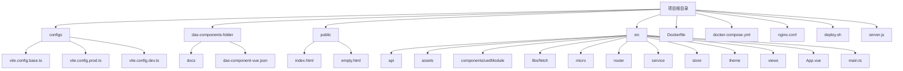
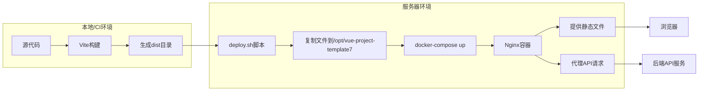
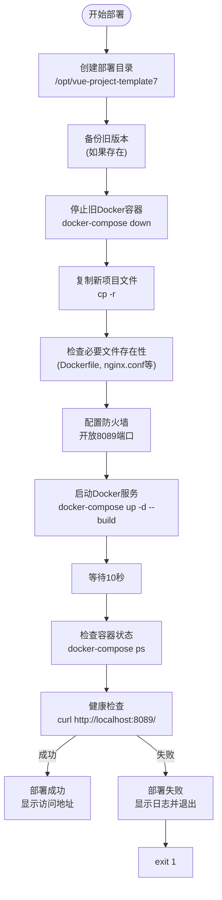
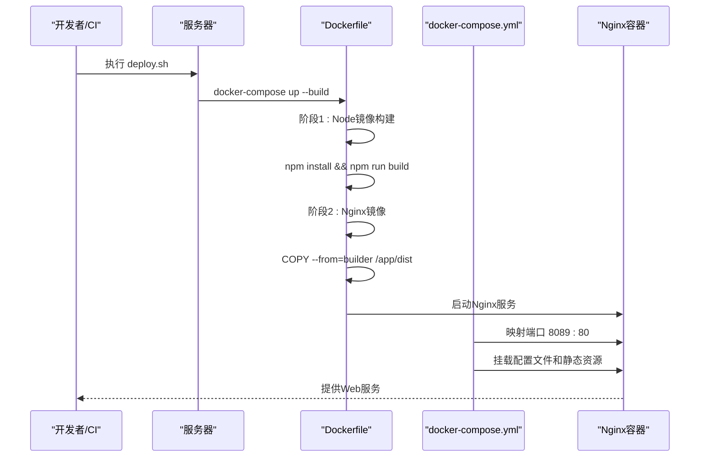

# 部署自动化脚本

<cite>
**本文档引用的文件**   
- [deploy.sh](file://deploy.sh)
- [Dockerfile](file://Dockerfile)
- [docker-compose.yml](file://docker-compose.yml)
- [nginx.conf](file://nginx.conf)
- [configs/vite.config.prod.ts](file://configs/vite.config.prod.ts)
- [configs/vite.config.base.ts](file://configs/vite.config.base.ts)
- [server.js](file://server.js)
</cite>

## 目录
1. [简介](#简介)
2. [项目结构](#项目结构)
3. [核心组件](#核心组件)
4. [架构概览](#架构概览)
5. [详细组件分析](#详细组件分析)
6. [依赖分析](#依赖分析)
7. [性能考虑](#性能考虑)
8. [故障排除指南](#故障排除指南)
9. [结论](#结论)

## 简介
本文档详细分析了 `vue-project-template6` 项目的部署自动化流程。重点解析了 `deploy.sh` 部署脚本的完整执行过程，包括构建前清理、生产环境构建、Docker镜像构建与推送、容器服务重启等关键步骤。同时，深入探讨了 `server.js` 中自定义Node.js服务器的作用，以及如何将部署流程集成到CI/CD自动化流水线中。文档旨在为开发和运维团队提供一份全面、清晰的部署指南。

## 项目结构
该项目是一个基于Vue 3的前端微前端架构项目，采用Vite作为构建工具，并通过Docker和Nginx进行容器化部署。项目结构清晰，主要分为配置文件、公共组件库、源代码、静态资源和部署相关文件。



**Diagram sources**
- [project_structure](file://project_structure)

## 核心组件

`deploy.sh` 是整个部署流程的核心，它是一个Bash脚本，负责协调从代码复制到服务启动的全过程。该脚本通过一系列有序的步骤，确保了部署的可靠性和可重复性。其主要功能包括：创建和清理部署目录、备份旧版本、停止旧容器、复制新文件、检查必要文件、配置防火墙、启动Docker服务以及进行健康检查。

**Section sources**
- [deploy.sh](file://deploy.sh#L1-L87)

## 架构概览

整个应用采用多阶段Docker构建和容器化部署的架构。首先，使用Vite在本地或CI环境中构建生产版本的静态文件。然后，`deploy.sh` 脚本将这些文件连同Docker配置一起复制到服务器的指定目录。最后，通过 `docker-compose` 启动一个Nginx容器，该容器负责提供静态文件服务，并将API请求代理到后端服务。



**Diagram sources**
- [deploy.sh](file://deploy.sh#L1-L87)
- [Dockerfile](file://Dockerfile#L1-L14)
- [docker-compose.yml](file://docker-compose.yml#L1-L13)

## 详细组件分析

### deploy.sh 脚本分析

`deploy.sh` 脚本是部署流程的指挥中心，其执行流程严谨，包含了完善的错误处理和日志记录。

#### 执行流程与错误处理


**Diagram sources**
- [deploy.sh](file://deploy.sh#L1-L87)

**Section sources**
- [deploy.sh](file://deploy.sh#L1-L87)

#### 环境判断逻辑
脚本中的环境判断逻辑主要体现在以下几个方面：
1.  **备份判断**：通过 `if [ -d "${DEPLOY_DIR}/dist" ]; then` 判断是否存在旧的 `dist` 目录，只有存在时才执行备份，避免了不必要的操作。
2.  **容错处理**：在停止容器和配置防火墙时，使用了 `|| true`。这意味着即使 `docker-compose down` 或 `firewall-cmd` 命令执行失败（例如，容器从未启动过），脚本也不会中断，而是继续执行后续步骤，提高了脚本的鲁棒性。
3.  **文件存在性检查**：脚本在启动服务前，会遍历 `required_files` 数组，检查 `Dockerfile`, `nginx.conf`, `dist` 等关键文件是否都已存在。如果缺少任何文件，脚本会立即报错并退出 (`exit 1`)，防止了因配置不全导致的部署失败。

### server.js 文件分析

`server.js` 文件在此项目中是一个配置文件，用于定义Vite开发服务器的行为。

#### 功能与作用
该文件导出一个配置对象，主要作用于开发环境：
-   **热重载 (hot: true)**：启用模块热替换（HMR），当代码更改时，无需刷新整个页面即可更新修改的模块，极大提升了开发效率。
-   **端口 (port: 3000)**：指定开发服务器监听的端口号为3000。
-   **客户端日志级别 (client.logging: 'warn')**：设置客户端（浏览器控制台）的日志级别为“警告”，减少不必要的信息输出，使开发者能更专注于关键日志。
-   **代理 (proxy: {})**：预留了代理配置项，可用于将特定的API请求代理到后端开发服务器，解决开发环境下的跨域问题。虽然当前为空，但为后续集成提供了便利。

**Section sources**
- [server.js](file://server.js#L1-L8)

### 生产环境构建分析

生产环境的构建由Vite完成，其配置定义在 `configs/vite.config.prod.ts` 中。

#### 构建配置与优化
```mermaid
classDiagram
class vite.config.prod.ts {
+mode : 'production'
+plugins : [compressPlugin, configImageminPlugin]
+build.rollupOptions.output.manualChunks
+chunkSizeWarningLimit : 2000
}
class vite.config.base.ts {
+base : env?.BASE_PATH || '/'
+plugins : [vue, vueJsx, federation, UnoCSS, AutoImport, Components]
+resolve.alias
+define : {'process.env' : JSON.stringify(env)}
}
class vite-plugin-compression {
+ext : '.gz'
}
class vite-plugin-image-optimizer {
+jpg.quality : 90
+png.quality : 100
}
vite.config.prod.ts --> vite.config.base.ts : "mergeConfig"
vite.config.prod.ts --> vite-plugin-compression : "使用"
vite.config.prod.ts --> vite-plugin-image-optimizer : "使用"
```

**Diagram sources**
- [configs/vite.config.prod.ts](file://configs/vite.config.prod.ts#L1-L28)
- [configs/vite.config.base.ts](file://configs/vite.config.base.ts#L1-L92)
- [configs/plugin/imagemin.ts](file://configs/plugin/imagemin.ts#L1-L16)

**Section sources**
- [configs/vite.config.prod.ts](file://configs/vite.config.prod.ts#L1-L28)
- [configs/vite.config.base.ts](file://configs/vite.config.base.ts#L1-L92)

该配置通过 `mergeConfig` 继承了基础配置，并添加了生产环境特有的优化：
1.  **Gzip压缩**：使用 `vite-plugin-compression` 插件，对构建后的JS、CSS等资源文件生成 `.gz` 压缩包，显著减小文件体积，提升网络传输效率。
2.  **图片压缩**：通过 `configImageminPlugin`，对JPG和PNG图片进行质量优化（JPG 90%, PNG 100%），在保证视觉效果的同时减小图片大小。
3.  **代码分割**：通过 `manualChunks` 将 `vue`, `vue-router`, `pinia` 等核心库打包到一个名为 `vue` 的独立 `chunk` 中。这有利于浏览器缓存，当应用代码更新时，用户无需重新下载庞大的Vue框架。
4.  **警告阈值**：将 `chunkSizeWarningLimit` 设置为2000KB，当代码块超过此大小时会发出警告，提醒开发者注意性能。

### Docker与Nginx配置分析

Docker和Nginx是应用在生产环境中运行的基石。

#### 多阶段构建与服务编排


**Diagram sources**
- [Dockerfile](file://Dockerfile#L1-L14)
- [docker-compose.yml](file://docker-compose.yml#L1-L13)
- [nginx.conf](file://nginx.conf#L1-L102)

**Section sources**
- [Dockerfile](file://Dockerfile#L1-L14)
- [docker-compose.yml](file://docker-compose.yml#L1-L13)
- [nginx.conf](file://nginx.conf#L1-L102)

-   **Dockerfile**：采用多阶段构建。第一阶段使用 `node:18-alpine` 镜像安装依赖并执行 `npm run build` 生成 `dist` 目录。第二阶段使用轻量级的 `nginx:alpine` 镜像，仅将第一阶段构建好的 `dist` 目录复制到Nginx的默认Web根目录下，从而生成一个非常小巧且安全的生产镜像。
-   **docker-compose.yml**：定义了一个名为 `nginx` 的服务。它使用私有镜像 `docker.das-security.cn/nginx:latest`，将容器的80端口映射到宿主机的8089端口，并通过卷（volumes）挂载了自定义的Nginx配置、构建好的静态文件和文档。
-   **nginx.conf**：Nginx的核心配置，实现了：
    -   **静态文件服务**：`location /` 和 `location /assets/` 处理主应用和资源文件的请求。
    -   **微前端子应用路由**：为 `vue2`, `vue3`, `react`, `angular` 等子应用配置了独立的 `location` 块，确保路由正确。
    -   **API代理**：`location /api` 将所有以 `/api` 开头的请求代理到后端服务（`$service_url` 变量定义的地址），并配置了WebSocket支持和跨域头。
    -   **健康检查**：`deploy.sh` 脚本中的 `curl -f http://localhost:8089/` 正是访问Nginx提供的根路径，以验证服务是否正常运行。

## 依赖分析

项目依赖关系清晰，主要分为构建依赖、运行时依赖和部署依赖。

```mermaid
graph TD
A[Vite] --> B[开发服务器]
A --> C[生产构建]
B --> D[server.js 配置]
C --> E[dist 目录]
E --> F[Dockerfile]
F --> G[Nginx 容器]
G --> H[浏览器]
I[deploy.sh] --> J[复制文件]
J --> K[/opt/vue-project-template7]
K --> L[docker-compose up]
L --> G
M[nginx.conf] --> G
N[package.json] --> A
O[configs/vite.config.*] --> A
```

**Diagram sources**
- [package.json](file://package.json)
- [configs/vite.config.base.ts](file://configs/vite.config.base.ts)
- [Dockerfile](file://Dockerfile)
- [docker-compose.yml](file://docker-compose.yml)
- [nginx.conf](file://nginx.conf)

**Section sources**
- [package.json](file://package.json)
- [Dockerfile](file://Dockerfile)
- [docker-compose.yml](file://docker-compose.yml)

## 性能考虑

项目的部署和运行在性能方面做了多项优化：
1.  **构建优化**：通过Gzip压缩和图片优化，显著减小了前端资源的体积。
2.  **代码分割**：将核心库单独打包，利用浏览器缓存，减少用户二次访问时的加载时间。
3.  **轻量级镜像**：Docker多阶段构建避免了将Node.js和构建工具打入最终镜像，使得生产镜像非常小，加快了拉取和启动速度。
4.  **Nginx高效服务**：Nginx作为静态文件服务器，性能卓越，能够高效处理大量并发请求。

## 故障排除指南

根据 `deploy.sh` 脚本的逻辑，常见的部署问题及排查方法如下：

**Section sources**
- [deploy.sh](file://deploy.sh#L1-L87)

-   **问题：部署脚本在“检查部署文件”步骤报错“缺少必要文件”**。
    -   **原因**：`deploy.sh` 脚本执行时，当前工作目录下缺少 `Dockerfile`, `nginx.conf`, `dist` 等文件。
    -   **解决**：确保在执行 `deploy.sh` 前，已经完成了Vite的生产构建（`npm run build`），并且所有必要的配置文件都已准备就绪。

-   **问题：健康检查失败，提示“主应用访问失败”**。
    -   **原因**：Nginx容器未能成功启动，或端口映射、配置文件有误。
    -   **解决**：根据脚本末尾提示，执行 `cd /opt/vue-project-template7 && sudo docker-compose logs` 查看Nginx容器的详细日志，根据日志信息进行修复。

-   **问题：页面可以访问，但API请求失败**。
    -   **原因**：Nginx的 `proxy_pass` 配置中的 `$service_url` 指向的后端服务不可达。
    -   **解决**：检查 `nginx.conf` 中 `set $service_url` 的IP地址和端口是否正确，并确保后端服务正在运行。

## 结论

`vue-project-template6` 项目通过 `deploy.sh` 脚本实现了一套完整、可靠的自动化部署流程。该流程结合了Vite的现代化构建、Docker的容器化隔离以及Nginx的高性能服务，形成了一个高效、稳定的生产环境部署方案。脚本中完善的错误处理和健康检查机制，极大地降低了部署风险。对于CI/CD集成，可以将 `deploy.sh` 脚本封装到GitHub Actions或Jenkins的流水线中，在代码合并到主分支后自动触发。关于蓝绿部署或滚动更新，可以在 `docker-compose.yml` 中定义两个服务（如 `nginx-blue` 和 `nginx-green`），通过脚本控制流量切换，实现零停机部署。