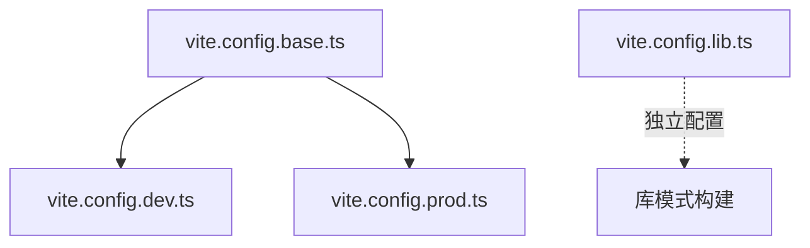

# Vite多环境配置

<cite>
**本文档引用的文件**  
- [vite.config.base.ts](file://configs/vite.config.base.ts)
- [vite.config.dev.ts](file://configs/vite.config.dev.ts)
- [vite.config.prod.ts](file://configs/vite.config.prod.ts)
- [vite.config.lib.ts](file://configs/vite.config.lib.ts)
- [utils.ts](file://configs/utils.ts)
- [imagemin.ts](file://configs/plugin/imagemin.ts)
</cite>

## 目录
1. [简介](#简介)
2. [配置文件继承关系](#配置文件继承关系)
3. [基础配置：vite.config.base.ts](#基础配置viteconfigbasts)
4. [开发环境配置：vite.config.dev.ts](#开发环境配置viteconfigdevts)
5. [生产环境配置：vite.config.prod.ts](#生产环境配置viteconfigprodtts)
6. [库模式配置：vite.config.lib.ts](#库模式配置viteconfiglibts)
7. [配置合并策略](#配置合并策略)
8. [环境变量注入机制](#环境变量注入机制)
9. [插件配置与资源优化](#插件配置与资源优化)
10. [总结](#总结)

## 简介
本项目采用 Vite 构建工具，通过多环境配置文件实现开发、生产、库构建等不同场景下的精细化控制。配置体系以 `vite.config.base.ts` 为基础，通过 `mergeConfig` 实现配置继承与覆盖，确保配置一致性的同时满足各环境特定需求。

## 配置文件继承关系
项目采用分层配置模式，结构清晰，职责分明：
- `vite.config.base.ts`：基础配置，定义通用别名、插件、构建选项等
- `vite.config.dev.ts`：继承基础配置，扩展开发服务器相关设置
- `vite.config.prod.ts`：继承基础配置，增强生产构建优化能力
- `vite.config.lib.ts`：独立库构建配置，用于打包可复用的 JavaScript 库

**Diagram sources**
- [vite.config.base.ts](file://configs/vite.config.base.ts#L1-L91)
- [vite.config.dev.ts](file://configs/vite.config.dev.ts#L1-L27)
- [vite.config.prod.ts](file://configs/vite.config.prod.ts#L1-L27)
- [vite.config.lib.ts](file://configs/vite.config.lib.ts#L1-L12)

**Section sources**
- [vite.config.base.ts](file://configs/vite.config.base.ts#L1-L91)
- [vite.config.dev.ts](file://configs/vite.config.dev.ts#L1-L27)
- [vite.config.prod.ts](file://configs/vite.config.prod.ts#L1-L27)
- [vite.config.lib.ts](file://configs/vite.config.lib.ts#L1-L12)

## 基础配置：vite.config.base.ts
`vite.config.base.ts` 是所有环境配置的基石，定义了项目的核心构建行为。

### 别名配置
通过 `resolve.alias` 设置路径别名：
- `@` 指向 `src` 目录，简化模块导入路径
- `vue` 指向 `vue.esm-bundler.js`，支持模板编译功能

### 核心插件
集成多个关键插件提升开发体验与构建能力：
- `@vitejs/plugin-vue`：Vue 3 单文件组件支持
- `@vitejs/plugin-vue-jsx`：JSX/TSX 语法支持
- `@originjs/vite-plugin-federation`：微前端模块联邦支持
- `unplugin-auto-import/vite`：自动导入常用 API（如 ref、computed）
- `unplugin-vue-components/vite`：组件自动注册，支持 Ant Design Vue 和自定义组件解析
- `unocss/vite`：原子化 CSS 引擎支持

### 公共路径与环境变量
- `base` 字段动态读取 `BASE_PATH` 环境变量，默认为 `'/'`
- 使用 `loadEnv()` 工具函数加载 `.env` 文件中的环境变量，并通过 `define` 注入到代码中

**Section sources**
- [vite.config.base.ts](file://configs/vite.config.base.ts#L1-L91)
- [utils.ts](file://configs/utils.ts#L1-L30)

## 开发环境配置：vite.config.dev.ts
该配置专为开发环境设计，在继承基础配置的同时增强了本地开发体验。

### 开发服务器配置
- `host: '0.0.0.0'`：允许外部网络访问
- `port: 3000`：指定开发服务器端口
- `proxy`：通过 `devEnv.proxy` 配置代理规则，解决跨域问题

### 文件系统安全
启用 `server.fs.strict` 模式，限制对项目根目录外文件的访问，提升安全性。

### 插件管理
当前注释了 `vite-plugin-eslint`，可根据需要启用以实现实时 ESLint 检查。

**Section sources**
- [vite.config.dev.ts](file://configs/vite.config.dev.ts#L1-L27)
- [dev.env.js](file://dev.env.js#L1-L10)

## 生产环境配置：vite.config.prod.ts
该配置专注于生产环境的性能优化与资源压缩。

### 代码分割策略
通过 `rollupOptions.output.manualChunks` 实现：
- 将 `vue`、`vue-router`、`pinia` 等核心依赖打包为独立 `vue` chunk
- 有利于长期缓存，提升页面加载性能

### 资源压缩
集成两项压缩插件：
- `vite-plugin-compression`：生成 `.gz` 压缩文件，减小传输体积
- `vite-plugin-image-optimizer`：通过 `configImageminPlugin()` 启用图片压缩（JPEG 90% 质量，PNG 100% 质量）

### 构建警告阈值
设置 `chunkSizeWarningLimit: 2000`（单位 KB），当代码块超过 2MB 时发出警告，便于监控包体积。

**Section sources**
- [vite.config.prod.ts](file://configs/vite.config.prod.ts#L1-L27)
- [imagemin.ts](file://configs/plugin/imagemin.ts#L1-L17)

## 库模式配置：vite.config.lib.ts
该配置用于将项目部分功能打包为独立的 JavaScript 库供外部使用。

### 库构建选项
- `entry: 'src/remote-lib.js'`：指定库的入口文件
- `name: 'remoteLib'`：全局变量名称（UMD 模式下）
- `formats: ['umd']`：输出格式为 UMD，兼容多种模块系统
- `fileName: 'remoteLib'`：输出文件名

此配置独立于其他环境配置，专用于构建可分发的库文件。

**Section sources**
- [vite.config.lib.ts](file://configs/vite.config.lib.ts#L1-L12)

## 配置合并策略
项目使用 Vite 提供的 `mergeConfig` 函数实现配置继承：
- 后续配置会深度合并到基础配置中
- 数组类型字段（如 `plugins`）默认采用追加策略
- 可通过 `mergeConfig(a, b, { customizeArray: ... })` 自定义合并行为

这种策略确保了配置的可复用性与灵活性，避免重复定义。

**Section sources**
- [vite.config.dev.ts](file://configs/vite.config.dev.ts#L5-L27)
- [vite.config.prod.ts](file://configs/vite.config.prod.ts#L5-L27)

## 环境变量注入机制
通过 `utils.ts` 中的 `loadEnv()` 函数实现环境变量加载：
- 根据 `NODE_ENV` 加载对应的 `.env.{mode}` 文件
- 使用 `dotenv` 解析环境变量
- 通过 Vite 的 `define` 选项将变量注入到客户端代码中，替换 `process.env` 表达式

同时，`base` 路径也通过环境变量 `BASE_PATH` 动态配置，支持部署到子路径。

**Section sources**
- [utils.ts](file://configs/utils.ts#L20-L29)
- [vite.config.base.ts](file://configs/vite.config.base.ts#L15-L17)
- [vite.config.base.ts](file://configs/vite.config.base.ts#L85-L88)

## 插件配置与资源优化
项目通过插件体系实现了丰富的构建功能与资源优化。

### 图片压缩插件
`vite-plugin-image-optimizer` 在生产环境中启用，对输出的图片资源进行压缩：
- JPEG 质量设置为 90%，平衡画质与体积
- PNG 质量保持 100%，避免有损压缩

### 自动导入与组件注册
- `unplugin-auto-import/vite` 自动导入 Vue 和 Vue Router 的常用 API，减少手动导入
- `unplugin-vue-components/vite` 结合 `AntDesignVueResolver` 实现 Ant Design Vue 组件的按需加载

### 微前端支持
`@originjs/vite-plugin-federation` 配置模块联邦：
- 暴露 `axios`、`ant-design-vue`、`dayjs` 等依赖供其他微应用使用
- 支持微前端架构下的依赖共享与模块通信

**Section sources**
- [imagemin.ts](file://configs/plugin/imagemin.ts#L1-L17)
- [vite.config.base.ts](file://configs/vite.config.base.ts#L1-L91)

## 总结
本项目的 Vite 多环境配置体系结构清晰、职责分明：
- 基础配置统一核心设置
- 开发配置优化本地体验
- 生产配置强化性能优化
- 库模式配置支持组件复用

通过 `mergeConfig` 实现配置继承，结合环境变量注入与插件扩展，构建了一个高效、灵活、可维护的前端构建体系。