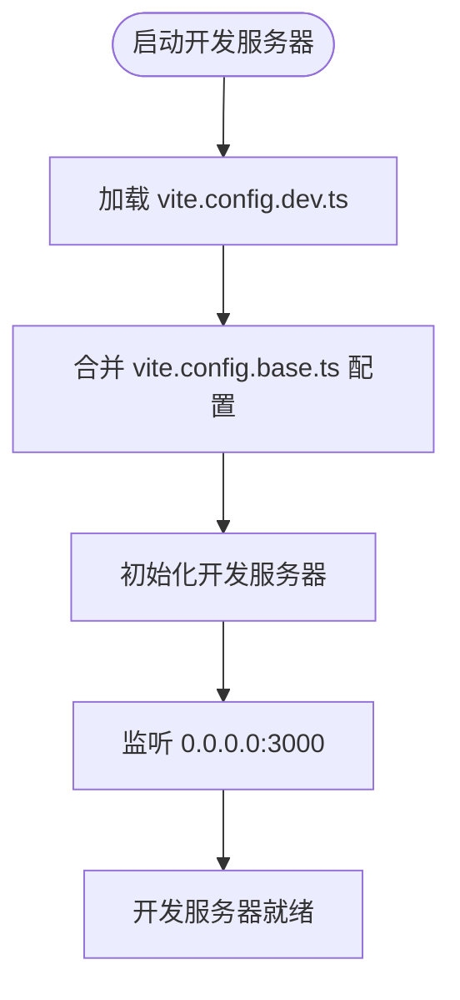
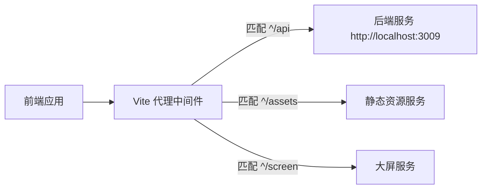

# 开发环境构建

<cite>
**本文档引用的文件**
- [vite.config.dev.ts](file://configs/vite.config.dev.ts)
- [dev.env.js](file://dev.env.js)
- [.env.development.js](file://.env.development.js)
- [vite.config.base.ts](file://configs/vite.config.base.ts)
</cite>

## 目录
1. [开发服务器配置](#开发服务器配置)
2. [代理配置与API请求转发](#代理配置与api请求转发)
3. [环境变量加载机制](#环境变量加载机制)
4. [热模块替换与源码映射](#热模块替换与源码映射)
5. [开发专用插件与优化](#开发专用插件与优化)
6. [错误提示与调试支持](#错误提示与调试支持)

## 开发服务器配置

开发环境的服务器配置在 `vite.config.dev.ts` 中定义，通过合并基础配置实现。开发服务器运行在 `3000` 端口，并监听所有网络接口（`0.0.0.0`），便于局域网内设备访问。文件系统访问权限设置为严格模式，确保安全性。

**Diagram sources**
- [vite.config.dev.ts](file://configs/vite.config.dev.ts#L1-L27)
- [vite.config.base.ts](file://configs/vite.config.base.ts#L1-L91)

**Section sources**
- [vite.config.dev.ts](file://configs/vite.config.dev.ts#L1-L27)

## 代理配置与API请求转发

开发环境中通过 `dev.env.js` 配置请求代理，将前端请求转发至后端服务。代理规则基于正则表达式匹配路径前缀，如 `/api`、`/assets` 和 `/screen`，统一转发至本地后端服务 `http://localhost:3009/`。该机制解决了开发阶段的跨域问题，并确保前端可无缝对接后端API。

代理配置的关键特性包括：
- `changeOrigin: true`：修改请求头中的 `origin` 字段，避免后端拒绝请求
- `secure: false`：允许代理 HTTPS 请求时忽略证书验证
- `rewrite`：重写请求路径，例如将 `/assets` 前缀移除后再转发

**Diagram sources**
- [dev.env.js](file://dev.env.js#L1-L26)
- [.env.development.js](file://.env.development.js#L1-L4)

**Section sources**
- [dev.env.js](file://dev.env.js#L1-L26)
- [.env.development.js](file://.env.development.js#L1-L4)

## 环境变量加载机制

开发环境变量通过 `dev.env.js` 加载，并引用 `.env.development.js` 中定义的目标地址。该机制实现了环境配置的分离，便于在不同开发环境中切换后端服务地址。例如，`DEV_PROXY_TARGET_local_server` 指向本地运行的 mock 服务或真实后端。

环境变量加载流程如下：
1. `vite.config.dev.ts` 导入 `dev.env.js`
2. `dev.env.js` 动态读取 `.env.development.js` 中的代理目标
3. 配置项注入 Vite 的 `server.proxy` 设置中

此设计支持灵活的环境切换，无需修改主配置文件。

**Section sources**
- [dev.env.js](file://dev.env.js#L1-L26)
- [.env.development.js](file://.env.development.js#L1-L4)

## 热模块替换与源码映射

Vite 原生支持热模块替换（HMR），在开发模式下修改代码后，浏览器将自动更新变更的模块，无需刷新整个页面。结合 Vue 3 的响应式系统，组件状态得以保留，极大提升开发效率。

源码映射（Source Map）由 Vite 自动生成，默认启用。开发者可在浏览器开发者工具中直接调试 `.ts` 和 `.vue` 文件，定位错误和设置断点更加直观。

**Section sources**
- [vite.config.dev.ts](file://configs/vite.config.dev.ts#L1-L27)
- [vite.config.base.ts](file://configs/vite.config.base.ts#L1-L91)

## 开发专用插件与优化

尽管 `vite.config.dev.ts` 中注释了 `vite-plugin-eslint` 插件，但其配置表明项目原本计划在开发阶段集成 ESLint 检查。该插件可实现保存时自动校验代码风格，支持 `emitWarning` 控制警告输出级别，并排除 `node_modules` 目录。

此外，基础配置中集成了以下开发优化插件：
- `unplugin-auto-import`：自动导入 Vue 和 Vue Router 的 API，减少手动引入
- `unplugin-vue-components`：按需自动注册组件，支持 Ant Design Vue 和自定义组件解析器
- `UnoCSS`：原子化 CSS 引擎，提升样式开发效率

这些插件共同构建了高效的开发体验。

**Section sources**
- [vite.config.dev.ts](file://configs/vite.config.dev.ts#L1-L27)
- [vite.config.base.ts](file://configs/vite.config.base.ts#L1-L91)

## 错误提示与调试支持

开发服务器启用了详细的日志输出，特别是针对 `/api/user` 路径的代理设置了 `logLevel: 'debug'`，可输出详细的请求和响应信息，便于排查接口问题。结合浏览器控制台和 Vite 的错误 overlay，开发者能快速定位语法错误、模块解析失败等问题。

同时，通过 `define: { 'process.env': ... }` 将环境变量注入客户端，便于在代码中进行条件调试和功能开关控制。

**Section sources**
- [vite.config.dev.ts](file://configs/vite.config.dev.ts#L1-L27)
- [vite.config.base.ts](file://configs/vite.config.base.ts#L1-L91)
- [dev.env.js](file://dev.env.js#L1-L26)