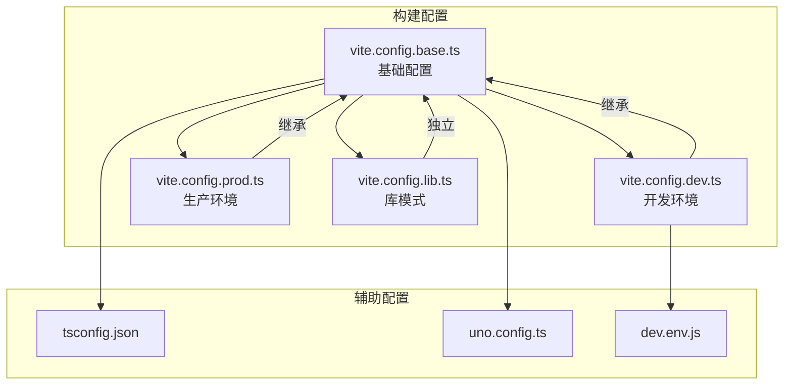
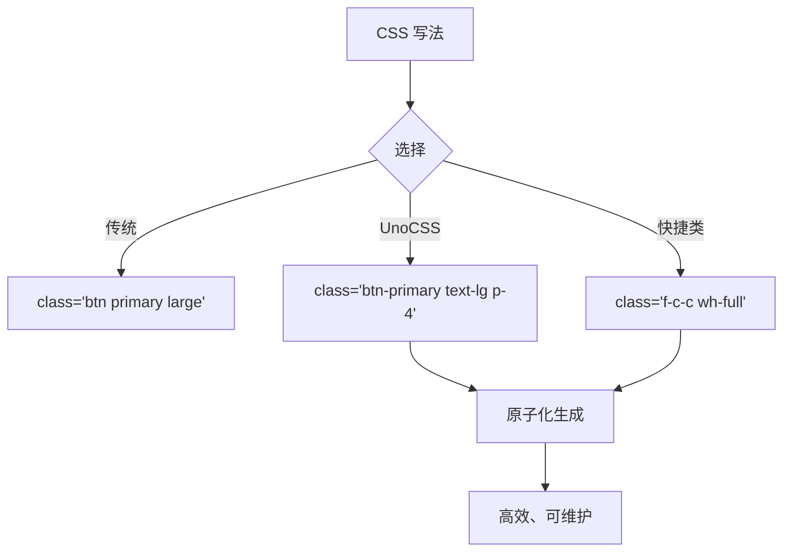

# 构建配置

<cite>
**本文档中引用的文件**  
- [vite.config.base.ts](file://configs/vite.config.base.ts)
- [vite.config.dev.ts](file://configs/vite.config.dev.ts)
- [vite.config.prod.ts](file://configs/vite.config.prod.ts)
- [vite.config.lib.ts](file://configs/vite.config.lib.ts)
- [tsconfig.json](file://tsconfig.json)
- [uno.config.ts](file://uno.config.ts)
- [dev.env.js](file://dev.env.js)
- [package.json](file://package.json)
</cite>

## 目录
1. [简介](#简介)
2. [项目结构](#项目结构)
3. [核心构建配置](#核心构建配置)
4. [多环境构建策略](#多环境构建策略)
5. [TypeScript 构建配置](#typescript-构建配置)
6. [UnoCSS 构建配置](#unocss-构建配置)
7. [自定义构建脚本与环境变量](#自定义构建脚本与环境变量)
8. [总结](#总结)

## 简介
本项目采用 Vite 作为前端构建工具，支持多环境（开发、生产、库模式）的灵活构建策略。通过模块化配置文件实现不同场景下的构建需求，结合 TypeScript、UnoCSS 等现代前端技术栈，提升开发效率与构建性能。本文档详细说明各构建配置的作用、差异及使用方式，帮助开发者理解并定制构建流程。

## 项目结构
项目构建相关配置集中于 `configs/` 目录下，采用分层设计，基础配置与环境特定配置分离，便于维护和扩展。



**图示来源**
- [vite.config.base.ts](file://configs/vite.config.base.ts#L1-L92)
- [vite.config.dev.ts](file://configs/vite.config.dev.ts#L1-L28)
- [vite.config.prod.ts](file://configs/vite.config.prod.ts#L1-L28)
- [vite.config.lib.ts](file://configs/vite.config.lib.ts#L1-L13)
- [tsconfig.json](file://tsconfig.json#L1-L32)
- [uno.config.ts](file://uno.config.ts#L1-L20)
- [dev.env.js](file://dev.env.js#L1-L27)

**本节来源**
- [configs/](file://configs/)
- [tsconfig.json](file://tsconfig.json)
- [uno.config.ts](file://uno.config.ts)

## 核心构建配置
项目采用 Vite 的模块化配置体系，将构建逻辑拆分为多个文件，提升可维护性。

### 基础配置 (vite.config.base.ts)
基础配置定义了项目通用的构建规则和插件，所有环境均继承此配置。

- **别名配置**：`@` 指向 `src/` 目录，简化模块导入
- **Vue 编译支持**：启用自定义元素编译，支持微前端标签
- **模块联邦**：通过 `@originjs/vite-plugin-federation` 实现模块共享
- **自动导入**：集成 `unplugin-auto-import` 和 `unplugin-vue-components`，实现 API 自动导入
- **UnoCSS 集成**：引入原子化 CSS 框架 UnoCSS
- **Ant Design Vue 按需加载**：通过解析器实现组件与样式的按需引入

**本节来源**
- [vite.config.base.ts](file://configs/vite.config.base.ts#L1-L92)

### 开发环境配置 (vite.config.dev.ts)
开发环境配置扩展自基础配置，专注于提升开发体验。

- **服务器配置**：
  - 监听所有网络接口（`host: '0.0.0.0'`）
  - 端口设置为 `3000`
  - 启用文件系统严格模式
- **代理设置**：通过 `dev.env.js` 加载代理规则，解决跨域问题
  - `/api`、`/assets`、`/screen` 等路径代理至本地 mock 服务
  - 支持路径重写（如 `/assets` 前缀移除）

**本节来源**
- [vite.config.dev.ts](file://configs/vite.config.dev.ts#L1-L28)
- [dev.env.js](file://dev.env.js#L1-L27)

### 生产环境配置 (vite.config.prod.ts)
生产环境配置在基础配置上增加优化策略，提升部署性能。

- **代码压缩**：使用 `vite-plugin-compression` 生成 `.gz` 压缩文件
- **图片优化**：集成 `vite-plugin-imagemin` 插件，优化图像资源
- **代码分割**：
  - 手动分块，将 `vue`、`vue-router`、`pinia` 提取为独立 chunk
  - 降低首屏加载体积
- **警告阈值**：设置 `chunkSizeWarningLimit` 为 2000KB，避免过大包

**本节来源**
- [vite.config.prod.ts](file://configs/vite.config.prod.ts#L1-L28)
- [configs/plugin/imagemin.ts](file://configs/plugin/imagemin.ts)

### 库模式配置 (vite.config.lib.ts)
库模式用于构建可复用的 JavaScript 库。

- **库构建模式**：`build.lib` 配置指定入口文件 `src/remote-lib.js`
- **输出格式**：生成 UMD 格式，兼容多种模块系统
- **命名规范**：全局变量名为 `remoteLib`
- **独立构建**：通过 `npm run build:lib` 命令单独执行

**本节来源**
- [vite.config.lib.ts](file://configs/vite.config.lib.ts#L1-L13)
- [package.json](file://package.json#L1-L159)

## 多环境构建策略
项目通过 `mergeConfig` 实现配置继承与覆盖，形成清晰的构建层次。

```mermaid
classDiagram
class BaseConfig {
+base : string
+plugins : Array
+resolve : Object
+define : Object
}
class DevConfig {
+mode : 'development'
+server : Object
}
class ProdConfig {
+mode : 'production'
+plugins : Array
+build : Object
}
class LibConfig {
+build : Object
}
DevConfig --> BaseConfig : "mergeConfig"
ProdConfig --> BaseConfig : "mergeConfig"
LibConfig --> BaseConfig : "defineConfig"
note right of DevConfig
开发环境：热重载、代理、宽松错误处理
end note
note right of ProdConfig
生产环境：压缩、分块、性能优化
end note
note right of LibConfig
库模式：UMD输出、独立入口
end note
```

**图示来源**
- [vite.config.base.ts](file://configs/vite.config.base.ts#L1-L92)
- [vite.config.dev.ts](file://configs/vite.config.dev.ts#L1-L28)
- [vite.config.prod.ts](file://configs/vite.config.prod.ts#L1-L28)
- [vite.config.lib.ts](file://configs/vite.config.lib.ts#L1-L13)

**本节来源**
- [vite.config.dev.ts](file://configs/vite.config.dev.ts#L1-L28)
- [vite.config.prod.ts](file://configs/vite.config.prod.ts#L1-L28)
- [vite.config.lib.ts](file://configs/vite.config.lib.ts#L1-L13)

## TypeScript 构建配置
`tsconfig.json` 定义了项目的 TypeScript 编译选项。

- **模块与目标**：ES2020 模块与目标，支持现代语法
- **路径映射**：`@/*` 映射到 `src/*`，支持绝对路径导入
- **Vue 支持**：允许 `.vue` 文件导入，启用 JSX 支持
- **类型检查**：启用严格模式，排除 `node_modules`
- **引用项目**：关联 `tsconfig.node.json`，区分运行时与构建时类型

**本节来源**
- [tsconfig.json](file://tsconfig.json#L1-L32)

## UnoCSS 构建配置
`uno.config.ts` 配置原子化 CSS 框架 UnoCSS。

- **预设**：
  - `presetUno`：基础原子类
  - `presetAttributify`：属性化语法支持
  - `presetRemToPx`：`rem` 转 `px`，基础字体大小为 4px
- **快捷类**：定义常用组合类，如 `f-c-c`（居中）、`wh-full`（全宽高）
- **转换器**：启用指令转换（如 `@apply`）



**图示来源**
- [uno.config.ts](file://uno.config.ts#L1-L20)

**本节来源**
- [uno.config.ts](file://uno.config.ts#L1-L20)

## 自定义构建脚本与环境变量
`package.json` 中的脚本定义了完整的构建流程。

### 构建命令
- `npm run dev`：并行启动前端与 mock 服务
- `npm run build`：生产构建 + 微前端构建
- `npm run build:lib`：独立构建库文件
- `npm run lint`：代码格式化与检查

### 环境变量
- 通过 `cross-env NODE_ENV=development` 设置环境
- `loadEnv()` 工具函数加载 `.env` 文件
- 代理目标通过 `dev.env.js` 动态配置

**本节来源**
- [package.json](file://package.json#L1-L159)
- [dev.env.js](file://dev.env.js#L1-L27)
- [configs/utils.ts](file://configs/utils.ts)

## 总结
本项目构建系统具备以下特点：

- **模块化配置**：基础 + 环境配置，易于维护
- **多环境支持**：开发、生产、库模式各司其职
- **性能优化**：压缩、分块、图片优化
- **开发体验**：热重载、代理、自动导入
- **技术先进**：TypeScript、UnoCSS、模块联邦

开发者可根据需求修改对应配置文件，或通过 npm 脚本快速执行构建任务。