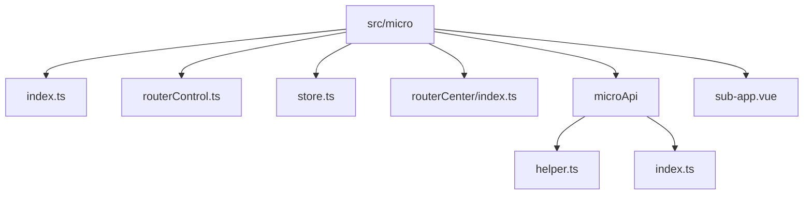
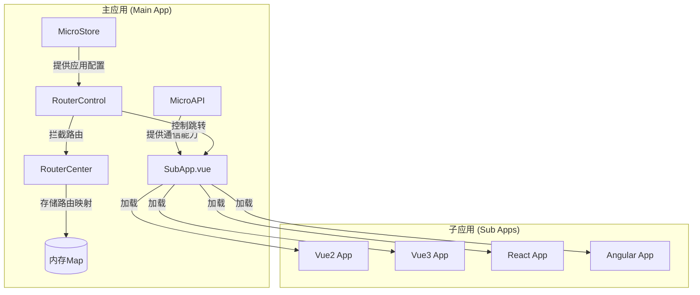
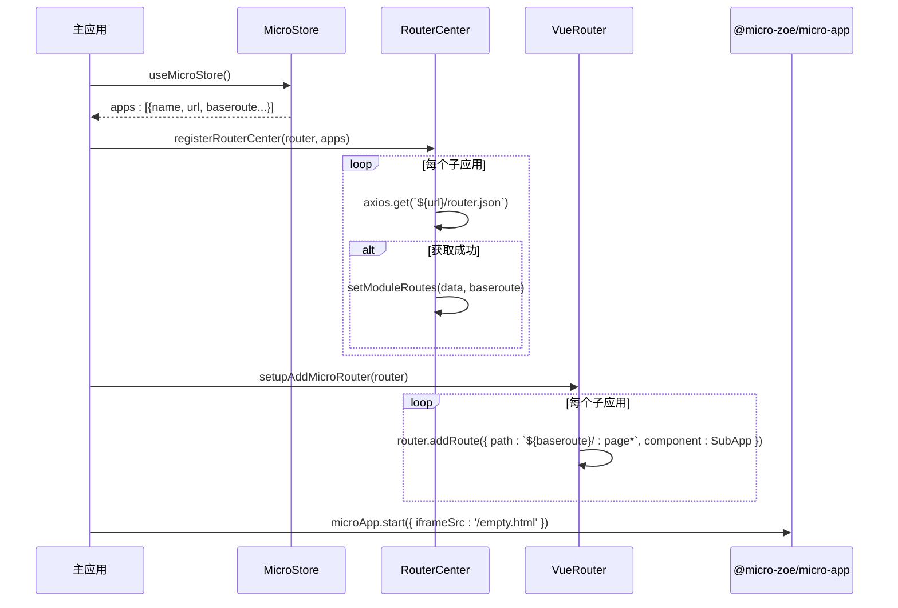
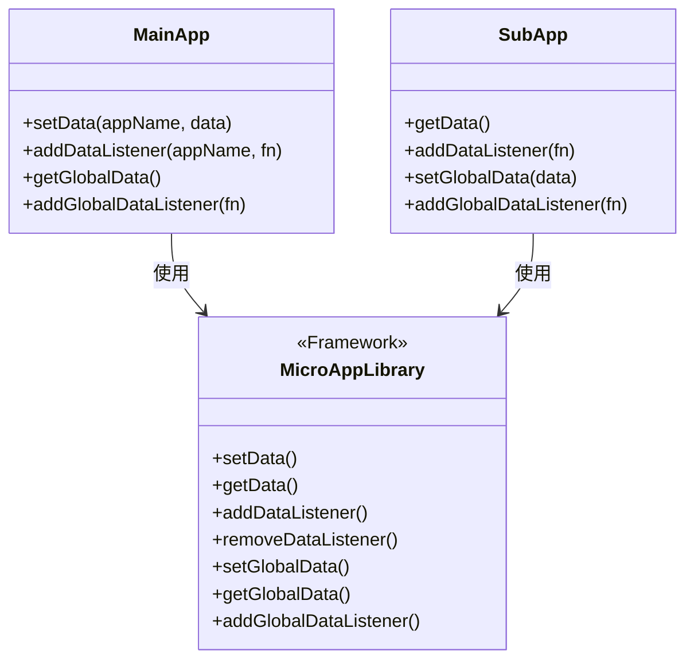

# 微前端系统

<cite>
**本文档引用的文件**  
- [index.ts](file://src/micro/index.ts)
- [routerControl.ts](file://src/micro/routerControl.ts)
- [store.ts](file://src/micro/store.ts)
- [routerCenter/index.ts](file://src/micro/routerCenter/index.ts)
- [microApi/helper.ts](file://src/micro/microApi/helper.ts)
- [sub-app.vue](file://src/micro/sub-app.vue)
- [microApi/index.ts](file://src/micro/microApi/index.ts)
- [example/child-react/src/public-path.js](file://src/micro/example/child-react/src/public-path.js)
- [example/vue3/src/public-path.js](file://src/micro/example/vue3/src/public-path.js)
</cite>

## 目录
1. [简介](#简介)
2. [项目结构](#项目结构)
3. [核心组件](#核心组件)
4. [架构概述](#架构概述)
5. [详细组件分析](#详细组件分析)
6. [依赖分析](#依赖分析)
7. [性能考虑](#性能考虑)
8. [故障排除指南](#故障排除指南)
9. [结论](#结论)

## 简介
本文档详细描述了基于 `@micro-zoe/micro-app` 的微前端系统实现，重点聚焦于 `src/micro` 模块。系统支持集成 Angular、React、Vue2 和 Vue3 等多种技术栈的子应用，通过统一的路由控制、数据通信和生命周期管理机制，实现了主应用与子应用之间的无缝协作。文档将深入解析子应用的注册与加载流程、路由拦截与集成策略、跨应用通信机制以及关键的配置文件。

## 项目结构
`src/micro` 模块是整个微前端系统的核心，其结构清晰，职责分明，实现了子应用的注册、路由管理、状态存储和通信等功能。



**图示来源**  
- [index.ts](file://src/micro/index.ts)
- [routerControl.ts](file://src/micro/routerControl.ts)
- [store.ts](file://src/micro/store.ts)
- [routerCenter/index.ts](file://src/micro/routerCenter/index.ts)
- [microApi/helper.ts](file://src/micro/microApi/helper.ts)
- [microApi/index.ts](file://src/micro/microApi/index.ts)
- [sub-app.vue](file://src/micro/sub-app.vue)

**本节来源**  
- [src/micro](file://src/micro)

## 核心组件
本系统的核心组件包括子应用注册与启动器、路由控制中心、全局状态存储、API 通信层和子应用容器组件。这些组件协同工作，确保了微前端架构的稳定运行。

**本节来源**  
- [index.ts](file://src/micro/index.ts#L1-L65)
- [routerControl.ts](file://src/micro/routerControl.ts#L1-L141)
- [store.ts](file://src/micro/store.ts#L1-L45)
- [routerCenter/index.ts](file://src/micro/routerCenter/index.ts#L1-L221)

## 架构概述
该微前端系统采用主从式架构，主应用负责全局路由、状态管理和子应用的生命周期控制，而各个子应用则作为独立的模块被加载和运行。



**图示来源**  
- [index.ts](file://src/micro/index.ts#L1-L65)
- [routerControl.ts](file://src/micro/routerControl.ts#L1-L141)
- [store.ts](file://src/micro/store.ts#L1-L45)
- [routerCenter/index.ts](file://src/micro/routerCenter/index.ts#L1-L221)
- [sub-app.vue](file://src/micro/sub-app.vue#L1-L87)

## 详细组件分析

### 子应用注册与启动流程分析
系统通过 `startMicro` 函数初始化微前端环境。该函数首先从 `store` 中获取所有子应用的配置，然后调用 `registerRouterCenter` 获取每个子应用的路由信息并注册到 `RouterCenter`，最后调用 `setupAddMicroRouter` 在主应用的 Vue Router 中动态添加子应用的路由。



**图示来源**  
- [index.ts](file://src/micro/index.ts#L1-L65)
- [routerCenter/index.ts](file://src/micro/routerCenter/index.ts#L1-L221)
- [routerControl.ts](file://src/micro/routerControl.ts#L1-L141)

**本节来源**  
- [index.ts](file://src/micro/index.ts#L1-L65)
- [routerCenter/index.ts](file://src/micro/routerCenter/index.ts#L1-L221)

### 路由拦截与集成策略分析
`routerControl.ts` 文件实现了核心的路由拦截机制。它通过 `setupMicroRouterGuards` 函数设置了两个路由守卫：一个用于监听子应用内部的路由变化，另一个用于监听主应用的路由变化。

当用户访问主应用的某个路径时，`decorateLocationPath` 函数会解析该路径，判断其是否属于某个子应用（通过 `routeCenter.get` 查询）。如果是，则将路由重定向到对应的子应用容器组件 `SubApp.vue`，并传递正确的 `path` 和 `module` 信息。

```mermaid
flowchart TD
A[主应用路由变化] --> B{路径是否匹配子应用?}
B --> |是| C[解析出 module 和 path]
C --> D[设置 customPath 映射]
D --> E[重定向到 /{module}/...]
E --> F[SubApp.vue 加载对应子应用]
B --> |否| G[正常处理主应用路由]
```

**图示来源**  
- [routerControl.ts](file://src/micro/routerControl.ts#L1-L141)
- [microApi/helper.ts](file://src/micro/microApi/helper.ts#L1-L185)

**本节来源**  
- [routerControl.ts](file://src/micro/routerControl.ts#L1-L141)
- [microApi/helper.ts](file://src/micro/microApi/helper.ts#L1-L185)

### 主子应用通信机制分析
系统通过 `microApp` 提供的 API 实现主子应用间的双向通信。在 `sub-app.vue` 中，主应用通过 `data` 属性向子应用传递全局数据（如语言、主题、token 和 `pushState` 函数）。子应用可以通过 `window.microApp.getData()` 获取这些数据。

同时，主应用也可以通过 `microApp.setData()` 向特定子应用发送数据，子应用通过 `window.microApp.addDataListener()` 监听来接收。此外，还支持全局数据的监听与分发。



**图示来源**  
- [sub-app.vue](file://src/micro/sub-app.vue#L1-L87)
- [microApi/index.ts](file://src/micro/microApi/index.ts#L1-L136)

**本节来源**  
- [sub-app.vue](file://src/micro/sub-app.vue#L1-L87)
- [microApi/index.ts](file://src/micro/microApi/index.ts#L1-L136)

### 子应用集成配置分析
子应用的集成需要特定的配置文件。对于使用 Webpack 的 React 应用，需要在 `public-path.js` 中动态设置 `__webpack_public_path__`，以确保资源能从正确的基础路径加载。

```javascript
// example/child-react/src/public-path.js
if (window.__MICRO_APP_ENVIRONMENT__) {
  __webpack_public_path__ = window.__MICRO_APP_PUBLIC_PATH__
}
```

而对于使用 Vite 的 Vue3 应用，其 `public-path.js` 则通过劫持 `import` 语句来实现类似功能。

```javascript
// example/vue3/src/public-path.js
if (window.__MICRO_APP_ENVIRONMENT__) {
  // @ts-ignore
  __SYSTEMJS_IMPORTED_URI__ = window.__MICRO_APP_PUBLIC_PATH__
}
```

**本节来源**  
- [example/child-react/src/public-path.js](file://src/micro/example/child-react/src/public-path.js)
- [example/vue3/src/public-path.js](file://src/micro/example/vue3/src/public-path.js)

## 依赖分析
系统依赖于 `@micro-zoe/micro-app` 作为核心框架，利用其提供的沙箱隔离、资源预加载和路由代理能力。主应用通过 Pinia 进行状态管理，并与 Vue Router 深度集成以实现路由控制。

```mermaid
graph LR
A[主应用] --> B[@micro-zoe/micro-app]
A --> C[Pinia]
A --> D[Vue Router]
B --> E[iframe]
B --> F[JavaScript 沙箱]
B --> G[样式隔离]
```

**图示来源**  
- [index.ts](file://src/micro/index.ts#L1-L65)
- [store.ts](file://src/micro/store.ts#L1-L45)
- [routerControl.ts](file://src/micro/routerControl.ts#L1-L141)

**本节来源**  
- [index.ts](file://src/micro/index.ts#L1-L65)
- [store.ts](file://src/micro/store.ts#L1-L45)
- [routerControl.ts](file://src/micro/routerControl.ts#L1-L141)

## 性能考虑
系统在启动时会预加载所有子应用的 `router.json` 文件，以获取其路由配置，这避免了用户首次访问子应用时的延迟。同时，`@micro-zoe/micro-app` 支持显式的预加载功能（`microApp.preFetch`），可以进一步优化用户体验。子应用在非激活状态下会被隐藏，但其状态得以保留，实现了类似 `keep-alive` 的效果。

## 故障排除指南
- **子应用无法加载**：检查子应用的 `url` 配置是否正确，确保 `router.json` 文件可访问。
- **路由跳转失败**：确认子应用的 `baseroute` 配置与主应用的路由规则匹配。
- **样式污染**：确保子应用在 `iframe` 模式下运行，或检查是否正确启用了 `@micro-zoe/micro-app` 的样式隔离功能。
- **通信失败**：检查主应用是否正确调用了 `setData`，子应用是否正确设置了 `addDataListener`。

**本节来源**  
- [index.ts](file://src/micro/index.ts#L1-L65)
- [routerControl.ts](file://src/micro/routerControl.ts#L1-L141)
- [sub-app.vue](file://src/micro/sub-app.vue#L1-L87)

## 结论
该微前端系统设计精巧，通过 `@micro-zoe/micro-app` 框架有效地解决了多技术栈集成、路由管理、状态隔离和跨应用通信等复杂问题。其模块化的代码结构和清晰的职责划分，使得系统易于维护和扩展。通过深入理解 `src/micro` 模块的实现，开发者可以高效地集成和管理各类子应用，构建出灵活、可扩展的大型前端应用。