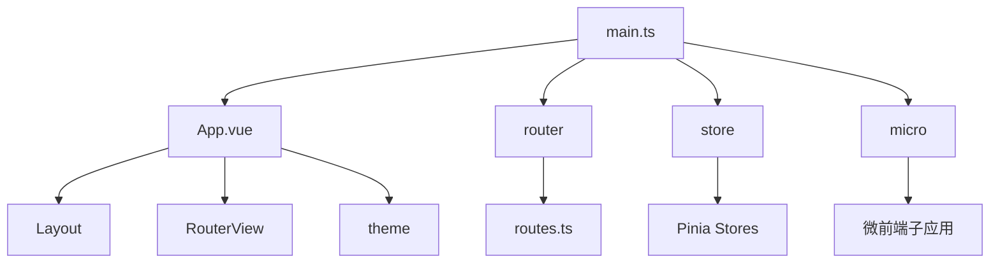
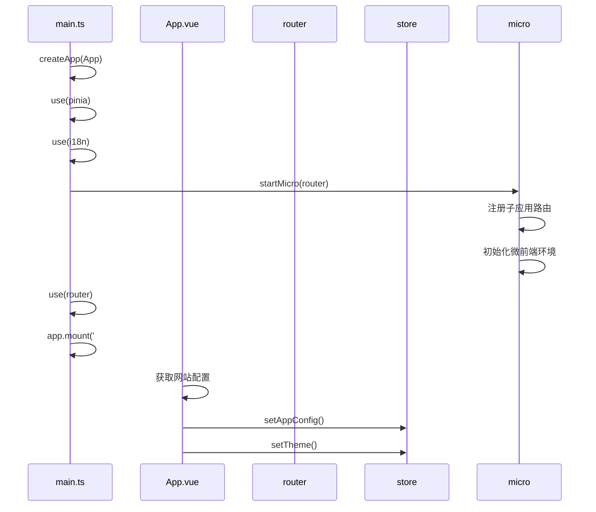
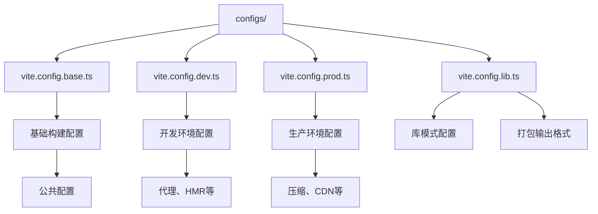
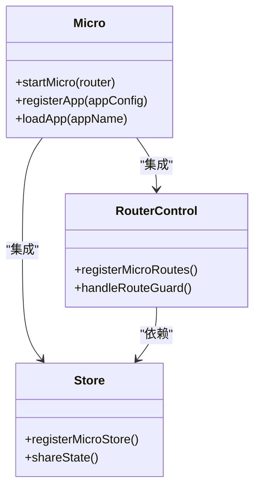
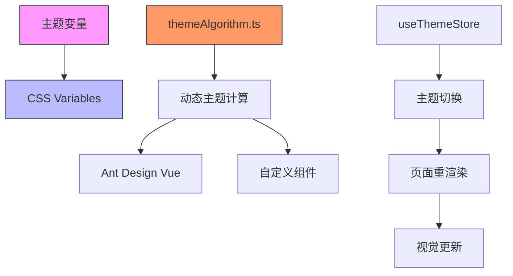
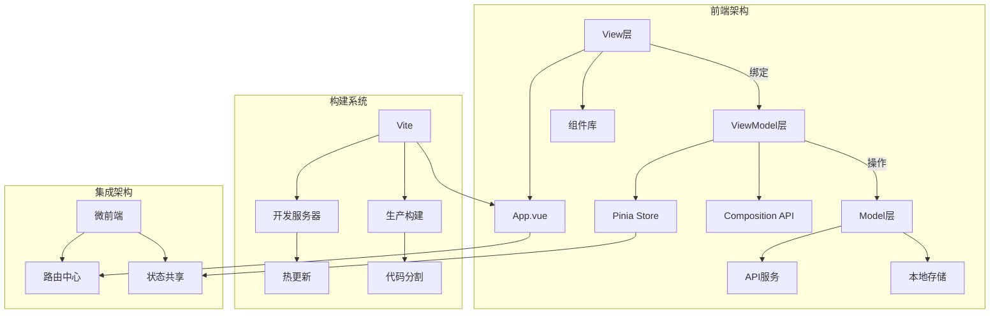

# 架构设计

<cite>
**本文档引用文件**  
- [main.ts](file://src/main.ts)
- [App.vue](file://src/App.vue)
- [router/index.ts](file://src/router/index.ts)
- [router/routes.ts](file://src/router/routes.ts)
- [store/index.ts](file://src/store/index.ts)
- [micro/index.ts](file://src/micro/index.ts)
- [micro/store.ts](file://src/micro/store.ts)
- [micro/routerControl.ts](file://src/micro/routerControl.ts)
- [configs/vite.config.base.ts](file://configs/vite.config.base.ts)
- [configs/vite.config.dev.ts](file://configs/vite.config.dev.ts)
- [configs/vite.config.prod.ts](file://configs/vite.config.prod.ts)
- [theme/themeAlgorithm.ts](file://src/theme/themeAlgorithm.ts)
</cite>

## 目录
1. [项目结构概览](#项目结构概览)
2. [MVVM架构风格与模块化设计](#mvvm架构风格与模块化设计)
3. [核心组件依赖关系与交互流程](#核心组件依赖关系与交互流程)
4. [Vite模块化构建机制](#vite模块化构建机制)
5. [多环境配置系统](#多环境配置系统)
6. [四大核心模块集成方式](#四大核心模块集成方式)
7. [架构图示](#架构图示)

## 项目结构概览

本项目采用清晰的模块化结构，主要分为以下几个核心目录：

- `src/`：源码主目录，包含应用核心逻辑
- `configs/`：构建配置文件，支持多环境差异化配置
- `public/`：静态资源目录
- `das-components-folder/`：第三方组件文档
- `micro/`：微前端模块实现

项目遵循Vue 3 + TypeScript + Vite技术栈，采用Pinia进行状态管理，Vue Router进行路由控制，并通过微前端架构实现多应用集成。

**Section sources**
- [main.ts](file://src/main.ts)
- [App.vue](file://src/App.vue)

## MVVM架构风格与模块化设计

项目采用标准的MVVM（Model-View-ViewModel）架构模式：

- **View层**：由`.vue`单文件组件构成，负责UI渲染与用户交互
- **ViewModel层**：通过`<script setup>`语法糖实现，集成Pinia Store与Composition API
- **Model层**：由API服务、状态管理Store和业务逻辑构成

模块化设计原则体现在：
1. 功能模块按业务域划分（如`uedModule`）
2. 路由、状态、主题等基础设施独立封装
3. 微前端架构实现应用级模块解耦
4. 配置文件分层管理，支持环境差异化

**Section sources**
- [main.ts](file://src/main.ts)
- [App.vue](file://src/App.vue)
- [store/index.ts](file://src/store/index.ts)

## 核心组件依赖关系与交互流程

### 组件依赖关系

### 应用初始化流程

**Diagram sources**
- [main.ts](file://src/main.ts#L1-L37)
- [App.vue](file://src/App.vue#L1-L73)

**Section sources**
- [main.ts](file://src/main.ts)
- [App.vue](file://src/App.vue)
- [router/index.ts](file://src/router/index.ts)
- [store/index.ts](file://src/store/index.ts)
- [micro/index.ts](file://src/micro/index.ts)

## Vite模块化构建机制

项目基于Vite实现高效模块化构建，核心机制包括：

1. **ESBuild预构建**：依赖预编译提升开发服务器启动速度
2. **原生ESM支持**：开发环境直接使用浏览器原生ES模块
3. **按需加载**：路由级代码分割，实现懒加载
4. **HMR优化**：精准的模块热更新

构建配置通过`configs/`目录下的文件实现分层管理：
- `vite.config.base.ts`：基础配置
- `vite.config.dev.ts`：开发环境配置
- `vite.config.prod.ts`：生产环境配置
- `vite.config.lib.ts`：库模式配置

**Section sources**
- [configs/vite.config.base.ts](file://configs/vite.config.base.ts)
- [configs/vite.config.dev.ts](file://configs/vite.config.dev.ts)
- [configs/vite.config.prod.ts](file://configs/vite.config.prod.ts)

## 多环境配置系统

项目通过多环境配置文件实现差异化部署：

### 配置文件结构

### 环境变量注入
通过`process.env`注入关键配置：
- `BASE_PATH`：应用基础路径
- `HISTORY_TYPE`：路由历史模式（hash/history）
- 环境特定API地址

配置继承关系：基础配置 → 环境特定配置（覆盖/扩展）

**Diagram sources**
- [configs/vite.config.base.ts](file://configs/vite.config.base.ts)
- [configs/vite.config.dev.ts](file://configs/vite.config.dev.ts)
- [configs/vite.config.prod.ts](file://configs/vite.config.prod.ts)

**Section sources**
- [configs/vite.config.base.ts](file://configs/vite.config.base.ts)
- [configs/vite.config.dev.ts](file://configs/vite.config.dev.ts)
- [configs/vite.config.prod.ts](file://configs/vite.config.prod.ts)

## 四大核心模块集成方式

### 微前端模块

**Diagram sources**
- [micro/index.ts](file://src/micro/index.ts)
- [micro/routerControl.ts](file://src/micro/routerControl.ts)
- [micro/store.ts](file://src/micro/store.ts)

### 状态管理模块
基于Pinia实现模块化状态管理：
- `app`：应用全局配置
- `user`：用户信息
- `theme`：主题配置
- `login`：登录状态
- `menus`：菜单权限

通过`storeToRefs`实现响应式解构，支持持久化存储。

**Section sources**
- [store/index.ts](file://src/store/index.ts)
- [store/uedModule/app/types.ts](file://src/store/uedModule/app/types.ts)

### 路由系统
采用Vue Router 4实现：
- 哈希/历史模式可配置
- 路由权限守卫（`guard.ts`）
- 动态路由扁平化处理
- 白名单路由机制

路由数据驱动菜单渲染与权限控制。

**Section sources**
- [router/index.ts](file://src/router/index.ts)
- [router/routes.ts](file://src/router/routes.ts)
- [router/guard.ts](file://src/router/guard.ts)

### 主题系统

通过CSS变量实现主题切换，结合`themeAlgorithm.ts`进行主题色衍生计算，支持暗色模式。

**Diagram sources**
- [theme/themeAlgorithm.ts](file://src/theme/themeAlgorithm.ts)
- [App.vue](file://src/App.vue#L1-L73)

**Section sources**
- [theme/themeAlgorithm.ts](file://src/theme/themeAlgorithm.ts)
- [App.vue](file://src/App.vue)

## 架构图示

### 整体架构图

**Diagram sources**
- [main.ts](file://src/main.ts)
- [App.vue](file://src/App.vue)
- [router/index.ts](file://src/router/index.ts)
- [store/index.ts](file://src/store/index.ts)