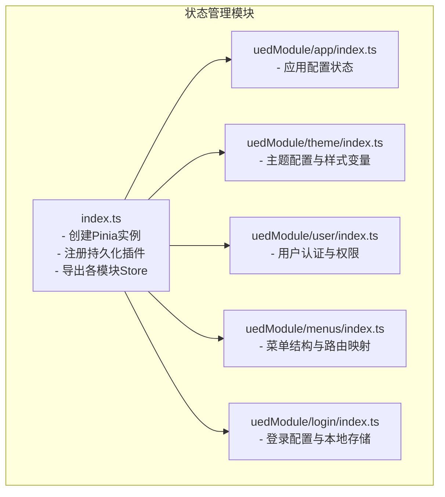
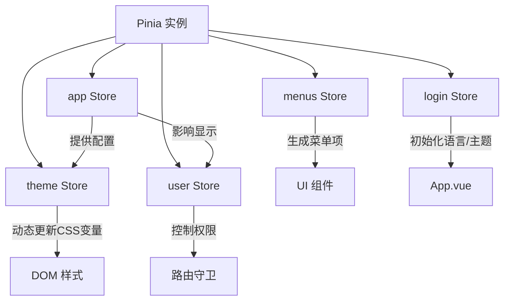
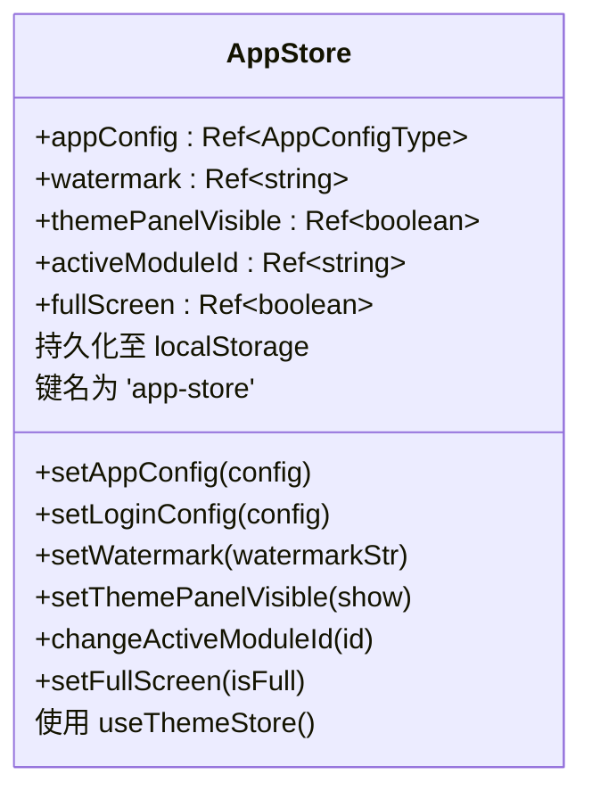
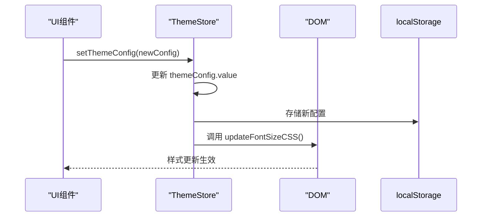
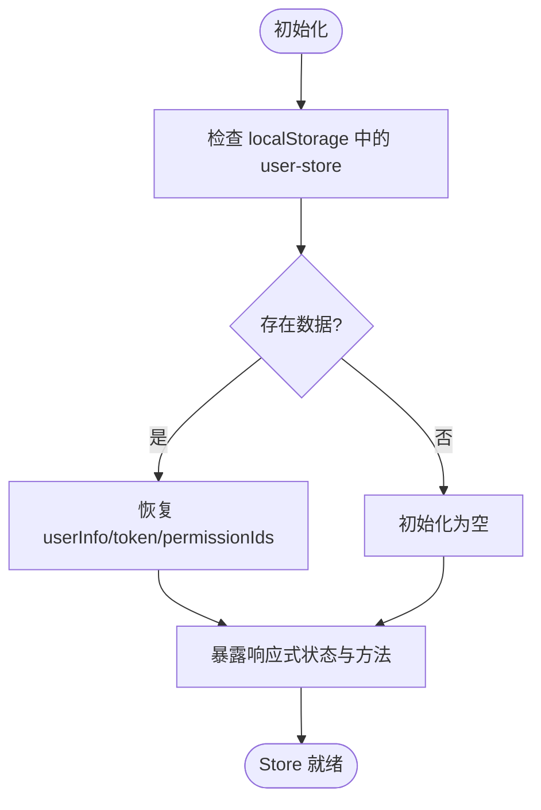
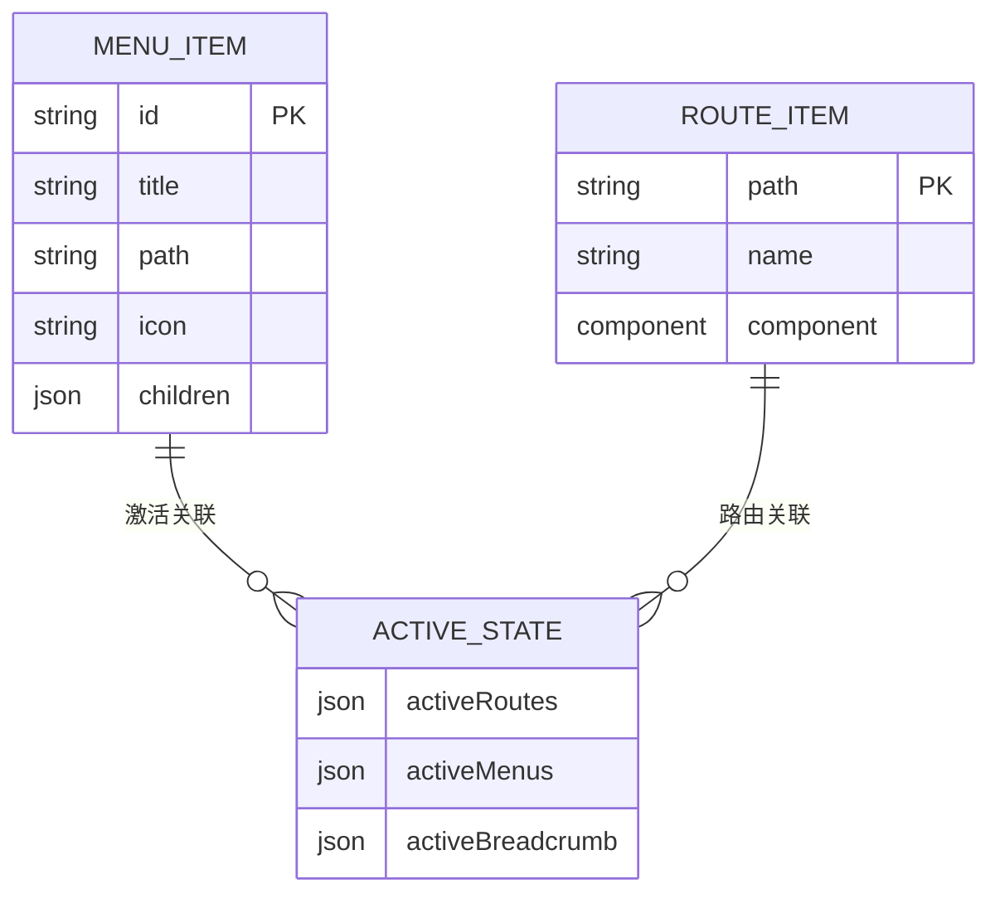
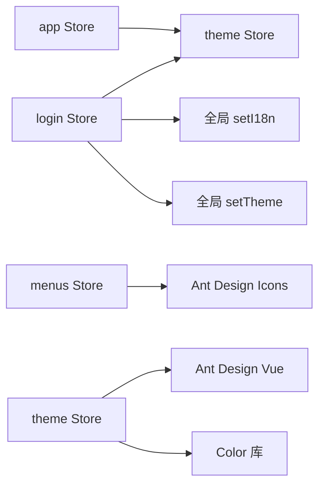

# 状态管理

<cite>
**本文档中引用的文件**  
- [index.ts](file://src/store/index.ts)
- [app/index.ts](file://src/store/uedModule/app/index.ts)
- [theme/index.ts](file://src/store/uedModule/theme/index.ts)
- [user/index.ts](file://src/store/uedModule/user/index.ts)
- [menus/index.ts](file://src/store/uedModule/menus/index.ts)
- [login/index.ts](file://src/store/uedModule/login/index.ts)
</cite>

## 目录
1. [项目结构](#项目结构)
2. [核心组件](#核心组件)
3. [架构概述](#架构概述)
4. [详细组件分析](#详细组件分析)
5. [依赖分析](#依赖分析)
6. [性能考虑](#性能考虑)
7. [故障排除指南](#故障排除指南)
8. [结论](#结论)

## 项目结构

项目中的状态管理模块位于 `src/store` 目录下，采用模块化设计，基于 Pinia 实现。主入口文件为 `index.ts`，负责初始化 Pinia 实例并注册持久化插件。各功能模块（如 app、theme、user、menus、login）分别封装在 `uedModule` 子目录中，每个模块独立定义其状态、动作和持久化策略。



**图示来源**
- [index.ts](file://src/store/index.ts#L1-L13)
- [app/index.ts](file://src/store/uedModule/app/index.ts#L1-L80)
- [theme/index.ts](file://src/store/uedModule/theme/index.ts#L1-L158)
- [user/index.ts](file://src/store/uedModule/user/index.ts#L1-L62)
- [menus/index.ts](file://src/store/uedModule/menus/index.ts#L1-L138)
- [login/index.ts](file://src/store/uedModule/login/index.ts#L1-L57)

**章节来源**
- [index.ts](file://src/store/index.ts#L1-L13)

## 核心组件

本项目使用 Pinia 作为状态管理工具，通过模块化方式组织不同功能域的状态。`store/index.ts` 是整个状态管理系统的入口，负责创建 Pinia 实例并应用 `pinia-plugin-persistedstate` 插件以实现状态持久化。各模块通过 `defineStore` 定义，支持类型推导和组合式 API 风格的逻辑组织。

**章节来源**
- [index.ts](file://src/store/index.ts#L1-L13)
- [app/index.ts](file://src/store/uedModule/app/index.ts#L1-L80)

## 架构概述

系统采用分层的模块化状态架构，每个 Store 模块职责清晰，彼此解耦。`app` 模块管理全局应用配置；`theme` 模块控制界面主题与样式变量；`user` 模块维护用户会话信息；`menus` 模块处理导航菜单结构与激活状态；`login` 模块保存登录页个性化设置。所有模块均可通过 `persist` 配置实现本地存储持久化。



**图示来源**
- [index.ts](file://src/store/index.ts#L1-L13)
- [app/index.ts](file://src/store/uedModule/app/index.ts#L1-L80)
- [theme/index.ts](file://src/store/uedModule/theme/index.ts#L1-L158)
- [user/index.ts](file://src/store/uedModule/user/index.ts#L1-L62)
- [menus/index.ts](file://src/store/uedModule/menus/index.ts#L1-L138)
- [login/index.ts](file://src/store/uedModule/login/index.ts#L1-L57)

## 详细组件分析

### app 模块分析

`app` 模块负责管理应用级别的全局配置，包括水印、全屏状态、主题面板可见性等。它依赖于 `theme` 模块来同步登录模式变更，并通过 `defaultConfig` 提供默认配置值。状态通过 `ref` 响应式包装，所有修改方法均封装在 Store 内部。



**图示来源**
- [app/index.ts](file://src/store/uedModule/app/index.ts#L1-L80)

**章节来源**
- [app/index.ts](file://src/store/uedModule/app/index.ts#L1-L80)

### theme 模块分析

`theme` 模块实现动态主题切换功能，支持明暗模式、主色调和字体大小的实时调整。通过 `computed` 计算属性生成 Ant Design Vue 所需的主题 token，并监听配置变化自动更新 CSS 变量。主题配置持久化至 `localStorage` 中的 `ZQTHEMECONFIG` 键。



**图示来源**
- [theme/index.ts](file://src/store/uedModule/theme/index.ts#L1-L158)

**章节来源**
- [theme/index.ts](file://src/store/uedModule/theme/index.ts#L1-L158)

### user 模块分析

`user` 模块管理用户认证状态，包括 token、权限 ID 列表和用户信息对象。使用 `reactive` 包装复杂对象，提供 `reset` 方法重置状态。在初始化时尝试从 `localStorage` 恢复状态，确保页面刷新后仍保持登录状态。



**图示来源**
- [user/index.ts](file://src/store/uedModule/user/index.ts#L1-L62)

**章节来源**
- [user/index.ts](file://src/store/uedModule/user/index.ts#L1-L62)

### menus 模块分析

`menus` 模块处理复杂的菜单结构与路由关系。将原始菜单数据转换为 Ant Design Vue 所需的 `MenuProps['items']` 格式，并构建路径映射表用于面包屑生成。`activeRoutes` 与 `activeMenus` 联动计算当前激活的菜单层级和导航路径。



**图示来源**
- [menus/index.ts](file://src/store/uedModule/menus/index.ts#L1-L138)

**章节来源**
- [menus/index.ts](file://src/store/uedModule/menus/index.ts#L1-L138)

### login 模块分析

`login` 模块专门管理登录页面的个性化配置，如语言和主题模式。配置变更时不仅保存到本地存储，还会调用外部函数 `setI18n` 和 `setTheme` 同步更新全局状态。该模块展示了 Store 如何与外部系统集成。

```mermaid
classDiagram
class LoginStore {
-name : string
+loginConfig : Ref~LoginConfigDTO~
+get(filed)
+reset()
+set(config)
}
LoginStore -->|持久化| localStorage : 键名为 'login-store'
LoginStore -->|初始化时调用| setI18n()
LoginStore -->|初始化时调用| setTheme()
LoginStore -->|set时调用| setI18n()
LoginStore -->|set时调用| setTheme()
```

**图示来源**
- [login/index.ts](file://src/store/uedModule/login/index.ts#L1-L57)

**章节来源**
- [login/index.ts](file://src/store/uedModule/login/index.ts#L1-L57)

## 依赖分析

各 Store 模块之间存在明确的依赖关系。`app` 模块依赖 `theme` 模块以同步主题配置；`login` 模块在初始化和更新时调用全局函数影响 `theme` 和国际化设置。模块间通过导入对应的 `useXXXStore` 函数建立依赖，避免了循环引用。



**图示来源**
- [app/index.ts](file://src/store/uedModule/app/index.ts#L1-L80)
- [theme/index.ts](file://src/store/uedModule/theme/index.ts#L1-L158)
- [login/index.ts](file://src/store/uedModule/login/index.ts#L1-L57)
- [menus/index.ts](file://src/store/uedModule/menus/index.ts#L1-L138)

**章节来源**
- [app/index.ts](file://src/store/uedModule/app/index.ts#L1-L80)
- [theme/index.ts](file://src/store/uedModule/theme/index.ts#L1-L158)
- [login/index.ts](file://src/store/uedModule/login/index.ts#L1-L57)
- [menus/index.ts](file://src/store/uedModule/menus/index.ts#L1-L138)

## 性能考虑

状态管理设计充分考虑性能优化：
- 使用 `computed` 缓存派生状态（如 `theme`、`siderMenus`），避免重复计算。
- 通过 `watch` 的 `deep: true` 选项精确控制持久化时机，减少不必要的存储操作。
- 菜单数据采用 Map 结构建立路径索引，提升查找效率。
- 字体大小等样式变更通过 CSS 变量批量更新，减少 DOM 操作开销。

## 故障排除指南

- **状态未持久化**：检查 `persist` 配置中的 `key` 是否唯一，确认 `localStorage` 是否被禁用。
- **主题未生效**：确保 `theme` 计算属性被正确注入到 Ant Design Vue 的 `config-provider` 中。
- **菜单映射错误**：验证原始菜单数据的 `path` 字段是否唯一且与路由匹配。
- **登录配置不同步**：确认 `setI18n` 和 `setTheme` 全局函数已正确引入并可用。

**章节来源**
- [app/index.ts](file://src/store/uedModule/app/index.ts#L1-L80)
- [theme/index.ts](file://src/store/uedModule/theme/index.ts#L1-L158)
- [user/index.ts](file://src/store/uedModule/user/index.ts#L1-L62)
- [menus/index.ts](file://src/store/uedModule/menus/index.ts#L1-L138)
- [login/index.ts](file://src/store/uedModule/login/index.ts#L1-L57)

## 结论

本项目基于 Pinia 构建了模块化、可维护的状态管理系统。通过清晰的职责划分、合理的持久化策略和高效的依赖管理，实现了复杂前端应用的状态集中控制。各模块设计充分考虑了可扩展性和性能，为后续功能迭代提供了坚实基础。