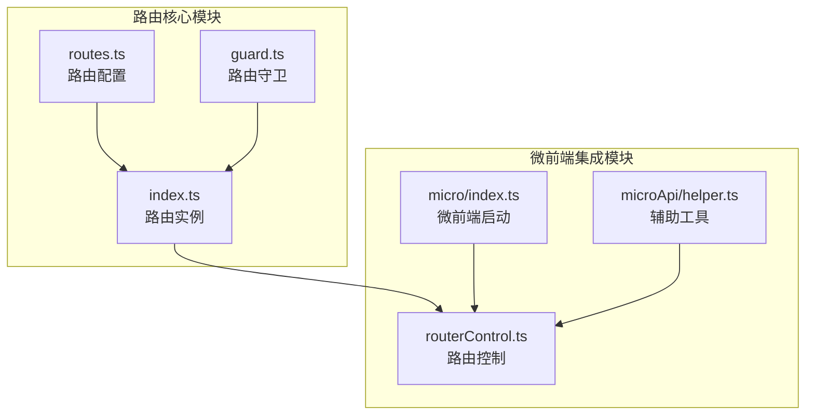
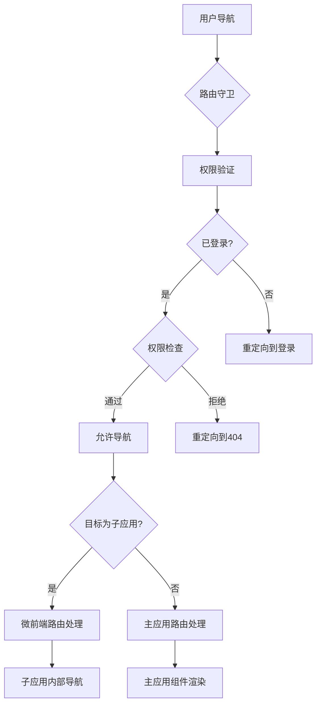
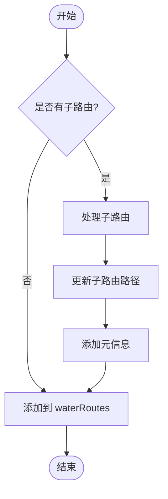
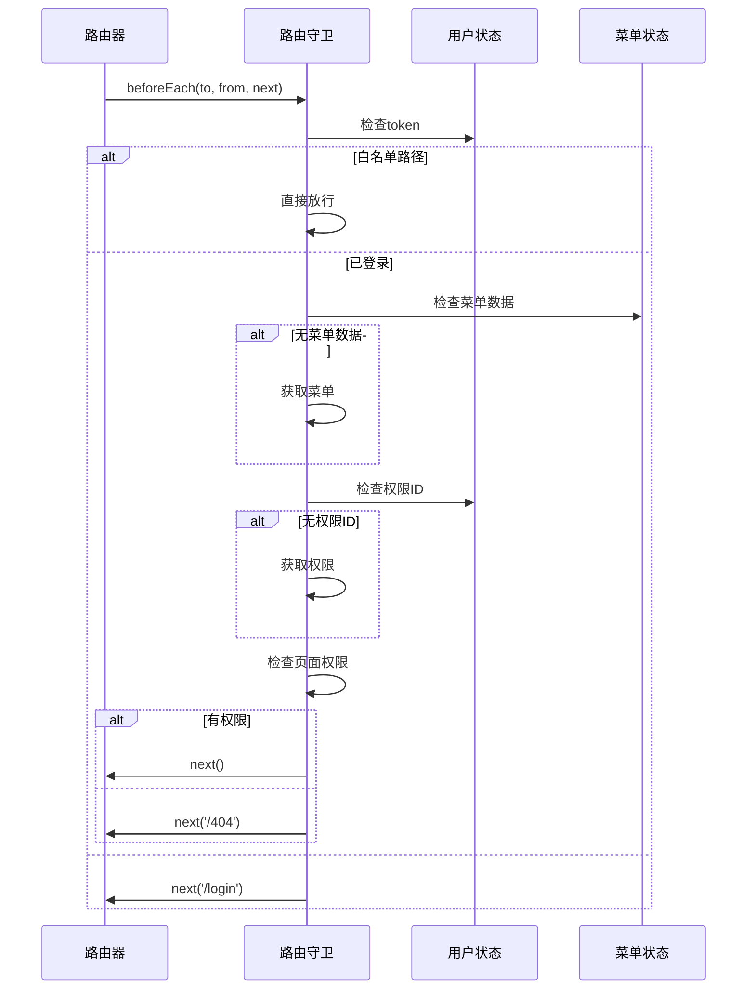
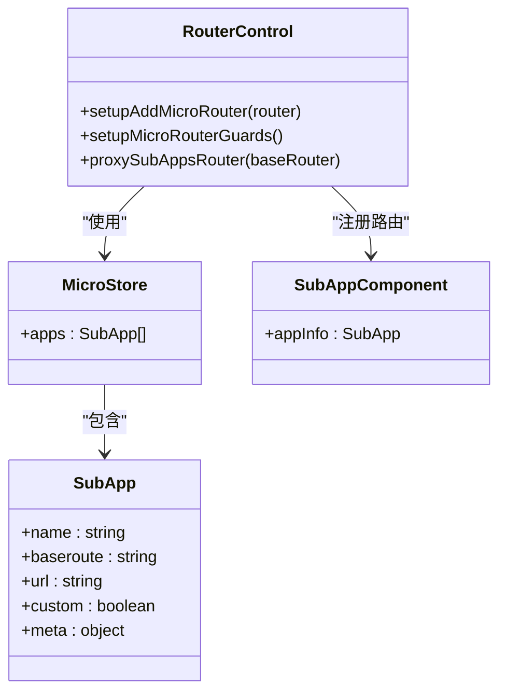
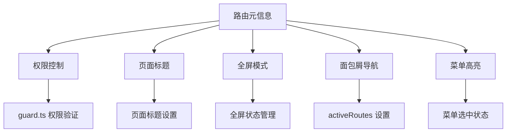

# 路由系统

<cite>
**本文档引用的文件**
- [routes.ts](file://src/router/routes.ts)
- [guard.ts](file://src/router/guard.ts)
- [index.ts](file://src/router/index.ts)
- [micro/index.ts](file://src/micro/index.ts)
- [routerControl.ts](file://src/micro/routerControl.ts)
- [helper.ts](file://src/micro/microApi/helper.ts)
</cite>

## 目录
1. [简介](#简介)
2. [项目结构](#项目结构)
3. [核心组件](#核心组件)
4. [架构概述](#架构概述)
5. [详细组件分析](#详细组件分析)
6. [依赖分析](#依赖分析)
7. [性能考虑](#性能考虑)
8. [故障排除指南](#故障排除指南)
9. [结论](#结论)

## 简介
本文档全面介绍 Vue 项目中的路由系统设计与实现。重点阐述基于 Vue Router 的扁平化路由配置、动态注册机制、路由守卫实现、微前端集成方案以及权限控制体系。文档深入分析了主应用与微前端子应用的路由协同机制，包括路径映射、前缀处理和跨应用跳转逻辑。同时说明了路由元信息在页面配置和权限验证中的关键作用。

## 项目结构
路由系统主要由 `src/router` 目录下的核心文件和 `src/micro` 目录下的微前端相关模块构成。`src/router` 包含路由定义、守卫逻辑和路由实例创建，而 `src/micro` 负责微前端子应用的路由集成与控制。



**图示来源**
- [routes.ts](file://src/router/routes.ts#L1-L288)
- [guard.ts](file://src/router/guard.ts#L1-L66)
- [index.ts](file://src/router/index.ts#L1-L53)
- [micro/index.ts](file://src/micro/index.ts#L1-L66)
- [routerControl.ts](file://src/micro/routerControl.ts#L1-L142)
- [helper.ts](file://src/micro/microApi/helper.ts#L1-L186)

**本节来源**
- [src/router](file://src/router)
- [src/micro](file://src/micro)

## 核心组件
路由系统的核心组件包括：扁平化路由配置、全局路由守卫、微前端路由集成和动态路由注册机制。系统通过 `routes.ts` 定义所有静态路由，利用 `guard.ts` 实现权限验证和登录控制，并通过 `index.ts` 中的 `routeToArr` 函数将嵌套路由转换为扁平结构。微前端子应用的路由通过 `routerControl.ts` 动态添加，并与主应用路由进行协同管理。

**本节来源**
- [routes.ts](file://src/router/routes.ts#L1-L288)
- [guard.ts](file://src/router/guard.ts#L1-L66)
- [index.ts](file://src/router/index.ts#L1-L53)
- [routerControl.ts](file://src/micro/routerControl.ts#L1-L142)

## 架构概述
系统采用主从式路由架构，主应用负责全局路由管理和权限控制，微前端子应用通过注册机制接入主路由系统。路由守卫在导航前进行权限验证，确保用户只能访问授权页面。微前端路由通过动态注册和路径映射实现无缝集成，支持跨应用跳转和状态同步。



**图示来源**
- [guard.ts](file://src/router/guard.ts#L1-L66)
- [index.ts](file://src/router/index.ts#L1-L53)
- [routerControl.ts](file://src/micro/routerControl.ts#L1-L142)

## 详细组件分析

### 扁平化路由设计
系统采用扁平化路由设计，将多层嵌套路由转换为平级路由结构，便于权限管理和路径匹配。通过 `routeToArr` 函数递归处理路由树，为每个路由节点生成完整的路径并保留父级路由信息。

#### 路由扁平化流程


**图示来源**
- [index.ts](file://src/router/index.ts#L25-L45)

**本节来源**
- [index.ts](file://src/router/index.ts#L25-L45)

### 路由守卫实现
路由守卫系统实现了完整的权限验证流程，包括登录状态检查、菜单权限获取和页面访问控制。守卫逻辑在每次路由跳转前执行，确保系统安全。

#### 全局前置守卫流程


**图示来源**
- [guard.ts](file://src/router/guard.ts#L10-L60)

**本节来源**
- [guard.ts](file://src/router/guard.ts#L1-L66)

### 微前端路由集成
微前端子应用通过动态路由注册机制集成到主应用路由系统中。系统为每个子应用创建通配符路由，捕获所有子应用路径请求，并通过 `SubApp` 组件进行渲染。

#### 微前端路由注册


**图示来源**
- [routerControl.ts](file://src/micro/routerControl.ts#L1-L142)
- [store.ts](file://src/micro/store.ts#L1-L30)
- [sub-app.vue](file://src/micro/sub-app.vue#L1-L100)

**本节来源**
- [routerControl.ts](file://src/micro/routerControl.ts#L1-L142)
- [store.ts](file://src/micro/store.ts#L1-L30)

### 路由元信息应用
路由元信息（meta字段）在系统中扮演重要角色，用于存储页面标题、权限ID、全屏模式等配置信息。这些信息被路由守卫、页面渲染和面包屑导航等多个组件使用。

#### 元信息应用场景


**图示来源**
- [routes.ts](file://src/router/routes.ts#L1-L288)
- [guard.ts](file://src/router/guard.ts#L1-L66)
- [routerControl.ts](file://src/micro/routerControl.ts#L1-L142)

**本节来源**
- [routes.ts](file://src/router/routes.ts#L1-L288)

## 依赖分析
路由系统依赖多个核心模块和外部库，形成复杂的依赖关系网络。主应用路由与微前端系统紧密耦合，通过共享状态和事件机制实现协同工作。

```mermaid
graph TD
VueRouter --> Router
Store --> UserStore
Store --> MenuStore
Store --> AppStore
MicroApp --> MicroFrontend
Axios --> API
Router --> Guard : "权限验证"
Guard --> UserStore : "检查登录状态"
Guard --> MenuStore : "获取菜单"
RouterControl --> Router : "动态注册"
RouterControl --> MicroApp : "子应用控制"
RouterControl --> AppStore : "全屏状态"
RouterControl --> MenuStore : "激活路由"
Helper --> RouteCenter : "路由中心"
Helper --> MicroApp : "应用状态"
Index --> Routes : "路由配置"
Index --> Guard : "安装守卫"
Index --> RouterControl : "初始化"
MicroIndex --> Router : "启动微前端"
MicroIndex --> RouterControl : "设置路由"
```

**图示来源**
- [index.ts](file://src/router/index.ts#L1-L53)
- [guard.ts](file://src/router/guard.ts#L1-L66)
- [routerControl.ts](file://src/micro/routerControl.ts#L1-L142)
- [helper.ts](file://src/micro/microApi/helper.ts#L1-L186)

**本节来源**
- [src/router](file://src/router)
- [src/micro](file://src/micro)
- [src/store](file://src/store)

## 性能考虑
路由系统在性能方面进行了多项优化：采用路由懒加载减少初始包大小，通过扁平化路由结构提高路径匹配效率，利用微前端预加载提升子应用响应速度。路由守卫中的异步操作已进行批处理优化，避免重复请求权限数据。

## 故障排除指南
常见路由问题包括：子应用无法加载、路由跳转失败、权限验证异常等。排查时应首先检查网络请求是否正常，确认子应用服务是否可用。对于路由匹配问题，需验证路径前缀和路由模式（hash/history）配置是否正确。权限相关问题应检查用户token和权限ID是否正确获取。

**本节来源**
- [guard.ts](file://src/router/guard.ts#L1-L66)
- [routerControl.ts](file://src/micro/routerControl.ts#L1-L142)
- [helper.ts](file://src/micro/microApi/helper.ts#L1-L186)

## 结论
本路由系统设计合理，功能完备，有效支持了主应用与微前端子应用的集成需求。扁平化路由设计简化了权限管理，路由守卫机制确保了系统安全，动态注册机制提供了良好的扩展性。系统在性能和用户体验方面表现良好，为复杂前端应用提供了可靠的路由解决方案。