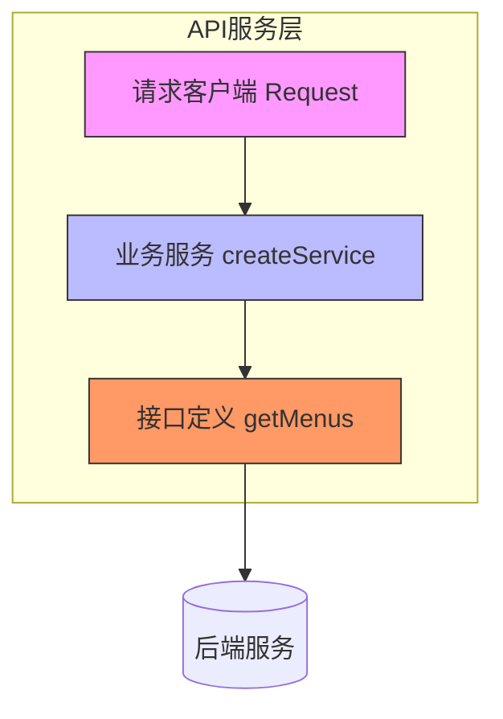
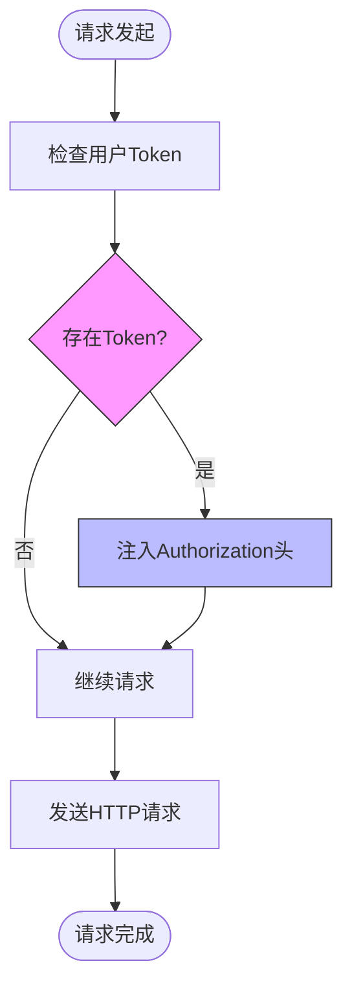
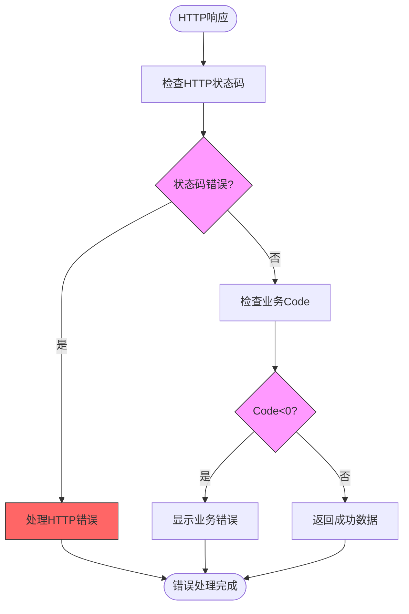
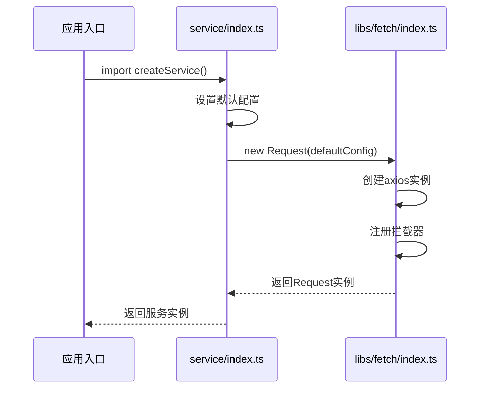
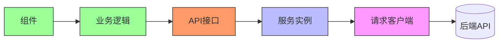
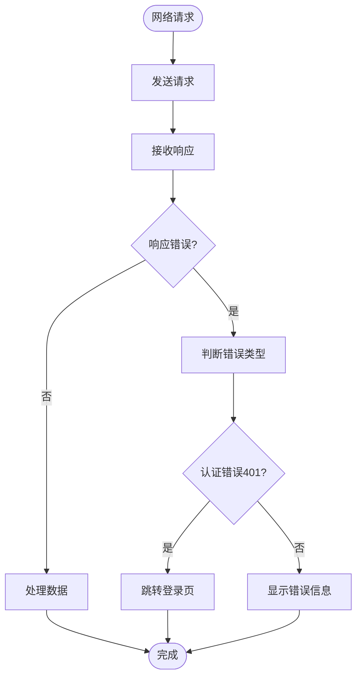
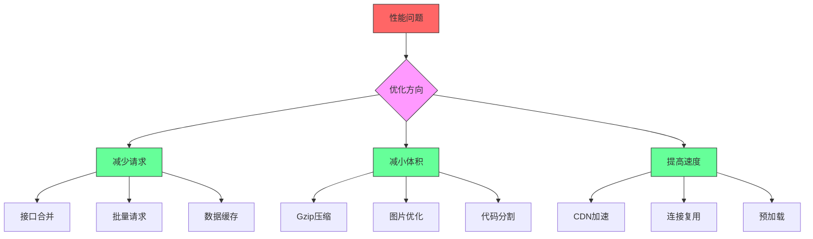

# API服务

<cite>
**本文档引用文件**  
- [index.ts](file://src/libs/fetch/index.ts)
- [types.ts](file://src/libs/fetch/types.ts)
- [index.ts](file://src/service/index.ts)
- [common.ts](file://src/api/common.ts)
- [drillRecords.ts](file://src/api/drillRecords.ts)
- [mock-server.js](file://mock-server.js)
- [nginx.conf](file://nginx.conf)
- [index.vue](file://src/views/uedModule/login/index.vue)
</cite>

## 目录

1. [API服务概述](#api服务概述)
2. [请求客户端实现](#请求客户端实现)
3. [业务服务组织方式](#业务服务组织方式)
4. [公共接口复用策略](#公共接口复用策略)
5. [高级功能使用方法](#高级功能使用方法)
6. [TypeScript类型集成](#typescript类型集成)
7. [常见网络问题解决方案](#常见网络问题解决方案)
8. [性能优化建议](#性能优化建议)

## API服务概述

本项目API服务层采用基于axios的封装设计，实现了完整的请求-响应处理流程。系统通过分层架构将请求客户端、业务服务和接口定义分离，确保代码的可维护性和可扩展性。核心功能包括请求拦截、响应处理、错误统一管理、认证令牌注入等。

**API服务架构图**


**Diagram sources**
- [index.ts](file://src/libs/fetch/index.ts)
- [index.ts](file://src/service/index.ts)
- [common.ts](file://src/api/common.ts)

## 请求客户端实现

### 请求/响应拦截器

请求客户端在`src/libs/fetch/index.ts`中通过axios拦截器实现核心功能。

**请求拦截器**在请求发送前自动注入认证令牌：
```typescript
this.instance.interceptors.request.use(
  (config: InternalAxiosRequestConfig) => {
    const { token } = this.userStore;
    if (token) {
      config.headers.Authorization = `Bearer ${token}`;
    }
    return config;
  },
  (err: any) => {
    message.error('接口请求配置错误');
    return Promise.reject(err);
  }
);
```

**响应拦截器**处理HTTP常见错误并进行全局提示：
```typescript
this.instance.interceptors.response.use(
  (res: AxiosResponse) => {
    return res;
  },
  (err: any) => {
    let msg = '';
    switch (err.response.status) {
      case 400:
        msg = '请求错误(400)';
        break;
      case 401:
        msg = '未授权，请重新登录(401)';
        this.userStore.reset();
        this.menusStroe.reset();
        router.replace('/login');
        break;
      // ...其他状态码处理
    }
    message.error(msg);
    return Promise.reject(err);
  }
);
```

**请求拦截流程图**


**Diagram sources**
- [index.ts](file://src/libs/fetch/index.ts#L14-L30)

### 错误统一处理机制

系统实现了两级错误处理机制：

1. **HTTP状态码处理**：在响应拦截器中处理4xx/5xx错误
2. **业务逻辑错误处理**：在`request`方法中处理业务code非0的情况

```typescript
request<D>(config: RequestConfigType): Promise<ResponseType<D>> {
  return new Promise((resolve, reject) => {
    this.instance(config)
      .then((res) => {
        if (res.data.code < 0 && config.showError) {
          message.error(res.data.msg);
          reject(res.data);
          return;
        }
        resolve(res.data);
      })
      .catch((err) => {
        reject(err);
      });
  });
}
```

**错误处理流程图**


**Section sources**
- [index.ts](file://src/libs/fetch/index.ts#L31-L59)

## 业务服务组织方式

业务服务在`src/service/index.ts`中通过工厂函数创建，实现了配置集中管理。

```typescript
function createService() {
  const defaultConfig = {
    baseURL: process.env.API_BASE_PATH || '/',
    timeout: Number(process.env.TIME_OUT || 1000 * 60)
  };
  const request = new Request(defaultConfig);
  return request;
}

export default createService();
```

这种设计模式的优势：
- **配置集中化**：所有服务共享相同的默认配置
- **环境变量支持**：通过`process.env`实现环境差异化配置
- **单例模式**：确保整个应用使用同一个请求实例

**业务服务创建流程**


**Diagram sources**
- [index.ts](file://src/service/index.ts)
- [index.ts](file://src/libs/fetch/index.ts)

## 公共接口复用策略

### 接口定义组织

`src/api/common.ts`文件定义了公共接口，采用函数导出模式：

```typescript
export async function getMenus(): Promise<MenuType[]> {
  return [
    {
      id: 'workBench',
      title: I18N.layout.gongZuoTai,
      icon: 'AppstoreOutlined',
      path: '/workBench'
    },
    // ...其他菜单项
  ];
}
```

### 复用策略

1. **模块化组织**：不同功能的接口放在不同文件中
2. **类型安全**：使用TypeScript接口定义数据结构
3. **异步函数**：统一返回Promise，便于异步处理

```typescript
// src/api/drillRecords.ts
export async function getDrillRecords(params: any): Promise<any> {
  // 实现钻取记录查询
}
```

**接口调用关系图**


**Section sources**
- [common.ts](file://src/api/common.ts)
- [drillRecords.ts](file://src/api/drillRecords.ts)

## 高级功能使用方法

### 请求参数序列化

系统通过axios内置功能自动处理请求参数序列化：
- GET请求：参数自动添加到URL查询字符串
- POST/PUT请求：数据作为请求体发送

### 超时设置

超时时间通过环境变量配置，具有默认值：
```typescript
timeout: Number(process.env.TIME_OUT || 1000 * 60) // 60秒
```

### 取消请求

虽然当前代码未直接实现取消请求功能，但axios支持通过CancelToken实现：
```typescript
// 使用示例
const source = axios.CancelToken.source();
request.get('/api/data', { cancelToken: source.token });
// 取消请求
source.cancel('请求被用户取消');
```

### 重试机制

当前代码未实现自动重试机制，但可通过以下方式实现：
```typescript
// 重试装饰器示例
function retry(times: number) {
  return function(target: any, propertyKey: string, descriptor: PropertyDescriptor) {
    const originalMethod = descriptor.value;
    descriptor.value = async function(...args: any[]) {
      for (let i = 0; i < times; i++) {
        try {
          return await originalMethod.apply(this, args);
        } catch (error) {
          if (i === times - 1) throw error;
        }
      }
    };
  };
}
```

## TypeScript类型集成

### 类型定义

`src/libs/fetch/types.ts`文件定义了核心类型：

```typescript
export interface ResponseType<T> {
  code: number;
  data: T;
  message: string;
}

export interface CreateAxiosConfig extends CreateAxiosDefaults<any> {
  baseURL?: string;
  headers?: Record<string, string>;
}

export interface RequestConfigType extends AxiosRequestConfig {
  showError?: boolean;
}
```

### 静态检查优势

1. **响应数据类型安全**：`request<D>(config)`泛型确保返回数据类型正确
2. **配置类型检查**：`RequestConfigType`确保请求配置的正确性
3. **接口一致性**：统一的`ResponseType<T>`结构

**类型检查示例**
```typescript
// 正确使用类型
interface UserInfo {
  id: string;
  name: string;
  email: string;
}

// 响应数据自动获得UserInfo类型
const userData: UserInfo = await request.get<UserInfo>('/api/user');
// TypeScript会验证userData的结构
console.log(userData.name); // 安全访问
```

**Section sources**
- [types.ts](file://src/libs/fetch/types.ts)

## 常见网络问题解决方案

### CORS问题

通过Nginx配置解决跨域问题：
```nginx
location /api {
  proxy_pass $service_url$request_uri;
  add_header Access-Control-Allow-Origin *;
  add_header Access-Control-Allow-Methods 'GET, POST, OPTIONS';
  add_header Access-Control-Allow-Headers '*';
}
```

### 认证失败处理

系统在响应拦截器中自动处理401错误：
```typescript
case 401:
  msg = '未授权，请重新登录(401)';
  this.userStore.reset();
  this.menusStroe.reset();
  router.replace('/login');
  break;
```

### 其他网络问题

| 状态码 | 问题描述 | 解决方案 |
|--------|---------|---------|
| 400 | 请求错误 | 检查请求参数格式 |
| 403 | 拒绝访问 | 检查用户权限 |
| 404 | 请求出错 | 检查API路径 |
| 408 | 请求超时 | 优化网络或增加超时时间 |
| 500 | 服务器错误 | 联系后端开发人员 |

**网络错误处理流程**


**Section sources**
- [index.ts](file://src/libs/fetch/index.ts#L40-L55)
- [nginx.conf](file://nginx.conf)

## 性能优化建议

### 请求缓存

虽然当前代码未实现缓存，但建议添加缓存机制：
```typescript
// 简单的内存缓存示例
const cache = new Map<string, any>();
const CACHE_TTL = 5 * 60 * 1000; // 5分钟

async function getCachedData(url: string) {
  const now = Date.now();
  const cached = cache.get(url);
  if (cached && now - cached.timestamp < CACHE_TTL) {
    return cached.data;
  }
  
  const data = await request.get(url);
  cache.set(url, { data, timestamp: now });
  return data;
}
```

### 批量请求

对于多个相关请求，建议使用批量处理：
```typescript
// 批量请求示例
async function batchRequest(urls: string[]) {
  const requests = urls.map(url => request.get(url));
  return await Promise.all(requests);
}
```

### 其他优化建议

1. **减少请求次数**：合并相关接口
2. **压缩响应数据**：启用Gzip压缩
3. **使用CDN**：静态资源托管到CDN
4. **连接复用**：保持长连接减少握手开销
5. **预加载**：预测用户行为提前加载数据

**性能优化策略图**


**Section sources**
- [mock-server.js](file://mock-server.js)
- [nginx.conf](file://nginx.conf)