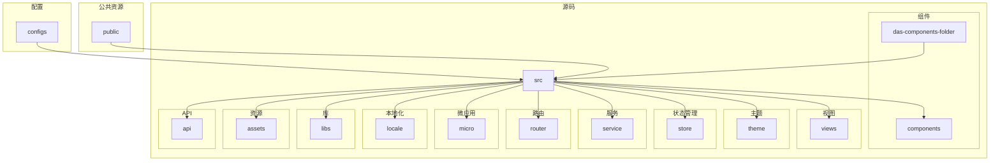
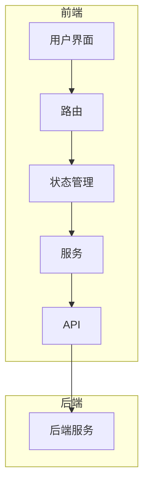
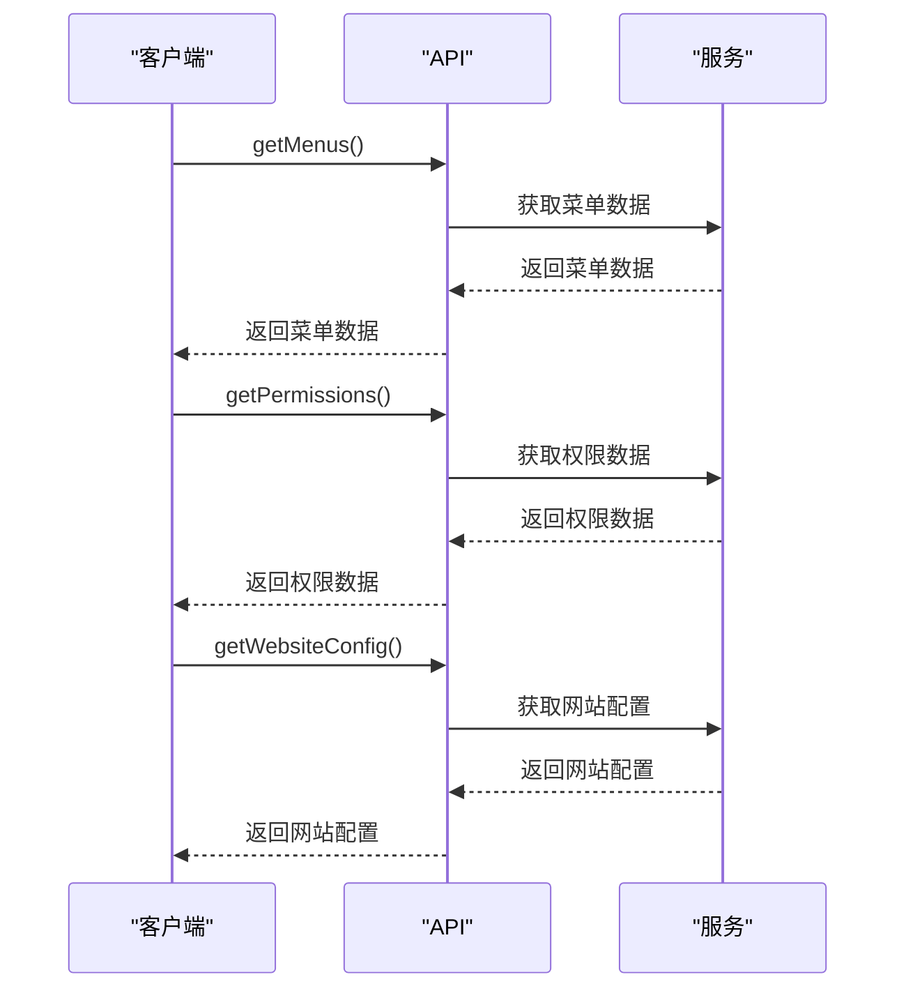
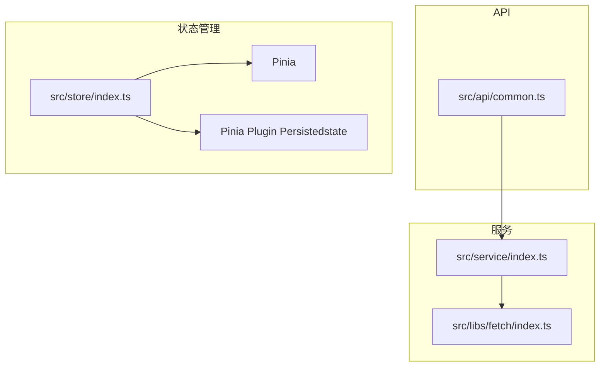

# 服务组织方式

<cite>
**本文档中引用的文件**
- [index.ts](file://src/service/index.ts)
- [common.ts](file://src/api/common.ts)
- [types.ts](file://src/store/uedModule/menus/types.ts)
- [types.ts](file://src/store/uedModule/app/types.ts)
- [index.ts](file://src/libs/fetch/index.ts)
- [types.ts](file://src/libs/fetch/types.ts)
- [index.ts](file://src/store/index.ts)
- [index.ts](file://src/store/uedModule/user/index.ts)
- [mock-server.js](file://mock-server.js)
</cite>

## 目录
1. [简介](#简介)
2. [项目结构](#项目结构)
3. [核心组件](#核心组件)
4. [架构概览](#架构概览)
5. [详细组件分析](#详细组件分析)
6. [依赖分析](#依赖分析)
7. [性能考虑](#性能考虑)
8. [故障排除指南](#故障排除指南)
9. [结论](#结论)

## 简介
本文档深入解析了 `src/service/index.ts` 中业务服务的模块化组织结构，阐述了各服务模块的职责划分和依赖关系。同时，文档详细说明了 `api/common.ts` 中公共接口定义的复用策略，包括通用响应格式、分页参数和错误码规范。此外，文档还提供了服务方法的封装模式，如参数校验、缓存策略和批量请求处理，并展示了如何通过服务组合实现复杂业务流程。最后，文档涵盖了服务间通信、依赖注入和测试桩创建的最佳实践。

## 项目结构
项目结构清晰，遵循了模块化和分层的设计原则。主要目录包括 `configs`、`das-components-folder`、`public`、`src` 等。`src` 目录下包含了 `api`、`assets`、`components`、`libs`、`locale`、`micro`、`router`、`service`、`store`、`theme` 和 `views` 等子目录，每个子目录都有明确的职责。



**图示来源**
- [src/service/index.ts](file://src/service/index.ts)
- [src/api/common.ts](file://src/api/common.ts)

**本节来源**
- [src/service/index.ts](file://src/service/index.ts)
- [src/api/common.ts](file://src/api/common.ts)

## 核心组件
核心组件主要包括 `src/service/index.ts` 中的服务模块和 `src/api/common.ts` 中的公共接口定义。`src/service/index.ts` 负责创建和配置请求实例，而 `src/api/common.ts` 则定义了各种公共接口，如获取菜单数据、权限数据和网站配置等。

**本节来源**
- [src/service/index.ts](file://src/service/index.ts#L1-L12)
- [src/api/common.ts](file://src/api/common.ts#L1-L355)

## 架构概览
系统架构采用了模块化设计，通过 `src/service/index.ts` 创建请求实例，并在 `src/api/common.ts` 中定义公共接口。状态管理通过 `src/store` 目录下的模块实现，使用 Pinia 进行状态管理。微应用通过 `src/micro` 目录下的模块实现，支持多框架应用的集成。



**图示来源**
- [src/service/index.ts](file://src/service/index.ts#L1-L12)
- [src/api/common.ts](file://src/api/common.ts#L1-L355)
- [src/store/index.ts](file://src/store/index.ts#L1-L13)

## 详细组件分析
### 服务模块分析
`src/service/index.ts` 文件中定义了一个 `createService` 函数，用于创建请求实例。该函数配置了默认的 `baseURL` 和 `timeout`，并返回一个 `Request` 实例。

```mermaid
classDiagram
class Request {
+instance : AxiosInstance
+userStore : UserStore
+menusStroe : MenusStore
+constructor(createConfig : CreateAxiosConfig)
+request<D>(config : RequestConfigType) : Promise~ResponseType<D>~
+get<D>(url : string, params? : any, config? : RequestConfigType) : Promise~ResponseType<D>~
+put<D>(url : string, data? : any, config? : RequestConfigType) : Promise~ResponseType<D>~
+post<D>(url : string, data? : any, config? : RequestConfigType) : Promise~ResponseType<D>~
+delete<D>(url : string, params? : any, config? : RequestConfigType) : Promise~ResponseType<D>~
}
class CreateAxiosConfig {
+baseURL? : string
+headers? : Record<string, string>
}
class RequestConfigType {
+showError? : boolean
}
class ResponseType<T> {
+code : number
+data : T
+message : string
}
Request --> CreateAxiosConfig : "使用"
Request --> RequestConfigType : "使用"
Request --> ResponseType : "返回"
```

**图示来源**
- [src/service/index.ts](file://src/service/index.ts#L1-L12)
- [src/libs/fetch/index.ts](file://src/libs/fetch/index.ts#L1-L140)
- [src/libs/fetch/types.ts](file://src/libs/fetch/types.ts#L1-L16)

**本节来源**
- [src/service/index.ts](file://src/service/index.ts#L1-L12)
- [src/libs/fetch/index.ts](file://src/libs/fetch/index.ts#L1-L140)
- [src/libs/fetch/types.ts](file://src/libs/fetch/types.ts#L1-L16)

### 公共接口分析
`src/api/common.ts` 文件中定义了多个公共接口，如 `getMenus`、`getPermissions` 和 `getWebsiteConfig`。这些接口返回 Promise，用于异步获取数据。



**图示来源**
- [src/api/common.ts](file://src/api/common.ts#L1-L355)
- [src/service/index.ts](file://src/service/index.ts#L1-L12)

**本节来源**
- [src/api/common.ts](file://src/api/common.ts#L1-L355)

## 依赖分析
项目中的依赖关系清晰，`src/service/index.ts` 依赖于 `src/libs/fetch/index.ts` 中的 `Request` 类，`src/api/common.ts` 依赖于 `src/service/index.ts` 中的 `createService` 函数。状态管理模块 `src/store` 依赖于 Pinia 和 `pinia-plugin-persistedstate`。



**图示来源**
- [src/service/index.ts](file://src/service/index.ts#L1-L12)
- [src/api/common.ts](file://src/api/common.ts#L1-L355)
- [src/store/index.ts](file://src/store/index.ts#L1-L13)

**本节来源**
- [src/service/index.ts](file://src/service/index.ts#L1-L12)
- [src/api/common.ts](file://src/api/common.ts#L1-L355)
- [src/store/index.ts](file://src/store/index.ts#L1-L13)

## 性能考虑
在性能方面，项目通过使用 Axios 的拦截器来处理请求和响应，减少了重复代码。同时，通过 Pinia 的持久化插件 `pinia-plugin-persistedstate`，实现了状态的持久化，提高了用户体验。

## 故障排除指南
在开发过程中，可能会遇到一些常见问题，如请求失败、状态管理异常等。可以通过查看控制台日志和网络请求来定位问题。对于请求失败，可以检查请求配置和服务器状态；对于状态管理异常，可以检查状态管理模块的实现和使用。

**本节来源**
- [src/service/index.ts](file://src/service/index.ts#L1-L12)
- [src/api/common.ts](file://src/api/common.ts#L1-L355)
- [mock-server.js](file://mock-server.js#L109-L162)

## 结论
本文档详细解析了 `src/service/index.ts` 和 `src/api/common.ts` 中的业务服务和公共接口定义，展示了项目的模块化组织结构和最佳实践。通过这些分析，开发者可以更好地理解和维护项目代码，提高开发效率和代码质量。