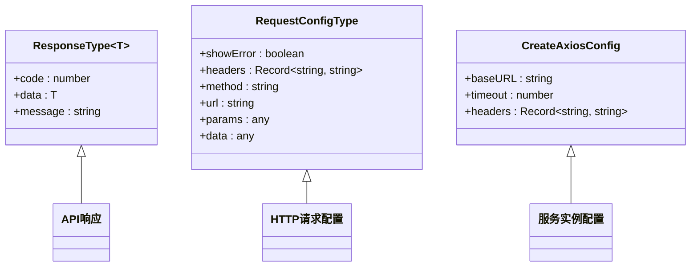
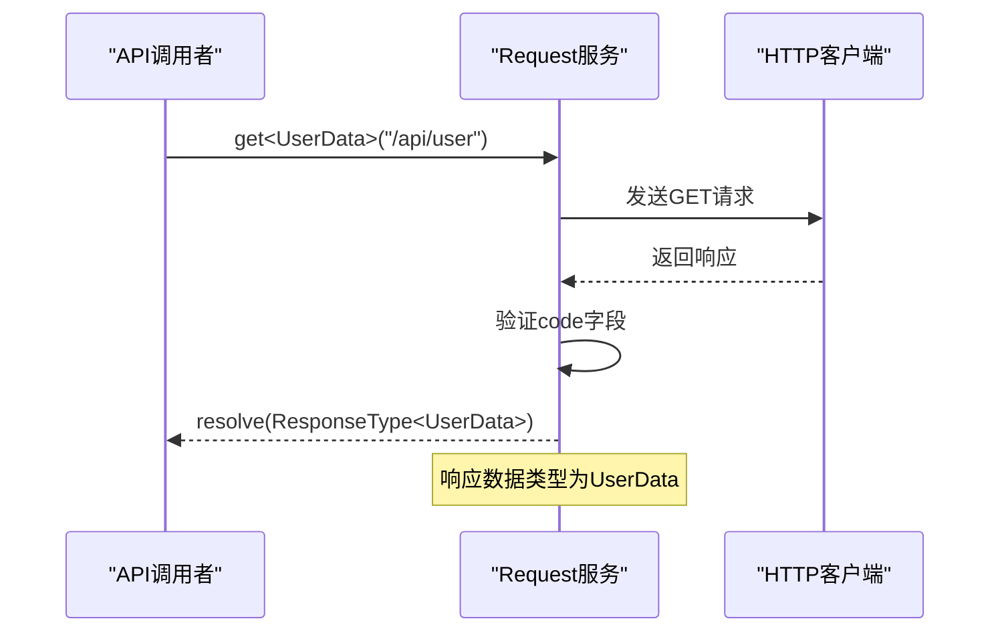
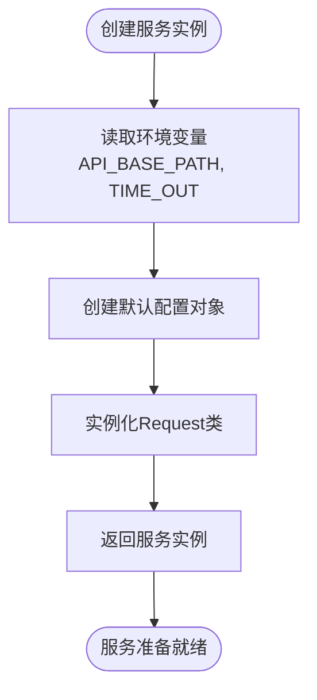
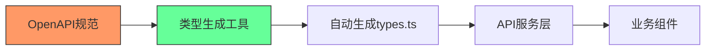

# 类型安全设计

<cite>
**本文档引用的文件**  
- [common.ts](file://src/api/common.ts#L1-L355)
- [types.ts](file://src/libs/fetch/types.ts#L1-L16)
- [index.ts](file://src/libs/fetch/index.ts#L1-L140)
- [service/index.ts](file://src/service/index.ts#L1-L12)
</cite>

## 目录
1. [引言](#引言)
2. [类型系统架构概览](#类型系统架构概览)
3. [核心类型定义分析](#核心类型定义分析)
4. [泛型接口设计与应用](#泛型接口设计与应用)
5. [API契约类型建模](#api契约类型建模)
6. [类型安全实现机制](#类型安全实现机制)
7. [类型推断与条件类型应用](#类型推断与条件类型应用)
8. [运行时类型验证](#运行时类型验证)
9. [类型生成工具集成](#类型生成工具集成)

## 引言

本项目通过精心设计的TypeScript类型系统，为API服务层提供了强大的类型安全保障。该系统采用分层架构，将类型定义与服务实现分离，确保了代码的可维护性和类型安全性。核心设计原则包括：使用泛型接口统一响应结构、通过类型别名精确建模API契约、利用类型推断减少冗余声明。这种设计不仅提高了开发效率，还显著降低了运行时错误的风险。

## 类型系统架构概览

项目类型系统采用分层设计模式，将类型定义、服务封装和API契约分离到不同模块中。这种架构确保了类型安全的端到端实现，从底层HTTP请求封装到高层API调用都受到类型系统的保护。

```mermaid
graph TB
subgraph "类型定义层"
A[types.ts]
end
subgraph "服务封装层"
B[index.ts]
end
subgraph "API契约层"
C[common.ts]
end
A --> B: 导出泛型接口
B --> C: 提供类型化服务
C --> D[业务组件]: 消费类型化API
style A fill:#f9f,stroke:#333
style B fill:#bbf,stroke:#333
style C fill:#f96,stroke:#333
```

**图示来源**  
- [types.ts](file://src/libs/fetch/types.ts#L1-L16)
- [index.ts](file://src/libs/fetch/index.ts#L1-L140)
- [common.ts](file://src/api/common.ts#L1-L355)

## 核心类型定义分析

### 响应类型泛型接口

`ResponseType<T>` 接口是整个类型系统的核心，它定义了所有API响应的统一结构。该泛型接口包含三个关键属性：`code`、`data`和`message`，其中`data`字段使用泛型参数`T`来表示具体的业务数据类型。



**图示来源**  
- [types.ts](file://src/libs/fetch/types.ts#L2-L6)

**本节来源**  
- [types.ts](file://src/libs/fetch/types.ts#L2-L6)

### 请求配置类型扩展

`RequestConfigType` 接口扩展了Axios的请求配置，添加了`showError`布尔标志，用于控制是否自动显示错误提示。这个设计体现了类型系统对业务需求的精确建模能力。

```typescript
export interface RequestConfigType extends AxiosRequestConfig {
  showError?: boolean; // 默认: true 自动提示错误信息
}
```

## 泛型接口设计与应用

### 泛型请求方法实现

`Request` 类的 `request<D>` 方法是泛型设计的典范，它接受一个泛型参数`D`，表示期望的响应数据类型，并返回 `Promise<ResponseType<D>>`。这种设计确保了调用者在编译时就能知道响应数据的具体结构。



**图示来源**  
- [index.ts](file://src/libs/fetch/index.ts#L82-L88)

**本节来源**  
- [index.ts](file://src/libs/fetch/index.ts#L82-L88)

### 泛型在实际API调用中的应用

在 `common.ts` 文件中，虽然没有显式使用泛型语法，但通过 `createService` 返回的请求实例继承了泛型能力。例如 `onLogin` 方法返回 `Promise<any>`，这表明类型系统在高层API中仍有改进空间。

```typescript
export async function onLogin(data: any): Promise<any> {
  return createService.post('/api/user/v1/login', data);
}
```

## API契约类型建模

### 请求参数精确建模

`getLoginRedirectUrl` 函数展示了对请求参数的精确类型建模。它接受一个包含 `state` 和 `redirectUri` 属性的对象参数，这种结构化参数设计提高了代码的可读性和类型安全性。

```typescript
export async function getLoginRedirectUrl(params: { state: string; redirectUri: string }): Promise<any> {
  return createService.get('/api/user/v1/dingtalk/login-url', params);
}
```

### 枚举值与联合类型应用

虽然在分析的文件中没有直接的枚举定义，但项目结构中的 `types.ts` 文件表明存在对枚举值的建模。例如，风险等级可能使用联合类型 `'high' | 'medium' | 'low'` 来精确表示。

```typescript
// 示例：风险等级联合类型
type RiskLevel = 'high' | 'medium' | 'low';
type RiskStatus = 'pending' | 'processing' | 'resolved';
```

**本节来源**  
- [common.ts](file://src/api/common.ts#L1-L355)

## 类型安全实现机制

### 服务实例创建

`createService` 函数通过封装 `Request` 类的实例化过程，为整个应用提供了统一的API服务入口。该函数读取环境变量配置，创建具有默认超时和基础URL的请求实例。



**图示来源**  
- [service/index.ts](file://src/service/index.ts#L1-L12)

**本节来源**  
- [service/index.ts](file://src/service/index.ts#L1-L12)

### 拦截器中的类型处理

请求拦截器在发送请求前自动添加认证头，而响应拦截器则处理HTTP错误状态码。这些拦截器虽然主要处理运行时逻辑，但它们的设计考虑了类型安全，确保错误信息能够被正确传递。

```typescript
this.instance.interceptors.request.use(
  (config: InternalAxiosRequestConfig) => {
    const { token } = this.userStore;
    if (token) {
      config.headers.Authorization = `Bearer ${token}`;
    }
    return config;
  }
);
```

## 类型推断与条件类型应用

### 类型推断在配置合并中的应用

在 `get`、`post` 等方法中，通过使用扩展运算符 `...(config || {})`，TypeScript能够自动推断合并后的配置对象类型。这种设计减少了类型声明的冗余，同时保持了类型安全性。

```typescript
public get<D = any>(url: string, params?: any, config?: RequestConfigType) {
  return this.request<D>({
    showError: true,
    ...(config || {}),
    method: 'GET',
    params,
    url
  });
}
```

### 条件类型的潜在应用

虽然在分析的代码中没有直接使用条件类型，但 `ResponseType<T>` 的设计为条件类型的使用奠定了基础。例如，可以根据 `code` 字段的值条件性地推断响应数据的可用性。

```typescript
// 潜在的条件类型应用示例
type SuccessResponse<T> = ResponseType<T> & { code: 0 };
type ErrorResponse = ResponseType<never> & { code: number; code: Exclude<number, 0> };
```

## 运行时类型验证

### 错误处理中的类型守卫

响应拦截器中的错误处理逻辑虽然没有使用显式的类型守卫，但通过检查 `err.response.status` 的值，实际上实现了一种类守卫的功能。这种模式可以根据HTTP状态码的不同分支处理逻辑。

```typescript
switch (err.response.status) {
  case 401:
    msg = '未授权，请重新登录(401)';
    this.userStore.reset();
    router.replace('/login');
    break;
  // 其他状态码处理...
}
```

### 业务逻辑中的类型断言

在 `request<D>` 方法中，当响应的 `code` 字段小于0时，通过 `reject(res.data)` 将整个响应对象作为拒绝原因传递。这隐含地使用了类型断言，假设错误响应也符合 `ResponseType<D>` 的结构。

```typescript
if (res.data.code < 0 && config.showError) {
  message.error(res.data.msg);
  reject(res.data); // 隐式类型断言
  return;
}
```

**本节来源**  
- [index.ts](file://src/libs/fetch/index.ts#L89-L95)

## 类型生成工具集成

### 当前类型系统局限性

分析显示，项目目前主要依赖手动类型定义，没有集成自动化类型生成工具。所有类型都是手动编写的，这可能导致类型定义与后端API实际契约的不一致。

### 潜在的类型生成方案

可以集成OpenAPI/Swagger类型生成工具，从API文档自动生成TypeScript类型定义。这种集成将确保前端类型与后端API契约保持同步，减少手动维护的错误。



**本节来源**  
- [types.ts](file://src/libs/fetch/types.ts#L1-L16)
- [common.ts](file://src/api/common.ts#L1-L355)