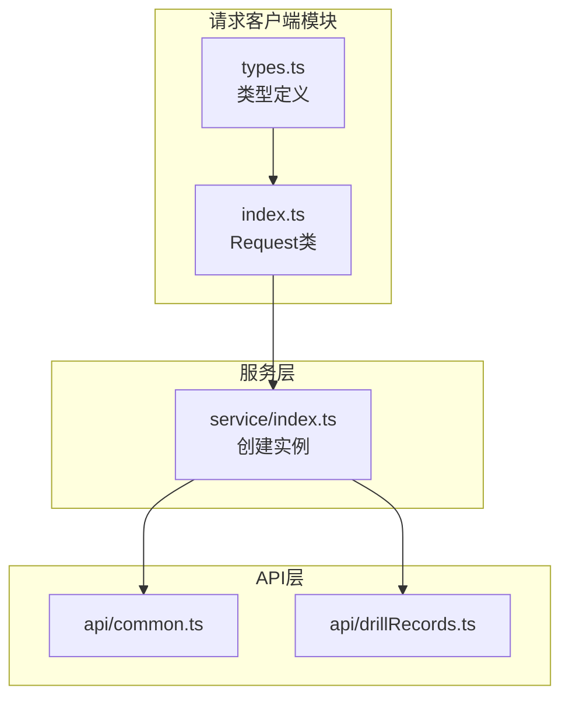
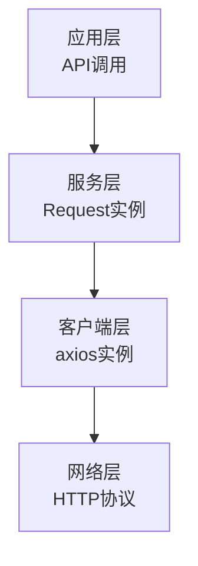
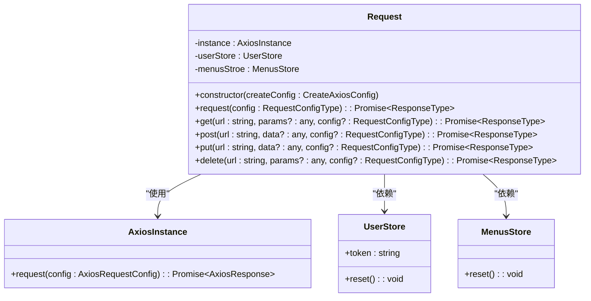
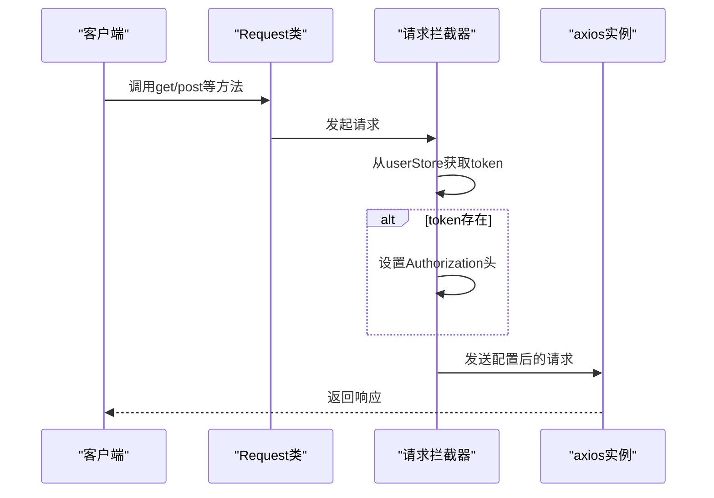
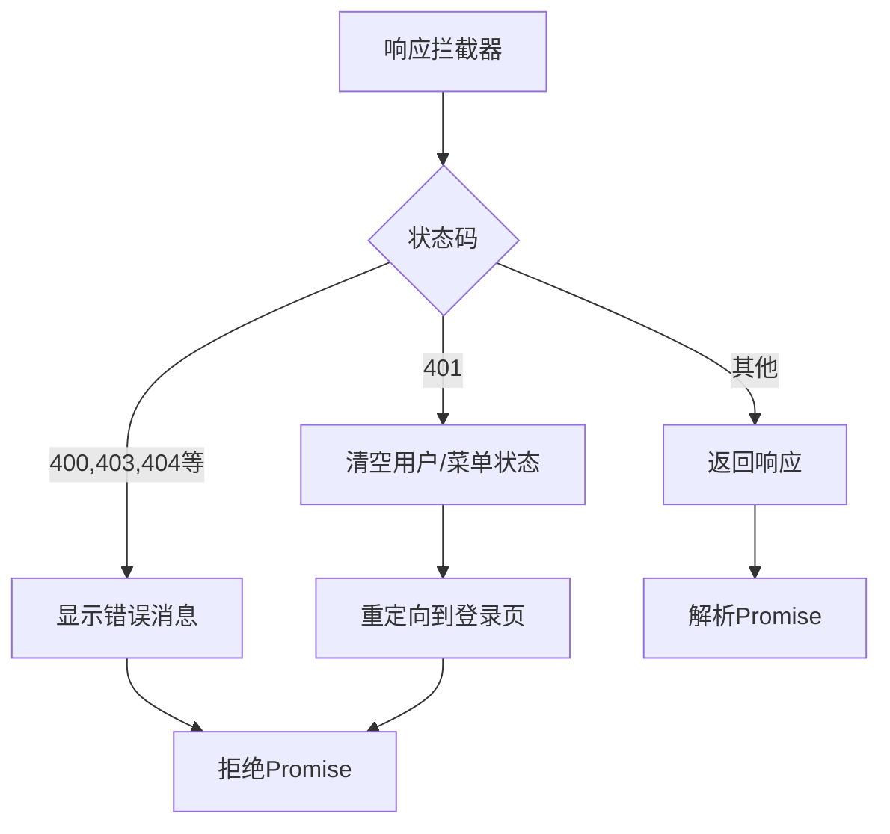
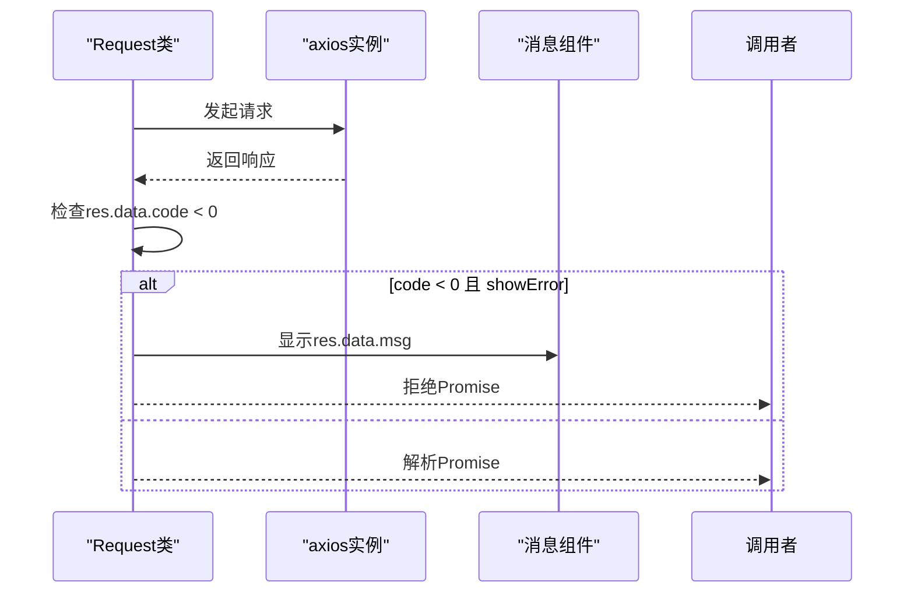
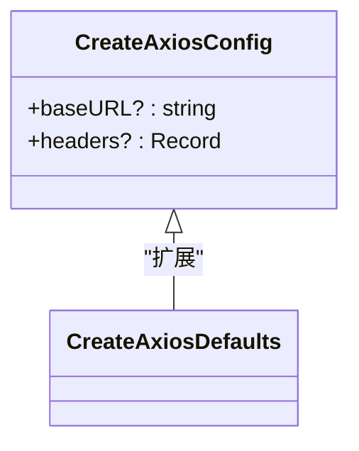
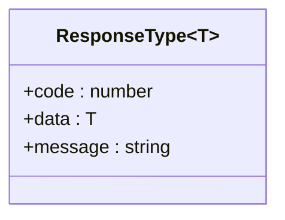
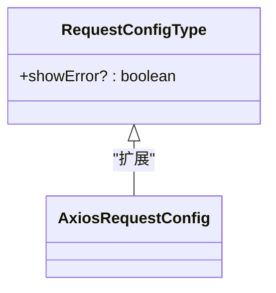
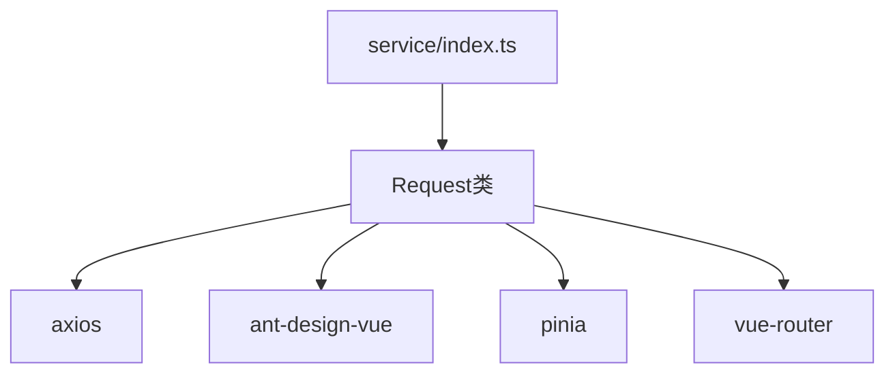

# 请求客户端

<cite>
**本文档中引用的文件**   
- [index.ts](file://src/libs/fetch/index.ts)
- [types.ts](file://src/libs/fetch/types.ts)
- [index.ts](file://src/service/index.ts)
- [common.ts](file://src/api/common.ts)
- [drillRecords.ts](file://src/api/drillRecords.ts)
</cite>

## 目录
1. [简介](#简介)
2. [项目结构](#项目结构)
3. [核心组件](#核心组件)
4. [架构概述](#架构概述)
5. [详细组件分析](#详细组件分析)
6. [依赖分析](#依赖分析)
7. [性能考虑](#性能考虑)
8. [故障排除指南](#故障排除指南)
9. [结论](#结论)

## 简介
本文档详细介绍了基于axios的请求客户端实现，重点分析了`src/libs/fetch`目录下的`Fetch`类（在代码中命名为`Request`）的设计与实现。文档涵盖了请求和响应拦截器的具体实现，包括认证令牌自动注入、请求日志记录、错误统一处理机制。同时，阐述了`FetchConfig`和`FetchResponse`等类型定义在`types.ts`中的作用，确保类型安全。提供了自定义实例化、基础URL设置、超时配置、请求取消功能的使用示例，并说明了如何通过拦截器链实现请求重试、CORS预检处理、数据序列化等高级功能。

## 项目结构
请求客户端的核心实现位于`src/libs/fetch`目录下，由`index.ts`和`types.ts`两个文件组成。`index.ts`文件定义了`Request`类，封装了axios实例及其拦截器逻辑。`types.ts`文件则定义了相关的类型接口，确保了配置和响应数据的类型安全。该客户端通过`src/service/index.ts`进行实例化和全局配置，然后被`src/api`目录下的各个API服务文件所使用。

**图示来源**
- [index.ts](file://src/libs/fetch/index.ts)
- [types.ts](file://src/libs/fetch/types.ts)
- [index.ts](file://src/service/index.ts)

**本节来源**
- [index.ts](file://src/libs/fetch/index.ts)
- [types.ts](file://src/libs/fetch/types.ts)
- [index.ts](file://src/service/index.ts)

## 核心组件
请求客户端的核心是`Request`类，它封装了axios实例，并通过拦截器实现了认证、错误处理等通用逻辑。`Request`类的构造函数接收一个`CreateAxiosConfig`配置对象，用于初始化底层的axios实例。该类提供了`get`、`post`、`put`、`delete`等便捷方法，简化了HTTP请求的调用。

**本节来源**
- [index.ts](file://src/libs/fetch/index.ts#L1-L140)

## 架构概述
整个请求客户端的架构遵循分层设计模式。最底层是axios库，提供了HTTP请求的基础能力。中间层是`Request`类，它通过创建axios实例并配置拦截器，为上层应用提供了增强的、带有业务逻辑的请求能力。最上层是具体的API服务，它们通过调用`Request`实例的方法来发起网络请求，而无需关心底层的细节。

**图示来源**
- [index.ts](file://src/libs/fetch/index.ts)
- [index.ts](file://src/service/index.ts)

## 详细组件分析

### Request类分析
`Request`类是整个请求客户端的核心，它通过封装axios实例和配置拦截器来提供统一的请求处理能力。

#### 类结构与依赖
`Request`类依赖于`axios`库、`pinia`状态管理、`vue-router`以及自定义的类型定义。它在构造函数中初始化axios实例，并设置请求和响应拦截器。

**图示来源**
- [index.ts](file://src/libs/fetch/index.ts#L1-L140)

#### 请求拦截器
请求拦截器的主要作用是在每个请求发送前自动注入认证令牌。它从`userStore`中获取`token`，如果存在，则将其添加到请求头的`Authorization`字段中。

**图示来源**
- [index.ts](file://src/libs/fetch/index.ts#L14-L28)

#### 响应拦截器
响应拦截器负责处理HTTP常见错误，并进行全局提示。当响应状态码为401时，它会清空用户和菜单状态，并将用户重定向到登录页面。

**图示来源**
- [index.ts](file://src/libs/fetch/index.ts#L29-L59)

#### request方法
`request`方法是所有HTTP请求的最终执行者。它首先调用底层的axios实例，然后检查响应数据中的`code`字段。如果`code`小于0且`showError`为true，则会显示错误消息并拒绝Promise。

**图示来源**
- [index.ts](file://src/libs/fetch/index.ts#L82-L97)

### 类型定义分析
`types.ts`文件定义了请求客户端中使用的关键类型，确保了代码的类型安全。

#### CreateAxiosConfig
`CreateAxiosConfig`接口扩展了axios的`CreateAxiosDefaults`，允许设置`baseURL`和`headers`。

**图示来源**
- [types.ts](file://src/libs/fetch/types.ts#L10-L14)

#### ResponseType
`ResponseType`泛型接口定义了服务器响应的标准格式，包含`code`、`data`和`message`三个字段。

**图示来源**
- [types.ts](file://src/libs/fetch/types.ts#L4-L8)

#### RequestConfigType
`RequestConfigType`接口扩展了axios的`AxiosRequestConfig`，增加了一个`showError`布尔值字段，用于控制是否自动显示错误消息。

**图示来源**
- [types.ts](file://src/libs/fetch/types.ts#L16-L19)

**本节来源**
- [index.ts](file://src/libs/fetch/index.ts#L1-L140)
- [types.ts](file://src/libs/fetch/types.ts#L1-L19)

## 依赖分析
请求客户端模块依赖于多个外部库和内部模块。它直接依赖`axios`进行HTTP通信，依赖`ant-design-vue`的`message`组件进行错误提示，依赖`pinia`和`vue-router`进行状态管理和页面导航。在项目内部，它被`src/service/index.ts`所依赖，用于创建全局的请求实例。

**图示来源**
- [index.ts](file://src/libs/fetch/index.ts#L1-L10)
- [index.ts](file://src/service/index.ts#L1-L11)

**本节来源**
- [index.ts](file://src/libs/fetch/index.ts)
- [index.ts](file://src/service/index.ts)

## 性能考虑
虽然当前实现没有显式地配置连接复用或压缩，但axios本身支持这些功能。可以通过在`CreateAxiosConfig`中设置`httpAgent`和`httpsAgent`来启用连接复用，并通过设置`Accept-Encoding`头来请求压缩响应。此外，`timeout`配置（在`service/index.ts`中设置为60秒）有助于防止请求无限期挂起。

## 故障排除指南
- **401错误后未跳转登录页**：检查`userStore`和`menusStroe`的`reset`方法是否正确执行，以及`router.replace('/login')`是否被正确调用。
- **认证令牌未发送**：确认`userStore`中的`token`字段是否正确设置，并且请求拦截器能够正确访问该状态。
- **错误消息未显示**：检查`message.error`调用是否成功，以及`ant-design-vue`的`message`组件是否已正确安装和配置。
- **请求超时**：检查`service/index.ts`中的`timeout`配置是否合理，以及网络状况是否良好。

**本节来源**
- [index.ts](file://src/libs/fetch/index.ts#L14-L59)
- [index.ts](file://src/service/index.ts#L5-L7)

## 结论
本文档详细分析了基于axios的请求客户端实现。`Request`类通过封装axios实例和配置拦截器，为项目提供了统一、安全、易用的HTTP请求能力。其设计清晰，职责分明，通过类型定义确保了代码的健壮性。该客户端在项目中被广泛使用，是前后端通信的核心组件。