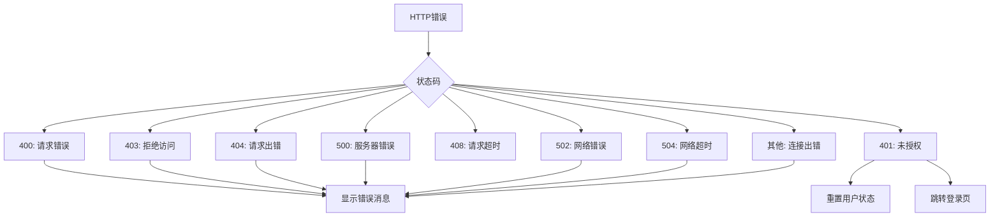
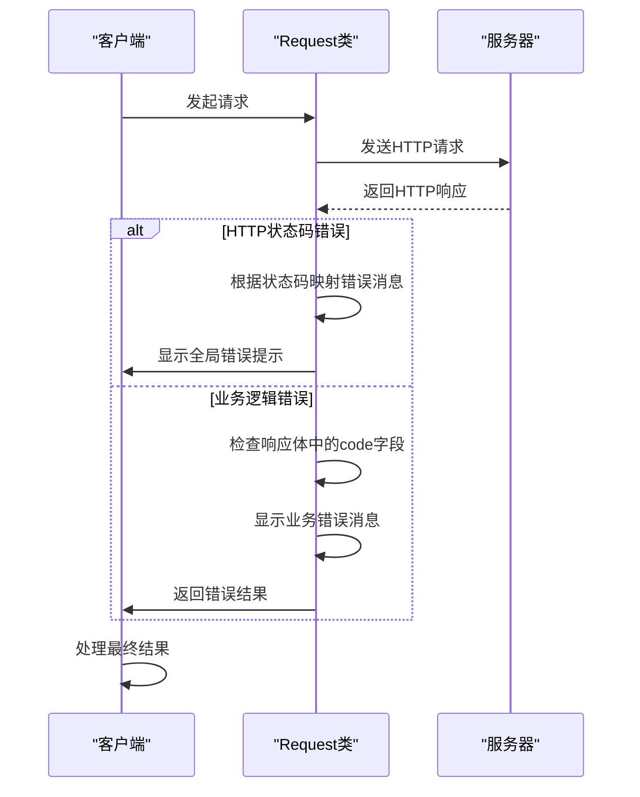
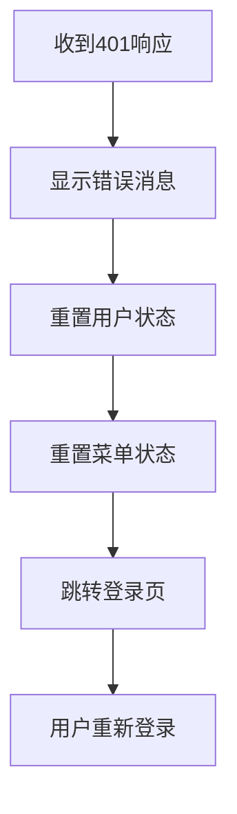
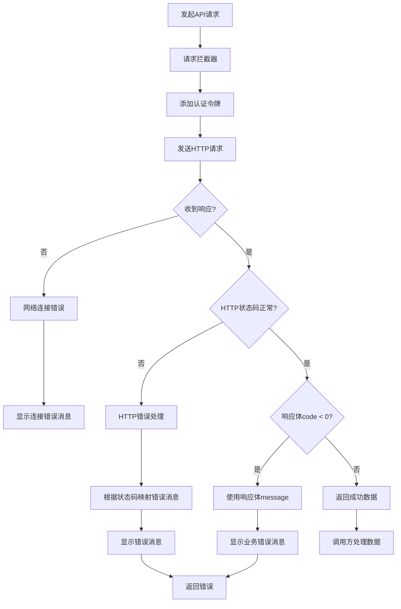

# 错误处理机制

<cite>
**本文档引用的文件**   
- [index.ts](file://src/libs/fetch/index.ts#L1-L140)
- [types.ts](file://src/libs/fetch/types.ts#L1-L16)
- [user/index.ts](file://src/store/uedModule/user/index.ts#L1-L62)
- [menus/index.ts](file://src/store/uedModule/menus/index.ts#L1-L138)
</cite>

## 目录
1. [简介](#简介)
2. [核心错误处理组件](#核心错误处理组件)
3. [错误分类与处理策略](#错误分类与处理策略)
4. [错误码映射与用户友好消息转换](#错误码映射与用户友好消息转换)
5. [全局与局部错误处理配置](#全局与局部错误处理配置)
6. [状态管理与认证失败处理](#状态管理与认证失败处理)
7. [错误处理流程图](#错误处理流程图)

## 简介
本项目采用基于Axios的封装请求类实现API服务层的错误处理机制。系统通过请求拦截器和响应拦截器捕获不同类型的错误，并根据错误类型进行分类处理。错误处理策略涵盖了网络错误、认证失败、服务器异常等多种场景，通过全局消息提示和状态重置机制为用户提供友好的错误体验。项目还实现了错误码映射机制，将技术性错误代码转换为用户可理解的提示信息。

## 核心错误处理组件

项目的核心错误处理逻辑位于`src/libs/fetch/index.ts`文件中，通过封装的`Request`类实现。该类使用Axios作为底层HTTP客户端，并通过拦截器机制实现错误的捕获和处理。

```typescript
export default class Request {
  private instance: AxiosInstance;
  private userStore = useUserStore(pinia);
  private menusStroe = useMenusStore(pinia);

  constructor(createConfig: CreateAxiosConfig) {
    this.instance = axios.create(createConfig);
    // 请求拦截器
    this.instance.interceptors.request.use(
      (config: InternalAxiosRequestConfig) => {
        const { token } = this.userStore;
        if (token) {
          config.headers.Authorization = `Bearer ${token}`;
        }
        return config;
      },
      (err: any) => {
        message.error('接口请求配置错误');
        return Promise.reject(err);
      }
    );
    // 响应拦截器
    this.instance.interceptors.response.use(
      (res: AxiosResponse) => {
        return res;
      },
      (err: any) => {
        // HTTP错误处理
        let msg = '';
        switch (err.response.status) {
          case 401:
            msg = '未授权，请重新登录(401)';
            this.userStore.reset();
            this.menusStroe.reset();
            router.replace('/login');
            break;
          // 其他错误处理...
        }
        message.error(msg);
        return Promise.reject(err);
      }
    );
  }
}
```

**错误处理组件结构**
- **请求拦截器**: 在请求发送前添加认证令牌，并处理请求配置错误
- **响应拦截器**: 捕获HTTP响应错误，进行分类处理和用户提示
- **请求方法封装**: 提供get、post、put、delete等常用HTTP方法的封装

**Section sources**
- [index.ts](file://src/libs/fetch/index.ts#L1-L140)

## 错误分类与处理策略

### HTTP状态码错误分类
系统对常见的HTTP状态码进行了分类处理，每种错误类型都有对应的用户友好消息和处理逻辑。



**错误类型与处理方式**
| 错误类型 | HTTP状态码 | 处理策略 | 用户提示 |
|---------|----------|--------|--------|
| 认证失败 | 401 | 重置用户状态，跳转登录页 | 未授权，请重新登录 |
| 权限不足 | 403 | 显示错误消息 | 拒绝访问 |
| 资源未找到 | 404 | 显示错误消息 | 请求出错 |
| 请求超时 | 408 | 显示错误消息 | 请求超时 |
| 服务器错误 | 500 | 显示错误消息 | 服务器错误 |
| 网络错误 | 502 | 显示错误消息 | 网络错误 |
| 网络超时 | 504 | 显示错误消息 | 网络超时 |

**Section sources**
- [index.ts](file://src/libs/fetch/index.ts#L55-L80)

## 错误码映射与用户友好消息转换

### 响应数据结构定义
项目定义了统一的响应数据结构，包含业务错误码、数据和消息。

```typescript
export interface ResponseType<T> {
  code: number; // 业务错误码，0表示成功，其他值表示错误
  data: T; // 响应数据
  message: string; // 错误消息
}
```

### 错误码映射机制
系统实现了两层错误处理机制：HTTP状态码映射和业务错误码映射。



### 用户友好消息转换
系统将技术性错误信息转换为用户可理解的提示：

```typescript
// HTTP状态码到用户友好消息的映射
switch (err.response.status) {
  case 400:
    msg = '请求错误(400)';
    break;
  case 401:
    msg = '未授权，请重新登录(401)';
    break;
  case 403:
    msg = '拒绝访问(403)';
    break;
  // ...其他映射
}
```

当服务器返回的响应体中`code`字段小于0时，系统会直接使用响应体中的`message`字段作为错误提示。

**Section sources**
- [types.ts](file://src/libs/fetch/types.ts#L2-L6)
- [index.ts](file://src/libs/fetch/index.ts#L90-L100)

## 全局与局部错误处理配置

### 全局错误处理
全局错误处理通过Axios拦截器实现，对所有请求进行统一的错误处理。

```typescript
this.instance.interceptors.response.use(
  (res: AxiosResponse) => {
    return res;
  },
  (err: any) => {
    // 全局HTTP错误处理
    let msg = '';
    switch (err.response.status) {
      // ...错误消息映射
    }
    message.error(msg);
    return Promise.reject(err);
  }
);
```

### 局部错误处理配置
通过`RequestConfigType`接口提供局部错误处理配置选项。

```typescript
export interface RequestConfigType extends AxiosRequestConfig {
  showError?: boolean; // 是否自动显示错误消息，默认为true
}
```

在具体请求中可以配置`showError`选项来控制是否显示错误提示：

```typescript
// 禁用自动错误提示，由调用方自行处理
request.post('/api/data', data, { showError: false })
  .then(result => {
    // 自定义错误处理
  })
  .catch(err => {
    // 自定义错误处理
  });
```

这种设计允许开发者在需要时覆盖全局错误处理行为，实现更精细的错误控制。

**Section sources**
- [types.ts](file://src/libs/fetch/types.ts#L13-L15)
- [index.ts](file://src/libs/fetch/index.ts#L90-L100)

## 状态管理与认证失败处理

### 用户状态管理
当发生401未授权错误时，系统会重置用户状态，确保应用处于一致的状态。

```typescript
// user/index.ts
export default defineStore<'user', UserStore>(
  'user',
  () => {
    const token = ref<string | undefined>(undefined);
    const userInfo = reactive({});
    const permissionIds = ref<string[]>([]);
    
    const reset = () => {
      token.value = undefined;
      permissionIds.value = [];
      Object.assign(userInfo, {});
    };

    return {
      token,
      permissionIds,
      reset,
      userInfo
    };
  }
);
```

### 菜单状态管理
同时重置菜单状态，确保用户重新登录后菜单状态正确。

```typescript
// menus/index.ts
const reset = () => {
  menusData.value = [];
  menusMap.clear();
  activeRoutes.value = [];
};
```

### 认证失败处理流程


当检测到401未授权错误时，系统会：
1. 显示"未授权，请重新登录"的错误消息
2. 调用`userStore.reset()`重置用户信息和认证令牌
3. 调用`menusStroe.reset()`重置菜单状态
4. 使用`router.replace('/login')`跳转到登录页面

这种处理方式确保了用户在会话过期或令牌失效时能够安全地重新认证，同时避免了状态不一致的问题。

**Section sources**
- [user/index.ts](file://src/store/uedModule/user/index.ts#L1-L62)
- [menus/index.ts](file://src/store/uedModule/menus/index.ts#L1-L138)

## 错误处理流程图



该流程图展示了完整的错误处理流程，从请求发起开始，经过请求拦截、HTTP通信、响应处理，最终到错误提示和结果返回的全过程。系统通过多层错误处理机制，确保了各种错误情况都能得到适当的处理，为用户提供一致的错误体验。

**Diagram sources**
- [index.ts](file://src/libs/fetch/index.ts#L1-L140)
- [types.ts](file://src/libs/fetch/types.ts#L1-L16)