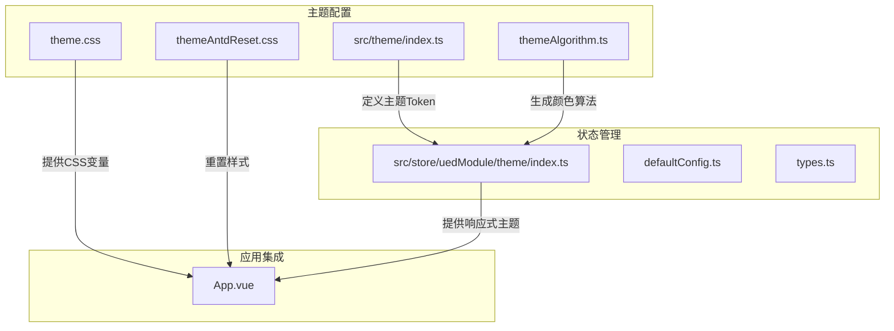
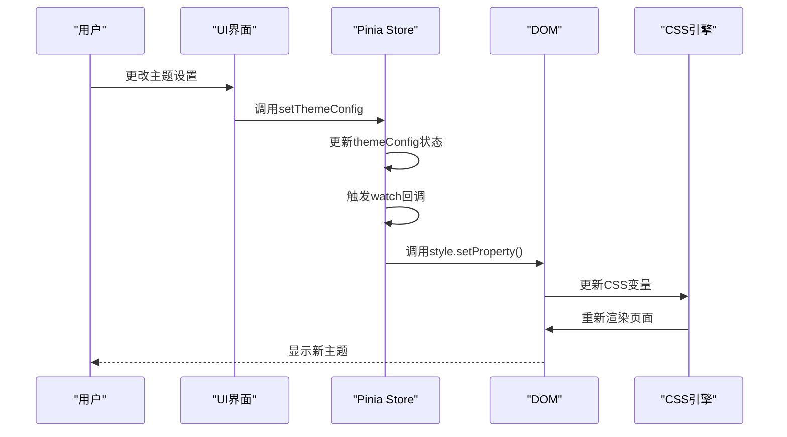
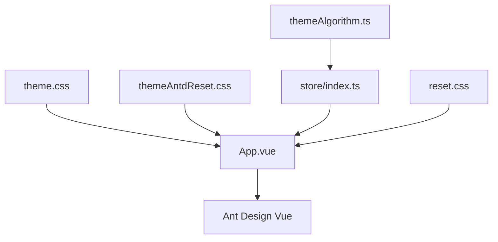

# CSS变量管理

<cite>
**本文档中引用的文件**  
- [theme.css](file://src/theme/theme.css)
- [themeAntdReset.css](file://src/theme/themeAntdReset.css)
- [index.ts](file://src/theme/index.ts)
- [themeAlgorithm.ts](file://src/theme/themeAlgorithm.ts)
- [defaultConfig.ts](file://src/store/uedModule/theme/defaultConfig.ts)
- [types.ts](file://src/store/uedModule/theme/types.ts)
- [index.ts](file://src/store/uedModule/theme/index.ts)
- [App.vue](file://src/App.vue)
- [reset.css](file://src/assets/styles/reset.css)
</cite>

## 目录
1. [简介](#简介)
2. [项目结构](#项目结构)
3. [核心组件](#核心组件)
4. [架构概述](#架构概述)
5. [详细组件分析](#详细组件分析)
6. [依赖分析](#依赖分析)
7. [性能考虑](#性能考虑)
8. [故障排除指南](#故障排除指南)
9. [结论](#结论)

## 简介
本文档深入阐述了Vue项目模板中基于CSS自定义属性（CSS Variables）的主题管理系统。该系统通过结合Vue 3的响应式机制、Pinia状态管理库和Ant Design Vue组件库，实现了主题变量的运行时动态更新。文档将详细解析`theme.css`如何利用CSS变量实现动态主题切换，说明`themeAntdReset.css`如何重置Ant Design Vue的默认样式以确保无缝集成，并描述CSS变量的注入时机与作用域管理策略。

## 项目结构
项目中的主题管理功能主要集中在`src/theme`和`src/store/uedModule/theme`目录下。`src/theme`目录包含核心的主题配置文件，而`src/store/uedModule/theme`则负责主题状态的持久化和响应式更新。



**Diagram sources**
- [theme.css](file://src/theme/theme.css)
- [themeAntdReset.css](file://src/theme/themeAntdReset.css)
- [index.ts](file://src/theme/index.ts)
- [themeAlgorithm.ts](file://src/theme/themeAlgorithm.ts)
- [index.ts](file://src/store/uedModule/theme/index.ts)
- [App.vue](file://src/App.vue)

**Section sources**
- [theme.css](file://src/theme/theme.css)
- [themeAntdReset.css](file://src/theme/themeAntdReset.css)
- [index.ts](file://src/theme/index.ts)
- [themeAlgorithm.ts](file://src/theme/themeAlgorithm.ts)
- [index.ts](file://src/store/uedModule/theme/index.ts)
- [App.vue](file://src/App.vue)

## 核心组件
主题系统的核心由三个部分构成：CSS变量定义、主题状态管理、以及与UI库的集成。`theme.css`文件定义了所有可动态更新的CSS变量；`src/store/uedModule/theme/index.ts`使用Pinia创建了一个响应式存储，用于管理主题配置；`themeAlgorithm.ts`则负责根据用户选择的主色调生成一套完整的颜色梯度。

**Section sources**
- [theme.css](file://src/theme/theme.css)
- [index.ts](file://src/store/uedModule/theme/index.ts)
- [themeAlgorithm.ts](file://src/theme/themeAlgorithm.ts)

## 架构概述
整个主题系统的架构遵循“配置-状态-应用”的模式。首先，在`theme.css`中定义一组以`--`为前缀的CSS自定义属性。然后，通过Pinia store将这些配置项与应用状态绑定，当用户在UI中更改主题设置时，store会自动更新。最后，通过JavaScript动态修改`document.documentElement`或`document.body`上的CSS变量值，触发浏览器的样式重计算，从而实现即时的主题切换。



**Diagram sources**
- [index.ts](file://src/store/uedModule/theme/index.ts)
- [themeAlgorithm.ts](file://src/theme/themeAlgorithm.ts)

## 详细组件分析

### theme.css分析
`theme.css`文件是整个主题系统的基石，它通过CSS自定义属性（CSS Variables）定义了所有可动态更新的样式变量。这些变量被设计为具有清晰的命名规范和层级结构。

```css
/* 示例：theme.css中的变量定义 */
:root {
  --color-bg-container: #ffffff;
  --color-text-primary: #1e2435;
  --font-size-base: 14px;
}
```

该文件中的变量命名遵循`--组件名-属性名`或`--语义名`的规范，例如`--color-bg-container`表示容器背景色，`--font-size-base`表示基础字号。这种命名方式提高了代码的可读性和可维护性。

**Section sources**
- [theme.css](file://src/theme/theme.css)

### themeAntdReset.css分析
`themeAntdReset.css`文件的作用是重置Ant Design Vue组件库的默认样式，确保自定义主题能够正确应用。它通过覆盖Ant Design Vue的CSS类来实现样式重置。

```css
/* 示例：themeAntdReset.css中的重置规则 */
.ant-btn-primary {
  background-color: var(--um-primary-color-normal);
  border-color: var(--um-primary-color-normal);
}
.ant-btn-primary:hover {
  background-color: var(--um-primary-color-hover);
  border-color: var(--um-primary-color-hover);
}
```

该文件确保了Ant Design Vue的按钮、输入框等组件的颜色与通过CSS变量定义的主题色保持一致，实现了主题系统与UI库的无缝集成。

**Section sources**
- [themeAntdReset.css](file://src/theme/themeAntdReset.css)

### 主题状态管理分析
`src/store/uedModule/theme/index.ts`文件使用Pinia定义了一个名为`theme`的store，用于管理主题配置的状态。该store的核心功能包括：

- **状态定义**：`themeConfig`是一个响应式的`ref`，存储了所有主题配置项。
- **持久化**：通过`localStorage`将主题配置持久化，确保页面刷新后设置不丢失。
- **响应式更新**：使用`watch`监听`themeConfig`的变化，当配置更新时，立即调用`updateFontSizeCSS`函数更新对应的CSS变量。

```mermaid
classDiagram
class ThemeStore {
+themeConfig : Ref<ThemeConfigType>
+themeType : Ref<ThemeTypes>
+themeTokenType : ComputedRef<string>
+theme : ComputedRef<AntTheme>
+setThemeConfig(config : ThemeConfigType) : void
+reset() : void
+resetThemePrimaryColor() : void
+getPrimaryColors() : {primaryColors : string[], darkPrimaryColors : string[]}
}
ThemeStore --> ThemeConfigType : "使用"
ThemeStore --> ThemeTypes : "使用"
ThemeStore --> AntTheme : "生成"
```

**Diagram sources**
- [index.ts](file://src/store/uedModule/theme/index.ts)
- [types.ts](file://src/store/uedModule/theme/types.ts)

**Section sources**
- [index.ts](file://src/store/uedModule/theme/index.ts)
- [types.ts](file://src/store/uedModule/theme/types.ts)

### CSS变量注入与作用域管理
CSS变量的注入时机和作用域管理是确保主题系统稳定运行的关键。在本项目中，变量注入主要通过以下两种方式实现：

1.  **初始化注入**：在`App.vue`的`setup`函数中，通过`themeAlgorithm()`函数调用，立即根据初始配置生成并注入所有CSS变量。
2.  **运行时注入**：当用户更改主题配置时，Pinia store中的`watch`回调会动态调用`document.body.style.setProperty()`来更新变量。

作用域管理方面，变量被注入到`:root`或`document.body`上，确保了全局作用域，所有子组件都能访问到这些变量。同时，通过为深色主题添加`theme-dark`类名，可以实现基于类名的样式覆盖，避免了复杂的CSS优先级问题。

**Section sources**
- [themeAlgorithm.ts](file://src/theme/themeAlgorithm.ts)
- [index.ts](file://src/store/uedModule/theme/index.ts)
- [App.vue](file://src/App.vue)

### 即时主题切换代码示例
以下是一个通过JavaScript操作CSS变量实现即时主题切换的代码示例：

```typescript
// 在themeAlgorithm.ts中
import { ref, watch } from 'vue';

const config = ref({
  primaryColor: '#1890ff',
  mode: 'light'
});

watch(
  () => config.value.primaryColor,
  (newColor) => {
    const bodyEl = document.body;
    // 动态更新CSS变量
    bodyEl.style.setProperty('--um-primary-color-light', generate(newColor)[0]);
    bodyEl.style.setProperty('--um-primary-color-hover', generate(newColor)[4]);
    bodyEl.style.setProperty('--um-primary-color-normal', generate(newColor)[5]);
  },
  { immediate: true }
);
```

此代码片段展示了如何监听`primaryColor`的变化，并立即更新对应的CSS变量，从而实现按钮、链接等元素颜色的即时变化。

**Section sources**
- [themeAlgorithm.ts](file://src/theme/themeAlgorithm.ts)

## 依赖分析
主题系统依赖于多个关键库和文件，它们之间的依赖关系如下：



**Diagram sources**
- [theme.css](file://src/theme/theme.css)
- [themeAntdReset.css](file://src/theme/themeAntdReset.css)
- [themeAlgorithm.ts](file://src/theme/themeAlgorithm.ts)
- [index.ts](file://src/store/uedModule/theme/index.ts)
- [App.vue](file://src/App.vue)
- [reset.css](file://src/assets/styles/reset.css)

**Section sources**
- [theme.css](file://src/theme/theme.css)
- [themeAntdReset.css](file://src/theme/themeAntdReset.css)
- [themeAlgorithm.ts](file://src/theme/themeAlgorithm.ts)
- [index.ts](file://src/store/uedModule/theme/index.ts)
- [App.vue](file://src/App.vue)
- [reset.css](file://src/assets/styles/reset.css)

## 性能考虑
使用CSS变量进行主题切换具有良好的性能表现：
- **高效性**：仅需修改少量CSS变量，浏览器会自动重新计算所有引用这些变量的样式，避免了大规模的DOM操作。
- **兼容性**：现代浏览器对CSS变量的支持良好，但在IE11等旧版浏览器中需要使用polyfill。
- **内存占用**：Pinia store的响应式机制和`localStorage`的持久化对内存影响较小。

## 故障排除指南
- **主题不生效**：检查`App.vue`中是否正确引入了`a-config-provider`并绑定了`theme`属性。
- **CSS变量未更新**：确认`themeAlgorithm.ts`中的`watch`回调是否被正确触发，以及`style.setProperty()`的调用是否成功。
- **深色模式样式错乱**：检查`themeAntdReset.css`中的重置规则是否覆盖了所有需要修改的Ant Design Vue组件类名。

**Section sources**
- [App.vue](file://src/App.vue)
- [themeAlgorithm.ts](file://src/theme/themeAlgorithm.ts)
- [themeAntdReset.css](file://src/theme/themeAntdReset.css)

## 结论
本项目通过精心设计的CSS变量、响应式状态管理和UI库集成策略，构建了一个灵活、高效且易于维护的主题系统。该系统不仅支持运行时动态更新，还确保了与Ant Design Vue的无缝兼容，为用户提供了一致且可定制的视觉体验。