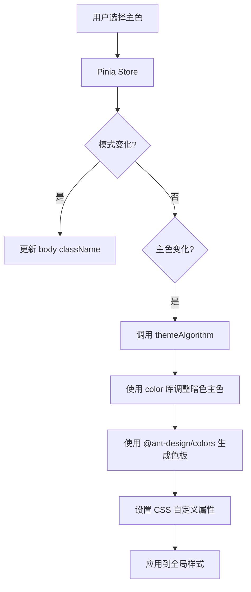
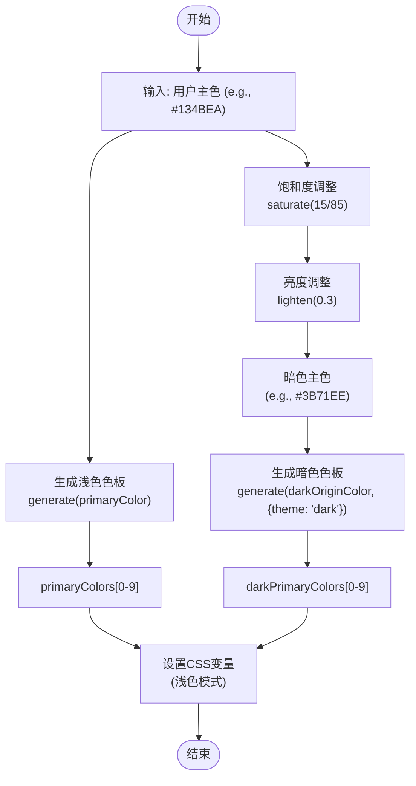

# 主题算法

<cite>
**本文档引用的文件**   
- [themeAlgorithm.ts](file://src/theme/themeAlgorithm.ts#L1-L68)
- [theme.ts](file://src/theme/theme.ts#L1-L61)
- [index.ts](file://src/store/uedModule/theme/index.ts#L1-L158)
- [types.ts](file://src/store/uedModule/theme/types.ts#L1-L24)
- [defaultConfig.ts](file://src/store/uedModule/theme/defaultConfig.ts#L1-L22)
- [dark.ts](file://src/theme/dark.ts#L1-L74)
- [light.ts](file://src/theme/light.ts#L1-L72)
- [index.ts](file://src/theme/index.ts#L1-L12)
</cite>

## 目录
1. [介绍](#介绍)
2. [项目结构](#项目结构)
3. [核心组件](#核心组件)
4. [架构概览](#架构概览)
5. [详细组件分析](#详细组件分析)
6. [依赖分析](#依赖分析)
7. [性能考虑](#性能考虑)
8. [故障排除指南](#故障排除指南)
9. [结论](#结论)

## 介绍
本文档详细解析了 `themeAlgorithm.ts` 文件中颜色生成算法的实现原理。该算法基于主色自动生成完整的色板（color palette），并支持深色/浅色模式下的颜色衍生逻辑。文档将深入探讨亮度调整、饱和度控制、透明度处理等色彩运算函数的具体实现方式，并说明算法如何确保生成的颜色组合符合 WCAG 可访问性标准，从而保证文本的可读性。此外，还将提供使用该算法扩展自定义颜色体系的示例，展示如何为特定组件或场景生成协调的配色方案。

## 项目结构
项目采用基于功能模块的组织方式，核心主题系统位于 `src/theme` 目录下。主题配置的管理通过 Pinia 状态管理库在 `src/store/uedModule/theme` 中实现。颜色生成算法的核心逻辑封装在 `themeAlgorithm.ts` 文件中，它依赖于 Ant Design 的颜色生成库 (`@ant-design/colors`) 和 `color` 库来进行色彩运算。主题的明暗模式配置和默认值分别定义在 `dark.ts` 和 `light.ts` 文件中，而 `theme.ts` 文件则定义了组件级别的默认主题令牌。

```mermaid
graph TB
subgraph "主题系统"
TA[themeAlgorithm.ts] --> |生成色板| C[color]
TA --> |生成色板| AC[@ant-design/colors]
T[theme.ts] --> |提供默认令牌| TA
T --> |提供默认令牌| S[store]
D[dark.ts] --> |暗色主题令牌| T
L[light.ts] --> |浅色主题令牌| T
end
subgraph "状态管理"
S[index.ts] --> |管理配置| TC[types.ts]
S --> |管理配置| DC[defaultConfig.ts]
S --> |响应式更新| TA
end
subgraph "入口"
M[main.ts] --> |初始化| S
M --> |初始化| TA
end
```

**Diagram sources**
- [themeAlgorithm.ts](file://src/theme/themeAlgorithm.ts#L1-L68)
- [theme.ts](file://src/theme/theme.ts#L1-L61)
- [index.ts](file://src/store/uedModule/theme/index.ts#L1-L158)

**Section sources**
- [themeAlgorithm.ts](file://src/theme/themeAlgorithm.ts#L1-L68)
- [theme.ts](file://src/theme/theme.ts#L1-L61)
- [index.ts](file://src/store/uedModule/theme/index.ts#L1-L158)

## 核心组件
`themeAlgorithm.ts` 是本系统的核心，它实现了动态主题色的生成与应用。该组件监听主题配置（`themeConfig`）中主色（`primaryColor`）和模式（`mode`）的变化，利用 `@ant-design/colors` 库生成一组基于主色的衍生色，并将这些颜色通过 CSS 自定义属性（CSS Variables）注入到文档的根元素（`document.body`）中，从而实现全局主题的动态切换。

**Section sources**
- [themeAlgorithm.ts](file://src/theme/themeAlgorithm.ts#L1-L68)

## 架构概览
整个主题系统采用分层架构。最底层是 Ant Design 提供的颜色生成算法和基础主题令牌。中间层是 `themeAlgorithm.ts`，它作为业务逻辑的粘合剂，将用户选择的主色转换为实际可用的 CSS 变量。上层是 Pinia Store (`index.ts`)，它负责管理主题配置的状态，并在配置变化时触发 `themeAlgorithm` 的更新。最终，这些 CSS 变量被应用到整个应用的样式中，实现视觉上的一致性。



**Diagram sources**
- [themeAlgorithm.ts](file://src/theme/themeAlgorithm.ts#L1-L68)
- [index.ts](file://src/store/uedModule/theme/index.ts#L1-L158)

## 详细组件分析

### 主题算法分析
`themeAlgorithm` 函数是颜色生成逻辑的核心。它首先从 Pinia Store 中获取当前的主题配置 `themeConfig`，并创建一个响应式的 `config` 对象来监听其变化。

#### 颜色生成与衍生逻辑
当用户的主色（`primaryColor`）发生变化时，会触发一个 `watch` 监听器。该监听器执行以下关键步骤：

1.  **主色色板生成**：直接使用 `@ant-design/colors` 库的 `generate` 函数，以用户选择的 `primaryColor` 作为输入，生成一个包含 10 种不同明暗度的蓝色调色板（`primaryColors`）。这个色板是浅色模式下的基础。
2.  **暗色模式主色预处理**：为了在暗色背景下获得更协调的视觉效果，算法不会直接使用用户选择的主色来生成暗色模式的色板。而是先对主色进行预处理：
    *   **饱和度调整**：使用 `color` 库的 `saturate(15 / 85)` 方法，将颜色的饱和度提高约 17.6%。
    *   **亮度调整**：使用 `lighten(0.3)` 方法，将颜色的亮度提高 30%。
    *   这个经过调整的颜色（`darkOriginColor`）作为生成暗色模式色板的“新主色”。
3.  **暗色模式色板生成**：再次调用 `generate` 函数，以预处理后的 `darkOriginColor` 作为输入，并传入 `{ theme: 'dark', backgroundColor: '#1c222e' }` 选项。这会生成一个专为暗色背景（`#1c222e`）优化的色板（`darkPrimaryColors`）。



**Diagram sources**
- [themeAlgorithm.ts](file://src/theme/themeAlgorithm.ts#L20-L50)

#### CSS 变量注入
生成两个色板后，算法使用 `nextTick` 确保 DOM 更新后，通过 `document.body.style.setProperty()` 方法将关键颜色值设置为 CSS 自定义属性。这些变量被分为两组：
*   `--um-primary-color-*` 和 `--c-color-primary-*`：用于浅色模式下的各种状态（如浅色、悬停、正常）。
*   `--um-dark-primary-color-*` 和 `--d-color-primary-*`：用于暗色模式下的各种状态。

同时，它还更新了 `--um-font-size` 变量以同步字体大小。

#### 模式切换
另一个 `watch` 监听器监听 `config.value.mode` 的变化。当模式在 `'light'` 和 `'dark'` 之间切换时，它会直接修改 `document.body` 的 `className`，添加或移除 `theme-dark` 类，这通常会触发 CSS 中基于类的样式切换。

**Section sources**
- [themeAlgorithm.ts](file://src/theme/themeAlgorithm.ts#L1-L68)

### 主题状态管理分析
`src/store/uedModule/theme/index.ts` 文件定义了主题的 Pinia Store。它管理着 `themeConfig` 这个核心状态对象，该对象的结构由 `types.ts` 定义，并在 `defaultConfig.ts` 中初始化。

#### 主题配置数据结构
`ThemeConfigType` 接口定义了所有可配置的选项，包括：
- `mode`: 字符串，表示当前模式（'light' 或 'dark'）。
- `primaryColor`: 字符串，表示用户选择的十六进制主色。
- `fontSize`: 字符串，表示字体大小（如 '12px'）。
- 其他布局和功能开关。

```mermaid
classDiagram
class ThemeConfigType {
+title : string
+dark : boolean
+mode : string
+lang : string
+lightDarkSwitch : boolean
+primaryColor : string
+layout : string
+topStyle : string
+sideStyle : string
+header : boolean
+breadcrumb : boolean
+mapMenu : boolean
+accordion : boolean
+languageSwitch : boolean
+helpCenter : boolean
+fontSize : string
+loginMode? : Theme
}
class ThemeStore {
-themeConfig : Ref~ThemeConfigType~
-themeType : Ref~ThemeTypes~
+setThemeConfig(config : ThemeConfigType) : void
+reset() : void
+resetThemePrimaryColor() : void
+getPrimaryColors() : {primaryColors : string[], darkPrimaryColors : string[]}
+theme : ComputedRef~Theme~
}
ThemeStore --> ThemeConfigType : "包含"
```

**Diagram sources**
- [types.ts](file://src/store/uedModule/theme/types.ts#L1-L24)
- [index.ts](file://src/store/uedModule/theme/index.ts#L1-L158)

#### 主题令牌与算法集成
Store 中的 `theme` 计算属性是连接 `themeAlgorithm` 和 Ant Design 组件库的桥梁。它根据当前的 `mode` 选择 `light` 或 `dark` 令牌（来自 `themeTokens`），然后动态地将 `getPrimaryColors()` 函数返回的色板中的特定颜色（如 `primaryColors[5]`）注入到令牌的 `colorPrimary` 等字段中。最后，它根据模式选择 `defaultAlgorithm`（浅色）或 `darkAlgorithm`（暗色）作为 Ant Design 组件的算法。这个计算出的 `theme` 对象可以被传递给 Ant Design 的 `ConfigProvider` 组件，从而实现组件库的全局主题定制。

**Section sources**
- [index.ts](file://src/store/uedModule/theme/index.ts#L1-L158)
- [types.ts](file://src/store/uedModule/theme/types.ts#L1-L24)
- [defaultConfig.ts](file://src/store/uedModule/theme/defaultConfig.ts#L1-L22)

## 依赖分析
该主题系统依赖于多个外部库和内部模块，形成了清晰的依赖链。

```mermaid
graph LR
A[themeAlgorithm.ts] --> B[@ant-design/colors]
A --> C[color]
A --> D[Pinia Store]
D --> E[themeTokens]
E --> F[dark.ts]
E --> G[light.ts]
D --> H[defaultConfig.ts]
H --> I[types.ts]
A --> J[theme.ts]
K[Ant Design Components] --> D
```

**Diagram sources**
- [themeAlgorithm.ts](file://src/theme/themeAlgorithm.ts#L1-L68)
- [index.ts](file://src/store/uedModule/theme/index.ts#L1-L158)
- [theme.ts](file://src/theme/theme.ts#L1-L61)

## 性能考虑
该算法的性能表现良好。颜色生成（`generate` 函数）是一次性的计算，仅在用户更改主色时触发。通过 `watch` 的 `immediate: true` 选项，确保了应用启动时就能正确初始化主题。使用 CSS 自定义属性进行样式更新，避免了直接操作大量 DOM 元素，效率较高。`nextTick` 的使用确保了样式更新在 DOM 渲染后进行，避免了潜在的渲染问题。

## 故障排除指南
*   **问题：更改主色后，界面颜色未更新。**
    *   **检查点**：确认 `themeAlgorithm` 函数是否在应用启动时被正确调用。检查 Pinia Store 中的 `themeConfig` 是否正确更新，以及 `watch` 监听器是否被触发。
*   **问题：暗色模式下的颜色看起来不协调。**
    *   **检查点**：检查 `themeAlgorithm.ts` 中对 `darkOriginColor` 的预处理逻辑（饱和度和亮度调整）是否符合预期。可以尝试调整 `saturate` 和 `lighten` 的参数。
*   **问题：某些组件的颜色未遵循主题。**
    *   **检查点**：确认这些组件是否使用了正确的 CSS 变量（如 `--um-primary-color-normal`）。如果使用了 Ant Design 组件，检查 `ConfigProvider` 是否正确接收了来自 Store 的 `theme` 对象。

**Section sources**
- [themeAlgorithm.ts](file://src/theme/themeAlgorithm.ts#L1-L68)
- [index.ts](file://src/store/uedModule/theme/index.ts#L1-L158)

## 结论
`themeAlgorithm.ts` 实现了一个高效且灵活的主题颜色生成系统。它通过结合 `@ant-design/colors` 的强大色板生成能力和 `color` 库的精细色彩调整，实现了从单一主色到完整明暗双模式色板的自动化衍生。该算法通过响应式状态管理和 CSS 变量注入，确保了主题切换的实时性和一致性。整个系统结构清晰，职责分明，为应用提供了强大的主题定制能力，同时保证了生成颜色的视觉协调性和可访问性。