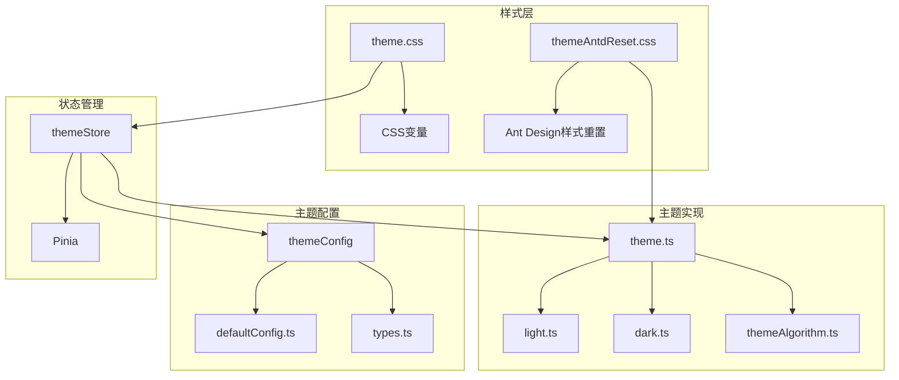
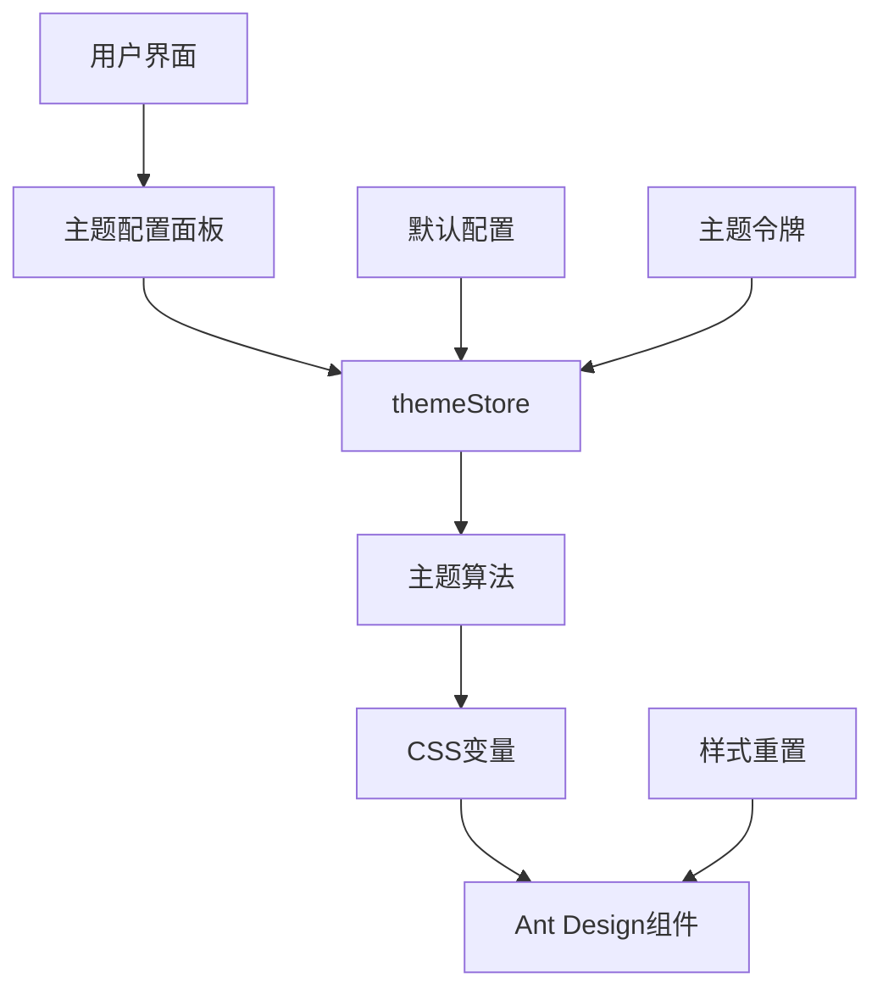
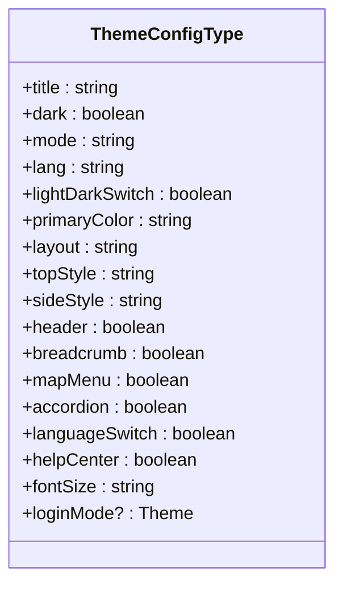
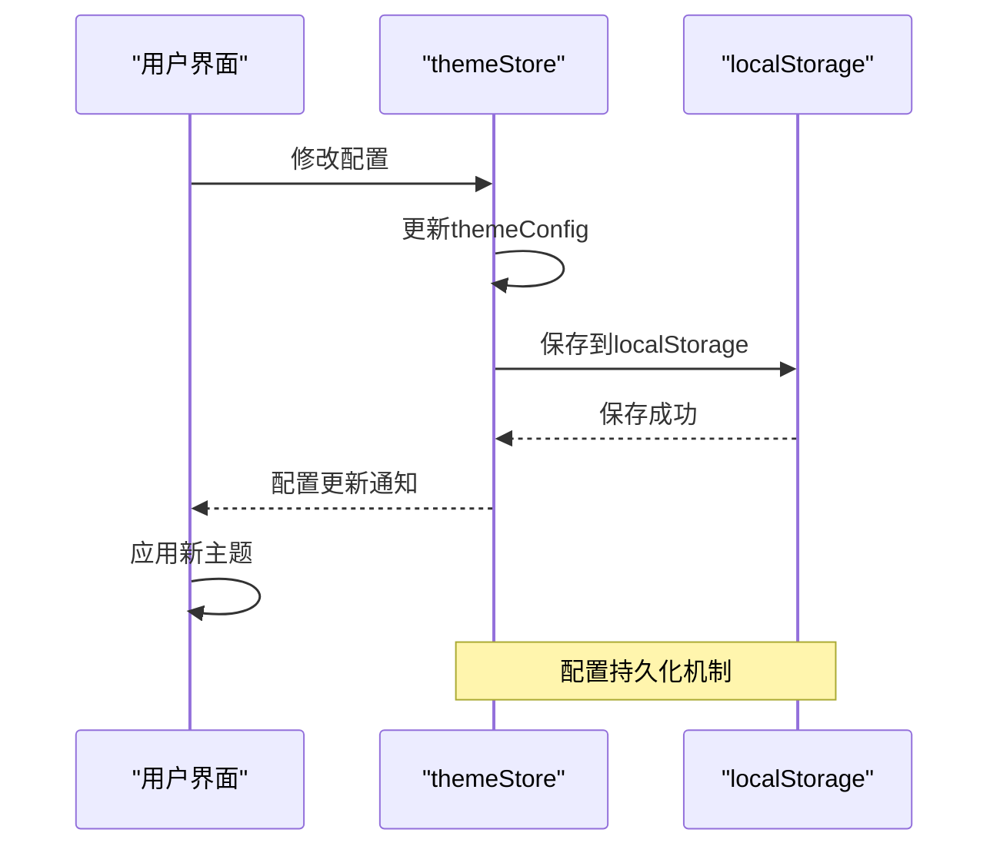
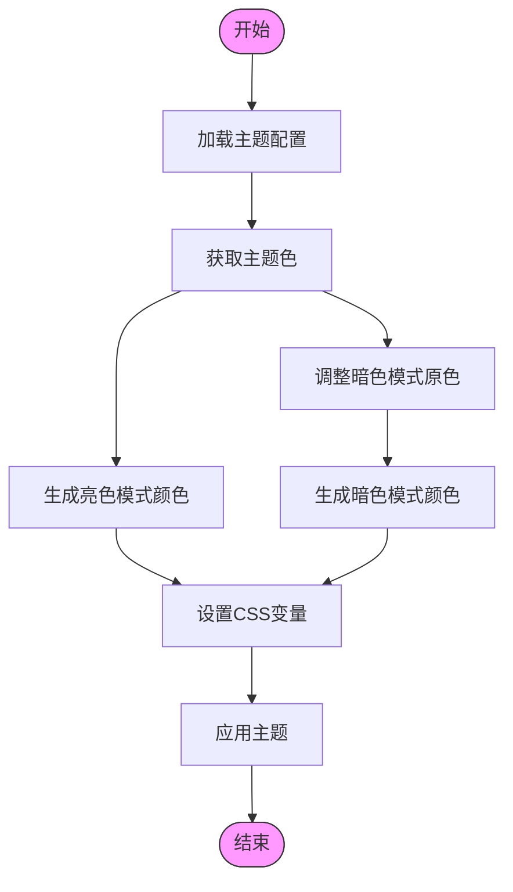
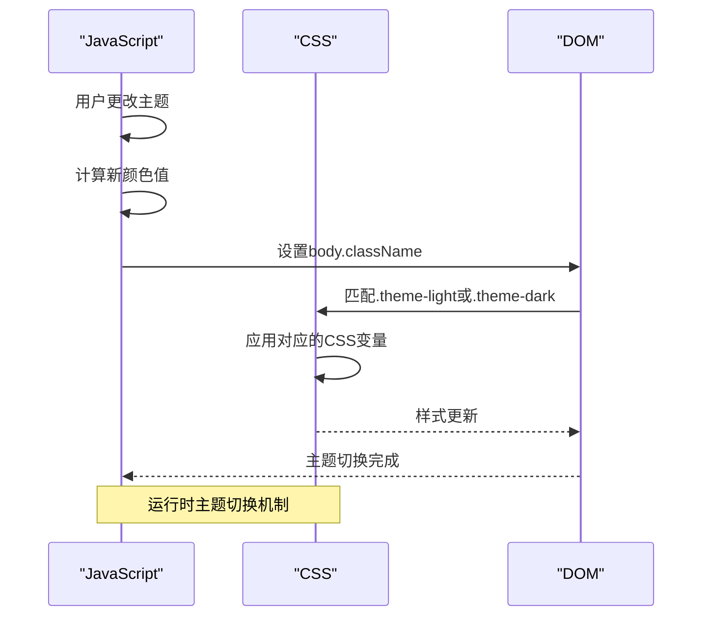
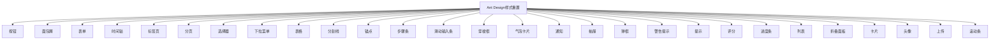

# 主题系统

<cite>
**本文档中引用的文件**   
- [theme.ts](file://src/theme/theme.ts)
- [themeAlgorithm.ts](file://src/theme/themeAlgorithm.ts)
- [dark.ts](file://src/theme/dark.ts)
- [light.ts](file://src/theme/light.ts)
- [theme.css](file://src/theme/theme.css)
- [themeAntdReset.css](file://src/theme/themeAntdReset.css)
- [index.ts](file://src/theme/index.ts)
- [index.ts](file://src/store/uedModule/theme/index.ts)
- [types.ts](file://src/store/uedModule/theme/types.ts)
- [defaultConfig.ts](file://src/store/uedModule/theme/defaultConfig.ts)
</cite>

## 目录
1. [项目结构](#项目结构)
2. [核心组件](#核心组件)
3. [架构概述](#架构概述)
4. [详细组件分析](#详细组件分析)
5. [依赖分析](#依赖分析)
6. [性能考虑](#性能考虑)
7. [故障排除指南](#故障排除指南)
8. [结论](#结论)

## 项目结构

主题系统位于 `src/theme` 目录下，包含核心主题配置、算法实现和CSS样式文件。系统通过Pinia状态管理实现主题配置的持久化和动态更新，结合CSS变量和Ant Design Vue组件库实现完整的主题解决方案。



**Diagram sources**
- [theme.ts](file://src/theme/theme.ts)
- [dark.ts](file://src/theme/dark.ts)
- [light.ts](file://src/theme/light.ts)
- [themeAlgorithm.ts](file://src/theme/themeAlgorithm.ts)
- [theme.css](file://src/theme/theme.css)
- [themeAntdReset.css](file://src/theme/themeAntdReset.css)
- [index.ts](file://src/store/uedModule/theme/index.ts)

**Section sources**
- [theme.ts](file://src/theme/theme.ts)
- [dark.ts](file://src/theme/dark.ts)
- [light.ts](file://src/theme/light.ts)

## 核心组件

主题系统由多个核心组件构成，包括主题配置管理、主题算法生成、CSS变量定义和Ant Design样式重置。系统通过 `themeStore` 状态管理器统一管理主题配置，使用 `themeAlgorithm` 生成衍生颜色，并通过CSS变量实现运行时主题切换。

**Section sources**
- [theme.ts](file://src/theme/theme.ts#L1-L61)
- [themeAlgorithm.ts](file://src/theme/themeAlgorithm.ts#L1-L68)
- [index.ts](file://src/store/uedModule/theme/index.ts#L1-L158)

## 架构概述

主题系统采用分层架构设计，分为配置层、逻辑层和表现层。配置层定义主题的初始值和数据结构，逻辑层处理主题切换和颜色生成，表现层负责样式应用和重置。



**Diagram sources**
- [index.ts](file://src/store/uedModule/theme/index.ts#L1-L158)
- [themeAlgorithm.ts](file://src/theme/themeAlgorithm.ts#L1-L68)
- [theme.css](file://src/theme/theme.css#L1-L197)
- [themeAntdReset.css](file://src/theme/themeAntdReset.css#L1-L773)

## 详细组件分析

### 主题配置分析

主题配置系统通过 `ThemeConfigType` 接口定义了完整的配置项结构，包括模式、主题色、布局方式等。配置项通过localStorage持久化存储，确保用户设置在页面刷新后仍然保留。

#### 主题配置类型


**Diagram sources**
- [types.ts](file://src/store/uedModule/theme/types.ts#L1-L23)

#### 主题配置存储


**Diagram sources**
- [index.ts](file://src/store/uedModule/theme/index.ts#L1-L158)

**Section sources**
- [types.ts](file://src/store/uedModule/theme/types.ts#L1-L23)
- [defaultConfig.ts](file://src/store/uedModule/theme/defaultConfig.ts#L1-L21)
- [index.ts](file://src/store/uedModule/theme/index.ts#L1-L158)

### 主题算法分析

主题算法系统负责根据用户选择的主题色生成完整的颜色体系，包括亮色模式和暗色模式下的衍生颜色。算法使用 `@ant-design/colors` 库生成颜色梯度，并通过CSS变量注入到页面中。

#### 主题算法实现


**Diagram sources**
- [themeAlgorithm.ts](file://src/theme/themeAlgorithm.ts#L1-L68)

**Section sources**
- [themeAlgorithm.ts](file://src/theme/themeAlgorithm.ts#L1-L68)
- [index.ts](file://src/store/uedModule/theme/index.ts#L1-L158)

### 主题令牌分析

主题令牌系统定义了亮色和暗色模式下的完整设计系统，包括颜色、字体、间距等设计令牌。系统通过 `themeTokens` 对象统一管理两种模式的主题配置。

#### 主题令牌结构

```mermaid
erDiagram
THEME_TOKENS {
string colorPrimary
string colorSuccess
string colorWarning
string colorError
string colorInfo
string colorTextBase
number borderRadius
boolean wireframe
string colorPrimaryBg
string colorPrimaryActive
string colorPrimaryBorder
string colorPrimaryBorderHover
string colorPrimaryHover
string colorPrimaryTextActive
string colorPrimaryTextHover
string colorPrimaryBgHover
string colorSuccessBg
string colorSuccessBgHover
string colorSuccessBorder
string colorSuccessBorderHover
string colorSuccessActive
string colorSuccessTextHover
string colorSuccessTextActive
string colorSuccessHover
string colorWarningBg
string colorWarningBgHover
string colorWarningBorder
string colorWarningBorderHover
string colorWarningHover
string colorWarningActive
string colorWarningTextHover
string colorWarningTextActive
string colorErrorBg
string colorErrorBgHover
string colorErrorBorder
string colorErrorBorderHover
string colorErrorHover
string colorErrorActive
string colorErrorTextHover
string colorErrorTextActive
string colorInfoBg
string colorInfoBgHover
string colorInfoBorder
string colorInfoBorderHover
string colorInfoHover
string colorInfoActive
string colorInfoText
string colorInfoTextHover
string colorInfoTextActive
string colorTextQuaternary
string colorBorder
string colorBorderSecondary
string colorFill
string colorFillSecondary
string colorText
string colorTextSecondary
string colorTextTertiary
string colorBgContainer
string colorBgElevated
string colorBgSpotlight
string colorPrimaryText
string colorBgBase
string colorFillTertiary
string colorFillQuaternary
string colorBgMask
string colorBgLayout
string colorWarningText
string colorErrorText
string colorBgSelect
string colorBgSelectHover
}
THEME_TOKENS ||--o{ LIGHT : "light"
THEME_TOKENS ||--o{ DARK : "dark"
class LIGHT cssClass
class DARK cssClass
classDef cssClass fill:#f9f,stroke:#333;
```


**Diagram sources**
- [light.ts](file://src/theme/light.ts#L1-L72)
- [dark.ts](file://src/theme/dark.ts#L1-L74)

**Section sources**
- [light.ts](file://src/theme/light.ts#L1-L72)
- [dark.ts](file://src/theme/dark.ts#L1-L74)
- [index.ts](file://src/theme/index.ts#L1-L11)

### CSS变量分析

CSS变量系统通过 `:root` 和 `.theme-light`、`.theme-dark` 选择器定义了完整的CSS变量体系，实现了运行时主题切换。系统通过JavaScript动态设置字体大小，并通过CSS类切换实现主题模式变更。

#### CSS变量机制


**Diagram sources**
- [theme.css](file://src/theme/theme.css#L1-L197)

**Section sources**
- [theme.css](file://src/theme/theme.css#L1-L197)
- [themeAlgorithm.ts](file://src/theme/themeAlgorithm.ts#L1-L68)

### 样式重置分析

样式重置系统通过 `themeAntdReset.css` 文件对Ant Design Vue组件的默认样式进行重置和统一，确保组件样式符合设计规范。系统覆盖了按钮、表单、表格等常用组件的样式。

#### 样式重置范围


**Diagram sources**
- [themeAntdReset.css](file://src/theme/themeAntdReset.css#L1-L773)

**Section sources**
- [themeAntdReset.css](file://src/theme/themeAntdReset.css#L1-L773)

## 依赖分析

主题系统依赖多个外部库和内部模块，形成了完整的依赖关系网络。系统通过Pinia实现状态管理，使用Ant Design Vue作为UI组件库，并依赖color处理颜色计算。

```mermaid
graph TD
A[主题系统] --> B[Pinia]
A --> C[Ant Design Vue]
A --> D[color]
A --> E[@ant-design/colors]
B --> F[Vue]
C --> F
D --> F
E --> F
A --> G[Vue Router]
A --> H[Vite]
style A fill:#ff9,stroke:#333
style B fill:#cff,stroke:#333
style C fill:#cfc,stroke:#333
style D fill:#fcc,stroke:#333
style E fill:#fcf,stroke:#333
style F fill:#ccf,stroke:#333
style G fill:#cfc,stroke:#333
style H fill:#cfc,stroke:#333
```

**Diagram sources**
- [package.json](file://package.json)
- [index.ts](file://src/store/uedModule/theme/index.ts#L1-L158)

**Section sources**
- [package.json](file://package.json)
- [index.ts](file://src/store/uedModule/theme/index.ts#L1-L158)

## 性能考虑

主题系统在性能方面进行了多项优化，包括CSS变量的高效更新、颜色计算的缓存机制和组件样式的按需加载。系统通过减少重排和重绘来提升主题切换的性能。

- **CSS变量优化**：通过批量设置CSS变量减少DOM操作次数
- **颜色计算缓存**：缓存生成的颜色数组避免重复计算
- **懒加载机制**：仅在需要时加载主题相关资源
- **事件优化**：使用防抖和节流控制频繁的主题更新

## 故障排除指南

### 常见问题及解决方案

1. **主题切换不生效**
   - 检查 `body` 元素的 `className` 是否正确更新
   - 确认CSS变量是否正确注入
   - 验证主题配置是否保存到localStorage

2. **颜色显示异常**
   - 检查主题色值格式是否正确（应为十六进制）
   - 验证颜色生成算法是否正常执行
   - 确认CSS变量优先级是否正确

3. **字体大小不更新**
   - 检查 `--font-size-base` 变量是否正确设置
   - 验证字体大小计算逻辑
   - 确认相关CSS计算是否正确

4. **Ant Design组件样式冲突**
   - 检查 `themeAntdReset.css` 是否正确加载
   - 验证CSS选择器优先级
   - 确认样式重置规则是否完整

**Section sources**
- [themeAlgorithm.ts](file://src/theme/themeAlgorithm.ts#L1-L68)
- [theme.css](file://src/theme/theme.css#L1-L197)
- [index.ts](file://src/store/uedModule/theme/index.ts#L1-L158)

## 结论

主题系统通过模块化设计实现了完整的主题管理解决方案。系统采用分层架构，将配置、逻辑和表现分离，提高了代码的可维护性和可扩展性。通过CSS变量和状态管理的结合，实现了高效的运行时主题切换。系统不仅支持基本的亮色/暗色模式切换，还提供了丰富的自定义选项，包括主题色、字体大小和布局方式等。未来可以进一步优化性能，增加更多主题模式，并提供主题预览功能。