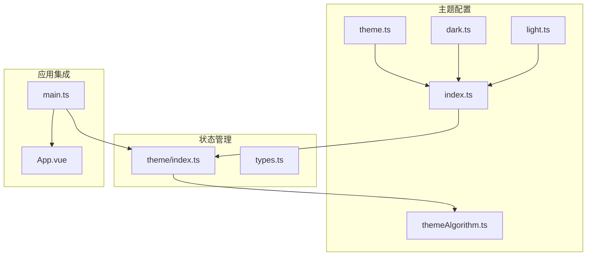
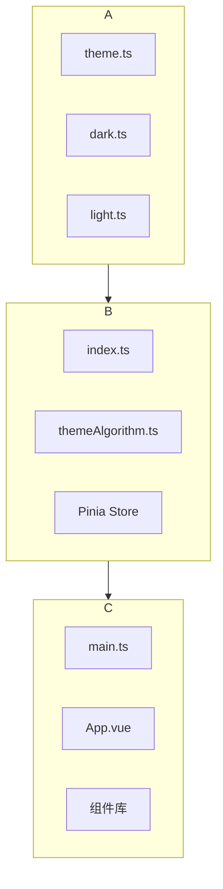
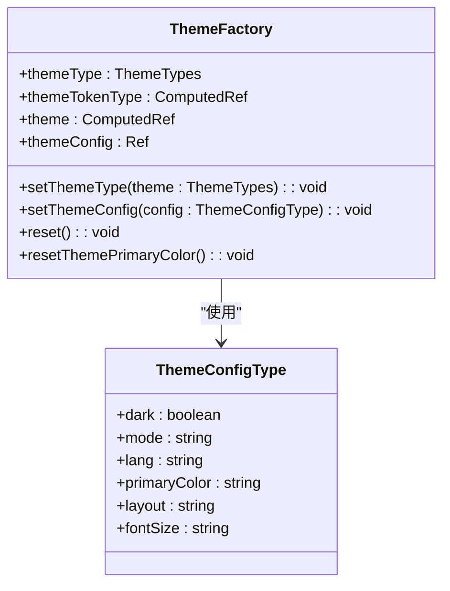
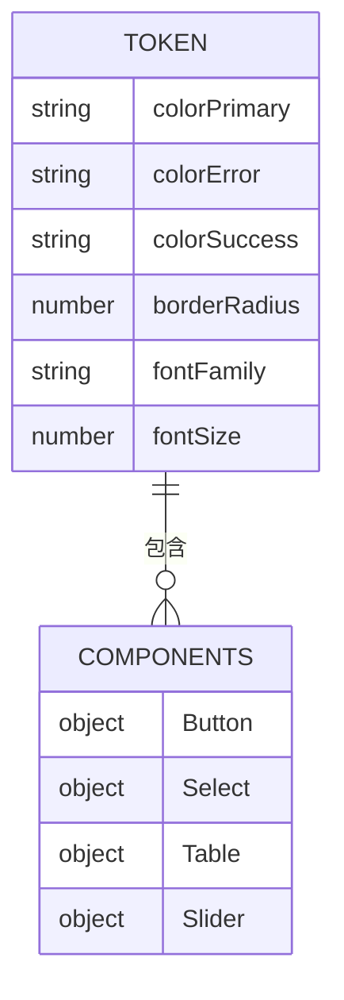
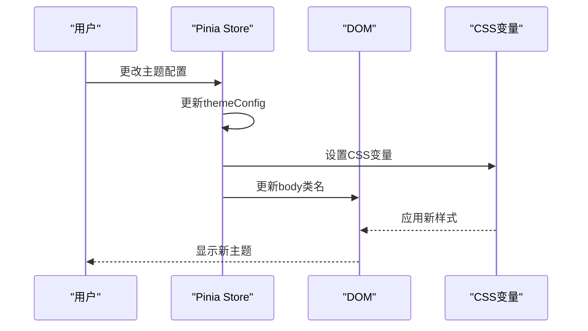

# 主题配置

<cite>
**本文档引用的文件**
- [theme.ts](file://src/theme/theme.ts)
- [index.ts](file://src/theme/index.ts)
- [dark.ts](file://src/theme/dark.ts)
- [light.ts](file://src/theme/light.ts)
- [types.ts](file://src/store/uedModule/theme/types.ts)
- [theme/index.ts](file://src/store/uedModule/theme/index.ts)
- [main.ts](file://src/main.ts)
- [themeAlgorithm.ts](file://src/theme/themeAlgorithm.ts)
</cite>

## 目录
1. [简介](#简介)
2. [项目结构](#项目结构)
3. [核心组件](#核心组件)
4. [架构概览](#架构概览)
5. [详细组件分析](#详细组件分析)
6. [依赖分析](#依赖分析)
7. [性能考量](#性能考量)
8. [故障排除指南](#故障排除指南)
9. [结论](#结论)

## 简介
本文档深入探讨了Vue项目中主题系统的实现机制，重点分析了`theme.ts`文件中的主题工厂函数、主题配置的结构设计、类型安全保障以及如何通过Pinia状态管理持久化用户主题偏好。文档详细解释了浅色和暗色主题的配置变量，展示了如何在应用中动态加载和切换主题，并提供了完整的代码示例和架构图。

## 项目结构
项目中的主题系统位于`src/theme`目录下，由多个文件协同工作。`theme.ts`定义了基础主题配置，`dark.ts`和`light.ts`分别定义了暗色和浅色主题的具体变量，`index.ts`负责导出主题实例，而`themeAlgorithm.ts`处理动态主题切换的逻辑。主题状态管理通过Pinia store在`src/store/uedModule/theme/`目录下实现。



**图示来源**
- [theme.ts](file://src/theme/theme.ts)
- [index.ts](file://src/theme/index.ts)
- [dark.ts](file://src/theme/dark.ts)
- [light.ts](file://src/theme/light.ts)
- [themeAlgorithm.ts](file://src/theme/themeAlgorithm.ts)
- [theme/index.ts](file://src/store/uedModule/theme/index.ts)
- [main.ts](file://src/main.ts)

## 核心组件
主题系统的核心组件包括主题配置对象、主题工厂函数、Pinia状态管理器和动态主题切换算法。这些组件共同实现了可复用、可扩展的主题系统，支持用户自定义主题色和明暗模式切换。

**本节来源**
- [theme.ts](file://src/theme/theme.ts#L1-L61)
- [index.ts](file://src/theme/index.ts#L1-L12)
- [types.ts](file://src/store/uedModule/theme/types.ts#L1-L24)

## 架构概览
主题系统的架构采用分层设计，上层为配置层，中层为逻辑层，底层为应用集成层。配置层定义了所有设计系统变量，逻辑层处理主题的生成和切换，集成层将主题应用到整个应用中。



**图示来源**
- [theme.ts](file://src/theme/theme.ts)
- [index.ts](file://src/theme/index.ts)
- [themeAlgorithm.ts](file://src/theme/themeAlgorithm.ts)
- [theme/index.ts](file://src/store/uedModule/theme/index.ts)
- [main.ts](file://src/main.ts)

## 详细组件分析

### 主题工厂函数分析
主题工厂函数通过函数式编程方式生成可复用的主题配置对象。它利用计算属性和响应式系统，根据用户配置动态生成主题。



**图示来源**
- [theme/index.ts](file://src/store/uedModule/theme/index.ts#L0-L158)
- [types.ts](file://src/store/uedModule/theme/types.ts#L1-L24)

### 主题配置结构设计
主题配置采用分层结构设计，分为`token`和`components`两个主要部分。`token`包含全局设计变量，如颜色、圆角、字体等；`components`包含特定组件的样式配置。



**图示来源**
- [theme.ts](file://src/theme/theme.ts#L1-L61)
- [dark.ts](file://src/theme/dark.ts#L1-L74)
- [light.ts](file://src/theme/light.ts#L1-L72)

### 动态主题切换机制
动态主题切换机制通过监听主题配置的变化，实时更新CSS变量和应用类名，实现无缝的主题切换体验。



**图示来源**
- [themeAlgorithm.ts](file://src/theme/themeAlgorithm.ts#L18-L67)
- [theme/index.ts](file://src/store/uedModule/theme/index.ts#L0-L158)

## 依赖分析
主题系统依赖于多个外部库和内部模块，包括Ant Design Vue的`theme`模块、`color`库用于颜色处理、`@ant-design/colors`用于生成颜色梯度，以及Pinia用于状态管理。

```mermaid
graph TD
A[主题系统] --> B[Ant Design Vue]
A --> C[Color库]
A --> D[@ant-design/colors]
A --> E[Pinia]
A --> F[Vue]
B --> G[暗色算法]
B --> H[默认算法]
C --> I[颜色处理]
D --> J[颜色梯度生成]
E --> K[状态管理]
F --> L[响应式系统]
```

**图示来源**
- [theme/index.ts](file://src/store/uedModule/theme/index.ts#L0-L158)
- [themeAlgorithm.ts](file://src/theme/themeAlgorithm.ts#L1-L67)

**本节来源**
- [theme/index.ts](file://src/store/uedModule/theme/index.ts#L0-L158)
- [themeAlgorithm.ts](file://src/theme/themeAlgorithm.ts#L1-L67)

## 性能考量
主题系统在性能方面做了多项优化，包括使用计算属性缓存主题配置、通过CSS变量减少DOM操作、使用`nextTick`确保DOM更新时机，以及通过`watch`的`deep`选项精确控制监听范围。

## 故障排除指南
当主题切换不生效时，可以检查以下几点：
1. 确认`ZQTHEMECONFIG` localStorage项是否正确更新
2. 检查body元素的类名是否根据模式正确切换
3. 验证CSS变量是否在`:root`或`body`上正确设置
4. 确认Pinia store中的`theme`计算属性是否重新计算

**本节来源**
- [themeAlgorithm.ts](file://src/theme/themeAlgorithm.ts#L18-L67)
- [theme/index.ts](file://src/store/uedModule/theme/index.ts#L0-L158)

## 结论
本文档详细分析了Vue项目中主题系统的实现机制，展示了如何通过函数式编程和响应式系统构建灵活的主题配置。系统采用分层架构，将配置、逻辑和集成分离，提高了代码的可维护性和可扩展性。通过Pinia状态管理和CSS变量，实现了高效的动态主题切换，为用户提供个性化的视觉体验。