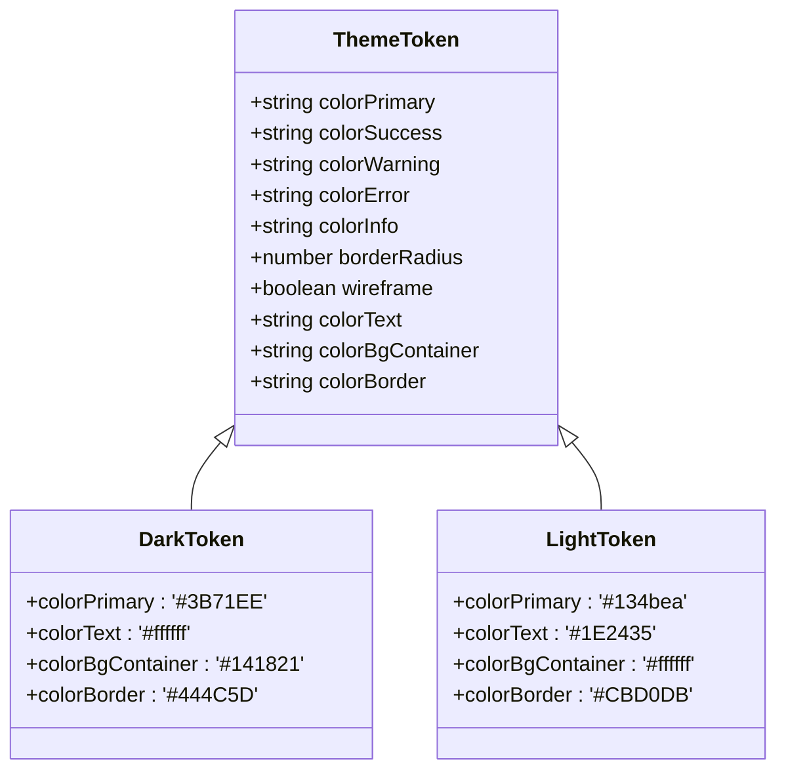
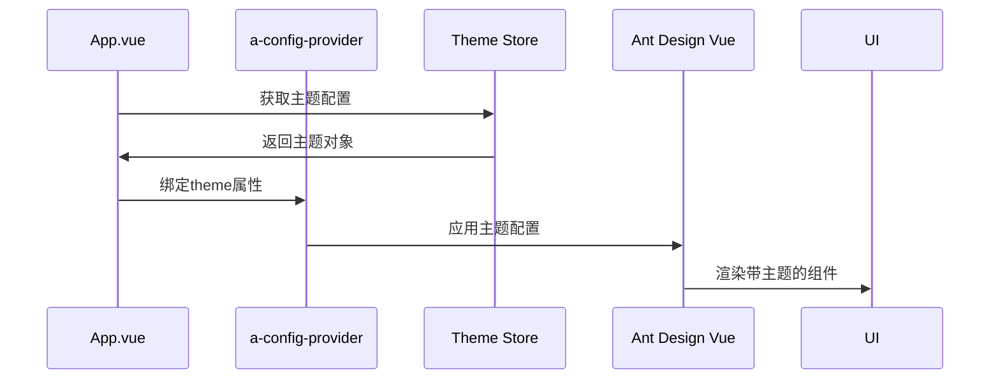
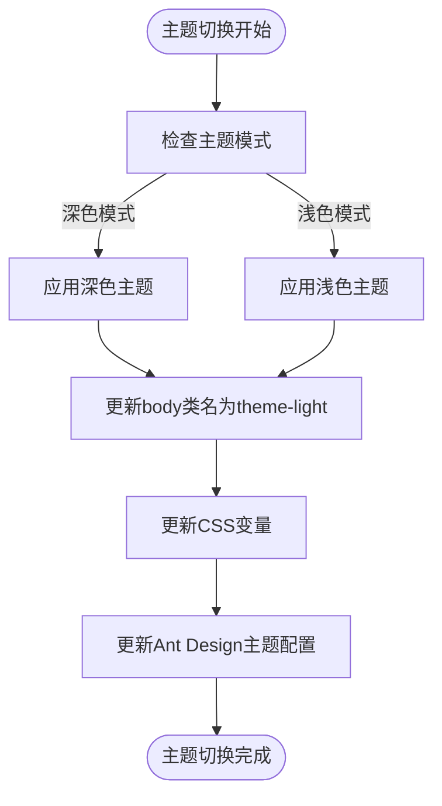

# 深色与浅色主题

<cite>
**本文档引用文件**   
- [dark.ts](file://src/theme/dark.ts)
- [light.ts](file://src/theme/light.ts)
- [theme.ts](file://src/theme/theme.ts)
- [themeAlgorithm.ts](file://src/theme/themeAlgorithm.ts)
- [index.ts](file://src/theme/index.ts)
- [theme.css](file://src/theme/theme.css)
- [themeAntdReset.css](file://src/theme/themeAntdReset.css)
- [App.vue](file://src/App.vue)
- [index.ts](file://src/store/uedModule/theme/index.ts)
</cite>

## 目录
1. [深色与浅色主题概述](#深色与浅色主题概述)
2. [设计令牌对比分析](#设计令牌对比分析)
3. [Ant Design Vue组件库适配](#ant-design-vue组件库适配)
4. [运行时主题切换实现](#运行时主题切换实现)
5. [性能优化与动画建议](#性能优化与动画建议)

## 深色与浅色主题概述

本项目实现了完整的深色与浅色双主题系统，通过`dark.ts`和`light.ts`文件分别定义了两种主题的设计令牌（Design Tokens）。主题系统基于Ant Design Vue组件库，并通过CSS变量和JavaScript动态配置相结合的方式实现。主题切换不仅改变了颜色方案，还调整了对比度、视觉层次和交互反馈，以适应不同环境下的用户体验需求。

深色主题以深灰和黑色为主色调，提供低光环境下的舒适视觉体验，减少眼睛疲劳。浅色主题则采用明亮的背景和清晰的对比度，符合传统网页浏览习惯。两种主题都遵循了WCAG 2.1无障碍标准，确保文本可读性和界面可用性。

**Section sources**
- [dark.ts](file://src/theme/dark.ts)
- [light.ts](file://src/theme/light.ts)

## 设计令牌对比分析

### 背景色配置

深色与浅色主题在背景色配置上存在显著差异，以适应不同的视觉环境。

**深色主题背景色**
- **容器背景色**: `colorBgContainer: '#141821'`
- **悬浮层背景色**: `colorBgElevated: '#1C222E'`
- **基础背景色**: `colorBgBase: '#2e3545'`
- **遮罩背景色**: `colorBgMask: 'rgba(0, 0, 0, 0.40)'`

**浅色主题背景色**
- **容器背景色**: `colorBgContainer: '#ffffff'`
- **悬浮层背景色**: `colorBgElevated: '#ffffff'`
- **基础背景色**: `colorBgBase: '#fff'`
- **遮罩背景色**: `colorBgMask: '#1f253673'`

### 文本色配置

两种主题的文本颜色配置体现了不同的可读性策略。

**深色主题文本色**
- **主要文本**: `colorText: '#ffffff'` (纯白色)
- **次要文本**: `colorTextSecondary: '#B0B8C8'` (浅灰色)
- **三级文本**: `colorTextTertiary: '#878EA0'` (中灰色)
- **基础文本**: `colorTextBase: '#878ea0'`

**浅色主题文本色**
- **主要文本**: `colorText: '#1E2435'` (深灰色)
- **次要文本**: `colorTextSecondary: '#353C51'` (中深灰色)
- **三级文本**: `colorTextTertiary: '#7E8494'` (中灰色)
- **基础文本**: `colorTextBase: '#7e8494'`

### 边框与分割线配置

边框颜色在两种主题中起到不同的视觉引导作用。

**深色主题边框**
- **主要边框**: `colorBorder: '#444C5D'` (深蓝灰色)
- **次要边框**: `colorBorderSecondary: '#394052'` (更深的蓝灰色)
- **填充色**: `colorFill: '#2E3545'` (深灰色)

**浅色主题边框**
- **主要边框**: `colorBorder: '#CBD0DB'` (浅灰色)
- **次要边框**: `colorBorderSecondary: '#E9EAF0'` (极浅灰色)
- **填充色**: `colorFill: '#f1f2f5'` (浅灰色)

### 交互状态颜色

两种主题在交互状态的颜色配置上保持了一致的设计逻辑，但具体数值不同。

**悬停状态**
- **深色主题**: 使用较亮的颜色作为悬停反馈，如`colorPrimaryHover: '#2E55AD'`
- **浅色主题**: 使用较深的颜色作为悬停反馈，如`colorPrimaryHover: '#6E9EFD'`

**激活状态**
- **深色主题**: 激活状态颜色更亮，提供明显的视觉反馈
- **浅色主题**: 激活状态颜色更深，保持界面的清晰度



**Diagram sources**
- [dark.ts](file://src/theme/dark.ts)
- [light.ts](file://src/theme/light.ts)

**Section sources**
- [dark.ts](file://src/theme/dark.ts)
- [light.ts](file://src/theme/light.ts)

## Ant Design Vue组件库适配

### 主题集成机制

项目通过Ant Design Vue的`a-config-provider`组件将自定义主题应用到整个应用。在`App.vue`文件中，使用`theme`属性绑定从Pinia store获取的主题配置。

```vue
<template>
  <a-config-provider :locale="zhCN" :theme="theme">
    <das-theme-provider :locale="zhCN" :theme="theme">
      <Layout class="layout-overflow-x">
        <RouterView></RouterView>
      </Layout>
    </das-theme-provider>
  </a-config-provider>
</template>
```

### 组件样式覆盖

通过`themeAntdReset.css`文件对Ant Design Vue组件的默认样式进行覆盖，确保UI一致性。

**按钮组件**
- 移除了默认阴影效果：`box-shadow:none`
- 自定义了链接按钮的悬停效果：`text-decoration: underline`

**表单组件**
- 统一了表单项的底部间距：`margin-bottom: 24px`
- 调整了垂直表单标签的内边距

**选择器组件**
- 自定义了下拉菜单的背景色：`background: var(--color-bg-component2)`
- 调整了选中项的颜色：`color: var(--color-brand-normal)`

### CSS变量应用

项目使用CSS变量系统来管理主题颜色，确保样式的可维护性和一致性。

**主题CSS变量**
- `--color-brand-normal`: 品牌色正常状态
- `--color-brand-hover`: 品牌色悬停状态
- `--color-text-primarys`: 主要文字颜色
- `--color-bg-container`: 容器背景色

这些CSS变量在`theme.css`文件中定义，并根据`.theme-light`和`.theme-dark`类名应用不同的值。



**Diagram sources**
- [App.vue](file://src/App.vue)
- [themeAntdReset.css](file://src/theme/themeAntdReset.css)

**Section sources**
- [App.vue](file://src/App.vue)
- [themeAntdReset.css](file://src/theme/themeAntdReset.css)

## 运行时主题切换实现

### 主题状态管理

主题配置通过Pinia store进行管理，实现了响应式和持久化存储。

```typescript
export default defineStore('theme', () => {
  const themeConfig = ref<ThemeConfigType>({ ...themeDefaultConfig, ...localThemeConfig });
  
  watch(
    themeConfig,
    (newValue) => {
      localStorage.setItem('ZQTHEMECONFIG', JSON.stringify(newValue));
    },
    { deep: true }
  );
  
  const theme = computed(() => {
    let token = themeTokens[themeTokenType.value as keyof typeof themeTokens];
    const { primaryColors, darkPrimaryColors } = getPrimaryColors();
    const isDark = themeTokenType.value === 'dark';
    
    return {
      token: {
        ...token,
        colorPrimary: isDark ? primaryColors[4] : primaryColors[5],
        colorPrimaryHover: isDark ? darkPrimaryColors[4] : primaryColors[4],
      },
      algorithm: themeTokenType.value === ThemeTypes.Dark ? darkAlgorithm : defaultAlgorithm,
      components: {
        // 组件特定配置
      }
    };
  });

  return {
    themeConfig,
    theme
  };
});
```

### 主题切换逻辑

主题切换通过修改body元素的类名和CSS变量来实现。

```typescript
watch(
  () => config.value.mode,
  (val) => {
    const bodyEl = document.body;
    bodyEl.className = val === 'dark' ? 'theme-dark' : 'theme-light';
  },
  { immediate: true }
);
```

当主题模式改变时，系统会：
1. 更新body元素的类名
2. 触发CSS变量的重新计算
3. 重新渲染受影响的组件

### 动态颜色生成

项目使用`@ant-design/colors`库动态生成主题色系。

```typescript
function getPrimaryColors() {
  let primaryColors: string[] = [];
  let darkPrimaryColors: string[] = [];
  const color = Color(themeConfig.value.primaryColor);
  const darkOriginColor = color
    .saturate(15 / 85)
    .lighten(0.3)
    .hex();
  primaryColors = generate(themeConfig.value.primaryColor);
  darkPrimaryColors = generate(darkOriginColor, { theme: 'dark', backgroundColor: '#1c222e' });
  return { primaryColors, darkPrimaryColors };
}
```



**Diagram sources**
- [themeAlgorithm.ts](file://src/theme/themeAlgorithm.ts)
- [index.ts](file://src/store/uedModule/theme/index.ts)

**Section sources**
- [themeAlgorithm.ts](file://src/theme/themeAlgorithm.ts)
- [index.ts](file://src/store/uedModule/theme/index.ts)

## 性能优化与动画建议

### 性能优化策略

1. **避免频繁重排重绘**: 通过CSS变量而不是直接修改样式属性来切换主题，减少DOM操作。
2. **使用计算属性**: 在Pinia store中使用computed属性缓存主题配置，避免重复计算。
3. **延迟更新**: 使用`nextTick`确保DOM更新完成后再应用主题变化。

### 动画实现建议

虽然当前实现没有包含主题切换动画，但可以考虑以下方案：

1. **淡入淡出动画**: 在主题切换时添加轻微的淡入淡出效果，使过渡更自然。
2. **CSS过渡**: 为关键颜色属性添加CSS过渡效果。

```css
:root, .theme-light, .theme-dark {
  transition: background-color 0.3s ease, color 0.3s ease;
}
```

3. **JavaScript动画**: 使用requestAnimationFrame实现更复杂的主题切换动画。

### 最佳实践

1. **预加载主题资源**: 在应用启动时预加载两种主题的CSS资源，避免切换时的延迟。
2. **用户偏好记忆**: 将用户的主题选择存储在localStorage中，实现个性化体验。
3. **系统主题同步**: 检测用户的操作系统主题设置，并自动匹配应用主题。

**Section sources**
- [themeAlgorithm.ts](file://src/theme/themeAlgorithm.ts)
- [theme.css](file://src/theme/theme.css)