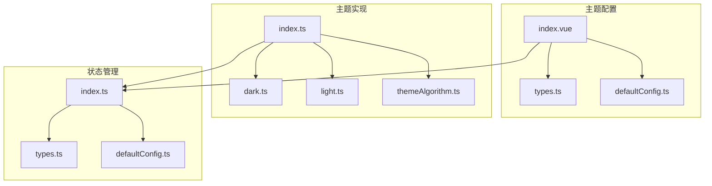
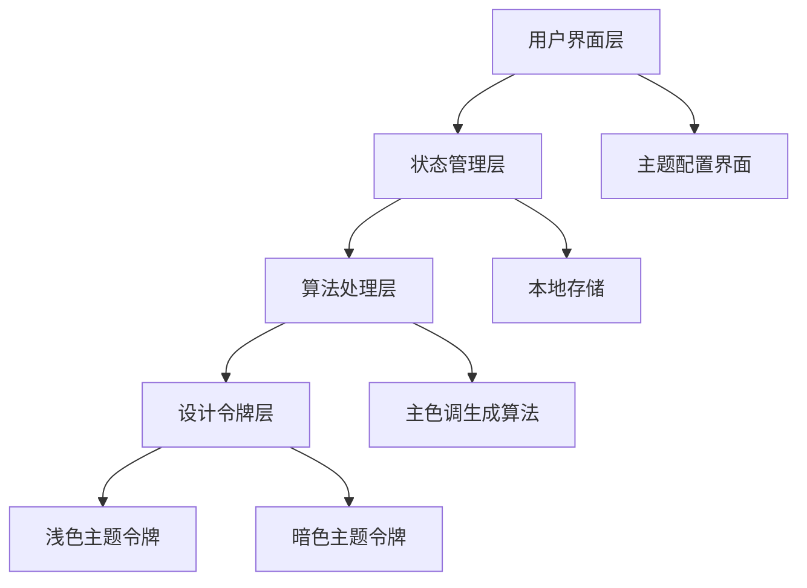
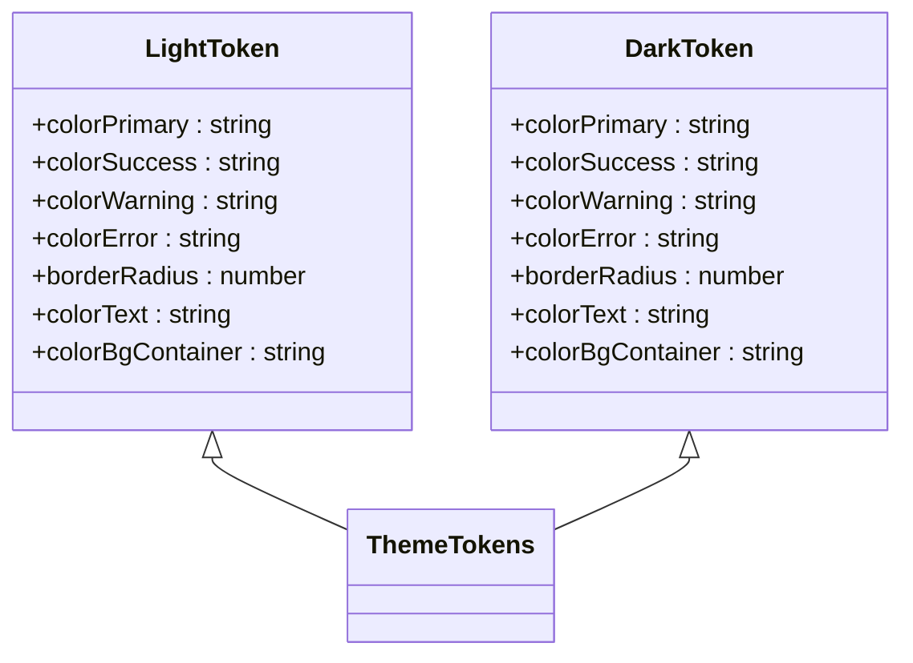
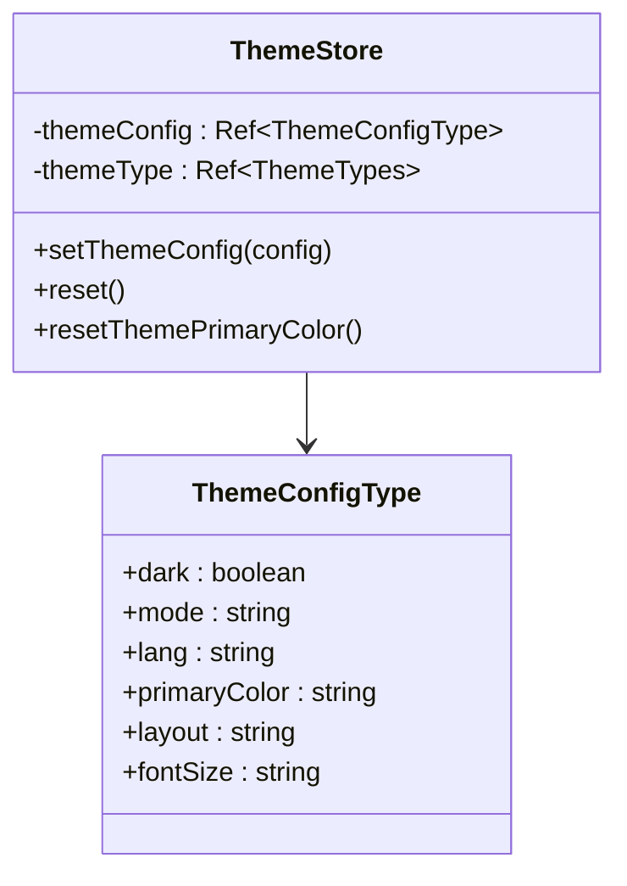
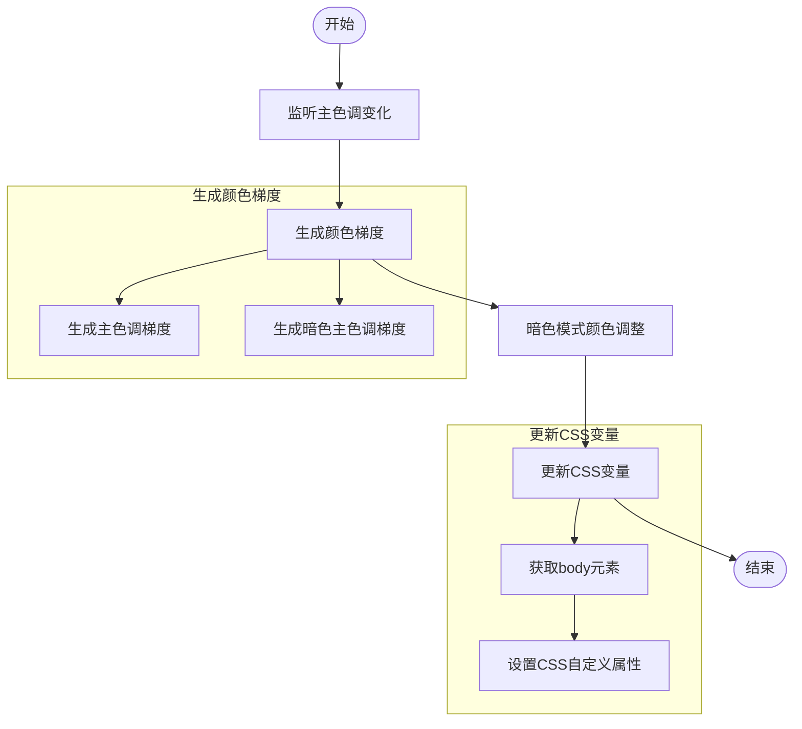
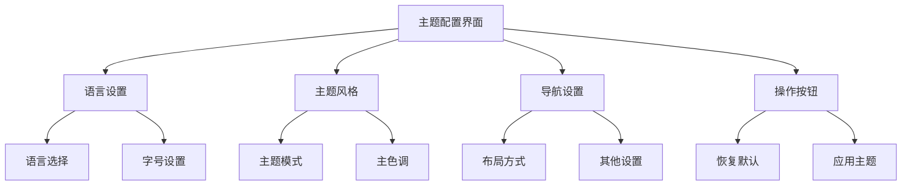

# 自定义主题扩展

<cite>
**本文档引用的文件**   
- [dark.ts](file://src/theme/dark.ts)
- [index.ts](file://src/theme/index.ts)
- [light.ts](file://src/theme/light.ts)
- [theme.ts](file://src/theme/theme.ts)
- [themeAlgorithm.ts](file://src/theme/themeAlgorithm.ts)
- [defaultConfig.ts](file://src/store/uedModule/theme/defaultConfig.ts)
- [index.ts](file://src/store/uedModule/theme/index.ts)
- [types.ts](file://src/store/uedModule/theme/types.ts)
- [index.vue](file://src/views/uedModule/themeConfig/index.vue)
</cite>

## 目录
1. [项目结构](#项目结构)
2. [核心组件](#核心组件)
3. [架构概述](#架构概述)
4. [详细组件分析](#详细组件分析)
5. [依赖分析](#依赖分析)
6. [性能考虑](#性能考虑)
7. [故障排除指南](#故障排除指南)
8. [结论](#结论)

## 项目结构
项目采用模块化架构，主题系统主要位于`src/theme`和`src/store/uedModule/theme`目录下。主题配置界面位于`src/views/uedModule/themeConfig/index.vue`。系统通过Pinia进行状态管理，结合Ant Design Vue组件库实现主题切换功能。



**图示来源**
- [index.vue](file://src/views/uedModule/themeConfig/index.vue)
- [index.ts](file://src/theme/index.ts)
- [index.ts](file://src/store/uedModule/theme/index.ts)

**本节来源**
- [index.vue](file://src/views/uedModule/themeConfig/index.vue)
- [index.ts](file://src/theme/index.ts)
- [index.ts](file://src/store/uedModule/theme/index.ts)

## 核心组件
主题系统由三个核心部分组成：主题令牌定义、主题状态管理和主题配置界面。主题令牌定义了浅色和暗色主题的设计令牌；主题状态管理使用Pinia存储主题配置并提供响应式更新；主题配置界面提供用户友好的主题定制体验。

**本节来源**
- [dark.ts](file://src/theme/dark.ts)
- [light.ts](file://src/theme/light.ts)
- [index.ts](file://src/store/uedModule/theme/index.ts)
- [index.vue](file://src/views/uedModule/themeConfig/index.vue)

## 架构概述
主题系统采用分层架构设计，从下到上分别为设计令牌层、算法处理层、状态管理层和用户界面层。设计令牌层定义了基础颜色和样式；算法处理层根据用户选择的主色调生成调色板；状态管理层持久化存储用户配置；用户界面层提供可视化配置界面。



**图示来源**
- [dark.ts](file://src/theme/dark.ts)
- [light.ts](file://src/theme/light.ts)
- [themeAlgorithm.ts](file://src/theme/themeAlgorithm.ts)
- [index.ts](file://src/store/uedModule/theme/index.ts)
- [index.vue](file://src/views/uedModule/themeConfig/index.vue)

## 详细组件分析

### 主题令牌分析
主题令牌是主题系统的基础，定义了应用的视觉设计语言。系统预定义了浅色和暗色两种主题模式，每种模式包含完整的颜色、圆角、字体等设计令牌。



**图示来源**
- [dark.ts](file://src/theme/dark.ts)
- [light.ts](file://src/theme/light.ts)
- [index.ts](file://src/theme/index.ts)

**本节来源**
- [dark.ts](file://src/theme/dark.ts)
- [light.ts](file://src/theme/light.ts)

### 主题状态管理分析
主题状态管理使用Pinia实现，存储用户的主题配置并提供响应式更新。配置包括主题模式、主色调、布局方式、语言等，并持久化到localStorage中。



**图示来源**
- [types.ts](file://src/store/uedModule/theme/types.ts)
- [index.ts](file://src/store/uedModule/theme/index.ts)

**本节来源**
- [types.ts](file://src/store/uedModule/theme/types.ts)
- [index.ts](file://src/store/uedModule/theme/index.ts)

### 主题算法分析
主题算法根据用户选择的主色调动态生成调色板，并更新CSS变量。算法使用@ant-design/colors库生成颜色梯度，同时考虑暗色模式下的颜色调整。



**图示来源**
- [themeAlgorithm.ts](file://src/theme/themeAlgorithm.ts)

**本节来源**
- [themeAlgorithm.ts](file://src/theme/themeAlgorithm.ts)

### 主题配置界面分析
主题配置界面提供用户友好的主题定制体验，分为语言设置、主题风格和导航设置三个部分。界面使用响应式设计，实时预览主题效果。



**图示来源**
- [index.vue](file://src/views/uedModule/themeConfig/index.vue)

**本节来源**
- [index.vue](file://src/views/uedModule/themeConfig/index.vue)

## 依赖分析
主题系统依赖多个外部库和内部模块。主要依赖包括@ant-design/colors用于颜色生成，color用于颜色操作，Pinia用于状态管理，以及Ant Design Vue组件库用于UI实现。

```mermaid
graph TD
A[主题系统] --> B[@ant-design/colors]
A --> C[color]
A --> D[Pinia]
A --> E[Ant Design Vue]
A --> F[Vue 3]
B --> G[颜色梯度生成]
C --> H[颜色操作]
D --> I[状态管理]
E --> J[UI组件]
F --> K[响应式系统]
```

**图示来源**
- [themeAlgorithm.ts](file://src/theme/themeAlgorithm.ts)
- [index.ts](file://src/store/uedModule/theme/index.ts)
- [index.vue](file://src/views/uedModule/themeConfig/index.vue)

**本节来源**
- [themeAlgorithm.ts](file://src/theme/themeAlgorithm.ts)
- [index.ts](file://src/store/uedModule/theme/index.ts)
- [index.vue](file://src/views/uedModule/themeConfig/index.vue)

## 性能考虑
主题系统在性能方面做了多项优化。通过CSS变量实现主题切换，避免了重新渲染整个应用；使用watchEffect进行响应式更新，确保配置变更的及时性；将主题配置持久化到localStorage，减少重复计算。

## 故障排除指南
常见问题包括主题不生效、颜色显示异常等。解决方案包括检查CSS变量是否正确设置、确认Pinia store是否正确更新、验证localStorage中的配置是否完整。

**本节来源**
- [themeAlgorithm.ts](file://src/theme/themeAlgorithm.ts)
- [index.ts](file://src/store/uedModule/theme/index.ts)
- [index.vue](file://src/views/uedModule/themeConfig/index.vue)

## 结论
主题系统提供了一套完整的主题定制解决方案，从设计令牌定义到用户界面实现，形成了闭环。系统具有良好的扩展性，可以轻松添加新的主题模式和设计令牌。