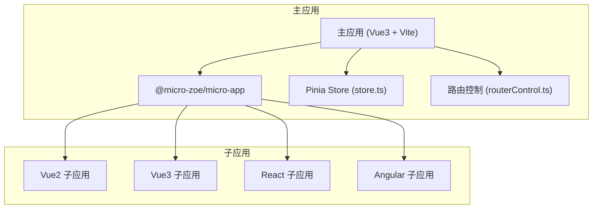
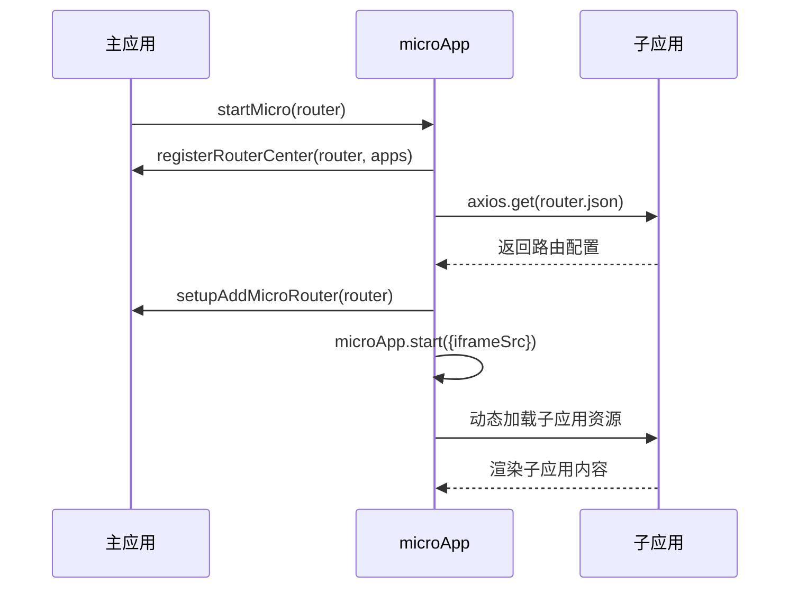
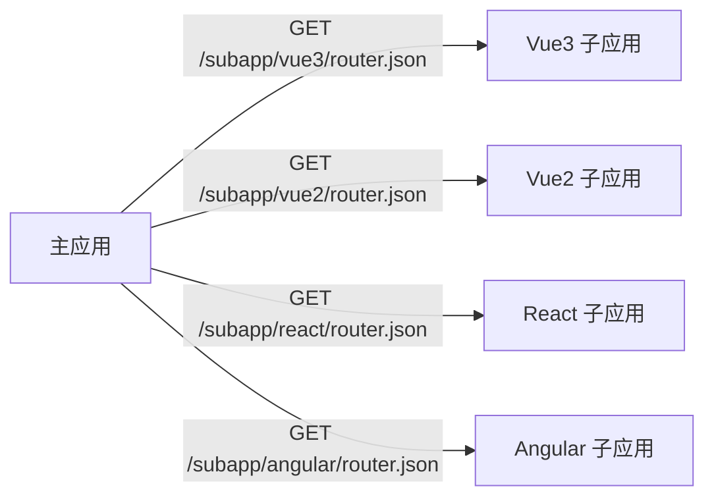

# 子应用注册与加载

<cite>
**本文档引用的文件**  
- [index.ts](file://src/micro/index.ts#L1-L65)
- [store.ts](file://src/micro/store.ts#L1-L45)
- [vite.config.js](file://src/micro/example/vue3/vite.config.js#L1-L33)
- [vue.config.js](file://src/micro/example/vue2/vue.config.js#L1-L33)
- [angular.json](file://src/micro/example/angular/angular.json#L1-L113)
- [config-overrides.js](file://src/micro/example/child-react/config-overrides.js#L1-L21)
- [package.json](file://src/micro/example/child-react/package.json#L1-L44)
- [public-path.js](file://src/micro/example/vue3/src/public-path.js#L1-L4)
- [bootstrap.js](file://src/micro/example/vue2/src/bootstrap.js#L1-L21)
- [public-path.js](file://src/micro/example/child-react/src/public-path.js#L1-L4)
</cite>

## 目录

1. [简介](#简介)
2. [项目结构](#项目结构)
3. [核心组件](#核心组件)
4. [架构概览](#架构概览)
5. [详细组件分析](#详细组件分析)
6. [依赖分析](#依赖分析)
7. [性能考量](#性能考量)
8. [故障排除指南](#故障排除指南)
9. [结论](#结论)

## 简介

本文档详细说明主应用如何通过 `@micro-zoe/micro-app` 注册不同技术栈的子应用，包括 Vue2、Vue3、React 和 Angular。文档涵盖 `registerApp` 方法的参数配置、子应用的构建输出配置、预加载与懒加载机制、资源路径处理、跨域问题及性能优化建议。目标是为开发者提供一份全面且易于理解的技术指南，帮助其快速集成和管理微前端架构中的子应用。

## 项目结构

本项目采用微前端架构，主应用负责注册和管理多个独立开发、部署的子应用。子应用位于 `src/micro/example/` 目录下，分别使用 Vue2、Vue3、React 和 Angular 构建。主应用通过 `@micro-zoe/micro-app` 实现子应用的加载与隔离。



**图示来源**  
- [index.ts](file://src/micro/index.ts#L1-L65)
- [store.ts](file://src/micro/store.ts#L1-L45)

## 核心组件

主应用的核心组件包括微应用注册逻辑、状态管理、路由中心和子应用配置。`index.ts` 文件中的 `startMicro` 函数是微前端初始化的入口，负责注册子应用、设置路由并启动 `microApp`。

`store.ts` 文件定义了 `SubApp` 接口和 `useMicroStore`，用于集中管理所有子应用的配置信息，如名称、URL、基础路由等。

**本节来源**  
- [index.ts](file://src/micro/index.ts#L1-L65)
- [store.ts](file://src/micro/store.ts#L1-L45)

## 架构概览

系统采用主从式微前端架构，主应用作为容器，通过 iframe 或 JS 沙箱加载子应用。子应用独立构建，通过配置公共路径（publicPath）确保资源正确加载。主应用通过 `microApp.start()` 启动微前端环境，并预加载子应用以提升用户体验。



**图示来源**  
- [index.ts](file://src/micro/index.ts#L1-L65)
- [store.ts](file://src/micro/store.ts#L1-L45)

## 详细组件分析

### 子应用注册与配置分析

主应用通过 `useMicroStore` 定义子应用列表，每个子应用包含以下关键字段：

- **name**: 子应用唯一标识符
- **url**: 子应用部署地址
- **baseroute**: 主应用中映射的基础路由
- **custom**: 是否为定制应用
- **routerMode**: 路由模式（hash 或 history）

```typescript
export interface SubApp {
  name: string;
  url: string;
  baseroute: string;
  custom?: boolean;
  routerMode?: 'hash' | 'history';
  meta?: {
    fullScreen?: boolean;
  };
}
```

**本节来源**  
- [store.ts](file://src/micro/store.ts#L1-L45)

### 各框架子应用构建配置分析

#### Vue3 子应用配置

Vue3 子应用使用 Vite 构建，其 `vite.config.js` 配置如下：

```javascript
export default defineConfig({
  base: `/subapp/vue3`,
  build: {
    outDir: path.resolve(__dirname, '../../../../dist/subapp/vue3')
  },
  server: {
    port: 7002
  }
});
```

- **base**: 设置资源的基础路径，确保资源从 `/subapp/vue3` 加载
- **outDir**: 指定构建输出目录

#### Vue2 子应用配置

Vue2 子应用使用 Vue CLI，其 `vue.config.js` 配置如下：

```javascript
module.exports = defineConfig({
  publicPath: '/subapp/vue2/',
  outputDir: path.resolve(__dirname, '../../../../dist/subapp/vue2'),
  devServer: {
    port: 7001,
    headers: {
      'Access-Control-Allow-Origin': '*'
    }
  }
});
```

- **publicPath**: 等同于 Vite 的 `base`，设置运行时资源路径
- **devServer.headers**: 解决开发环境跨域问题

#### React 子应用配置

React 子应用使用 `react-app-rewired` 覆盖默认配置，`config-overrides.js` 如下：

```javascript
module.exports = function override(config, env) {
  config.output.publicPath = '/subapp/react/';
  config.output.path = path.resolve(__dirname, '../../../../dist/subapp/react');
  return config;
};
```

- **homepage**: 在 `package.json` 中设置，等同于 `publicPath`
- **config-overrides.js**: 通过 `react-app-rewired` 修改 webpack 配置

#### Angular 子应用配置

Angular 子应用在 `angular.json` 中配置：

```json
"options": {
  "outputPath": "../../../../dist/subapp/angular",
  "baseHref": "/subapp/angular/"
}
```

- **baseHref**: 设置 `<base href>` 标签，影响资源加载路径
- **outputPath**: 构建输出目录

**本节来源**  
- [vite.config.js](file://src/micro/example/vue3/vite.config.js#L1-L33)
- [vue.config.js](file://src/micro/example/vue2/vue.config.js#L1-L33)
- [config-overrides.js](file://src/micro/example/child-react/config-overrides.js#L1-L21)
- [angular.json](file://src/micro/example/angular/angular.json#L1-L113)
- [package.json](file://src/micro/example/child-react/package.json#L1-L44)

### 子应用运行时公共路径配置

子应用在运行时需动态设置 `__webpack_public_path__`，以确保懒加载的 chunk 能正确加载。

#### Vue3 和 React 子应用

两者均通过 `public-path.js` 文件实现：

```javascript
if (window.__MICRO_APP_ENVIRONMENT__) {
  __webpack_public_path__ = window.__MICRO_APP_PUBLIC_PATH__;
}
```

此代码需在入口文件（如 `main.js`）的最顶部引入。

#### Vue2 子应用

Vue2 子应用在 `bootstrap.js` 中通过 `VueRouter` 的 `base` 属性处理路由：

```javascript
const router = new VueRouter({
  routes,
});
```

未显式设置 `base`，依赖 `publicPath` 和运行时环境变量。

**本节来源**  
- [public-path.js](file://src/micro/example/vue3/src/public-path.js#L1-L4)
- [public-path.js](file://src/micro/example/child-react/src/public-path.js#L1-L4)
- [bootstrap.js](file://src/micro/example/vue2/src/bootstrap.js#L1-L21)

## 依赖分析

主应用与子应用之间通过 HTTP 接口通信，主应用通过 `axios` 请求子应用的 `router.json` 文件获取路由配置。子应用需确保 `router.json` 文件可被跨域访问。



**图示来源**  
- [index.ts](file://src/micro/index.ts#L1-L65)

## 性能考量

- **预加载**: 主应用在 `startMicro` 中调用 `microApp.preFetch` 预加载子应用资源，提升首次访问速度。
- **懒加载**: 子应用仅在用户访问对应路由时才加载，减少初始加载时间。
- **资源路径优化**: 正确配置 `publicPath` 避免资源 404 错误，确保 chunk 正确加载。
- **构建输出分离**: 各子应用构建到独立目录，便于部署和版本管理。

## 故障排除指南

### 资源路径错误

**现象**: 子应用加载后，CSS 或 JS chunk 404。  
**解决方案**: 确保子应用的 `publicPath`（或 `base`、`homepage`、`baseHref`）与部署路径一致，并在运行时通过 `public-path.js` 动态设置 `__webpack_public_path__`。

### 跨域问题

**现象**: 开发环境下无法加载子应用资源。  
**解决方案**: 在子应用的开发服务器配置中添加 `Access-Control-Allow-Origin: *` 头部，如 Vue2 的 `devServer.headers`。

### 加载超时

**现象**: `registerRouterCenter` 中 `axios.get` 请求超时。  
**解决方案**: 增加 `timeout` 配置，或确保子应用服务已启动且网络通畅。

### 路由不匹配

**现象**: 子应用路由无法正确映射。  
**解决方案**: 检查主应用的 `baseroute` 与子应用的 `routerMode` 配置，确保路由模式一致。

**本节来源**  
- [index.ts](file://src/micro/index.ts#L1-L65)
- [vue.config.js](file://src/micro/example/vue2/vue.config.js#L1-L33)

## 结论

本文档详细阐述了主应用如何通过 `@micro-zoe/micro-app` 注册和管理多技术栈子应用。通过统一的配置规范（如 `publicPath`）和运行时机制（如 `public-path.js`），实现了子应用的无缝集成。开发者应遵循各框架的构建配置要求，正确处理资源路径和跨域问题，以确保微前端架构的稳定性和性能。