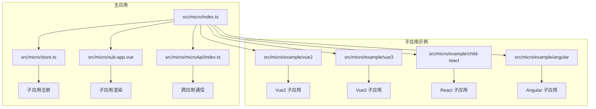
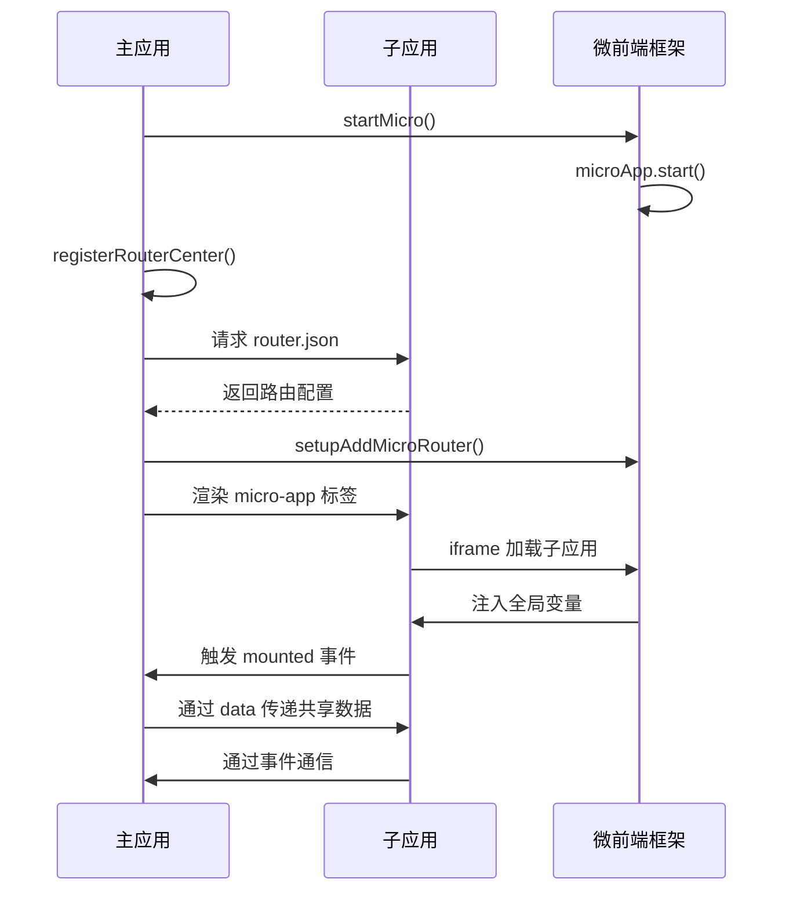

# 微前端集成

<cite>
**本文档引用的文件**  
- [index.ts](file://src/micro/index.ts)
- [store.ts](file://src/micro/store.ts)
- [sub-app.vue](file://src/micro/sub-app.vue)
- [microApi/index.ts](file://src/micro/microApi/index.ts)
- [bootstrap.js](file://src/micro/example/vue2/src/bootstrap.js)
- [main.js](file://src/micro/example/vue3/src/main.js)
- [index.js](file://src/micro/example/child-react/src/index.js)
- [main.ts](file://src/micro/example/angular/src/main.ts)
- [vue.config.js](file://src/micro/example/vue2/vue.config.js)
- [vite.config.js](file://src/micro/example/vue3/vite.config.js)
- [config-overrides.js](file://src/micro/example/child-react/config-overrides.js)
- [angular.json](file://src/micro/example/angular/angular.json)
- [router.js](file://src/micro/example/vue3/src/router.js)
- [router.js](file://src/micro/example/vue2/src/router.js)
</cite>

## 目录
1. [项目结构](#项目结构)
2. [主应用微前端配置](#主应用微前端配置)
3. [子应用注册与状态管理](#子应用注册与状态管理)
4. [子应用容器与渲染机制](#子应用容器与渲染机制)
5. [跨应用通信机制](#跨应用通信机制)
6. [各技术栈子应用接入方案](#各技术栈子应用接入方案)
7. [路由协调策略](#路由协调策略)
8. [构建配置与微前端集成](#构建配置与微前端集成)
9. [生命周期与数据流](#生命周期与数据流)
10. [性能优化与常见问题](#性能优化与常见问题)

## 项目结构

项目采用微前端架构，主应用基于 Vue3 实现，通过 `@micro-zoe/micro-app` 实现多框架子应用集成。核心微前端模块位于 `src/micro` 目录下，包含主应用的微前端初始化、状态管理、API 接口和子应用容器组件。



**Diagram sources**  
- [index.ts](file://src/micro/index.ts)
- [store.ts](file://src/micro/store.ts)
- [sub-app.vue](file://src/micro/sub-app.vue)

**Section sources**  
- [index.ts](file://src/micro/index.ts)
- [store.ts](file://src/micro/store.ts)

## 主应用微前端配置

主应用通过 `micro/index.ts` 文件初始化微前端环境，注册子应用并启动 `@micro-zoe/micro-app`。

```typescript
import microApp from '@micro-zoe/micro-app';
import { useMicroStore } from './store';
import { registerRouterCenter } from './routerControl';

export async function startMicro(router: Router) {
  const microStore = useMicroStore();
  const { apps } = microStore;
  
  // 注册路由中心，协调子应用路由
  await registerRouterCenter(router, apps);
  
  // 设置子应用路由控制
  setupAddMicroRouter(router);
  
  // 启动微前端，配置 iframe 沙箱
  microApp.start({
    iframeSrc: '/empty.html'
  });
}
```

该配置通过 `iframeSrc` 指定空页面作为 iframe 沙箱的源，确保子应用的 JS 和样式隔离。

**Section sources**  
- [index.ts](file://src/micro/index.ts#L1-L65)

## 子应用注册与状态管理

子应用的注册信息通过 Pinia 状态管理集中维护，定义在 `micro/store.ts` 中。

```typescript
export interface SubApp {
  name: string;
  url: string;
  baseroute: string;
  custom?: boolean;
  routerMode?: 'hash' | 'history';
  meta?: {
    fullScreen?: boolean;
  };
}

export const useMicroStore = defineStore('micro', () => {
  const apps = ref<SubApp[]>([
    {
      name: 'vue2',
      url: getRegistryUrl('vue2', '7001'),
      custom: true,
      baseroute: '/vue2'
    },
    {
      name: 'vue3',
      url: getRegistryUrl('vue3', '7002'),
      baseroute: '/vue3',
      routerMode: 'history'
    },
    {
      name: 'react',
      url: getRegistryUrl('react', '7003'),
      baseroute: '/react',
      routerMode: 'history'
    },
    {
      name: 'angular',
      url: getRegistryUrl('angular', '7004'),
      baseroute: '/angular'
    }
  ]);
  return { apps };
});
```

每个子应用包含名称、访问 URL、基础路由、路由模式等元信息，支持全屏模式等自定义配置。

**Section sources**  
- [store.ts](file://src/micro/store.ts#L1-L45)

## 子应用容器与渲染机制

子应用通过 `micro/sub-app.vue` 组件进行加载和渲染，该组件封装了 `micro-app` 自定义标签。

```vue
<template>
  <div :class="['micro-content', {'full-screen': isFullScreen}]">
    <a-button v-if="appInfo.name === 'vue2'" @click="sendData">动态发送基座数据</a-button>
    <micro-app
      :name="appInfo.name"
      :url="url"
      :baseroute="props.appInfo.baseroute"
      :data="globaldata"
      disable-memory-router
      iframe
      fiber
      @created="appCreated"
      @beforemount="appCreated"
      @mounted="appMounted"
    ></micro-app>
  </div>
  <div v-if="showSpin" pos-absolute inset-0 f-c-c z-1 style="background-color: rgba(55, 55, 55, 0.6)">
    <a-spin class="" tip="资源加载中..."> </a-spin>
  </div>
</template>
```

关键配置说明：
- `iframe`: 启用 iframe 沙箱，实现 JS 和样式隔离
- `fiber`: 启用 Fiber 架构优化渲染性能
- `disable-memory-router`: 禁用内存路由，使用真实路由
- `@created` 和 `@mounted`: 生命周期钩子，用于控制加载状态

**Section sources**  
- [sub-app.vue](file://src/micro/sub-app.vue#L1-L87)

## 跨应用通信机制

通过 `micro/microApi/index.ts` 提供统一的跨应用通信接口，基于 `@micro-zoe/micro-app` 的数据通信能力。

```typescript
// 向指定子应用发送数据
export function setData(appName: string, data: microData): void {
  microApp.setData(appName, data);
}

// 获取指定子应用的数据
export function getData(appName: string): microData | null {
  return microApp.getData(appName);
}

// 绑定数据监听
export function microAppAddDataListener(appName: string, dataListener: CallableFunction, autoTrigger?: boolean): void {
  microApp.addDataListener(appName, dataListener, autoTrigger);
}

// 全局数据通信
export function microAppSetGlobalData(data: microData) {
  microApp.setGlobalData(data);
}
export function microAppGetGlobalData(): microData | null {
  return microApp.getGlobalData();
}
```

主应用通过 `globaldata` 向子应用传递语言、主题、token 等共享状态，并提供 `pushState` 方法供子应用跳转。

**Section sources**  
- [microApi/index.ts](file://src/micro/microApi/index.ts#L1-L136)

## 各技术栈子应用接入方案

### Vue2 子应用接入

Vue2 子应用位于 `src/micro/example/vue2`，通过 `bootstrap.js` 进行初始化。

```javascript
import Vue from 'vue'
import App from './App.vue'
import VueRouter from 'vue-router'
import routes from './router'

const router = new VueRouter({
  routes,
})

new Vue({
  router,
  render: h => h(App),
}).$mount('#app')
```

构建配置在 `vue.config.js` 中设置 `publicPath` 为 `/subapp/vue2/`，确保资源路径正确。

### Vue3 子应用接入

Vue3 子应用位于 `src/micro/example/vue3`，入口文件 `main.js` 使用 `createApp` 初始化。

```javascript
import { createApp } from 'vue';
import App from './App.vue';
import router from './router';

createApp(App).use(router).mount('#app');
```

路由配置中使用 `window.__MICRO_APP_BASE_ROUTE__` 动态设置基础路由。

### React 子应用接入

React 子应用位于 `src/micro/example/child-react`，通过 `public-path.js` 处理微前端环境下的资源路径。

```javascript
if (window.__MICRO_APP_ENVIRONMENT__) {
  __webpack_public_path__ = window.__MICRO_APP_PUBLIC_PATH__
}
```

`config-overrides.js` 使用 `react-app-rewired` 覆盖 CRA 默认配置，设置输出路径和公共路径。

### Angular 子应用接入

Angular 子应用位于 `src/micro/example/angular`，通过全局声明 `mount` 和 `unmount` 函数支持微前端生命周期。

```typescript
// 监听卸载操作
window.unmount = () => {
  app?.destroy();
  console.log('微应用child-angular14卸载了 --- 默认模式');
};

// 如果不在微前端环境，则直接执行mount渲染
if (!window.__MICRO_APP_ENVIRONMENT__) {
  window.mount();
}
```

**Section sources**  
- [bootstrap.js](file://src/micro/example/vue2/src/bootstrap.js)
- [main.js](file://src/micro/example/vue3/src/main.js)
- [index.js](file://src/micro/example/child-react/src/index.js)
- [main.ts](file://src/micro/example/angular/src/main.ts)

## 路由协调策略

主应用通过 `routerCenter` 协调子应用路由，从子应用的 `router.json` 文件获取路由配置。

```typescript
async function registerRouterCenter(router: Router, apps: SubApp[]) {
  routeCenter = new RouterCenter(router);
  const res = await Promise.allSettled([
    ...apps.map((app: SubApp) => {
      const realUrl = getAppRealUrl(app.url);
      return axios.get(`${realUrl}${realUrl.endsWith('/') ? '' : '/'}router.json`, {
        timeout: 500
      });
    })
  ]);

  Array.from(res).forEach((item, index) => {
    if (item.status === 'fulfilled' && item.value.data) {
      if (apps[index]) {
        const { baseroute, routerMode } = apps[index];
        routeCenter.setModuleRoutes(item.value.data.data, baseroute.slice(1), routerMode);
      }
    }
  });
}
```

子应用通过 `micro-router-json-plugin` 插件在构建时生成 `router.json` 文件，暴露路由信息。

**Section sources**  
- [index.ts](file://src/micro/index.ts#L15-L50)
- [router.js](file://src/micro/example/vue3/src/router.js)
- [router.js](file://src/micro/example/vue2/src/router.js)

## 构建配置与微前端集成

### Vue2 构建配置

```javascript
module.exports = defineConfig({
  publicPath: '/subapp/vue2/',
  outputDir: path.resolve(__dirname, '../../../../dist/subapp/vue2'),
  devServer: {
    port: 7001,
    headers: {
      'Access-Control-Allow-Origin': '*',
    },
  },
  configureWebpack: {
    plugins: [
      new MicroRouterJsonPlugin({
        routerPath: process.cwd() +'/src/router.js',
        encrypt:false
      })
    ],
  }
})
```

### Vue3 构建配置

```javascript
export default defineConfig({
  base: `/subapp/vue3`,
  build:{
    outDir: path.resolve(__dirname, '../../../../dist/subapp/vue3'),
  },
  server: {
    port: 7002,
    host: true,
  },
  plugins: [
    MicroRouterJsonPlugin({
      routerPath: `${process.cwd()}/src/router.js`,
      encrypt: false
    })
  ]
})
```

### React 构建配置

```javascript
module.exports = function override(config, env) {
  config.output.publicPath = '/subapp/react/';
  config.output.path = path.resolve(__dirname, '../../../../dist/subapp/react');
  config.plugins.push(new MicroRouterJsonPlugin({
    routerPath: process.cwd() +'/src/router.js',
    encrypt:false
  }));
  return config;
}
```

### Angular 构建配置

```json
{
  "projects": {
    "angular14-2": {
      "architect": {
        "build": {
          "options": {
            "outputPath": "../../../../dist/subapp/angular",
            "baseHref": "/subapp/angular/"
          }
        }
      }
    }
  }
}
```

所有子应用构建输出到 `dist/subapp` 目录下的对应子目录，确保主应用可通过统一路径访问。

**Section sources**  
- [vue.config.js](file://src/micro/example/vue2/vue.config.js)
- [vite.config.js](file://src/micro/example/vue3/vite.config.js)
- [config-overrides.js](file://src/micro/example/child-react/config-overrides.js)
- [angular.json](file://src/micro/example/angular/angular.json)

## 生命周期与数据流



**Diagram sources**  
- [index.ts](file://src/micro/index.ts)
- [sub-app.vue](file://src/micro/sub-app.vue)

## 性能优化与常见问题

### 性能优化建议

1. **预加载**：在 `startMicro` 中调用 `microApp.preFetch()` 预加载子应用资源
2. **缓存策略**：利用浏览器缓存和 CDN 加速子应用静态资源
3. **按需加载**：子应用使用路由懒加载，减少初始包体积

### 常见集成问题及解决方案

| 问题 | 原因 | 解决方案 |
|------|------|----------|
| 样式冲突 | 子应用样式未隔离 | 启用 iframe 沙箱或使用 CSS Modules |
| JS 沙箱失效 | 子应用直接操作全局对象 | 确保使用 iframe 模式，避免直接访问 window |
| 路由跳转失败 | 基础路由未正确设置 | 在子应用路由中使用 `window.__MICRO_APP_BASE_ROUTE__` |
| 跨域问题 | 子应用服务未配置 CORS | 开发环境配置 `Access-Control-Allow-Origin: *` |
| 资源路径错误 | publicPath 未正确设置 | 确保构建配置中 publicPath 与访问路径一致 |

**Section sources**  
- [index.ts](file://src/micro/index.ts)
- [sub-app.vue](file://src/micro/sub-app.vue)
- [vue.config.js](file://src/micro/example/vue2/vue.config.js)