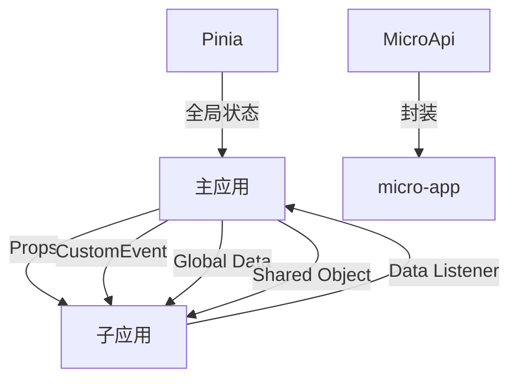
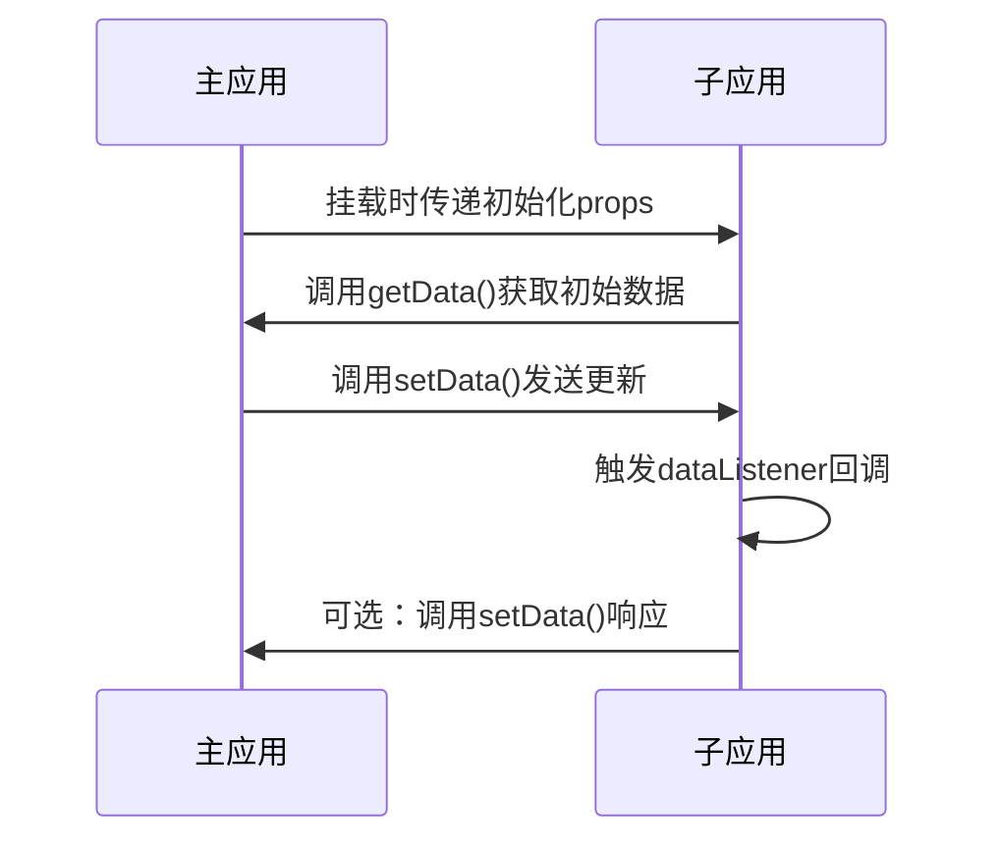

# 数据通信机制

<cite>
**本文档引用的文件**   
- [index.ts](file://src/micro/index.ts)
- [store.ts](file://src/micro/store.ts)
- [microApi/index.ts](file://src/micro/microApi/index.ts)
- [microApi/types.ts](file://src/micro/microApi/types.ts)
- [microApi/helper.ts](file://src/micro/microApi/helper.ts)
- [sub-app.vue](file://src/micro/sub-app.vue)
- [routerControl.ts](file://src/micro/routerControl.ts)
- [example/vue2/src/App.vue](file://src/micro/example/vue2/src/App.vue)
- [example/vue2/src/components/home.vue](file://src/micro/example/vue2/src/components/home.vue)
- [remote-lib.js](file://src/remote-lib.js)
</cite>

## 目录
1. [引言](#引言)
2. [主应用与子应用通信方案概览](#主应用与子应用通信方案概览)
3. [基于Props的初始化数据传递](#基于props的初始化数据传递)
4. [基于CustomEvent的事件通信机制](#基于customevent的事件通信机制)
5. [共享对象实现状态共享](#共享对象实现状态共享)
6. [通过microApi封装跨应用服务调用](#通过microapi封装跨应用服务调用)
7. [基于Pinia的全局状态共享](#基于pinia的全局状态共享)
8. [通信安全性与性能优化](#通信安全性与性能优化)
9. [结论](#结论)

## 引言
在微前端架构中，主应用与多个子应用之间的数据通信是实现功能集成和状态同步的关键。本文档系统阐述了项目中采用的多种数据通信方案，包括props传递、事件通信、共享对象、API封装和全局状态管理等机制。通过分析具体实现代码，详细说明各种通信方式的使用场景、技术原理和最佳实践，为开发者提供全面的技术参考。

## 主应用与子应用通信方案概览
本项目采用微前端架构，主应用通过`@micro-zoe/micro-app`库集成多个子应用（Vue2、Vue3、React、Angular）。通信机制设计遵循分层原则，针对不同场景提供相应的解决方案：

- **初始化数据传递**：通过`props`属性在子应用挂载时传递配置信息
- **动态数据通信**：基于`customEvent`机制实现应用间的数据发布/订阅
- **全局状态共享**：利用`microApp`提供的全局数据API实现跨应用状态同步
- **服务调用封装**：通过`microApi`模块封装底层通信接口
- **运行时共享**：通过模块联邦（Module Federation）实现代码和对象共享



**图示来源**
- [index.ts](file://src/micro/index.ts)
- [microApi/index.ts](file://src/micro/microApi/index.ts)
- [sub-app.vue](file://src/micro/sub-app.vue)

## 基于Props的初始化数据传递
### 同步Props传递
主应用通过`<micro-app>`组件的`data`属性向子应用传递初始化数据。这种通信方式在子应用挂载时同步完成，适用于传递配置信息、认证令牌等静态数据。

在`sub-app.vue`中，主应用定义了`globaldata`响应式对象，并通过`data`属性传递给子应用：

```typescript
const globaldata = ref<{
  language: 'zh' | 'en';
  token: string;
  pushState: PushStateFunction;
  themeMode: string;
}>({
  language: 'zh',
  token: '11111',
  themeMode: useThemeStore().themeConfig.mode,
  pushState: (path: string) => {
    router.push(path);
  }
});
```

```html
<micro-app
  :name="appInfo.name"
  :url="url"
  :baseroute="props.appInfo.baseroute"
  :data="globaldata"
  disable-memory-router
  iframe
  fiber
  @created="appCreated"
  @beforemount="appCreated"
  @mounted="appMounted"
></micro-app>
```

子应用通过`window.microApp.getData()`方法获取传递的数据：

```javascript
// example/vue2/src/App.vue
this.info = window.microApp.getData();
```

### 异步Props使用场景
异步数据传递通过`setData`和`addDataListener`API实现。主应用可以随时调用`setData`方法更新子应用数据，子应用通过监听器异步接收变化。

主应用发送动态数据：
```typescript
function sendData() {
  microApp.setData('vue2', { uuid: Math.random() });
}
```

子应用监听动态数据：
```javascript
window.microApp.addDataListener(this.getDynamicData, true);
```

**适用场景**：
- 主题模式切换
- 语言环境变更
- 用户认证状态更新
- 实时通知推送



**图示来源**
- [sub-app.vue](file://src/micro/sub-app.vue#L30-L86)
- [example/vue2/src/App.vue](file://src/micro/example/vue2/src/App.vue#L20-L30)

## 基于CustomEvent的事件通信机制
### 事件发布/订阅模式实现
项目采用`@micro-zoe/micro-app`库内置的事件机制实现跨应用通信，本质上是基于CustomEvent的发布/订阅模式。该机制提供了细粒度的数据监听控制。

#### 特定应用数据通信
主应用可以向特定子应用发送数据，并监听其响应：

```typescript
// 发送数据到特定子应用
export function setData(appName: string, data: microData): void {
  microApp.setData(appName, data);
}

// 获取特定子应用数据
export function getData(appName: string): microData | null {
  return microApp.getData(appName);
}

// 绑定数据监听器
export function microAppAddDataListener(
  appName: string, 
  dataListener: CallableFunction, 
  autoTrigger?: boolean
): void {
  microApp.addDataListener(appName, dataListener, autoTrigger);
}
```

#### 全局数据通信
实现广播式通信，所有子应用都能接收到全局数据变化：

```typescript
// 设置全局数据
export function microAppSetGlobalData(data: microData) {
  microApp.setGlobalData(data);
}

// 获取全局数据
export function microAppGetGlobalData(): microData | null {
  return microApp.getGlobalData();
}

// 绑定全局数据监听器
export function microAppAddGlobalDataListener(
  dataListener: CallableFunction, 
  autoTrigger?: boolean
): void {
  microApp.addGlobalDataListener(dataListener, autoTrigger);
}
```

### 通信流程分析
```mermaid
flowchart TD
A[主应用] --> B{通信类型}
B --> |特定应用| C[调用setData(appName, data)]
B --> |全局广播| D[调用setGlobalData(data)]
C --> E[目标子应用]
D --> F[所有子应用]
E --> G[触发addDataListener回调]
F --> H[触发addGlobalDataListener回调]
G --> I[子应用处理数据]
H --> I
I --> J[可选：响应主应用]
```

**自动触发机制**：`autoTrigger`参数控制监听器在绑定时是否立即执行。当设置为`true`时，如果已有缓存数据，监听器会立即被调用一次，确保子应用能获取到最新状态。

**生命周期管理**：子应用应在`beforeDestroy`阶段清理监听器，避免内存泄漏：

```javascript
beforeDestroy () {
  window.microApp.removeDataListener(this.getDynamicData);
  window.microApp.removeGlobalDataListener(this.getGlobalData);
}
```

**图示来源**
- [microApi/index.ts](file://src/micro/microApi/index.ts#L42-L84)
- [example/vue2/src/App.vue](file://src/micro/example/vue2/src/App.vue#L25-L30)

## 共享对象实现状态共享
### 模块联邦实现原理
项目通过模块联邦（Module Federation）实现运行时代码和对象共享。主应用将`dayjs`等公共库暴露为远程模块，子应用可以按需加载。

主应用`remote-lib.js`中定义了模块暴露机制：
```javascript
window.webpackChunkload_myRemote = {
  get: (module) => {
    return Promise.resolve(() => {
      switch (module) {
        case './dayjs':
          return dayjs;
        default:
          throw new Error(`未知模块: ${module}`);
      }
    });
  },
  init: (shareScope) => {
    console.log(shareScope);
  }
};
```

### 共享限制与挑战
1. **版本兼容性**：主应用和子应用必须使用兼容的库版本
2. **加载时机**：共享对象必须在子应用启动前可用
3. **作用域隔离**：共享对象在全局作用域中，需注意命名冲突
4. **按需加载**：不支持真正的按需加载，整个远程模块都会被加载

### 替代方案对比
| 方案 | 优点 | 缺点 | 适用场景 |
|------|------|------|----------|
| Props传递 | 简单直接，类型安全 | 仅支持初始化传递 | 静态配置 |
| CustomEvent | 实时性强，支持双向通信 | 需要手动管理监听器 | 动态状态同步 |
| 共享对象 | 减少重复代码，节省资源 | 版本管理复杂，耦合度高 | 公共工具库 |
| 全局状态 | 统一管理，自动同步 | 中心化，可能成为性能瓶颈 | 全局配置 |

**图示来源**
- [remote-lib.js](file://src/remote-lib.js#L10-L20)
- [example/vue2/src/loadComponents.js](file://src/micro/example/vue2/src/loadComponents.js)

## 通过microApi封装跨应用服务调用
### API封装设计
`microApi`模块对`@micro-zoe/micro-app`的底层API进行了封装，提供了更友好的接口和类型定义。

#### 核心功能封装
```typescript
// 应用生命周期管理
export function unmountMicroApp(appName: string, options?: unmountAppParams): Promise<boolean>
export function unmountMicroAllApps(options?: unmountAppParams): Promise<boolean>

// 数据通信封装
export function setData(appName: string, data: microData): void
export function getData(appName: string): microData | null

// 监听器管理
export function microAppAddDataListener(appName: string, dataListener: CallableFunction, autoTrigger?: boolean)
export function microAppRemoveDataListener(appName: string, dataListener: CallableFunction)
```

#### 类型安全保证
通过`types.ts`文件定义了严格的类型约束：

```typescript
export type microData = Record<PropertyKey, unknown>;
export type DynamicObject = Record<PropertyKey, unknown>;

export interface unmountAppParams {
  destroy?: boolean;
  clearAliveState?: boolean;
}
```

### 路由集成封装
`microApi`还封装了路由相关的通信功能：

```typescript
// 设置主应用路由，供子应用跳转
export function setBaseAppRouter(router: Router) {
  microApp.router.setBaseAppRouter(router);
}

// 监听子应用路由变化
export function monitorChildRouterChange(guard: RouterGuard): () => boolean {
  return microApp.router.beforeEach(guard);
}
```

子应用可以通过传递的`pushState`函数实现跨应用导航：

```javascript
// example/vue2/src/components/home.vue
goToVue3() {
  window.microApp.getData().pushState('/vue3/about')
}
```

### 预加载优化
提供预加载接口，提升用户体验：

```typescript
export function microAppPreFetch(apps: prefetchParamList) {
  microApp.preFetch(apps);
}
```

**图示来源**
- [microApi/index.ts](file://src/micro/microApi/index.ts)
- [microApi/types.ts](file://src/micro/microApi/types.ts)
- [example/vue2/src/components/home.vue](file://src/micro/example/vue2/src/components/home.vue#L15-L20)

## 基于Pinia的全局状态共享
### store.ts中的Pinia实例
主应用使用Pinia作为状态管理方案，`store.ts`文件定义了微前端相关的全局状态：

```typescript
export const useMicroStore = defineStore('micro', () => {
  const apps = ref<SubApp[]>([
    {
      name: 'vue2',
      url: getRegistryUrl('vue2', '7001'),
      custom: true,
      baseroute: '/vue2'
    },
    {
      name: 'vue3',
      url: getRegistryUrl('vue3', '7002'),
      baseroute: '/vue3',
      routerMode: 'history'
    }
    // ...其他子应用
  ]);
  return {
    apps
  };
});
```

### 设计模式分析
1. **单一状态树**：所有子应用配置集中管理，便于维护
2. **响应式更新**：使用`ref`实现状态的响应式，自动触发视图更新
3. **类型安全**：通过TypeScript接口定义确保数据结构一致性
4. **模块化设计**：与其他业务状态分离，职责单一

### 与microApp的协同
Pinia状态与`micro-app`运行时状态协同工作：

- **初始化阶段**：从Pinia store读取子应用配置
- **运行时阶段**：通过`microApp` API管理子应用生命周期
- **状态同步**：Pinia管理静态配置，`microApp`管理动态状态

```mermaid
classDiagram
class useMicroStore {
+apps : Ref<SubApp[]>
+getApps() : SubApp[]
}
class SubApp {
+name : string
+url : string
+baseroute : string
+custom? : boolean
+routerMode? : 'hash' | 'history'
+meta? : { fullScreen? : boolean }
}
class microApp {
+setData(appName, data)
+getData(appName)
+addDataListener(appName, listener)
+setGlobalData(data)
}
useMicroStore --> SubApp : "包含"
useMicroStore --> microApp : "配置"
microApp --> SubApp : "运行时"
```

**图示来源**
- [store.ts](file://src/micro/store.ts)
- [index.ts](file://src/micro/index.ts#L37-L45)

## 通信安全性与性能优化
### 安全性考虑
1. **数据验证**：所有通信数据应进行类型验证和边界检查
2. **敏感信息**：避免通过通信通道传递敏感信息（如完整令牌）
3. **XSS防护**：对传递的HTML内容进行转义处理
4. **权限控制**：不同子应用间的数据访问应有权限控制

### 数据类型限制
- **支持类型**：基本类型、对象、数组
- **限制类型**：函数、Symbol、BigInt、undefined
- **序列化要求**：数据需能被`JSON.stringify`序列化

### 性能影响评估
| 通信方式 | 性能开销 | 内存占用 | 延迟 |
|---------|---------|---------|------|
| Props传递 | 低 | 低 | 低 |
| CustomEvent | 中 | 中 | 低 |
| 全局状态 | 高 | 高 | 低 |
| 共享对象 | 低 | 低 | 高（首次加载） |

### 优化建议
1. **批量更新**：避免频繁调用`setData`，合并多次更新
2. **选择性监听**：只监听必要的数据变化
3. **内存管理**：及时清理不再需要的监听器
4. **懒加载**：非关键子应用采用懒加载策略
5. **数据压缩**：大数据量通信时考虑压缩
6. **错误处理**：添加完善的错误处理和重试机制

```typescript
// 优化示例：防抖更新
let updateTimer: NodeJS.Timeout;
function optimizedSetData(appName: string, data: microData) {
  clearTimeout(updateTimer);
  updateTimer = setTimeout(() => {
    microApp.setData(appName, data);
  }, 100); // 100ms内最后一次更新生效
}
```

## 结论
本项目实现了完整的微前端数据通信体系，通过多种机制满足不同场景需求：

1. **Props传递**适用于初始化配置，简单高效
2. **CustomEvent机制**提供灵活的实时通信能力
3. **全局状态管理**实现跨应用状态同步
4. **API封装**提高开发效率和代码可维护性
5. **模块联邦**优化资源利用，减少重复加载

建议在实际开发中根据具体场景选择合适的通信方式，优先考虑Props和事件通信，谨慎使用全局状态和共享对象。同时注意性能优化和安全性保障，确保系统的稳定性和可扩展性。