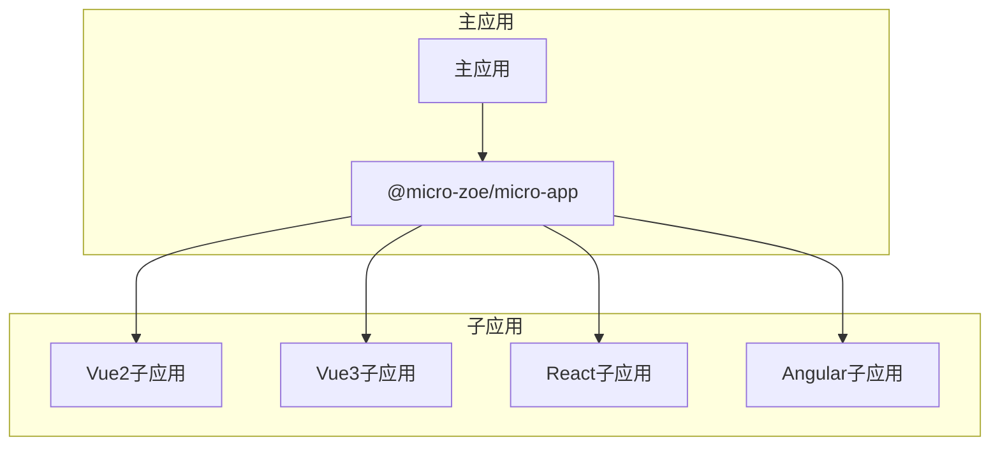
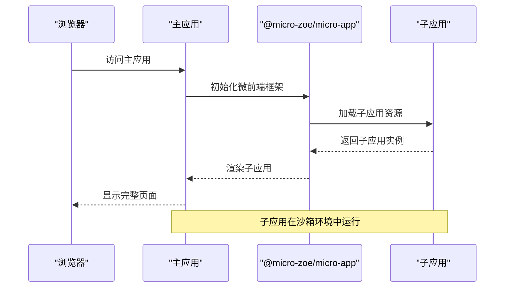
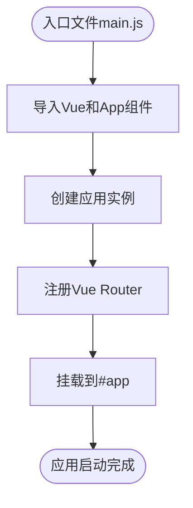
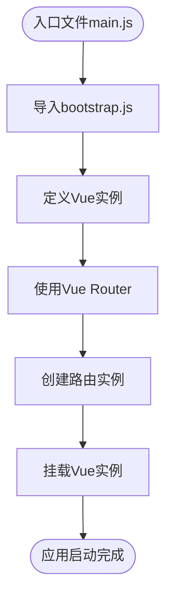
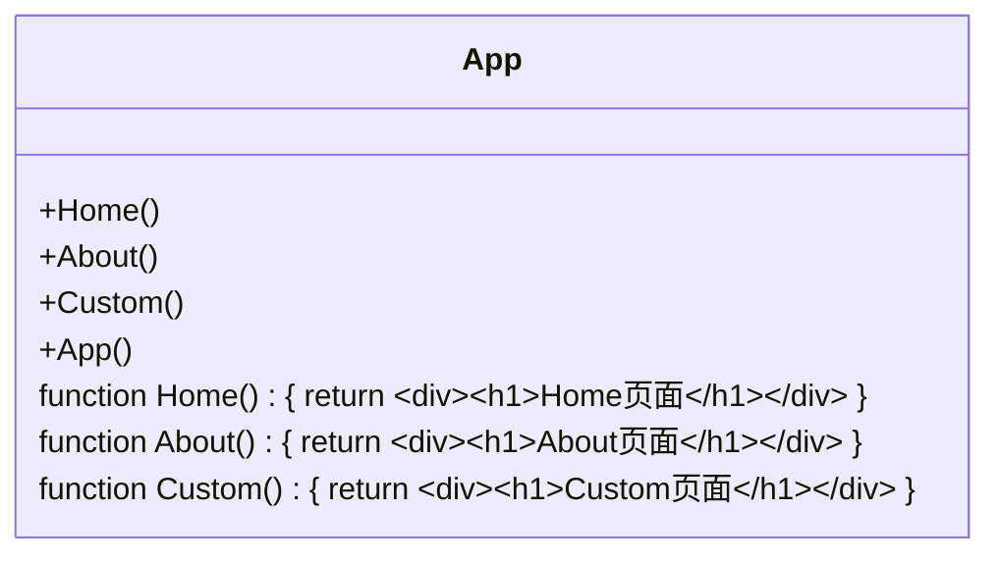
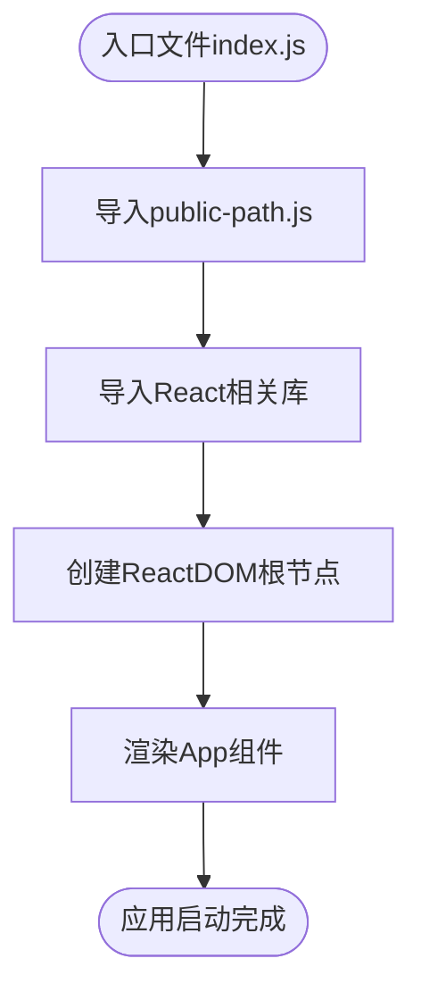
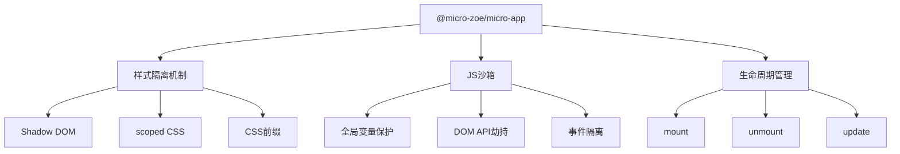

# 样式隔离与沙箱

<cite>
**本文档引用的文件**   
- [vite.config.js](file://src/micro/example/vue3/vite.config.js#L1-L34)
- [App.vue](file://src/micro/example/vue3/src/App.vue#L1-L22)
- [main.js](file://src/micro/example/vue3/src/main.js#L1-L13)
- [vue.config.js](file://src/micro/example/vue2/vue.config.js#L1-L34)
- [App.vue](file://src/micro/example/vue2/src/App.vue#L1-L90)
- [bootstrap.js](file://src/micro/example/vue2/src/bootstrap.js#L1-L22)
- [config-overrides.js](file://src/micro/example/child-react/config-overrides.js#L1-L22)
- [public-path.js](file://src/micro/example/child-react/src/public-path.js#L1-L5)
- [App.js](file://src/micro/example/child-react/src/App.js#L1-L46)
- [themeAntdReset.css](file://src/theme/themeAntdReset.css#L1-L50)
</cite>

## 目录
1. [引言](#引言)
2. [项目结构](#项目结构)
3. [核心组件](#核心组件)
4. [架构概述](#架构概述)
5. [详细组件分析](#详细组件分析)
6. [依赖分析](#依赖分析)
7. [性能考虑](#性能考虑)
8. [故障排除指南](#故障排除指南)
9. [结论](#结论)

## 引言
本文档全面解析微前端环境下的CSS样式隔离机制与JS沙箱工作原理。重点说明@micro-zoe/micro-app如何通过Shadow DOM或scoped CSS实现样式隔离，防止主子应用间样式相互污染。同时探讨JS沙箱的工作原理，包括全局变量保护、DOM API劫持和事件隔离等技术细节。文档还分析了不同框架子应用（Vue/React/Angular）在样式处理上的特殊配置需求，并结合themeAntdReset.css说明全局样式重置策略。

## 项目结构
本项目采用微前端架构，包含多个子应用（Vue2、Vue3、React、Angular），通过统一的微前端框架进行集成。主应用通过动态加载子应用的方式实现模块化开发和部署。



**图示来源**
- [vite.config.js](file://src/micro/example/vue3/vite.config.js#L1-L34)
- [vue.config.js](file://src/micro/example/vue2/vue.config.js#L1-L34)
- [config-overrides.js](file://src/micro/example/child-react/config-overrides.js#L1-L22)

**本节来源**
- [vite.config.js](file://src/micro/example/vue3/vite.config.js#L1-L34)
- [vue.config.js](file://src/micro/example/vue2/vue.config.js#L1-L34)

## 核心组件
微前端架构的核心组件包括主应用、子应用、微前端框架和通信机制。主应用负责路由分发和生命周期管理，子应用独立开发和部署，微前端框架提供样式隔离和JS沙箱能力。

**本节来源**
- [vite.config.js](file://src/micro/example/vue3/vite.config.js#L1-L34)
- [vue.config.js](file://src/micro/example/vue2/vue.config.js#L1-L34)

## 架构概述
微前端架构通过将大型单体应用拆分为多个小型、独立的应用（子应用）来提高开发效率和维护性。每个子应用可以使用不同的技术栈独立开发、测试、部署。



**图示来源**
- [vite.config.js](file://src/micro/example/vue3/vite.config.js#L1-L34)
- [vue.config.js](file://src/micro/example/vue2/vue.config.js#L1-L34)
- [config-overrides.js](file://src/micro/example/child-react/config-overrides.js#L1-L22)

## 详细组件分析

### Vue3子应用分析
Vue3子应用使用Vite作为构建工具，通过vite-plugin-federation实现模块联邦，支持微前端架构。

#### 样式隔离实现
Vue3子应用通过scoped CSS实现样式隔离，确保子应用样式不会影响主应用和其他子应用。

```mermaid
classDiagram
class App {
+setup()
+template
+style
}
App : style scoped
App : .logo { height : 6em; }
App : .logo : hover { filter : drop-shadow(0 0 2em #646cffaa); }
```

**图示来源**
- [App.vue](file://src/micro/example/vue3/src/App.vue#L1-L22)

#### 初始化流程
Vue3子应用的初始化流程包括创建应用实例、注册路由和挂载到DOM。



**图示来源**
- [main.js](file://src/micro/example/vue3/src/main.js#L1-L13)

**本节来源**
- [main.js](file://src/micro/example/vue3/src/main.js#L1-L13)
- [App.vue](file://src/micro/example/vue3/src/App.vue#L1-L22)
- [vite.config.js](file://src/micro/example/vue3/vite.config.js#L1-L34)

### Vue2子应用分析
Vue2子应用使用Vue CLI作为构建工具，通过webpack配置实现微前端集成。

#### 样式隔离实现
Vue2子应用通过CSS类名前缀和条件样式实现样式隔离。

```mermaid
classDiagram
class App {
+data()
+created()
+methods
+style
}
App : #app.vue-app-child { font-family : Avenir... }
App : .dark.vue-app-child { color : #fff; }
App : .vue-app-child button { margin : 0 8px; }
```

**图示来源**
- [App.vue](file://src/micro/example/vue2/src/App.vue#L1-L90)

#### 初始化流程
Vue2子应用采用分步初始化策略，通过bootstrap.js文件延迟加载主应用逻辑。



**图示来源**
- [bootstrap.js](file://src/micro/example/vue2/src/bootstrap.js#L1-L22)

**本节来源**
- [bootstrap.js](file://src/micro/example/vue2/src/bootstrap.js#L1-L22)
- [App.vue](file://src/micro/example/vue2/src/App.vue#L1-L90)
- [vue.config.js](file://src/micro/example/vue2/vue.config.js#L1-L34)

### React子应用分析
React子应用使用Create React App作为基础，通过react-app-rewired进行配置覆盖。

#### 样式隔离实现
React子应用通过CSS Modules或内联样式实现样式隔离。



**图示来源**
- [App.js](file://src/micro/example/child-react/src/App.js#L1-L46)

#### 初始化流程
React子应用通过public-path.js动态设置webpack公共路径，确保资源正确加载。



**图示来源**
- [public-path.js](file://src/micro/example/child-react/src/public-path.js#L1-L5)

**本节来源**
- [public-path.js](file://src/micro/example/child-react/src/public-path.js#L1-L5)
- [App.js](file://src/micro/example/child-react/src/App.js#L1-L46)
- [config-overrides.js](file://src/micro/example/child-react/config-overrides.js#L1-L22)

## 依赖分析
微前端架构中的依赖关系复杂，需要仔细管理以避免冲突。



**图示来源**
- [vite.config.js](file://src/micro/example/vue3/vite.config.js#L1-L34)
- [vue.config.js](file://src/micro/example/vue2/vue.config.js#L1-L34)
- [config-overrides.js](file://src/micro/example/child-react/config-overrides.js#L1-L22)

**本节来源**
- [vite.config.js](file://src/micro/example/vue3/vite.config.js#L1-L34)
- [vue.config.js](file://src/micro/example/vue2/vue.config.js#L1-L34)
- [config-overrides.js](file://src/micro/example/child-react/config-overrides.js#L1-L22)

## 性能考虑
微前端架构虽然提高了开发效率，但也带来了额外的性能开销，需要进行优化。

- **资源加载**：子应用资源按需加载，避免一次性加载过多资源
- **样式隔离**：scoped CSS比Shadow DOM性能更好，但隔离性较弱
- **JS沙箱**：Proxy实现的沙箱性能优于快照机制
- **通信开销**：减少主子应用间的频繁通信

## 故障排除指南
### 常见样式冲突问题
1. **字体冲突**：使用themeAntdReset.css进行全局字体重置
2. **z-index冲突**：为每个子应用设置独立的z-index范围
3. **动画冲突**：使用CSS自定义属性控制动画速度和延迟

### JS沙箱问题
1. **全局变量泄漏**：检查沙箱退出时是否正确恢复全局状态
2. **DOM事件监听器未清理**：确保在unmount时移除所有事件监听器
3. **定时器未清除**：在应用卸载时清除所有setTimeout和setInterval

**本节来源**
- [themeAntdReset.css](file://src/theme/themeAntdReset.css#L1-L50)

## 结论
微前端架构通过样式隔离和JS沙箱技术，有效解决了多团队协作开发中的技术栈异构和样式冲突问题。不同框架的子应用可以通过统一的微前端框架集成，实现独立开发、独立部署的目标。在实际应用中，需要根据具体需求选择合适的样式隔离方案和JS沙箱实现，同时注意性能优化和常见问题的预防。