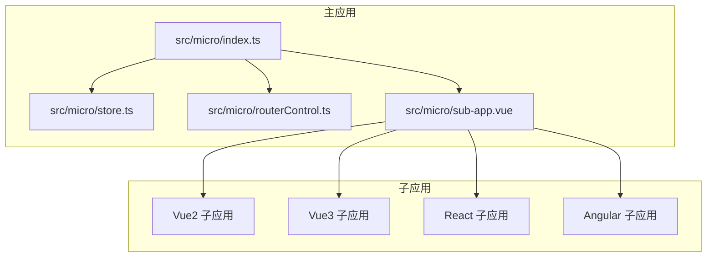
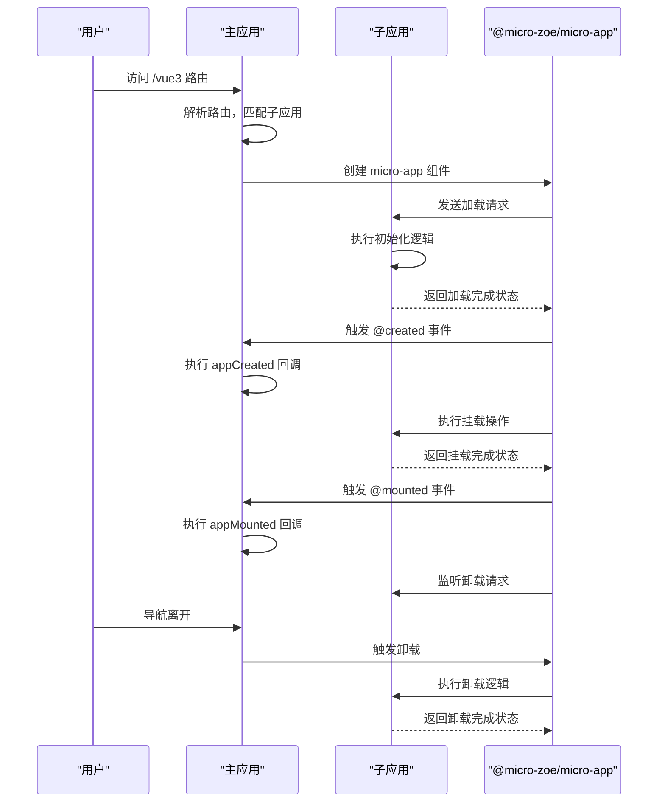
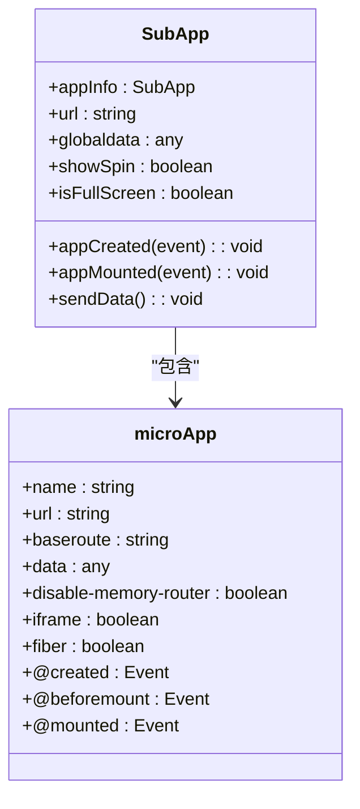
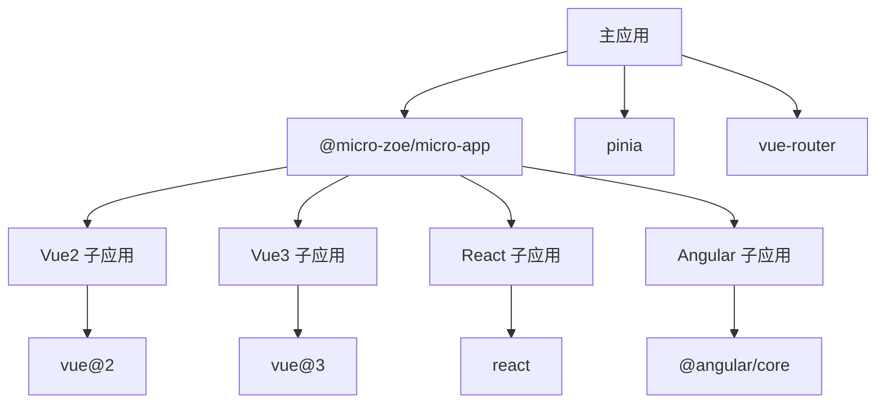

# 生命周期管理

<cite>
**本文档引用的文件**   
- [index.ts](file://src/micro/index.ts)
- [store.ts](file://src/micro/store.ts)
- [routerControl.ts](file://src/micro/routerControl.ts)
- [sub-app.vue](file://src/micro/sub-app.vue)
- [microApi/index.ts](file://src/micro/microApi/index.ts)
- [vue3/src/main.js](file://src/micro/example/vue3/src/main.js)
- [vue2/src/bootstrap.js](file://src/micro/example/vue2/src/bootstrap.js)
- [vue2/src/App.vue](file://src/micro/example/vue2/src/App.vue)
- [angular/src/main.ts](file://src/micro/example/angular/src/main.ts)
- [vue3/vite.config.js](file://src/micro/example/vue3/vite.config.js)
- [vue2/vue.config.js](file://src/micro/example/vue2/vue.config.js)
</cite>

## 目录
1. [引言](#引言)
2. [项目结构分析](#项目结构分析)
3. [核心组件](#核心组件)
4. [架构概览](#架构概览)
5. [详细组件分析](#详细组件分析)
6. [依赖分析](#依赖分析)
7. [性能考量](#性能考量)
8. [故障排除指南](#故障排除指南)
9. [结论](#结论)

## 引言
本文档深入解析微前端架构下子应用的完整生命周期管理机制。通过分析主应用与子应用之间的交互流程，详细阐述了`beforeLoad`、`beforeMount`、`mounted`、`beforeUnmount`、`unmounted`等生命周期钩子的触发时机与执行顺序。文档结合代码实例展示了如何在主应用和子应用中注册生命周期回调函数，并处理异步操作，同时讨论了异常情况下的生命周期中断处理机制和错误恢复策略。

## 项目结构分析
本项目采用微前端架构，主应用通过`@micro-zoe/micro-app`框架集成多个子应用（Vue2、Vue3、React、Angular）。主应用位于`src/micro`目录下，包含核心的生命周期管理、路由控制和状态管理模块。子应用分别位于`src/micro/example`目录下，各自独立开发和构建。



**图示来源**
- [index.ts](file://src/micro/index.ts)
- [store.ts](file://src/micro/store.ts)
- [routerControl.ts](file://src/micro/routerControl.ts)
- [sub-app.vue](file://src/micro/sub-app.vue)

**本节来源**
- [index.ts](file://src/micro/index.ts)
- [store.ts](file://src/micro/store.ts)

## 核心组件
微前端生命周期管理的核心组件包括：
- **microApp**: 基于`@micro-zoe/micro-app`的封装，提供子应用加载、通信和生命周期管理功能
- **store**: 使用Pinia管理子应用配置和状态
- **routerControl**: 控制主应用与子应用之间的路由交互
- **sub-app.vue**: 子应用的容器组件，负责渲染和生命周期事件监听

**本节来源**
- [index.ts](file://src/micro/index.ts#L1-L65)
- [store.ts](file://src/micro/store.ts#L1-L45)
- [routerControl.ts](file://src/micro/routerControl.ts#L1-L141)
- [sub-app.vue](file://src/micro/sub-app.vue#L1-L31)

## 架构概览
微前端架构采用主从模式，主应用负责协调和管理多个子应用的生命周期。当用户访问特定路由时，主应用动态加载对应的子应用，并通过事件机制监听其生命周期变化。



**图示来源**
- [index.ts](file://src/micro/index.ts#L37-L64)
- [sub-app.vue](file://src/micro/sub-app.vue#L1-L31)
- [microApi/index.ts](file://src/micro/microApi/index.ts#L0-L135)

## 详细组件分析

### 主应用生命周期管理

#### 生命周期事件监听
主应用通过`sub-app.vue`组件监听子应用的生命周期事件：

```vue
<micro-app
  :name="appInfo.name"
  :url="url"
  :baseroute="props.appInfo.baseroute"
  :data="globaldata"
  disable-memory-router
  iframe
  fiber
  @created="appCreated"
  @beforemount="appCreated"
  @mounted="appMounted"
></micro-app>
```

这些事件在`sub-app.vue`中定义了相应的处理函数，用于在子应用加载、挂载和卸载时执行特定逻辑。



**图示来源**
- [sub-app.vue](file://src/micro/sub-app.vue#L1-L31)

**本节来源**
- [sub-app.vue](file://src/micro/sub-app.vue#L1-L31)

#### 子应用启动流程
主应用在`index.ts`中通过`startMicro`函数启动微前端系统：

```typescript
export async function startMicro(router: Router) {
  const microStore = useMicroStore();
  const { apps } = microStore;
  // 获取定制页面的路由信息
  await registerRouterCenter(router, apps);
  setupAddMicroRouter(router);
  // 子应用预加载
  apps.forEach((app) => {
    // microApp.preFetch([{ name: app.name, url: app.url }]);
  });
  // 启动 micro-app 框架
  microApp.start({
    iframeSrc: '/empty.html'
  });
}
```

该流程包括：注册路由中心、设置微前端路由、预加载子应用和启动micro-app框架。

**本节来源**
- [index.ts](file://src/micro/index.ts#L37-L64)

### 子应用生命周期实现

#### Vue2 子应用实现
Vue2子应用通过`bootstrap.js`文件进行初始化，在`main.js`中导入：

```javascript
// src/micro/example/vue2/src/main.js
import('./bootstrap');
```

`bootstrap.js`文件中创建Vue实例并挂载：

```javascript
// src/micro/example/vue2/src/bootstrap.js
new Vue({
  router,
  render: h => h(App),
}).$mount('#app')
```

在`App.vue`中监听基座应用传递的数据：

```vue
<script>
export default {
  created () {
    // 初始化获取父级给的参数
    this.info = window.microApp.getData()
    // 监听基座的动态数据
    window.microApp.addDataListener(this.getDynamicData, true)
    window.microApp.addGlobalDataListener(this.getGlobalData, true)
  },
  beforeDestroy () {
    window.microApp.removeDataListener(this.getDynamicData);
    window.microApp.removeGlobalDataListener(this.getGlobalData);
  },
}
</script>
```

**本节来源**
- [vue2/src/main.js](file://src/micro/example/vue2/src/main.js)
- [vue2/src/bootstrap.js](file://src/micro/example/vue2/src/bootstrap.js)
- [vue2/src/App.vue](file://src/micro/example/vue2/src/App.vue)

#### Vue3 子应用实现
Vue3子应用在`main.js`中直接创建应用实例：

```javascript
// src/micro/example/vue3/src/main.js
import { createApp } from 'vue';
import App from './App.vue';
import router from './router';
import './style.css';

createApp(App).use(router).mount('#app');
```

通过`public-path.js`处理微前端环境下的资源路径：

```javascript
// src/micro/example/vue3/src/public-path.js
if (window.__MICRO_APP_ENVIRONMENT__) {
  // eslint-disable-next-line
  __webpack_public_path__ = window.__MICRO_APP_PUBLIC_PATH__
}
```

**本节来源**
- [vue3/src/main.js](file://src/micro/example/vue3/src/main.js)
- [vue3/src/public-path.js](file://src/micro/example/vue3/src/public-path.js)

#### Angular 子应用实现
Angular子应用通过`main.ts`进行引导：

```typescript
// src/micro/example/angular/src/main.ts
let app: void | NgModuleRef<AppModule>;
platformBrowserDynamic()
  .bootstrapModule(AppModule)
  .then((res: NgModuleRef<AppModule>) => {
    app = res;
  })
  .catch((err) => console.error(err));

// 监听卸载操作
window.unmount = () => {
  app?.destroy();
  app = undefined;
  console.log('微应用child-angular14卸载了 --- 默认模式');
};
```

在`app.component.ts`中处理路由变化：

```typescript
// src/micro/example/angular/src/app/app.component.ts
if (window.__MICRO_APP_ENVIRONMENT__) {
  window.addEventListener('popstate', () => {
    const fullPath = location.pathname.replace('/micro-app/angular14', '') + location.search + location.hash;
    this.ngZone.run(() => {
      this.router.navigateByUrl(fullPath);
    });
  });
}
```

**本节来源**
- [angular/src/main.ts](file://src/micro/example/angular/src/main.ts)
- [angular/src/app/app.component.ts](file://src/micro/example/angular/src/app/app.component.ts)

### 构建配置对生命周期的影响

#### Vue3 Vite 配置
Vue3子应用使用Vite构建，配置文件`vite.config.js`中设置了微前端相关配置：

```javascript
// src/micro/example/vue3/vite.config.js
export default defineConfig({
  plugins: [
    vue(),
    federation({
      name: 'host_app',
      remotes: {
        home: 'http://localhost:9003/assets/remoteEntry.js'
      }
    }),
    MicroRouterJsonPlugin({
      routerPath: `${process.cwd()}/src/router.js`,
      encrypt: false
    })
  ],
  build:{
    outDir: path.resolve(__dirname, '../../../../dist/subapp/vue3'), 
  },
  server: {
    port: 7002,
    host: true,
    fs: {
      strict: false
    }
  },
  base: `/subapp/vue3`
});
```

#### Vue2 Webpack 配置
Vue2子应用使用Vue CLI构建，配置文件`vue.config.js`中设置了相应的构建选项：

```javascript
// src/micro/example/vue2/vue.config.js
module.exports = defineConfig({
  publicPath: '/subapp/vue2/',
  transpileDependencies: true,
  configureWebpack: {
    plugins: [
      new MicroRouterJsonPlugin({
        routerPath: process.cwd() +'/src/router.js',
        encrypt:false
      })
    ],
  },
  outputDir: path.resolve(__dirname, '../../../../dist/subapp/vue2'), 
  devServer: {
    hot: true,
    port: 7001,
    headers: {
      'Access-Control-Allow-Origin': '*',
    },
  },
  lintOnSave: false,
})
```

**本节来源**
- [vue3/vite.config.js](file://src/micro/example/vue3/vite.config.js)
- [vue2/vue.config.js](file://src/micro/example/vue2/vue.config.js)

## 依赖分析
微前端架构中的依赖关系清晰，主应用与子应用之间通过接口进行通信，降低了耦合度。



**图示来源**
- [package.json](file://package.json)
- [index.ts](file://src/micro/index.ts)
- [vite.config.js](file://src/micro/example/vue3/vite.config.js)
- [vue.config.js](file://src/micro/example/vue2/vue.config.js)

**本节来源**
- [package.json](file://package.json)
- [index.ts](file://src/micro/index.ts#L1-L65)

## 性能考量
微前端架构在性能方面需要考虑以下几点：
1. **子应用预加载**：通过`microApp.preFetch()`方法预加载子应用，提升用户体验
2. **资源隔离**：每个子应用独立构建，避免样式和脚本冲突
3. **按需加载**：只有当用户访问特定路由时才加载对应的子应用
4. **内存管理**：及时清理已卸载子应用的资源，防止内存泄漏

## 故障排除指南
### 常见问题及解决方案
1. **子应用无法加载**
   - 检查子应用的`publicPath`配置是否正确
   - 确认主应用的`iframeSrc`指向有效的空页面
   - 检查网络请求是否被阻止

2. **生命周期事件未触发**
   - 确认`micro-app`组件的事件绑定是否正确
   - 检查主应用是否已正确调用`microApp.start()`
   - 验证子应用是否正确暴露了生命周期钩子

3. **路由跳转异常**
   - 检查`baseroute`配置是否与实际路由匹配
   - 确认`routerControl.ts`中的路由守卫逻辑是否正确
   - 验证子应用的路由模式（hash/history）配置

**本节来源**
- [index.ts](file://src/micro/index.ts#L37-L64)
- [routerControl.ts](file://src/micro/routerControl.ts#L43-L140)
- [sub-app.vue](file://src/micro/sub-app.vue#L1-L31)

## 结论
本文档全面解析了微前端架构下的生命周期管理机制。主应用通过`@micro-zoe/micro-app`框架有效地管理多个子应用的加载、挂载、更新和卸载过程。通过事件机制，主应用可以监听子应用的生命周期变化并执行相应的回调函数。不同技术栈的子应用（Vue2、Vue3、React、Angular）通过标准化的接口与主应用通信，实现了技术栈的解耦和独立开发部署。合理的构建配置和路由控制确保了微前端系统的稳定运行和良好性能。