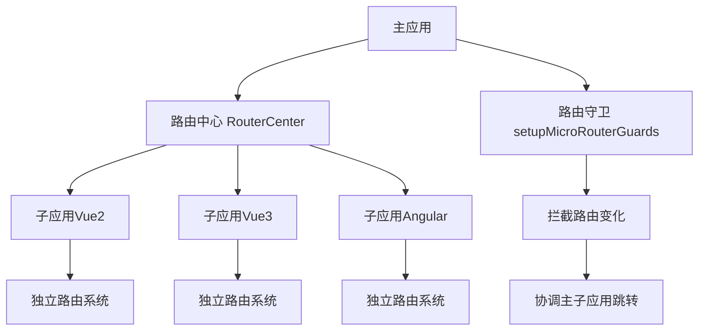
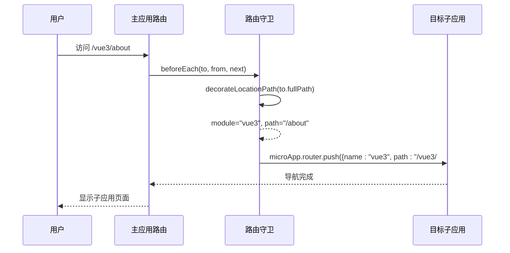
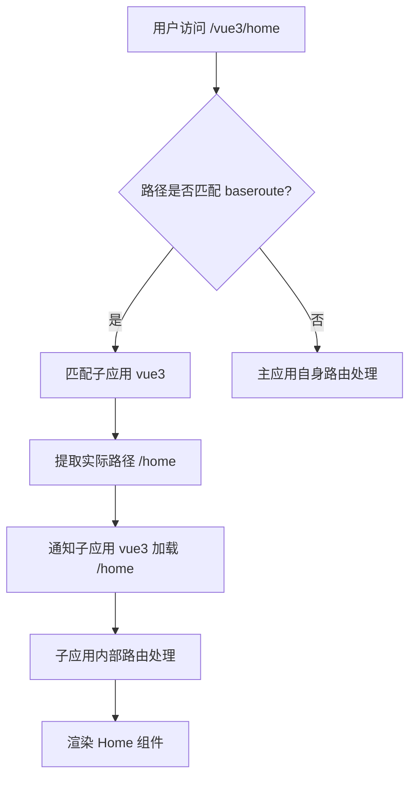
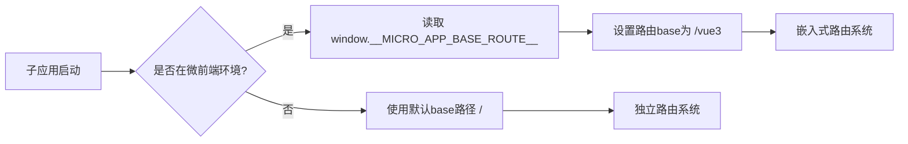
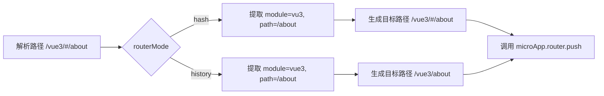
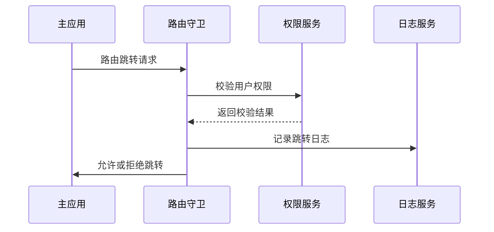
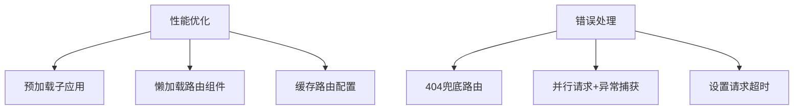

# 路由协调策略

<cite>
**本文档引用文件**  
- [routerControl.ts](file://src/micro/routerControl.ts#L1-L140)
- [helper.ts](file://src/micro/microApi/helper.ts#L63-L89)
- [index.ts](file://src/micro/index.ts#L0-L39)
- [sub-app.vue](file://src/micro/sub-app.vue#L0-L31)
- [routerCenter/index.ts](file://src/micro/routerCenter/index.ts#L108-L149)
- [microApi/index.ts](file://src/micro/microApi/index.ts#L119-L135)
</cite>

## 目录
1. [主子应用路由协调机制](#主子应用路由协调机制)
2. [路由拦截与重定向实现](#路由拦截与重定向实现)
3. [base路由前缀配置及其影响](#base路由前缀配置及其影响)
4. [子应用独立运行与微前端嵌入的路由模式差异](#子应用独立运行与微前端嵌入的路由模式差异)
5. [history模式下的兼容性处理](#history模式下的兼容性处理)
6. [路由守卫、权限校验与日志集成](#路由守卫权限校验与日志集成)
7. [路由性能优化与错误处理最佳实践](#路由性能优化与错误处理最佳实践)

## 主子应用路由协调机制

在微前端架构中，主应用与多个子应用之间的路由协调是实现无缝导航的核心。本系统通过 `micro-app` 框架和自定义的路由控制逻辑，实现了主子应用间的高效路由管理。

主应用通过 `setupAddMicroRouter` 函数为每个子应用动态注册路由规则，将子应用的访问路径映射到统一的路由结构中。子应用通过 `micro-app` 组件加载，并由主应用的路由系统进行统一调度。

**图示来源**
- [routerControl.ts](file://src/micro/routerControl.ts#L18-L35)
- [routerCenter/index.ts](file://src/micro/routerCenter/index.ts#L108-L149)

**本节来源**
- [routerControl.ts](file://src/micro/routerControl.ts#L18-L35)
- [index.ts](file://src/micro/index.ts#L0-L39)

## 路由拦截与重定向实现

路由拦截与重定向是避免主子应用间路由冲突的关键机制。系统通过 `setupMicroRouterGuards` 函数设置全局路由守卫，监听主应用的路由变化。

当用户访问一个包含子应用标识的路径时，`decorateLocationPath` 函数会解析出目标子应用模块名（module）、实际路径（path）和路由模式（routerMode）。如果目标路径属于某个子应用，则通过 `microApp.router.push` 方法将导航请求转发给对应的子应用实例。

**图示来源**
- [routerControl.ts](file://src/micro/routerControl.ts#L108-L140)
- [helper.ts](file://src/micro/microApi/helper.ts#L63-L89)

**本节来源**
- [routerControl.ts](file://src/micro/routerControl.ts#L81-L140)
- [helper.ts](file://src/micro/microApi/helper.ts#L63-L89)

## base路由前缀配置及其影响

base路由前缀是区分不同子应用的关键标识。在子应用配置中，通过 `baseroute` 属性指定其基础路径，例如 `/vue2`、`/vue3` 等。

主应用在 `setupAddMicroRouter` 中为每个子应用注册通配路由 `${app.baseroute}/:page*`，确保所有以该前缀开头的路径都被捕获并交由对应的子应用处理。

子应用内部的路由会受到base前缀的影响。在Vue3子应用中，通过 `createWebHistory(window.__MICRO_APP_BASE_ROUTE__ || '/vue3')` 设置路由历史模式，确保其内部路由与主应用的base前缀保持一致。

**图示来源**
- [routerControl.ts](file://src/micro/routerControl.ts#L18-L35)
- [vue3/src/router.js](file://src/micro/example/vue3/src/router.js#L0-L17)

**本节来源**
- [routerControl.ts](file://src/micro/routerControl.ts#L18-L35)
- [sub-app.vue](file://src/micro/sub-app.vue#L0-L31)

## 子应用独立运行与微前端嵌入的路由模式差异

子应用在独立运行和作为微前端嵌入时，其路由模式存在显著差异：

- **独立运行模式**：子应用使用自身的路由系统，base路径通常为 `/` 或特定开发路径。
- **微前端嵌入模式**：子应用的路由base路径由主应用通过 `window.__MICRO_APP_BASE_ROUTE__` 注入，必须适配主应用的路由前缀。

例如，Vue2子应用在独立运行时，其路由配置不设置base；而在微前端环境下，通过 `window.__MICRO_APP_BASE_ROUTE__` 动态获取base路径。

Angular子应用通过 `APP_BASE_HREF` 提供者注入base路径，确保其路由系统与主应用协调一致。

**图示来源**
- [vue2/src/bootstrap.js](file://src/micro/example/vue2/src/bootstrap.js#L0-L20)
- [angular/src/app/app-routing.module.ts](file://src/micro/example/angular/src/app/app-routing.module.ts#L0-L32)

**本节来源**
- [vue3/src/router.js](file://src/micro/example/vue3/src/router.js#L0-L17)
- [vue2/src/bootstrap.js](file://src/micro/example/vue2/src/bootstrap.js#L0-L20)

## history模式下的兼容性处理

系统支持hash和history两种路由模式，并通过 `routerMode` 配置项进行管理。在 `routeCenter.setModuleRoutes` 方法中，每个子应用的路由模式被记录在 `routerMode` 映射表中。

当主应用需要跳转到子应用时，会根据子应用的 `routerMode` 决定路径拼接方式：
- `hash` 模式：路径拼接为 `/${module}/#${path}`
- `history` 模式：路径拼接为 `/${module}${path}`

`decorateLocationPath` 函数负责解析包含hash模式的路径，确保在不同模式下都能正确提取模块名和实际路径。

**图示来源**
- [routerCenter/index.ts](file://src/micro/routerCenter/index.ts#L108-L149)
- [helper.ts](file://src/micro/microApi/helper.ts#L63-L89)

**本节来源**
- [routerCenter/index.ts](file://src/micro/routerCenter/index.ts#L108-L149)
- [routerControl.ts](file://src/micro/routerControl.ts#L108-L140)

## 路由守卫、权限校验与日志集成

路由守卫机制通过 `setupMicroRouterGuards` 实现，包含两个层面的监听：

1. **子应用路由变化监听**：通过 `monitorChildRouterChange` 监听子应用内部的路由跳转，更新主应用的全屏状态和菜单激活状态。
2. **主应用路由变化监听**：通过 `router.beforeEach` 拦截主应用的路由跳转，判断是否需要重定向到子应用。

权限校验可通过在路由元数据（meta）中添加 `auth` 字段实现，结合全局前置守卫进行访问控制。

页面跳转日志通过在路由守卫中添加 `console.log` 输出实现，记录每次路由跳转的详细信息。

**图示来源**
- [routerControl.ts](file://src/micro/routerControl.ts#L55-L140)
- [microApi/index.ts](file://src/micro/microApi/index.ts#L119-L135)

**本节来源**
- [routerControl.ts](file://src/micro/routerControl.ts#L55-L140)
- [microApi/index.ts](file://src/micro/microApi/index.ts#L119-L135)

## 路由性能优化与错误处理最佳实践

### 性能优化
- **路由预加载**：通过 `microApp.preFetch` 在应用启动时预加载子应用资源，减少首次加载延迟。
- **路由懒加载**：主应用路由采用动态导入 `() => Promise.resolve(h(SubApp, { appInfo: app }))`，实现按需加载。
- **路由缓存**：利用 `routeCenter` 缓存子应用路由配置，避免重复请求 `router.json` 文件。

### 错误处理
- **404路由兜底**：`decorateLocationPath` 函数对无效路径返回 `/404`，确保用户体验。
- **异常捕获**：`registerRouterCenter` 使用 `Promise.allSettled` 并行请求所有子应用路由配置，单个失败不影响整体初始化。
- **超时控制**：`axios.get` 请求设置 `timeout: 500`，防止因网络问题导致主应用卡死。

**图示来源**
- [index.ts](file://src/micro/index.ts#L0-L39)
- [helper.ts](file://src/micro/microApi/helper.ts#L63-L89)

**本节来源**
- [index.ts](file://src/micro/index.ts#L0-L39)
- [routerControl.ts](file://src/micro/routerControl.ts#L0-L41)