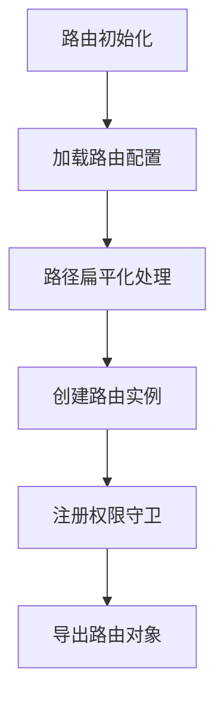
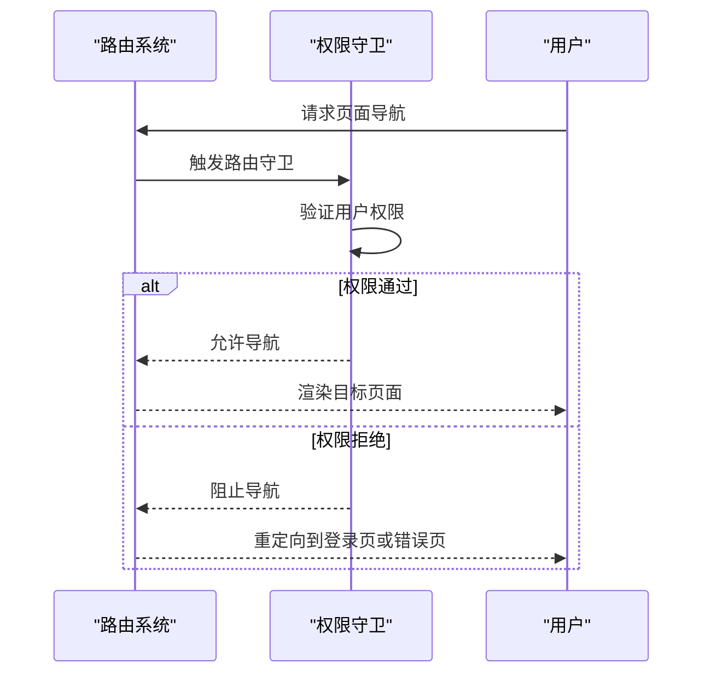
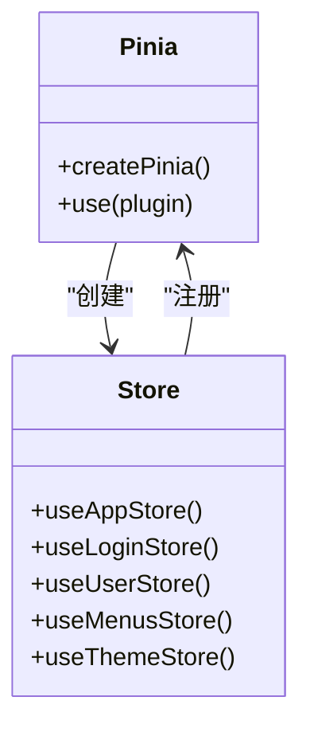
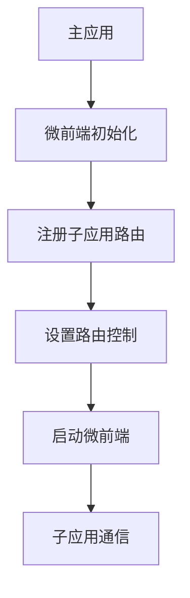
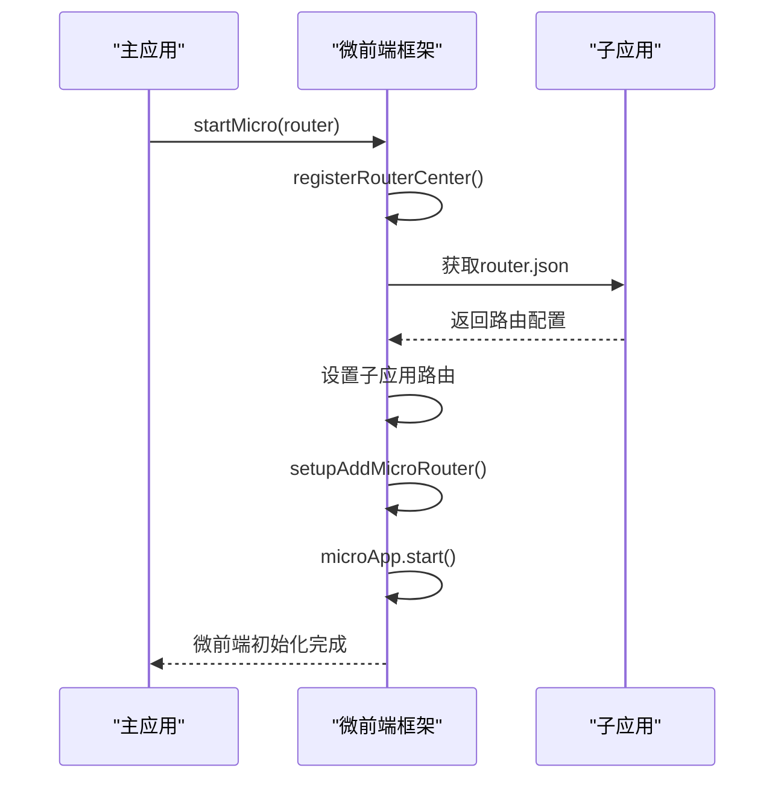
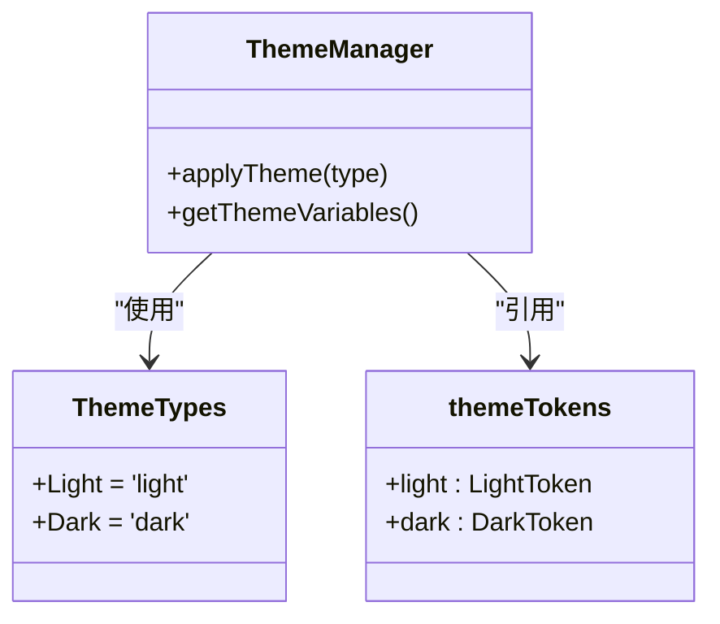
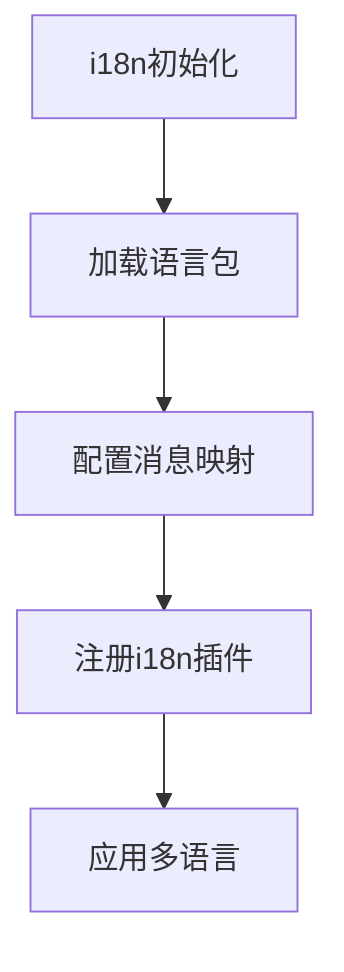
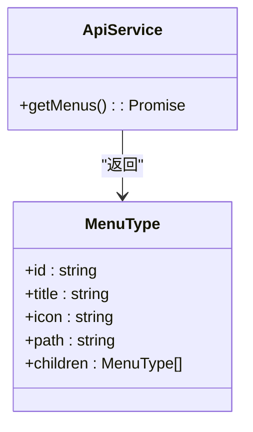

# 核心功能

<cite>
**本文档引用的文件**   
- [index.ts](file://src/router/index.ts#L1-L53)
- [routes.ts](file://src/router/routes.ts#L1-L261)
- [guard.ts](file://src/router/guard.ts)
- [index.ts](file://src/store/index.ts#L1-L14)
- [index.ts](file://src/micro/index.ts#L1-L66)
- [routerControl.ts](file://src/micro/routerControl.ts)
- [store.ts](file://src/micro/store.ts)
- [index.ts](file://src/theme/index.ts#L1-L13)
- [dark.ts](file://src/theme/dark.ts)
- [light.ts](file://src/theme/light.ts)
- [theme.ts](file://src/theme/theme.ts)
- [themeAlgorithm.ts](file://src/theme/themeAlgorithm.ts)
- [index.ts](file://src/locale/index.ts#L1-L19)
- [common.ts](file://src/api/common.ts#L1-L356)
</cite>

## 目录
1. [路由系统](#路由系统)
2. [状态管理](#状态管理)
3. [微前端集成](#微前端集成)
4. [主题系统](#主题系统)
5. [国际化支持](#国际化支持)
6. [API服务](#api服务)

## 路由系统

本项目采用Vue Router实现前端路由管理，通过hash或history模式进行路由导航。路由系统具有权限控制、路径扁平化处理和动态路由注册等核心功能。



**Diagram sources**
- [index.ts](file://src/router/index.ts#L1-L53)
- [routes.ts](file://src/router/routes.ts#L1-L261)

路由配置文件`routes.ts`定义了所有应用路由，包括工作台、表单、详情页等基础页面，以及通过iframe集成的外部应用。特殊路由如`/das-readdy`、`/chat-v`等使用`beforeEnter`守卫直接跳转到外部系统，不渲染本地组件。

路由主文件`index.ts`实现了关键的路径扁平化算法，将嵌套路由转换为平级路由结构，便于菜单生成和权限管理。该算法通过递归遍历路由树，拼接父级路径，并在路由元信息中保存父级路由链。



**Diagram sources**
- [index.ts](file://src/router/index.ts#L1-L53)
- [guard.ts](file://src/router/guard.ts)

**中文段落**
路由系统通过`setupPermissionGuard`函数设置权限守卫，确保用户只能访问其权限范围内的页面。路由配置中的`permissionId`字段用于标识每个路由的权限要求，与用户权限进行比对验证。

**Section sources**
- [index.ts](file://src/router/index.ts#L1-L53)
- [routes.ts](file://src/router/routes.ts#L1-L261)
- [guard.ts](file://src/router/guard.ts)

## 状态管理

项目采用Pinia作为状态管理方案，替代传统的Vuex。Pinia提供了更简洁的API和更好的TypeScript支持，同时通过插件实现状态持久化。



**Diagram sources**
- [index.ts](file://src/store/index.ts#L1-L14)

状态管理模块被组织在`src/store/uedModule`目录下，包含app、login、menus、theme和user五个独立的store模块。每个模块负责管理特定领域的应用状态，遵循单一职责原则。

主store文件`index.ts`创建Pinia实例并注册`pinia-plugin-persistedstate`插件，该插件自动将store状态持久化到localStorage中，确保页面刷新后用户状态不丢失。

```typescript
import { createPinia } from 'pinia';
import piniaPluginPersistedstate from 'pinia-plugin-persistedstate';
import useAppStore from './uedModule/app';
import useLoginStore from './uedModule/login';
import useMenusStore from './uedModule/menus';
import useThemeStore from './uedModule/theme';
import useUserStore from './uedModule/user';

const pinia = createPinia();
pinia.use(piniaPluginPersistedstate);

export { useAppStore, useLoginStore, useUserStore, useMenusStore, useThemeStore };
export default pinia;
```

**中文段落**
通过模块化的设计，各功能模块可以独立管理自己的状态，降低了代码耦合度。例如，`useThemeStore`专门负责主题相关的状态管理，`useUserStore`负责用户认证信息的存储和操作。

**Section sources**
- [index.ts](file://src/store/index.ts#L1-L14)

## 微前端集成

本项目实现了基于`@micro-zoe/micro-app`的微前端架构，支持将Vue2、Vue3、React和Angular等不同技术栈的应用集成到主应用中。



**Diagram sources**
- [index.ts](file://src/micro/index.ts#L1-L66)
- [routerControl.ts](file://src/micro/routerControl.ts)

微前端系统通过`startMicro`函数初始化，该函数接收Vue Router实例作为参数，实现主应用与子应用的路由协同。系统会从子应用的`router.json`文件中获取路由配置，并通过`RouterCenter`进行路由注册和管理。



**Diagram sources**
- [index.ts](file://src/micro/index.ts#L1-L66)
- [store.ts](file://src/micro/store.ts)

**中文段落**
微前端架构通过`iframeSrc: '/empty.html'`配置实现沙箱隔离，确保子应用的JavaScript和CSS不会影响主应用。子应用的路由信息通过`router.json`文件暴露，主应用动态加载这些路由配置，实现无缝集成。

**Section sources**
- [index.ts](file://src/micro/index.ts#L1-L66)
- [routerControl.ts](file://src/micro/routerControl.ts)
- [store.ts](file://src/micro/store.ts)

## 主题系统

主题系统实现了深色和浅色两种主题模式的切换功能，通过CSS变量和JavaScript逻辑的结合，提供一致的用户体验。



**Diagram sources**
- [index.ts](file://src/theme/index.ts#L1-L13)
- [dark.ts](file://src/theme/dark.ts)
- [light.ts](file://src/theme/light.ts)

主题系统的核心是`themeTokens`对象，它定义了深色和浅色主题的样式变量。`ThemeTypes`枚举定义了支持的主题类型。系统通过动态修改CSS变量的方式实现主题切换，确保样式变更的高效性和一致性。

```typescript
export enum ThemeTypes {
  Light = 'light',
  Dark = 'dark'
}

export const themeTokens = {
  light: LightToken,
  dark: DarkToken
};
```

**中文段落**
主题切换功能通常与状态管理结合使用，将当前主题类型存储在Pinia store中。当用户更改主题时，系统更新store状态，并触发UI重新渲染，应用新的主题样式。CSS变量的使用使得主题切换无需重新加载页面即可完成。

**Section sources**
- [index.ts](file://src/theme/index.ts#L1-L13)
- [dark.ts](file://src/theme/dark.ts)
- [light.ts](file://src/theme/light.ts)
- [theme.ts](file://src/theme/theme.ts)
- [themeAlgorithm.ts](file://src/theme/themeAlgorithm.ts)

## 国际化支持

项目通过`@international/vue3-i18n`库实现多语言支持，允许应用在不同语言环境之间切换，满足国际化需求。



**Diagram sources**
- [index.ts](file://src/locale/index.ts#L1-L19)

国际化系统在`src/locale/index.ts`中初始化，加载中文(`zh-CN`)和英文(`en-US`)语言包。系统使用`I18N`命名空间组织翻译文本，通过`createI18n`函数创建i18n实例并注册到Vue应用中。

```typescript
import { createI18n } from '@international/vue3-i18n';
import en from '../../.kiwi/en-US';
import zh from '../../.kiwi/zh-CN';

export default function i18n(app: any) {
  const i18nIns = createI18n(app, {
    autoDetect: false,
    messages: {
      zh: { I18N: zh },
      en: { I18N: en }
    },
    kiwi: {
      zh,
      en
    }
  });
  app.use(i18nIns);
}
```

**中文段落**
在模板中通过`I18N.layout.gongZuoTai`这样的语法引用翻译文本，系统会根据当前语言环境自动选择合适的翻译。这种命名约定提高了翻译文本的可读性和可维护性，便于开发人员理解和使用。

**Section sources**
- [index.ts](file://src/locale/index.ts#L1-L19)

## API服务

API服务层封装了与后端服务器的通信逻辑，提供统一的接口调用方式。`common.ts`文件定义了获取菜单数据等基础API。



**Diagram sources**
- [common.ts](file://src/api/common.ts#L1-L356)

API服务通过`createService`函数创建HTTP服务实例，封装了请求拦截、响应处理、错误处理等通用逻辑。`getMenus`函数返回模拟的菜单数据，包含工作台、AI能力、基础组件等多个菜单项。

```typescript
export async function getMenus(): Promise<MenuType[]> {
  return [
    {
      id: 'workBench',
      title: I18N.layout.genericTypicalPage,
      icon: 'AppstoreOutlined',
      path: '/workBench',
      children: [
        {
          id: 'workBench',
          title: I18N.layout.gongZuoTai,
          icon: 'AppstoreOutlined',
          path: '/workBench'
        },
        // ... 其他菜单项
      ]
    },
    // ... 其他菜单组
  ];
}
```

**中文段落**
API服务设计遵循单一职责原则，每个函数负责一个特定的业务功能。通过TypeScript接口定义数据结构，确保类型安全和代码可维护性。虽然当前实现返回静态数据，但结构已为接入真实后端API做好准备。

**Section sources**
- [common.ts](file://src/api/common.ts#L1-L356)