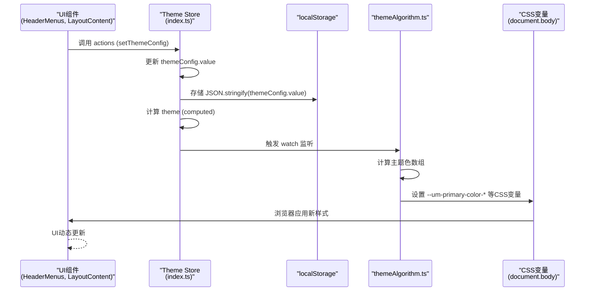
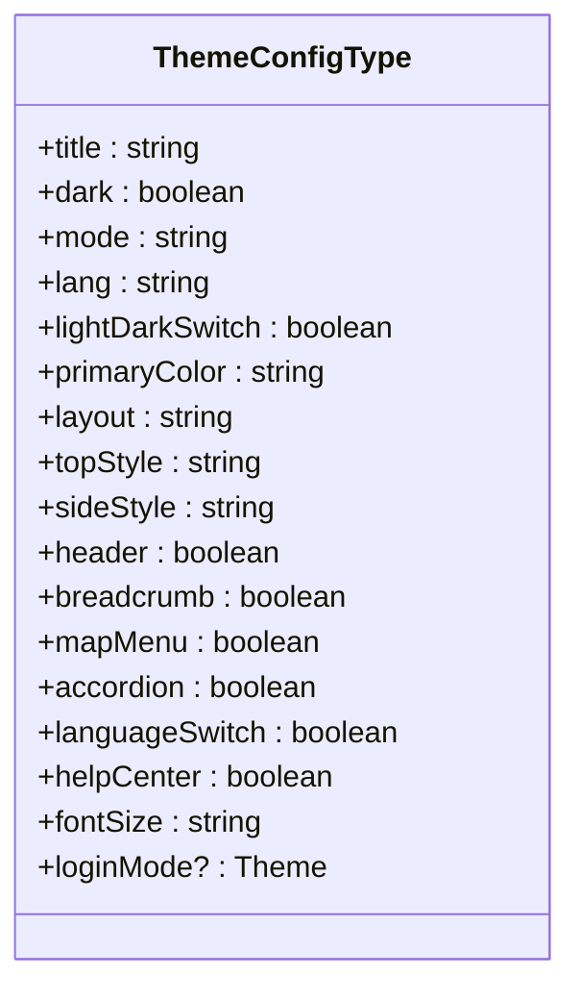
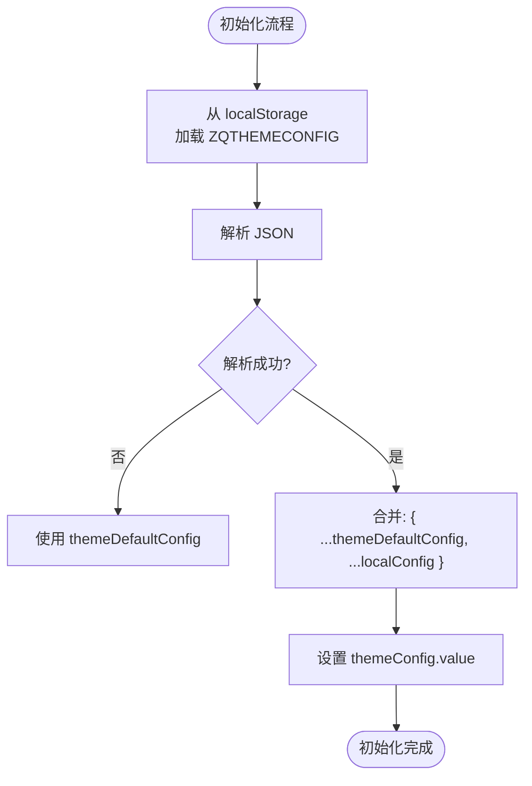
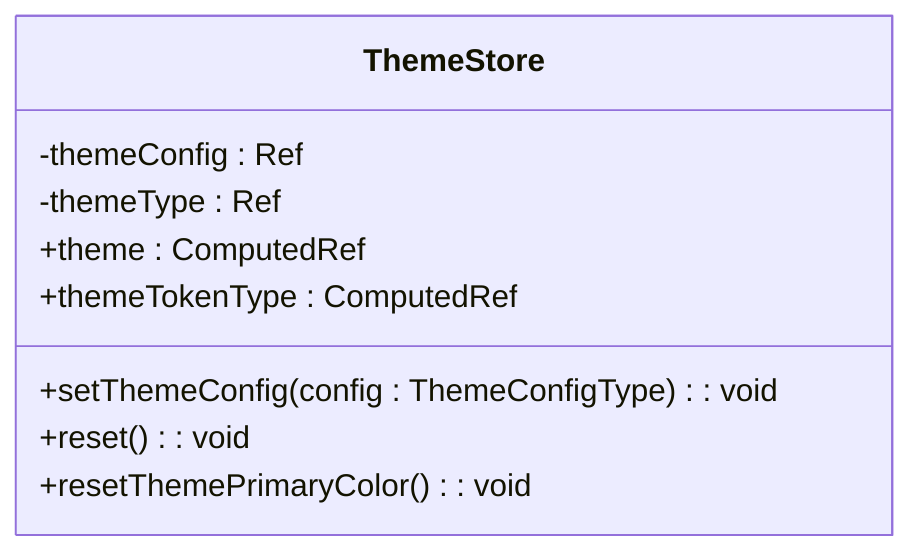
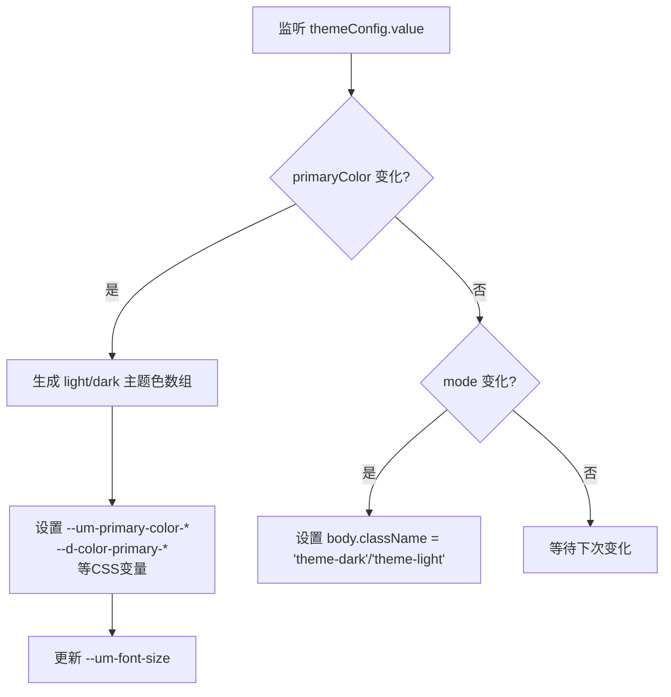
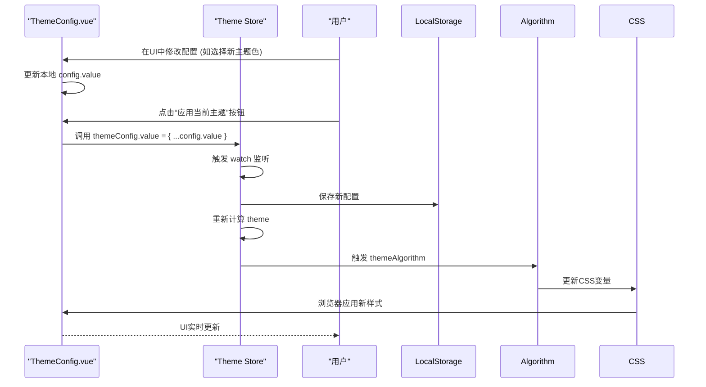
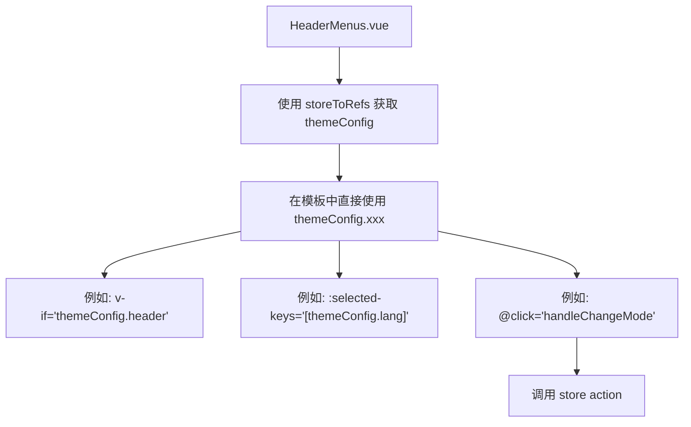
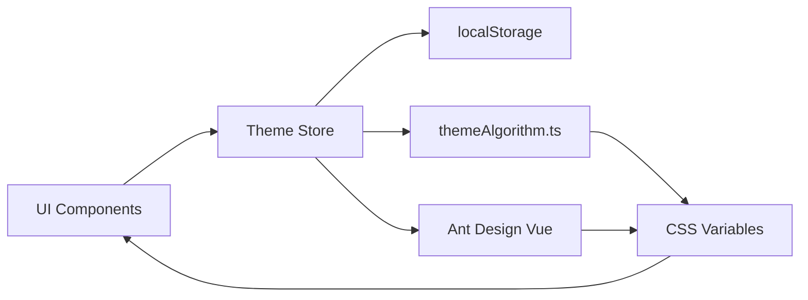

# 主题状态管理

<cite>
**本文档中引用的文件**  
- [types.ts](file://src/store/uedModule/theme/types.ts)
- [defaultConfig.ts](file://src/store/uedModule/theme/defaultConfig.ts)
- [index.ts](file://src/store/uedModule/theme/index.ts)
- [theme.ts](file://src/theme/theme.ts)
- [themeAlgorithm.ts](file://src/theme/themeAlgorithm.ts)
- [index.ts](file://src/theme/index.ts)
- [dark.ts](file://src/theme/dark.ts)
- [light.ts](file://src/theme/light.ts)
- [index.vue](file://src/views/uedModule/themeConfig/index.vue)
- [HeaderMenus.vue](file://src/components/uedModule/layout/comps/HeaderMenus.vue)
- [LayoutContent.vue](file://src/components/uedModule/layout/comps/LayoutContent.vue)
- [index.vue](file://src/components/uedModule/layout/index.vue)
</cite>

## 目录
1. [简介](#简介)
2. [项目结构](#项目结构)
3. [核心组件](#核心组件)
4. [架构概述](#架构概述)
5. [详细组件分析](#详细组件分析)
6. [依赖分析](#依赖分析)
7. [性能考虑](#性能考虑)
8. [故障排除指南](#故障排除指南)
9. [结论](#结论)

## 简介
本文档详细阐述了Vue项目模板中的主题状态管理模块，重点分析了`theme store`的设计与实现。该模块基于Pinia状态管理库，实现了对应用主题（如亮色/暗色模式、主题色、字体大小等）的集中管理。文档深入解析了其状态结构、初始化逻辑、操作方法以及与前端CSS变量的集成机制，展示了如何实现无刷新的主题切换和状态持久化。

## 项目结构
主题状态管理模块的代码分布在`src`目录下的两个主要位置：`store/uedModule/theme`负责状态逻辑，`theme`目录负责样式和算法。这种分离确保了状态管理与视觉表现的解耦。

```mermaid
graph TB
subgraph "状态管理 (store)"
A[src/store/uedModule/theme]
A1[types.ts]
A2[defaultConfig.ts]
A3[index.ts]
end
subgraph "主题样式与算法 (theme)"
B[src/theme]
B1[theme.ts]
B2[themeAlgorithm.ts]
B3[index.ts]
B4[dark.ts]
B5[light.ts]
end
subgraph "UI 组件"
C[src/views/uedModule/themeConfig]
C1[index.vue]
D[src/components/uedModule/layout]
D1[HeaderMenus.vue]
D2[LayoutContent.vue]
D3[index.vue]
end
A3 --> B2 : 使用
B2 --> B3 : 导入
B3 --> B4 : 导入
B3 --> B5 : 导入
C1 --> A3 : 使用
D1 --> A3 : 使用
D2 --> A3 : 使用
D3 --> A3 : 使用
```

**Diagram sources**
- [types.ts](file://src/store/uedModule/theme/types.ts)
- [defaultConfig.ts](file://src/store/uedModule/theme/defaultConfig.ts)
- [index.ts](file://src/store/uedModule/theme/index.ts)
- [theme.ts](file://src/theme/theme.ts)
- [themeAlgorithm.ts](file://src/theme/themeAlgorithm.ts)
- [index.ts](file://src/theme/index.ts)
- [dark.ts](file://src/theme/dark.ts)
- [light.ts](file://src/theme/light.ts)
- [index.vue](file://src/views/uedModule/themeConfig/index.vue)
- [HeaderMenus.vue](file://src/components/uedModule/layout/comps/HeaderMenus.vue)
- [LayoutContent.vue](file://src/components/uedModule/layout/comps/LayoutContent.vue)
- [index.vue](file://src/components/uedModule/layout/index.vue)

**Section sources**
- [types.ts](file://src/store/uedModule/theme/types.ts)
- [defaultConfig.ts](file://src/store/uedModule/theme/defaultConfig.ts)
- [index.ts](file://src/store/uedModule/theme/index.ts)
- [theme.ts](file://src/theme/theme.ts)
- [themeAlgorithm.ts](file://src/theme/themeAlgorithm.ts)
- [index.ts](file://src/theme/index.ts)
- [dark.ts](file://src/theme/dark.ts)
- [light.ts](file://src/theme/light.ts)
- [index.vue](file://src/views/uedModule/themeConfig/index.vue)
- [HeaderMenus.vue](file://src/components/uedModule/layout/comps/HeaderMenus.vue)
- [LayoutContent.vue](file://src/components/uedModule/layout/comps/LayoutContent.vue)
- [index.vue](file://src/components/uedModule/layout/index.vue)

## 核心组件
主题状态管理的核心是`theme store`，它定义了应用主题的单一数据源。该模块通过`types.ts`定义状态结构，`defaultConfig.ts`提供默认值，`index.ts`实现状态逻辑，并通过`themeAlgorithm.ts`将状态变化同步到CSS变量，最终在UI组件中实现动态响应。

**Section sources**
- [types.ts](file://src/store/uedModule/theme/types.ts)
- [defaultConfig.ts](file://src/store/uedModule/theme/defaultConfig.ts)
- [index.ts](file://src/store/uedModule/theme/index.ts)
- [themeAlgorithm.ts](file://src/theme/themeAlgorithm.ts)

## 架构概述
该模块采用分层架构，从上至下分为UI层、状态管理层和样式层。UI组件通过Pinia的`useThemeStore`访问状态，状态管理模块负责维护和更新`themeConfig`，并将其持久化到`localStorage`。`themeAlgorithm.ts`作为一个独立的算法层，监听`themeConfig`的变化，并动态更新`document.body`上的CSS变量，从而实现全局样式的无刷新切换。



**Diagram sources**
- [index.ts](file://src/store/uedModule/theme/index.ts)
- [themeAlgorithm.ts](file://src/theme/themeAlgorithm.ts)
- [HeaderMenus.vue](file://src/components/uedModule/layout/comps/HeaderMenus.vue)
- [LayoutContent.vue](file://src/components/uedModule/layout/comps/LayoutContent.vue)

## 详细组件分析

### 主题状态类型分析
`types.ts`文件定义了`ThemeConfigType`接口，这是整个主题模块的数据契约。它包含了所有可配置的主题属性。



**Diagram sources**
- [types.ts](file://src/store/uedModule/theme/types.ts#L3-L24)

#### 状态结构详解
- **模式控制**: `mode` (light/dark) 和 `dark` (布尔值) 共同控制主题模式。
- **视觉元素**: `primaryColor` 定义主题色，`fontSize` 定义基础字号。
- **布局配置**: `layout` (top/side/mix) 控制导航布局，`topStyle` 和 `sideStyle` 分别控制顶部和侧边栏的明暗。
- **功能开关**: 如 `breadcrumb` (面包屑), `languageSwitch` (语言切换), `helpCenter` (帮助中心) 等布尔值控制UI元素的显示。
- **持久化**: 所有配置项最终都会被序列化并存储在`localStorage`中，键名为`ZQTHEMECONFIG`。

**Section sources**
- [types.ts](file://src/store/uedModule/theme/types.ts#L3-L24)

### 主题状态初始化分析
`defaultConfig.ts`文件定义了`themeDefaultConfig`常量，它为`ThemeConfigType`提供了默认配置。



**Diagram sources**
- [defaultConfig.ts](file://src/store/uedModule/theme/defaultConfig.ts#L3-L22)
- [index.ts](file://src/store/uedModule/theme/index.ts#L20-L21)

#### 初始化逻辑详解
1.  **读取本地存储**: 在`index.ts`中，首先尝试从`localStorage`读取`ZQTHEMECONFIG`的值。
2.  **解析与合并**: 将读取到的JSON字符串解析为对象，并与`themeDefaultConfig`进行合并。本地存储的配置会覆盖默认配置，实现了用户自定义设置的持久化。
3.  **特殊逻辑**: `lang`字段的默认值会根据`localStorage`中`das-intl-locale`的值动态确定，实现了语言的初始化记忆。

**Section sources**
- [defaultConfig.ts](file://src/store/uedModule/theme/defaultConfig.ts#L3-L22)
- [index.ts](file://src/store/uedModule/theme/index.ts#L20-L21)

### 主题状态管理模块分析
`index.ts`是`theme store`的核心，它使用`defineStore`创建了一个Pinia store，封装了状态、计算属性和操作。



**Diagram sources**
- [index.ts](file://src/store/uedModule/theme/index.ts#L20-L158)

#### 核心实现机制
- **状态 (State)**:
  - `themeConfig`: 一个`ref`，持有合并了默认值和本地存储的完整主题配置对象。
  - `themeType`: 一个`ref`，用于内部标识主题类型（Light/Dark）。
- **操作 (Actions)**:
  - `setThemeConfig(config)`: 接收一个配置对象，将其与默认配置合并后更新`themeConfig.value`。这是外部修改主题的主要入口。
  - `reset()`: 将`themeConfig.value`重置为`themeDefaultConfig`。
  - `resetThemePrimaryColor()`: 仅将`primaryColor`重置为默认值。
- **计算属性 (Computed)**:
  - `theme`: 这是一个关键的计算属性。它根据当前的`themeTokenType`（即`themeConfig.value.mode`）选择`light`或`dark`的预设样式令牌（来自`themeTokens`），然后动态注入由`primaryColor`生成的调色板颜色和`fontSize`相关的字体大小。这个计算属性的输出被Ant Design Vue等UI库消费，以实现组件样式的动态更新。
  - `themeTokenType`: 一个简单的计算属性，返回`themeConfig.value.mode`，用于`theme`计算属性的依赖追踪。
- **副作用 (Side Effects)**:
  - `watch`: 对`themeConfig`进行深度监听，一旦配置发生变化，立即将其序列化并存入`localStorage`，确保状态持久化。
  - `updateFontSizeCSS`: 一个内部函数，用于动态更新`--font-size-base`这个CSS变量，直接影响全局字号。

**Section sources**
- [index.ts](file://src/store/uedModule/theme/index.ts#L20-L158)

### 主题算法与前端集成分析
`themeAlgorithm.ts`是连接状态管理与实际CSS样式的桥梁。它不直接被UI组件调用，而是作为一个独立的算法模块运行。



**Diagram sources**
- [themeAlgorithm.ts](file://src/theme/themeAlgorithm.ts#L10-L68)

#### 无刷新切换实现
1.  **监听状态**: `themeAlgorithm`函数内部使用`watchEffect`和`watch`来监听`themeConfig`的变化。
2.  **更新CSS变量**: 当`primaryColor`改变时，它使用`@ant-design/colors`库生成一组10色调色板，并将关键颜色（如浅色、正常、悬停色）映射到以`--um-`和`--d-`为前缀的CSS变量上。这些变量在`theme.css`等样式文件中被引用。
3.  **切换主题类**: 当`mode`改变时，它直接修改`document.body`的`className`，添加或移除`theme-dark`/`theme-light`类。这允许开发者在CSS中使用类选择器来定义全局的明暗样式。
4.  **同步字号**: 它还负责同步更新`--um-font-size`变量，确保全局字号一致。

**Section sources**
- [themeAlgorithm.ts](file://src/theme/themeAlgorithm.ts#L10-L68)

### 主题配置UI组件分析
`themeConfig/index.vue`是一个典型的UI组件，它展示了如何在组件中动态响应和修改主题状态。



**Diagram sources**
- [index.vue](file://src/views/uedModule/themeConfig/index.vue#L0-L315)

#### 编程模式
1.  **访问状态**: 使用`useThemeStore()`和`storeToRefs()`获取`themeConfig`的响应式引用。
2.  **创建本地副本**: 使用`ref`创建`config`作为`themeConfig`的副本。这允许用户在配置面板中进行临时修改，而不会立即影响全局状态。
3.  **监听同步**: 使用`watchEffect`确保`config`始终与`themeConfig`保持同步。
4.  **应用更改**: 当用户确认时，将`config`的值赋给`themeConfig.value`，从而触发全局更新。

**Section sources**
- [index.vue](file://src/views/uedModule/themeConfig/index.vue#L0-L315)

### 布局组件中的主题应用分析
`HeaderMenus.vue`和`LayoutContent.vue`等布局组件展示了主题状态在实际UI中的消费模式。



**Diagram sources**
- [HeaderMenus.vue](file://src/components/uedModule/layout/comps/HeaderMenus.vue#L1-L493)
- [LayoutContent.vue](file://src/components/uedModule/layout/comps/LayoutContent.vue#L0-L304)

#### 动态响应模式
- **条件渲染**: 使用`v-if="themeConfig.header"`等指令，根据主题配置决定是否渲染某个UI元素。
- **状态绑定**: 将下拉菜单的选中项（如语言、字号）直接绑定到`themeConfig.lang`和`themeConfig.fontSize`。
- **事件处理**: 在事件处理函数（如`handleChangeMode`）中，调用`themeStore.setThemeConfig()`来更新状态。
- **动态类名**: 在`layout/index.vue`中，使用`:class`绑定根据`themeConfig.mode`动态添加`dark`或`header-dark`类，从而应用不同的CSS样式。

**Section sources**
- [HeaderMenus.vue](file://src/components/uedModule/layout/comps/HeaderMenus.vue#L1-L493)
- [LayoutContent.vue](file://src/components/uedModule/layout/comps/LayoutContent.vue#L0-L304)
- [index.vue](file://src/components/uedModule/layout/index.vue#L0-L304)

## 依赖分析
该模块的依赖关系清晰，形成了一个单向的数据流。



**Diagram sources**
- [index.ts](file://src/store/uedModule/theme/index.ts)
- [themeAlgorithm.ts](file://src/theme/themeAlgorithm.ts)
- [index.vue](file://src/views/uedModule/themeConfig/index.vue)
- [HeaderMenus.vue](file://src/components/uedModule/layout/comps/HeaderMenus.vue)

**Section sources**
- [index.ts](file://src/store/uedModule/theme/index.ts)
- [themeAlgorithm.ts](file://src/theme/themeAlgorithm.ts)
- [index.vue](file://src/views/uedModule/themeConfig/index.vue)
- [HeaderMenus.vue](file://src/components/uedModule/layout/comps/HeaderMenus.vue)

## 性能考虑
- **计算属性优化**: `theme`计算属性的逻辑较为复杂，但由于其依赖`themeTokenType`和`primaryColor`，只有在这些值改变时才会重新计算，避免了不必要的性能开销。
- **深度监听**: 对`themeConfig`的`watch`使用了`{ deep: true }`，虽然能监听到所有嵌套属性的变化，但可能会在配置项较多时产生轻微性能影响。不过，主题配置的更新频率较低，此影响可忽略。
- **CSS变量**: 使用CSS变量进行样式更新是高效的，浏览器会直接应用新的样式，无需重新计算整个组件树。

## 故障排除指南
- **主题切换无反应**: 检查`themeAlgorithm.ts`是否被正确引入和执行。确认`document.body`上的CSS变量是否已更新。
- **配置未持久化**: 检查`localStorage`中`ZQTHEMECONFIG`的值。确认`watch`回调是否被触发，以及`setItem`调用是否成功。
- **UI未更新**: 确认UI组件是否正确地从`theme store`中读取了状态。检查`computed`属性或`watch`是否正常工作。
- **Ant Design 组件样式未变**: 确保`theme`计算属性的输出被正确传递给Ant Design Vue的`ConfigProvider`组件。

## 结论
该主题状态管理模块设计精良，通过Pinia实现了状态的集中管理和响应式更新。通过`localStorage`实现了配置的持久化，并通过`themeAlgorithm.ts`巧妙地利用CSS变量实现了无刷新的全局主题切换。其分层架构清晰，职责分明，易于维护和扩展。UI组件通过标准的Pinia模式消费状态，编程模式统一，为开发者提供了良好的体验。